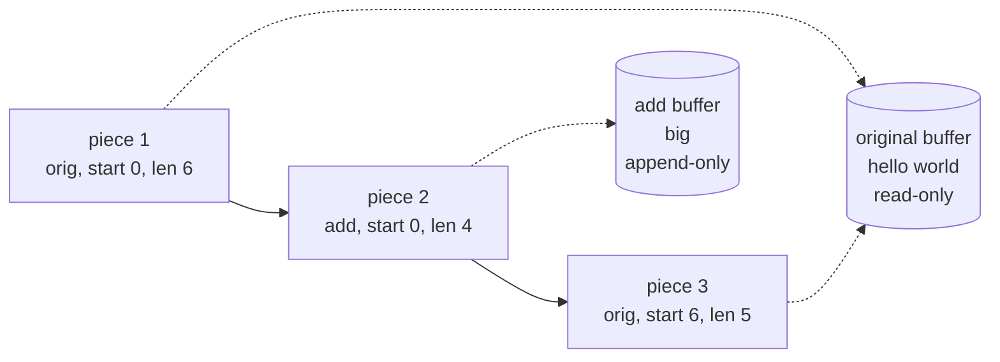
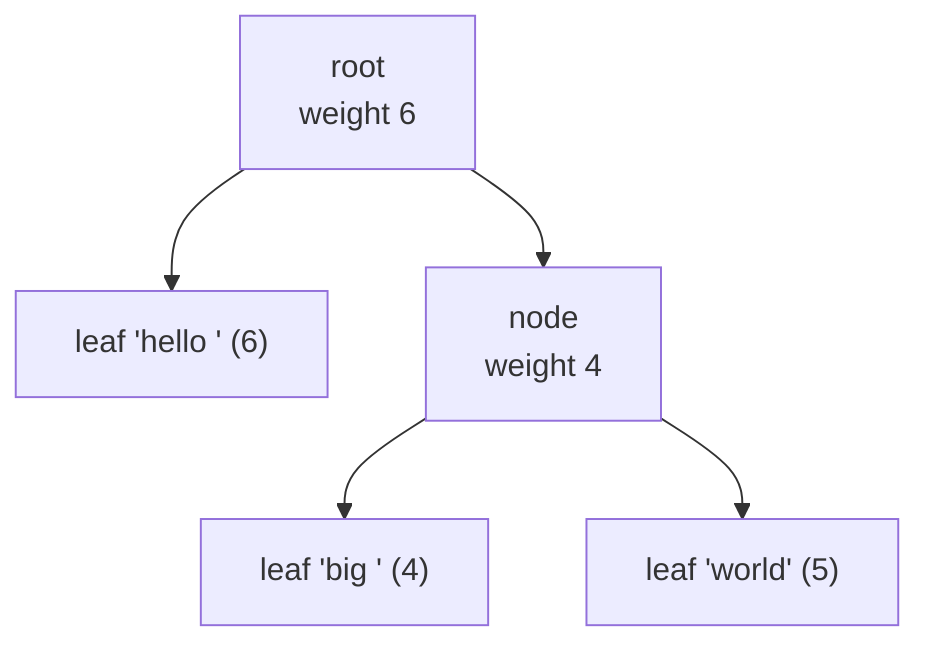

# Gap Buffers, Piece Tables and Ropes (text buffer data structures)

## 1. One-line summary

A text editor can't store a document as one plain `String`, because inserting a character in the middle would copy everything after it; a **gap buffer** keeps an empty hole at the cursor so typing is O(1), a **piece table** never modifies the original text and describes the document as a list of "pieces" pointing into an original buffer and an append-only buffer, and a **rope** is a balanced tree of small string chunks where every edit is O(log n). A **line index** sits beside any of them so "go to line 40,000" is fast.

💡 **O(1), O(n), O(log n)** = how the cost grows with document size `n`: constant, proportional, or growing very slowly (doubling the document adds one step). See [Big-O complexity](big-o-complexity.md).

---

## 2. The problem it solves

The obvious design is one array of characters (a Java `StringBuilder` or `char[]`):

```
"hello world"  insert "X" at 0 → shift all 11 chars right by one, then write X
```

`StringBuilder.insert(0, ...)` is O(n): it copies every character after the insert point. Arithmetic for a big file:

```
10 MB file ≈ 10,000,000 chars, cursor near the top
Java char = 2 bytes → each keystroke shifts 10,000,000 × 2 B = 20 MB
at ~10 GB/s memory bandwidth → 20 MB / 10 GB/s ≈ 2 ms per keystroke (rough)
find-replace-all with 1,000 replacements → 1,000 × 2 ms = 2 s freeze
```

💡 **Memory bandwidth** = how many bytes per second the CPU can copy to and from RAM; ~10 GB/s is a typical ballpark for one core.

The other naive design, **an array of lines** (`List<String>`), makes each edit cheap but costs memory per line. VS Code's team wrote in 2018 (*"Text Buffer Reimplementation"*, VS Code blog, March 2018) that their old line array needed about 600 MB for a 35 MB file with 13.7 million lines, because each line object cost roughly 40–60 bytes of overhead. That's ~17× the file size.

We want: cheap inserts/deletes anywhere, low memory overhead, fast "where is line N", and ideally cheap undo.

---

## 3. How it works

### 3.1 Gap buffer: keep the hole where you type

One array, with an unused **gap** at the cursor. Typing fills the gap from the left (O(1)), backspace widens it (O(1)). Moving the cursor slides characters from one side of the gap to the other: O(distance moved). When the gap is used up, allocate a bigger array (O(n), but rare, amortised like `ArrayList` growth).

💡 **Amortised** = averaged over many operations: an occasional expensive step (resize) is paid for by many cheap ones.

This is what **GNU Emacs** uses for its buffers. It's simple and very fast for the normal case: one person typing in one place.

```java
import java.util.Arrays;

public class GapBuffer {
    private char[] buf = new char[6];
    private int gapStart = 0;          // cursor position = where the gap begins
    private int gapEnd = buf.length;   // first char after the gap

    void insert(char c) {
        if (gapStart == gapEnd) grow();
        buf[gapStart++] = c;           // O(1): just fill the gap
    }

    void deleteBefore() {              // backspace: widen the gap, O(1)
        if (gapStart > 0) gapStart--;
    }

    void moveTo(int pos) {             // O(distance): slide chars across the gap
        while (gapStart > pos) buf[--gapEnd] = buf[--gapStart];
        while (gapStart < pos) buf[gapStart++] = buf[gapEnd++];
    }

    private void grow() {              // O(n), but rare: double the array
        char[] bigger = new char[buf.length * 2];
        int tail = buf.length - gapEnd;
        System.arraycopy(buf, 0, bigger, 0, gapStart);
        System.arraycopy(buf, gapEnd, bigger, bigger.length - tail, tail);
        gapEnd = bigger.length - tail;
        buf = bigger;
    }

    String text() {
        return new String(buf, 0, gapStart) + new String(buf, gapEnd, buf.length - gapEnd);
    }

    String internals() {               // '_' marks gap slots (stale bytes there are ignored)
        char[] view = Arrays.copyOf(buf, buf.length);
        for (int i = gapStart; i < gapEnd; i++) view[i] = '_';
        for (int i = 0; i < view.length; i++) if (view[i] == 0) view[i] = '_';
        return "[" + new String(view) + "] gap=" + gapStart + ".." + gapEnd + " text=\"" + text() + "\"";
    }

    public static void main(String[] args) {
        GapBuffer g = new GapBuffer();
        for (char c : "hello".toCharArray()) g.insert(c);
        System.out.println("type hello      " + g.internals());
        g.moveTo(1);
        System.out.println("move to 1       " + g.internals());
        g.insert('E');
        System.out.println("insert E        " + g.internals());
        g.insert('E');
        System.out.println("insert E (grow) " + g.internals());
        g.insert('!');
        System.out.println("insert !        " + g.internals());
        g.deleteBefore();
        System.out.println("backspace       " + g.internals());
        g.moveTo(g.text().length());
        System.out.println("move to end     " + g.internals());
    }
}
```

Real output of `javac GapBuffer.java && java GapBuffer` (Java 21):

```
type hello      [hello_] gap=5..6 text="hello"
move to 1       [h_ello] gap=1..2 text="hello"
insert E        [hEello] gap=2..2 text="hEello"
insert E (grow) [hEE_____ello] gap=3..8 text="hEEello"
insert !        [hEE!____ello] gap=4..8 text="hEE!ello"
backspace       [hEE_____ello] gap=3..8 text="hEEello"
move to end     [hEEello_____] gap=7..12 text="hEEello"
```

Read it line by line: moving to position 1 copied `ello` to the right end; the first `E` used the last gap slot; the second `E` found no gap and doubled the array to 12, keeping the gap at the cursor; backspace just moved `gapStart` back (the `!` byte is still in memory but inside the gap, so it's ignored).

**Weak spots:** jumping between two far-apart places (multi-cursor editing, find-replace-all) moves the gap across the whole file each time, and **concurrent edits at several places** don't fit one gap.

### 3.2 Piece table: never modify, only describe

Two buffers plus a list of pieces:

- **Original buffer**: the file as loaded. **Read-only**, never changed.
- **Add buffer**: everything ever typed, **append-only** (💡 new data only goes on the end, nothing is overwritten).
- **Piece list**: `(which buffer, start, length)` entries; reading them in order gives the document.

Example: original `"hello world"`, user types `"big "` before `world`:

```
original: "hello world"          add: "big "
pieces:   [orig 0..6 "hello "] [add 0..4 "big "] [orig 6..11 "world"]
document: "hello big world"
```



An insert **splits one piece** into two and puts a new piece between them; a delete shrinks or splits pieces. No text is copied. Memory ≈ file size + everything typed + a few pieces per edit. **Undo** is cheap: keep old piece lists (or the piece changes), since the buffers they point into never change.

With pieces in a plain list, finding "position 5,000,000" means walking pieces: O(number of pieces). Fix: store pieces in a **balanced binary tree**, each node caching the total length (and line-break count) of its subtree, so lookup is O(log pieces).

That's what **VS Code** did in its 2018 reimplementation (shipped in version 1.21): a piece table whose pieces live in a **red-black tree** (💡 a self-balancing binary search tree that keeps its height O(log n) after every insert/delete), with **line-break positions cached per node**. The code calls it a "piece tree" (`pieceTreeTextBuffer`). Because the buffers are read-only or append-only, the cached line breaks inside a buffer never move. Piece tables were also used by early word processors (Charles Crowley's 1998 paper *"Data Structures for Text Sequences"* compares these designs; details of which historic product used what are not verified here).

### 3.3 Rope: a balanced tree of string chunks

A **rope** (Boehm, Atkinson and Plass, *"Ropes: an Alternative to Strings"*, 1995) is a binary tree whose **leaves hold short strings** (say up to 512–2,048 chars) and whose internal nodes store the **length of their left subtree** ("weight"):



Document = `"hello big world"`. Find index 8: at the root `8 >= 6`, go right with `8 − 6 = 2`; at the next node `2 < 4`, go left; char 2 of `"big "` is `g`.

- **Index lookup**: at each node, if `i < weight` go left, else subtract weight and go right: O(log n).
- **Insert**: split a leaf at the position, put the new chunk in, rebalance: O(log n).
- **Concat / split** of whole documents: O(log n), no copying, which makes "cut this 1 MB block and paste it elsewhere" cheap.
- **Immutability**: ropes are often built **persistent** (an edit creates new nodes along one path and shares everything else), so an old version is just an old root pointer: free snapshots for undo and for handing a consistent copy to a background thread (syntax highlighting, autosave). The xi-editor project (Rust) was a well-known rope-based editor.

### 3.4 Line index

Editors constantly ask "which line is offset 812,345 on?" and "where does line 40,000 start?". Options:

| Line index | Lookup line ↔ offset | After an edit |
|---|---|---|
| Array of line-start offsets | O(log L) binary search | O(L) to shift every later offset |
| Line-break **counts cached in tree nodes** (piece tree, rope) | O(log n) | O(log n), update counts along one path |

💡 **L** = number of lines in the document.

### 3.5 Big-O comparison

`n` = document length, `k` = distance the cursor jumps, `p` = number of pieces (grows with edits).

| Operation | Plain array / `StringBuilder` | Gap buffer | Piece table (list) | Piece tree / rope (balanced) |
|---|---|---|---|---|
| Insert at cursor | O(n) | **O(1)** amortised | O(p) find + O(1) split | O(log n) |
| Insert after jumping k chars | O(n) | O(k) | O(p) | O(log n) |
| Delete | O(n) | O(1) at cursor | O(p) | O(log n) |
| Read char at index i | **O(1)** | O(1) | O(p) | O(log n) |
| Load file | O(n) copy | O(n) copy | **O(1)** (point at it) | O(n) to build |
| Memory overhead | none | gap size | pieces + add buffer | tree nodes |
| Cheap snapshots / undo | no | no | **yes** (immutable buffers) | **yes** if persistent |

## 4. When to use it

- **Gap buffer**: a single-cursor editor, a terminal line editor, a text field. Simplest correct choice for small-to-medium files.
- **Piece table / piece tree**: large files (open fast, low memory), cheap undo history, editors that need many cursors.
- **Rope**: very large texts, frequent cut/paste of big blocks, persistent versions shared across threads, collaborative editors where many positions are edited.
- In an LLD interview: start with a gap buffer (easy to code in 15 minutes), then say when you'd switch.

## 5. When NOT to use it

- **Short strings** (a username field, a chat message): `StringBuilder` is faster in practice; a tree of chunks adds pointer chasing and allocation for nothing.
- **Gap buffer for multi-cursor or concurrent collaborative editing**: one gap can't be in many places, and each jump is O(k).
- **Rope with tiny leaves** (1 char per leaf): the tree overhead is many times the text size. Leaves need hundreds of chars.
- **Piece table without rebalancing** after millions of edits: the piece list gets long and lookups degrade to O(p).

## 6. Commonly confused with

| | **Gap buffer** | **Piece table** | **Rope** | **Array of lines** |
|---|---|---|---|---|
| Shape | one array with a hole | 2 buffers + piece list/tree | balanced tree of chunks | `List<String>` |
| Modifies text in place? | yes | **never** | creates new leaves | yes, per line |
| Best at | typing in one spot | big files, undo | big edits, versions | tiny files, simple code |
| Known user | Emacs | VS Code (piece tree, 2018) | xi-editor | VS Code before 1.21 |

Also: a **rope is not a CRDT**. A rope is how one replica stores text; a CRDT is how replicas agree on it ([OT and CRDTs](../../HLD/concepts/operational-transformation-and-crdts.md)).

## 7. Common mistakes / misuse

1. **"I'll use a String and replace it"**: O(n) per keystroke, and the interviewer asks what happens with a 100 MB log file.
2. **Forgetting cursor movement cost** in a gap buffer: typing is O(1) only *at* the gap.
3. **No line index**: "go to line" scans the whole document.
4. **Mutating the original buffer** in a piece table: breaks undo and cached line breaks.
5. **Unbalanced rope**: repeated appends at the end turn it into a linked list.
6. **Confusing chars with bytes**: Java `char` is UTF-16, so an emoji is two `char`s; cursor positions must not split a pair.

## 8. Interview cheat-sheet

> "A plain StringBuilder makes every middle insert O(n), which is a couple of milliseconds per keystroke on a 10 MB file. I'd start with a gap buffer: one array with a hole at the cursor, so typing and backspace are O(1) and moving the cursor costs the distance moved. Emacs uses that. For big files and cheap undo I'd use a piece table: the original file stays read-only, typed text goes into an append-only buffer, and the document is a list of pieces pointing into both. VS Code keeps those pieces in a red-black tree with cached line breaks, so lookups are O(log n). A rope is a balanced tree of string chunks, good for huge files and cheap persistent snapshots. Whatever I pick, I keep a line index, line-break counts in tree nodes, so 'go to line N' is logarithmic."

## 9. Used in

- [Text editor](../interviews/text-editor/README.md): the **document storage** choice: gap buffer as the first implementation, piece table and rope as the scaling answers, cursor movement cost and the line index.
- Related: [Command and Memento](command-and-memento.md) (undo/redo on top of the buffer), [Big-O complexity](big-o-complexity.md), [OT and CRDTs](../../HLD/concepts/operational-transformation-and-crdts.md) (multi-user editing), [Git's object store](../../under-the-hood/git-object-store.md) (immutable, shared snapshots).
