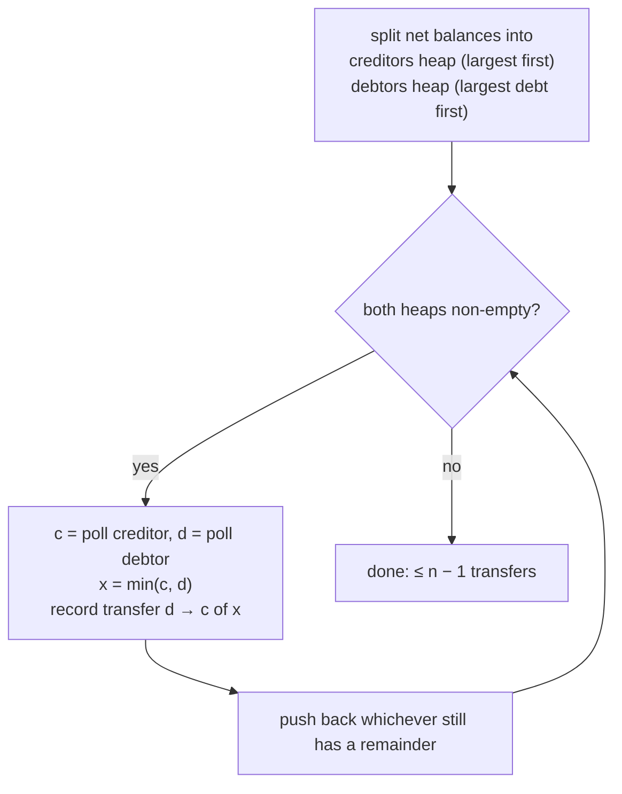

# Greedy Algorithms (and debt simplification)

## 1. One-line summary

A **greedy algorithm** builds an answer step by step, always taking the choice that looks best *right now* and never going back; it is fast and simple, sometimes **provably optimal**, and sometimes merely **good enough** — knowing which one you have is the interview skill.

## 2. The problem it solves

Many problems ask for "the best" combination out of an astronomically large number of options. Trying every combination (**brute force**) is exponential: with 20 people there are over a million subsets of them; with 40, over a trillion.

Greedy says: don't search, just repeatedly take the locally best move. Examples:

- Splitwise "simplify debts": the biggest debtor pays the biggest creditor, repeat.
- Giving change: hand over the biggest coin that fits, repeat.
- Booking a meeting room: always take the meeting that ends earliest, repeat.

Each runs in roughly O(n log n) (see [big-o-complexity](big-o-complexity.md)) instead of exponential time. The catch: the locally best move isn't always globally best.

## 3. How it works

### Optimal vs merely good

A greedy algorithm is **optimal** when the problem has two properties:

- **Greedy-choice property**: some best overall solution starts with the greedy choice — so taking it never closes the door on the best answer.
- **Optimal substructure**: after making that choice, what's left is a smaller copy of the same problem.

It's usually proven by an **exchange argument**: "take any optimal solution; swap its first choice for the greedy one; it's no worse; repeat". If you can't make that argument, the greedy answer is a **heuristic** (a good rule of thumb with no guarantee).

### Debt simplification with two max-heaps

Input: each user's net balance in a group (`net = paid − owed`, sums to 0; see [ledgers-and-event-sourcing](ledgers-and-event-sourcing.md)). Positive = **creditor** (is owed money), negative = **debtor**. Output: a list of transfers that settles everyone.

💡 A **max-heap** (Java `PriorityQueue` with a reversed comparator) always gives you the largest item in O(log n) — see [treeset-and-priorityqueue](../libraries/java/treeset-and-priorityqueue.md).



```java
import java.util.*;

record Transfer(String from, String to, long paise) {}

static List<Transfer> simplify(Map<String, Long> net) {
    record Party(String user, long amount) {}
    Comparator<Party> biggestFirst =
            Comparator.comparingLong(Party::amount).reversed().thenComparing(Party::user); // deterministic ties
    PriorityQueue<Party> creditors = new PriorityQueue<>(biggestFirst);
    PriorityQueue<Party> debtors   = new PriorityQueue<>(biggestFirst);
    net.forEach((user, amt) -> {
        if (amt > 0) creditors.add(new Party(user, amt));
        else if (amt < 0) debtors.add(new Party(user, -amt));      // store debts as positive
    });
    List<Transfer> result = new ArrayList<>();
    while (!creditors.isEmpty() && !debtors.isEmpty()) {
        Party c = creditors.poll(), d = debtors.poll();
        long x = Math.min(c.amount(), d.amount());
        result.add(new Transfer(d.user(), c.user(), x));
        if (c.amount() > x) creditors.add(new Party(c.user(), c.amount() - x));
        if (d.amount() > x) debtors.add(new Party(d.user(), d.amount() - x));
    }
    return result;
}
```

**Why at most n − 1 transfers?** Every transfer fully settles at least one person (whoever had the smaller amount drops out). The very last transfer settles *two* people at once (because balances sum to zero). With n non-zero people that's at most n − 1 transfers. Each step is a few heap operations, so the whole thing is O(n log n).

### Why the true minimum is NP-hard — and a case where greedy loses

💡 **NP-hard** means no known algorithm solves every instance fast (in polynomial time); in practice you're stuck with something close to trying combinations. Famous example: **subset-sum** — "is there a subset of these numbers that adds up exactly to T?"

Net balances: **A +6, B +4, C −3, D −3, E −4** (n = 5).

| Step | Greedy (largest ↔ largest) | Remaining |
|---|---|---|
| 1 | E → A 4 | A +2, B +4, C −3, D −3 |
| 2 | C → B 3 (tie C/D broken by id) | A +2, B +1, D −3 |
| 3 | D → A 2 | B +1, D −1 |
| 4 | D → B 1 | settled — **4 transfers** |

Optimal: **C → A 3, D → A 3, E → B 4 — 3 transfers.** It works because the group splits into two independent **zero-sum subgroups**: {A, C, D} (6 − 3 − 3 = 0) and {B, E} (4 − 4 = 0). Each subgroup of size k needs k − 1 transfers, so the minimum is **n − (number of zero-sum subgroups)**. Maximising the number of zero-sum subgroups means searching for subsets that sum to exactly zero — that is subset-sum in disguise, so the exact minimum is NP-hard. For a friend group of 5–10 people you *could* brute-force it; for large groups greedy's ≤ n − 1 is the practical answer.

### Other greedy classics

**Interval scheduling (optimal).** One meeting room, many requested meetings; maximise how many fit. Greedy: sort by **end time**, take each meeting that starts after the last taken one ended. The exchange argument works: finishing earliest always leaves the most room for the rest.

**Coin change (optimal only for some coin systems).** Indian coins ₹1, 2, 5, 10: greedy "biggest coin first" is always optimal (such systems are called **canonical**). But with coins {1, 3, 4} and amount 6:

- Greedy: 4 + 1 + 1 → **3 coins**
- Optimal: 3 + 3 → **2 coins**

The fix there is **dynamic programming** (solve every smaller amount once, build up). Others you'll meet: Dijkstra's shortest path, Kruskal/Prim for minimum spanning trees, Huffman coding — all greedy and provably optimal.

## 4. When to use it

- When you can **prove** the greedy choice is safe (exchange argument): interval scheduling, Dijkstra (non-negative weights), Huffman, canonical coin systems.
- When the exact optimum is **NP-hard** and a fast, bounded, explainable answer is good enough: debt simplification (≤ n − 1), bin packing heuristics, scheduling tasks onto k8s nodes (the scheduler scores nodes and greedily picks the best one per pod).
- As a **first answer** in an interview, followed by "here's when it's not optimal and what I'd do about it".

## 5. When NOT to use it

- **When an exact optimum is required and greedy isn't provably optimal** — e.g. arbitrary coin systems, 0/1 knapsack (take-it-or-leave-it items). Use dynamic programming or search.
- **When choices interact across steps** (taking item X now blocks a much better combination later) and you can't bound how bad that gets.
- **When the product needs stability, not minimality**: re-running simplify-debts after every expense can reshuffle "who pays whom" each time, confusing users. Sometimes a stable answer beats a minimal one.

## 6. Commonly confused with

| | Greedy | Dynamic programming | Brute force / backtracking |
|---|---|---|---|
| Idea | take the best-looking move, never undo | solve every subproblem once, combine | try all combinations |
| Speed | fast (often O(n log n)) | polynomial, more memory | exponential |
| Optimal? | only if provable | yes (for problems with optimal substructure) | yes |
| Example | interval scheduling, debt simplify | coin change {1,3,4}, knapsack | exact minimum transfers for ≤ ~12 people |

## 7. Common mistakes / misuse

1. Claiming greedy debt simplification gives the **minimum** number of transfers. It gives **at most n − 1**; minimum is NP-hard.
2. Assuming coin-change greedy works for any coins.
3. Non-deterministic tie-breaks in the heaps — the same balances give different transfer lists on retries. Add `thenComparing(user)`.
4. Simplifying from raw expenses instead of **net balances** — the whole trick is that only net amounts matter.
5. Mutating a heap element's amount in place instead of `poll` + re-`add` — the heap's order silently breaks.
6. Using `double` for amounts — `min` and subtraction drift and nobody ever reaches exactly zero. Use `long` paise.

## 8. Interview cheat-sheet

- "Only net balances matter, so I compute net per user, split into creditors and debtors, and keep each in a max-heap."
- "Greedy: the biggest debtor pays the biggest creditor `min(debt, credit)`, push back any remainder, repeat — O(n log n)."
- "Each transfer settles at least one person, so it's at most n − 1 transfers."
- "The true minimum is NP-hard — it's about finding zero-sum subgroups, which is subset-sum. Greedy can be beaten: A+6, B+4, C−3, D−3, E−4 takes 4 greedy transfers but 3 optimally."
- "Greedy is optimal only when there's an exchange argument — interval scheduling yes, coin change with {1,3,4} no."

## 9. Used in

- [LLD: Design Splitwise](../interviews/splitwise/README.md) — "simplify debts" with two priority queues (largest creditor ↔ largest debtor), ≤ n − 1 transfers, and the NP-hard discussion.
- Related: [treeset-and-priorityqueue](../libraries/java/treeset-and-priorityqueue.md), [big-o-complexity](big-o-complexity.md), [scheduling-algorithms](scheduling-algorithms.md), [ledgers-and-event-sourcing](ledgers-and-event-sourcing.md).
