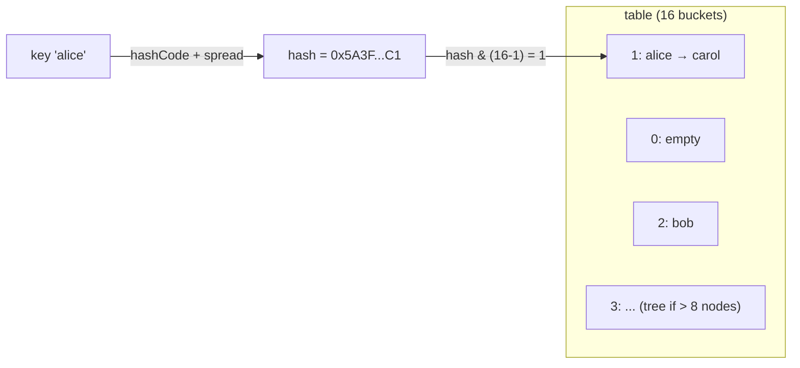
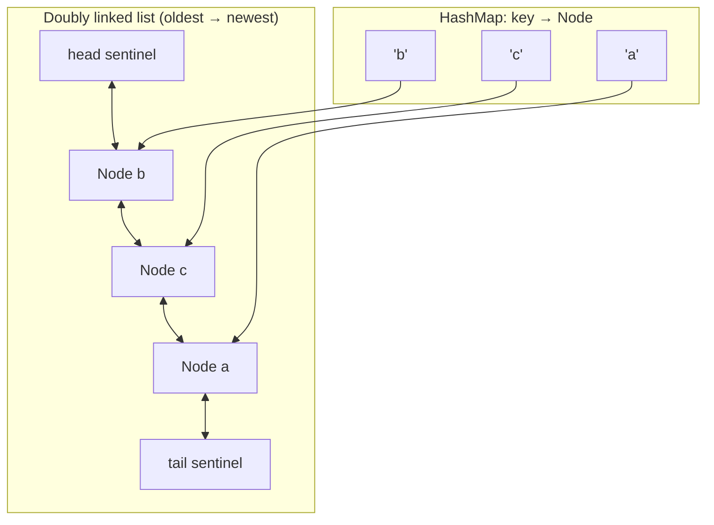

# Hash Map + Doubly Linked List

## 1. One-line summary

A **hash map** finds a value by key in O(1) average time (constant time, independent of size; see [Big-O](big-o-complexity.md)), a **doubly linked list** can remove or move a node in O(1) if you already hold a reference to it — and putting the two together (the map points straight at list nodes) gives an LRU cache where `get`, `put` and eviction are all O(1).

## 2. The problem it solves

An LRU cache (Least Recently Used: when full, evict the entry untouched the longest) needs three things fast:

1. **Find** an entry by key.
2. **Move** an entry to "most recent" on every access.
3. **Remove** the least recent entry when full.

Each structure alone fails one of them:

| Structure | Find by key | Move to front | Remove oldest |
|---|---|---|---|
| Hash map only | O(1) | no order to move in | O(n) scan for oldest timestamp |
| Array / `ArrayList` ordered by recency | O(n) | O(n) shift | O(1) or O(n) |
| Linked list only | O(n) walk | O(1) once found | O(1) |
| **Hash map → list node** | **O(1)** | **O(1)** | **O(1)** |

The combination is a classic interview idea: **use one structure for lookup and another for order, and have them point at the same nodes.**

## 3. How it works

### Hash map internals (Java `HashMap`)

- **Buckets**: an array of slots (`table`), size always a power of two (16, 32, 64, ...).
- **Hashing**: `key.hashCode()` gives an `int`; Java mixes the high bits into the low bits (`h ^ (h >>> 16)`) and takes `hash & (table.length - 1)` as the bucket index — a fast modulo for powers of two.
- **Collisions**: two keys landing in the same bucket. Java chains them in a small linked list inside that bucket; lookup walks the chain comparing with `equals`. That's why `hashCode` and `equals` must agree.
- **Resizing**: when `size > capacity × loadFactor` (default 0.75 — e.g. 16 × 0.75 = 12 entries), the table doubles and every entry is redistributed. One resize is O(n), but it happens rarely enough that `put` is **amortized O(1)** (averaged over many puts).
- **Treeification (Java 8+)**: if one bucket's chain grows past 8 nodes (and the table has at least 64 slots), it turns into a red-black tree (a self-balancing sorted tree), so even a terrible hash function or a deliberate collision attack degrades lookup to O(log n), not O(n). It turns back into a list below 6.



### Doubly linked list internals

Each node has `prev` and `next` pointers. With a reference to a node, you can unlink it in O(1) — just repoint its neighbours — without walking the list. (A **singly** linked list can't: to remove a node you need its predecessor, which costs an O(n) walk.)

**Sentinel nodes** (dummy `head` and `tail` that never hold data) mean the list is never "empty" structurally, so every node always has a real `prev` and `next`. That removes all `if (node == head)` / `if (prev == null)` special cases — the main source of bugs in hand-written lists.

```java
final class Dll<K, V> {
    static final class Node<K, V> {
        K key; V value; Node<K, V> prev, next;
        Node(K key, V value) { this.key = key; this.value = value; }
    }

    final Node<K, V> head = new Node<>(null, null); // sentinel: before the oldest
    final Node<K, V> tail = new Node<>(null, null); // sentinel: after the newest

    Dll() { head.next = tail; tail.prev = head; }

    void addLast(Node<K, V> n) {          // newest goes just before tail
        n.prev = tail.prev; n.next = tail;
        tail.prev.next = n; tail.prev = n;
    }

    void unlink(Node<K, V> n) {           // O(1), no null checks thanks to sentinels
        n.prev.next = n.next; n.next.prev = n.prev;
        n.prev = n.next = null;
    }

    Node<K, V> first() { return head.next == tail ? null : head.next; } // oldest
}
```

### Putting them together: O(1) LRU

`HashMap<K, Node<K,V>>` maps each key to **its node in the list**. The list is ordered oldest (after `head`) → newest (before `tail`).

- `get(k)`: `node = map.get(k)` (O(1)); `unlink(node); addLast(node)` (O(1)); return `node.value`.
- `put(k, v)`: if present, update value and move to end. Else create node, `addLast`, `map.put`. If `map.size() > capacity`: `oldest = first(); unlink(oldest); map.remove(oldest.key)`.

That last line is why **the node stores its key**: when you evict from the list, you need the key to delete it from the map too.



Here `b` is the eviction victim (right after `head`), `a` was used most recently. Java's [LinkedHashMap](../libraries/java/linkedhashmap.md) is exactly this design, built into the JDK; JavaScript's `Map` gives you the ordering part for free (see [lru-with-map](../libraries/js/lru-with-map.md)).

## 4. When to use it

- **LRU caches** — the canonical case.
- **LFU with O(1) buckets** — a map from frequency to a doubly linked list of nodes with that frequency; same "map points into list" trick (see [cache-eviction-policies](cache-eviction-policies.md)).
- **Ordered sets with fast removal**: task queues where tasks can be cancelled by id, connection pools with idle-ordering.
- Any time you need **"find by key" and "maintain an order" together**.

## 5. When NOT to use it

- **Only lookups needed** — a plain `HashMap`; the list doubles pointer overhead for no benefit.
- **Only ordering needed, with removal only at the ends** — an `ArrayDeque` is faster (contiguous memory, cache-friendly).
- **Sorted order by a value** (priority, deadline) — use a heap (`PriorityQueue`) or a `TreeMap`; a linked list can't keep sort order in O(1).
- **Production** — use `LinkedHashMap` or Caffeine rather than a hand-written list; the hand-written one is for interviews and learning.

## 6. Commonly confused with

| | `HashMap` | `LinkedList` (JDK) | Hand-written DLL + map | `LinkedHashMap` |
|---|---|---|---|---|
| Lookup by key | O(1) avg | O(n) | O(1) avg | O(1) avg |
| Remove a known element | O(1) | O(n) via `remove(Object)` — it searches first | O(1) via node ref | O(1) |
| Keeps order | no | yes | yes | yes |
| Exposes nodes | no | **no** — that's why JDK `LinkedList` can't do O(1) LRU | yes | internal |

## 7. Common mistakes / misuse

1. **Using `java.util.LinkedList` and calling `list.remove(key)`** — that's an O(n) search; the whole point is holding the node reference.
2. **Forgetting to store the key in the node** — then eviction can't remove the entry from the map; the map leaks.
3. **Updating the map but not the list (or vice versa)** — the two drift apart. Do every change in one method that updates both.
4. **No sentinels** → a forest of null checks, with the bugs hiding in the "first node" / "last node" branches.
5. **Mutable keys** — changing a key's fields after insertion changes its `hashCode`; the entry becomes unfindable in its bucket.
6. **Claiming worst-case O(1)** — hash maps are O(1) **average**; worst case is O(log n) in Java 8+ (treeified bucket), O(n) in many other languages.

## 8. Interview cheat-sheet

- "I'll use a `HashMap<K, Node>` for O(1) lookup and a doubly linked list for recency order; the map points directly at the nodes."
- "With the node in hand, I unlink it and append it at the tail in O(1), and the oldest is always `head.next`."
- "Sentinel head and tail nodes remove every null check, and the node stores its key so eviction can delete it from the map."
- "Hash map operations are O(1) on average and amortized because of resizing; Java treeifies long buckets so the worst case is O(log n)."
- "This is exactly what `LinkedHashMap` does internally with `accessOrder = true`."

## 9. Used in

- [LLD: Design an LRU Cache](../interviews/lru-cache/README.md) — `LruCache` (HashMap + hand-written doubly linked list with sentinels), and the frequency buckets of `LfuCache`.
- Related: [linkedhashmap](../libraries/java/linkedhashmap.md), [lru-with-map](../libraries/js/lru-with-map.md), [big-o-complexity](big-o-complexity.md), [cache-eviction-policies](cache-eviction-policies.md).
