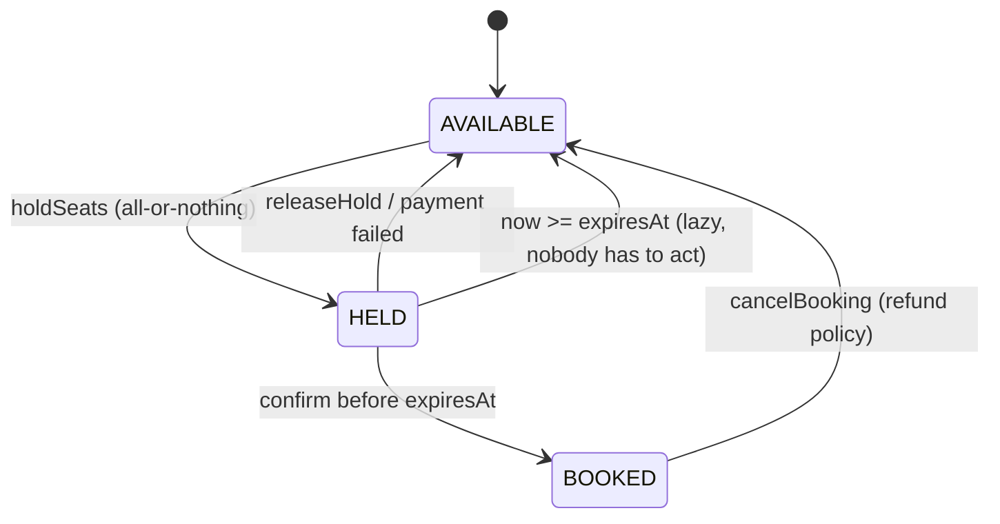

# Holds, Reservations and TTL

## 1. One-line summary

A **hold** is a temporary, exclusive claim on something scarce (a seat, a hotel room, the last item in stock) that **expires automatically** after a **TTL** (time to live) unless it is confirmed, so the user can finish a slow step like payment without someone else grabbing the item, and without the item being locked forever if they walk away.

## 2. The problem it solves

Booking a seat is not instant: pick seats, enter card details, wait for the bank's OTP (one-time password) page. That can take minutes. Two bad options without holds:

- **Mark the seat booked only after payment succeeds.** Two users pay for C7 at the same time; one gets charged for a seat they don't get, and you have to refund them. Terrible experience.
- **Mark the seat booked as soon as it's selected.** A user selects 10 seats and closes the tab. Those seats are gone until someone cleans up by hand.

A hold sits in between: the seat is **reserved for you for 10 minutes**. Pay in time and it becomes yours; leave and it quietly returns to the pool.

Infra analogy: this is a **lease**. A DHCP server leases an IP address to a laptop for some hours; if the laptop doesn't renew, the IP goes back to the pool. A Kubernetes `Lease` object lets a controller replica be leader only while it keeps renewing; if it crashes, another replica takes over after the lease runs out. Holds are leases for business inventory.

## 3. How it works



A hold records **who** holds it, **what** it covers, and **until when**:

```java
import java.time.Clock;
import java.time.Duration;
import java.time.Instant;
import java.util.List;

sealed interface SeatState permits Available, Held, Booked {}
record Available() implements SeatState {}
record Held(String holdId, Instant expiresAt) implements SeatState {}
record Booked(String bookingId) implements SeatState {}

final class HoldRules {
    static boolean isFree(SeatState s, Instant now) {
        return switch (s) {
            case Available a -> true;
            case Held h      -> !now.isBefore(h.expiresAt());  // expired hold = free
            case Booked b    -> false;
        };
    }
}
```

### Lazy expiry vs active sweeping

**Lazy expiry**: nobody deletes expired holds. Whenever you *read* a seat, you compare `expiresAt` with the current time, and an expired hold simply counts as available. Like a TTL cache entry that is only checked on `get`.

**Active sweeping**: a background job (a `ScheduledExecutorService` task, a cron job, a DB job) periodically finds expired holds and flips them back to AVAILABLE.

| | Lazy | Sweeper |
|---|---|---|
| Correctness | always exact at read time | stale between sweeps, unless reads also check |
| Moving parts | none | a thread/job to run, monitor and shut down |
| Seat map / "seats left" counter | must compute expiry on read | stored state is accurate (after a sweep) |
| Side effects at expiry (email "your hold expired", release payment auth) | not possible, nobody is notified | natural place for them |

The usual answer is **both**: lazy checks for correctness, plus an optional sweeper for cleanup and side effects. The sweeper is an optimization, never the thing correctness depends on. See [scheduled-executor-service](../libraries/java/scheduled-executor-service.md).

### The confirm-before-expiry race

The user pays at 09:59:59.900 with a hold that expires at 10:00:00. Payment takes 2 seconds. Meanwhile, at 10:00:00.1, another user's `holdSeats` sees an expired hold and grabs the seat. Then the first user's `confirmBooking` arrives.

Rules that keep this safe:

1. **Confirm re-checks expiry** under the same lock / CAS as the state change, using **the same injected `Clock`** as `holdSeats` (see [time-and-clock](../libraries/java/time-and-clock.md)). If two components use different clocks, one may think the hold is alive while the other thinks it's dead.
2. **Confirm checks the hold id**, not just "is the seat held?". If the seat is now held by someone else, `confirm` must fail.
3. **If confirm fails after money was taken**, refund automatically (or the payment was only *authorized*, and you void it).
4. Often a small **grace window** is shown to users as 10:00 but enforced as 10:00 + 30 s, so slow payment gateways don't cause refunds.

```java
String confirm(String holdId, Held current, Instant now) {
    if (!now.isBefore(current.expiresAt())) throw new IllegalStateException("hold expired");
    if (!current.holdId().equals(holdId))   throw new IllegalStateException("not your hold");
    return "booking-" + holdId;                       // flip HELD -> BOOKED under the same lock
}
```

### Idempotent confirm

Mobile networks retry. If `confirmBooking(holdId, paymentRef)` is called twice, the second call must return **the same booking**, not fail with "seat not held" and not create a second booking. Keep a map `holdId → bookingId`; if it's already there, return it. See [HLD: idempotency](../../HLD/concepts/idempotency-and-delivery-semantics.md).

### Releasing on payment failure

Card declined → call `releaseHold(holdId)` immediately so the seats go back now, not in 10 minutes. Release must also be idempotent and must only release seats *still held by this hold id* (they may have expired and been re-held by someone else).

### Choosing the TTL

| Too short (1 min) | Too long (30 min) |
|---|---|
| users with slow OTP/3-D Secure pages lose seats mid-payment; refunds | abandoned carts lock up inventory; a sold-out show has 20% "ghost" seats |
| angry users | bots can hold whole rows to scalp or block |

Pick it from data: the 95th or 99th percentile (the time within which 95% or 99% of users finish) of "seat selected → payment done". Typical values: ~5–10 min for cinema seats, ~10–15 min for flights, 15–60 min for e-commerce carts at sale time. Cap holds per user (e.g. 10 seats) to limit abuse.

### Overselling as a deliberate choice

Holds give **zero oversell**. Some businesses choose the opposite: airlines and hotels **overbook** on purpose because a predictable share of people don't show up, and an empty seat is lost revenue forever. That's a business decision with a compensation policy (bump with a voucher), not a concurrency bug. Cinemas usually don't overbook because the seat is a specific, numbered seat. Know which world your interview is in, and say it.

## 4. When to use it

- Any scarce, exclusive item with a slow step between "choose" and "commit": cinema/concert seats, flight seats, hotel rooms, limited-stock checkout, ride offers to a driver (offer expires in 15 s), appointment slots.
- Leader election and resource ownership in infra (leases), for the same reason: the owner might vanish.

## 5. When NOT to use it

- **Plentiful or non-exclusive goods** (an e-book, a digital subscription): no need to reserve anything.
- **Instant commits**: if the whole action is one fast transaction (like a "like" button), just do it atomically.
- **When you can't tolerate the hold window**: in flash sales with 1 M users and 1 k items, 10-minute holds on all items leave everyone else staring at "sold out" while most holds will be abandoned. Use short holds, queue users (virtual waiting room), or skip holds and accept "payment then allocate" with auto-refunds.

## 6. Commonly confused with

| | Hold / reservation | Lock | Booking |
|---|---|---|---|
| Lifetime | minutes, with TTL | microseconds to ms | permanent until cancelled |
| Survives a crash/restart | yes, if stored (DB/Redis) | no | yes |
| Held across user think-time | yes, that's the point | never | n/a |
| Can expire on its own | yes | no (unless timeout) | no |

A hold is **data** (a row, a record with `expiresAt`); a lock is a **runtime mechanism**. You take a lock briefly *to create* a hold; you don't hold a lock *as* the hold.

## 7. Common mistakes / misuse

1. **Holding a DB transaction or lock across payment** instead of storing a hold with an expiry.
2. **Relying on a sweeper for correctness**: if it lags or crashes, expired holds block seats.
3. **Using `System.currentTimeMillis()` directly**: untestable; inject a `Clock` and advance it in tests.
4. **Confirm doesn't re-check expiry or hold id**: you book a seat that was already given to someone else.
5. **Non-idempotent confirm**: a retry creates a duplicate booking or a false "failed" message after payment.
6. **Partial holds**: holding 3 of 4 requested seats. The user wanted 4 seats together; make it all-or-nothing.

## 8. Interview cheat-sheet

- "Selecting seats creates a hold with an `expiresAt`, not a booking; payment confirms it, otherwise it expires on its own."
- "Expiry is lazy: an expired hold counts as available when read, so correctness doesn't depend on a background job; a sweeper is optional for cleanup and notifications."
- "Confirm re-checks the hold id and expiry with the same injected `Clock`, atomically with the state change, and is idempotent by hold id."
- "On payment failure I release immediately; if payment succeeded but the hold expired, I auto-refund."
- "TTL is a UX vs inventory trade-off; I'd set it from the p95 checkout time and cap seats per user."

## 9. Used in

- [LLD: Design a Movie Ticket Booking System](../interviews/movie-booking/README.md) — `holdSeats` (all-or-nothing, 10-minute TTL, lazy expiry with an injected `Clock`), idempotent `confirmBooking`, `releaseHold`, holds stored in the DB at L6.
- [LLD: Design a Parking Lot](../interviews/parking-lot/README.md) — reservations held past start time, then released; overbooking as a business decision (L6).
- [HLD: Ride-sharing](../../HLD/interviews/ride-sharing/README.md) — driver offers that expire after 15 s (a lease).
- [ATM / Digital Wallet](../interviews/digital-wallet/README.md): wallet holds with capture, void and expiry.
- [Meeting-Room / Hotel Booking](../interviews/meeting-room-booking/README.md): tentative holds with expiry while the user confirms, tested with an injected clock.
- Related: [state-machines](state-machines.md), [optimistic-vs-pessimistic-locking](optimistic-vs-pessimistic-locking.md), [HLD: distributed locks and leases](../../HLD/concepts/distributed-locks-and-leases.md), [time-and-clock](../libraries/java/time-and-clock.md).
