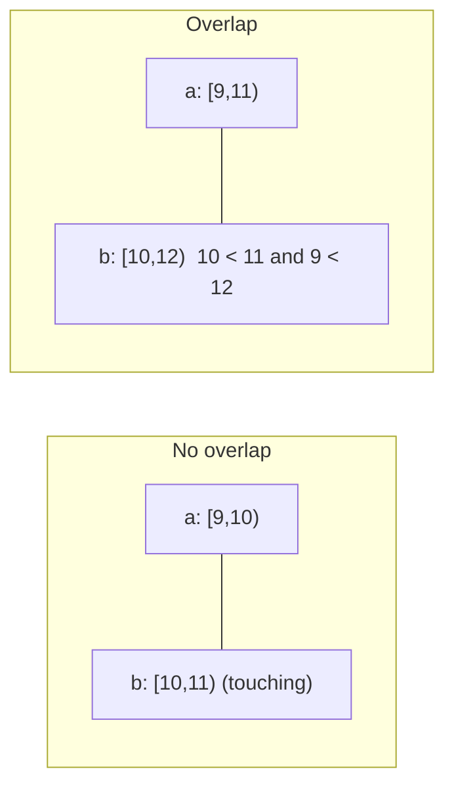

# Intervals and Overlap

## 1. One-line summary

An **interval** is a stretch of time (or numbers) with a start and an end; almost every scheduling problem reduces to three questions about intervals: *do these two overlap?*, *what is the union of all of these?* and *where are the gaps?*

## 2. The problem it solves

Two people want conference room "Aspen" on Monday. Ana wants 9:00 to 10:00, Ben wants 10:00 to 11:00. Is that a clash? Without a precise definition of "interval", teams disagree: the UI shows Ana's meeting ending "at 10:00", Ben's starting "at 10:00", and the code, written with `<=` somewhere, rejects Ben because "10:00 is in both". Worse, the bug hides: tests with clearly separated meetings pass, and only two back-to-back meetings (the most common case in real life) fail.

Infra analogy: this is the same problem as **CIDR ranges** (does 10.0.0.0/24 overlap 10.0.0.128/25?), **maintenance windows** (are two deploys scheduled at once?) and **log time ranges** (which segments cover 14:00 to 15:00?). Learn the pattern once and it applies everywhere.

## 3. How it works

### Half-open intervals: [start, end)

Write `[9:00, 10:00)`: the square bracket means "includes 9:00", the round one means "excludes 10:00". The meeting occupies every instant from 9:00 up to but not including 10:00. Consequences:

- `[9,10)` and `[10,11)` **touch but do not overlap**: back-to-back meetings just work.
- Length is simply `end - start`; no "+1" needed.
- Two adjacent intervals can be **merged** into `[9,11)` without gaps or double counting.
- Same convention as Java's `substring(from, to)`, `List.subList`, array ranges and `for (i = 0; i < n; i++)`.

Closed intervals `[9, 10]` would force you to say "ends at 9:59:59.999", which breaks the moment someone changes the time resolution.

### The overlap test

Two intervals overlap **if and only if each starts before the other ends**:

```java
boolean overlaps(Slot a, Slot b) { return a.start < b.end && b.start < a.end; }
```

Why this works: they are disjoint only when one lies completely before the other, `a.end <= b.start` or `b.end <= a.start`. Negate that and you get the formula (flipping "A or B" into "not A and not B"). It covers partial overlap, containment (one inside the other) and identical intervals with no special cases.



### Merging intervals (sweep from left to right)

Given a pile of intervals, produce the minimal set of non-overlapping blocks: **sort by start**, then walk through; if the next interval starts at or before the current block's end, extend the block's end to the larger of the two, otherwise start a new block. Cost: O(n log n) for the sort, O(n) for the sweep.

`[1,3) [2,6) [8,10) [10,12)` becomes `[1,6) [8,12)`. (Whether touching intervals merge is your choice; for "busy time" they should.)

### Gaps and the sweep line

**Free time = the window minus the merged busy blocks.** Walk the merged blocks with a cursor starting at the window start; every time the next block starts after the cursor, the stretch in between is a gap. To find "the first gap of at least 90 minutes across N rooms", either compute gaps per room and take the earliest, or (when *all* rooms must be free together) merge the busy intervals of all rooms into one list first.

A **sweep line** is the general version: turn every interval into two events (`+1` at start, `-1` at end), sort the events by time, walk through them while keeping a running counter. Where the counter is 0, it is free; the maximum counter value is the **peak concurrency** (the answer to "how many rooms do we need at once?"). At the same timestamp, process `-1` before `+1` so touching intervals do not count as concurrent.

### Keeping one resource's bookings searchable: TreeMap

If one room's bookings never overlap and are stored in a sorted map `start -> booking` (Java [`TreeMap`](../libraries/java/treeset-and-priorityqueue.md); a sorted map keeps keys ordered and finds neighbours in O(log n)), a new slot can only clash with **two** candidates:

1. `floorEntry(newStart)`: the booking starting at or before the new start. It clashes if its end is after `newStart`.
2. `higherEntry(newStart)`: the next booking starting after. It clashes if its start is before `newEnd`.

Anything further away is separated from the new slot by one of those two. So a check is O(log n) instead of scanning the whole day. This relies on the invariant "no overlaps inside the map"; if overlaps are allowed (e.g. a calendar showing everyone's meetings), the invariant breaks and you need a different structure.

### Interval trees

When intervals *can* overlap and you need "which of my 1 million intervals overlap this query?", use an **interval tree**: a balanced binary search tree keyed by start, where every node also stores the **maximum end** found in its subtree. While searching you skip any subtree whose max end is not after the query start. Query cost O(log n + k) for k results. The JDK has none built in; Guava's `RangeSet`/`RangeMap` store *disjoint* ranges (fine for a per-room calendar, not for overlapping ones), otherwise you hand-write an augmented tree. Variants: segment trees, and R-trees (for 2D/geo ranges).

### In the database: range types and exclusion constraints

Your code can check and still be wrong, because another server may insert in between (check-then-act race, see [transactions and isolation](transactions-and-isolation.md)). Make the **database** enforce it. PostgreSQL ([PostgreSQL](../../HLD/technologies/postgresql.md)) has range types (`tstzrange(start, end)` is half-open by default) and **exclusion constraints**:

```sql
CREATE EXTENSION IF NOT EXISTS btree_gist;
ALTER TABLE booking ADD CONSTRAINT no_double_booking
  EXCLUDE USING gist (room_id WITH =, tstzrange(start_at, end_at) WITH &&);
```

In words: "no two rows may exist where `room_id` is equal **and** the time ranges overlap (`&&`)". A **GiST index** (a tree index that supports "overlaps" questions, the database's built-in interval tree) enforces it atomically; the second concurrent insert fails with a constraint violation, which you translate to "slot taken". Without the extension, `WITH =` on a plain column cannot use a GiST index. MySQL has no equivalent; there you lock the room row (`SELECT ... FOR UPDATE`) and check inside the transaction.

## 4. When to use it

- Booking and reservation systems (rooms, tables, appointments, equipment).
- Scheduling and calendar views, free/busy lookups, "find a time that works for everyone".
- Capacity planning (peak concurrency), billing periods, validity ranges (price valid from/to), feature-flag windows, log or metric time ranges.

## 5. When NOT to use it

- **Not for point events** (a payment at 10:00:03): a plain timestamp is enough. Forcing a zero-length interval fails the "start before end" rule.
- **Not for counted inventory** (100 identical hotel rooms): that is a counter per night, not a search for overlapping intervals; see [meeting-room-booking L6](../interviews/meeting-room-booking/L6-staff.md).
- **Don't build an interval tree for 20 bookings a day**: a sorted list or the TreeMap trick is plenty.

## 6. Commonly confused with

| | Half-open `[s, e)` | Closed `[s, e]` |
|---|---|---|
| Back-to-back meetings | Fine | Falsely clash at the boundary |
| Length | `e - s` | `e - s + 1` (discrete) or ambiguous (continuous) |
| Good for | Time, ranges, arrays | Small whole-number ranges (page 3 to 7) |

| | Merge intervals | Sweep line | Interval tree |
|---|---|---|---|
| Answers | Union / busy blocks / gaps | Max overlap, free periods | "Who overlaps this query?" |
| Cost | O(n log n) once | O(n log n) once | O(log n) per query after build |
| Handles inserts | Rebuild | Rebuild | Yes |

## 7. Common mistakes / misuse

| Mistake | Why it hurts |
|---|---|
| `a.start <= b.end` (or `>=`) in the overlap test | Back-to-back meetings are rejected |
| Only checking "new start inside existing" | Misses a new slot that swallows an existing one |
| Allowing `start >= end` | Zero or negative length bookings that overlap nothing (or everything) |
| Storing local times | Daylight-saving changes make intervals vanish or double; store UTC instants, convert for display |
| Check in code, no database constraint | Two app servers pass the check and both insert |
| Merging without sorting first | Wrong blocks, depends on input order |
| Using `Date`/`long` mixed units (seconds vs ms) | Off by 1000x, silently |

## 8. Interview cheat-sheet

"I model a booking as a half-open interval `[start, end)` in UTC, so 9-10 and 10-11 don't clash. Overlap is `a.start < b.end && b.start < a.end`. Per room I keep a `TreeMap` from start to booking and check only the floor and the next entry, so a check is O(log n). For availability I merge busy intervals and take the gaps; for 'any room' I do this per room and take the earliest. To be safe under concurrency I do check-and-insert under one lock per room, and in the database I'd add a Postgres exclusion constraint on room and time range so even two app servers can't double-book."

## 9. Used in

- [Meeting-room booking (this concept is its core)](../interviews/meeting-room-booking/README.md)
- [Movie booking](../interviews/movie-booking/README.md): seats are discrete, but the same hold-then-confirm flow applies ([holds and TTL](holds-reservations-and-ttl.md))
- [Cron and recurring schedules](cron-and-recurring-schedules.md): generating the occurrences that become intervals
- [Optimistic vs pessimistic locking](optimistic-vs-pessimistic-locking.md): how to make the check-then-insert safe
