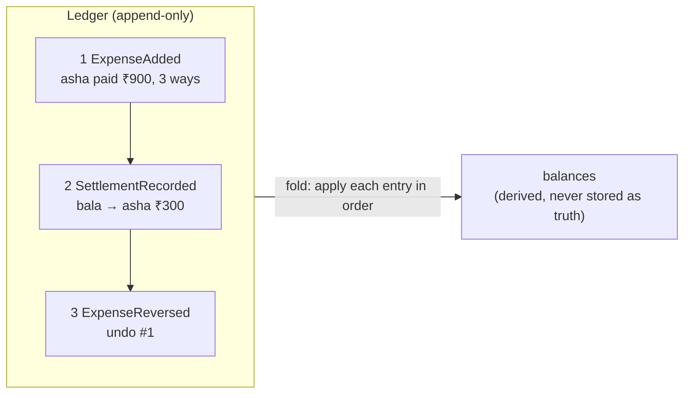

# Ledgers and Event Sourcing (append-only entries, derived balances)

## 1. One-line summary

A **ledger** is an append-only list of money movements; balances are never stored and edited directly but **derived** by adding up the entries — and **event sourcing** is the same idea as a software pattern: current state = a fold (running computation) over every event that ever happened.

## 2. The problem it solves

The obvious design for Splitwise is a `balance` column per user that you `UPDATE` on every expense:

```sql
UPDATE balances SET amount = amount + 30000 WHERE user_id = 'asha';
```

Then the questions start arriving:

- "Why do I owe Bala ₹1,240?" — you have no idea; the column only holds the latest number.
- Someone **edits** last week's dinner from ₹900 to ₹600. Which balances change, and by how much? You must re-derive the old split to undo it — from data you've overwritten.
- A bug double-applied an expense in March. Which rows are wrong? You can't tell; history is gone.
- Two requests update the same row at once and one update is lost.

Accountants solved this ~500 years ago: **never erase, only append**. Every movement is a new line in the book; the balance is the sum of the lines. A mistake is fixed by adding a *correcting* line, so the book always shows what happened and when.

## 3. How it works

### Ledger: entries in, balances out

Each entry is **immutable** (never changed after it's written). A balance is a **pure function** of the entries — same entries in, same balances out, every time.



### Double-entry bookkeeping in plain words

💡 **Double-entry bookkeeping**: every movement is recorded on **two sides** — the side money comes from (debit/credit, depending on account type) and the side it goes to — with equal and opposite amounts. So across all accounts, the entries always **sum to zero**. If they don't, there's a bug, and you know immediately.

In Splitwise terms, `net = paid − owed` per user:

- An expense: payer gets `+total`, each participant gets `−theirShare`. Because the shares sum exactly to the total (see [splitting-money-and-rounding](splitting-money-and-rounding.md)), the expense nets to **0**.
- A settlement (Bala pays Asha ₹300 in cash): Bala `+300`, Asha `−300`. Also **0**.
- Therefore **Σ net over the group is always 0**. That's a free invariant you can assert in tests and in a nightly reconciliation job.

### Corrections by reversal, not edits

Delete an expense → append `ExpenseReversed` that applies the exact **mirror** of the original. Edit an expense → append a reversal of the old version **plus** a new `ExpenseAdded`. History shows "₹900 dinner, reversed on 12 Oct, replaced by ₹600 dinner".

```java
import java.util.*;

sealed interface Entry permits ExpenseAdded, SettlementRecorded, ExpenseReversed {}
record ExpenseAdded(String expenseId, String payer, long total, Map<String, Long> owed) implements Entry {}
record SettlementRecorded(String from, String to, long paise) implements Entry {}
record ExpenseReversed(String expenseId, ExpenseAdded original) implements Entry {}

static Map<String, Long> balances(List<Entry> ledger) {      // state = fold over events
    Map<String, Long> net = new TreeMap<>();
    for (Entry e : ledger) apply(net, e);
    return net;
}

static void apply(Map<String, Long> net, Entry e) {
    switch (e) {                                              // exhaustive: sealed interface
        case ExpenseAdded(var id, var payer, var total, var owed) -> {
            net.merge(payer, total, Long::sum);                       // payer is owed the total...
            owed.forEach((u, amt) -> net.merge(u, -amt, Long::sum));  // ...each person owes their part
        }
        case SettlementRecorded(var from, var to, var paise) -> {
            net.merge(from, paise, Long::sum);    // debtor paid cash: their debt shrinks
            net.merge(to, -paise, Long::sum);     // creditor received cash: they're owed less
        }
        case ExpenseReversed(var id, var orig) -> {                  // exact mirror of the original
            net.merge(orig.payer(), -orig.total(), Long::sum);
            orig.owed().forEach((u, amt) -> net.merge(u, amt, Long::sum));
        }
    }
}
// after #1, #2:     {asha=30000, bala=0, chen=-30000}
// after #3 too:     {asha=-30000, bala=30000, chen=0}  <- bala's ₹300 payment is now owed back to him
```

The switch syntax is explained in [sealed-interfaces-and-pattern-matching](../libraries/java/sealed-interfaces-and-pattern-matching.md); `merge` in [streams-and-collectors](../libraries/java/streams-and-collectors.md).

### Event sourcing: the software pattern

💡 **Event sourcing**: instead of storing the current state of an object, store the sequence of **events** (facts in past tense: `ExpenseAdded`, `ExpenseReversed`) and rebuild state by replaying them. A **fold** (also called `reduce`) means "start with an empty state and apply each event in order".

- **Snapshots for speed.** Replaying 10 years of events on every read is slow. Periodically save `(balances, lastEntryNumber)`; to read, load the latest snapshot and replay only the entries after it. The snapshot is a **cache** — you can delete it and rebuild from the ledger.
- **Read models / projections.** You can keep a materialised `balances` map updated as each entry is appended (in the same lock / transaction). It's fine to *store* it — what matters is that the ledger is the **source of truth** and the projection can be rebuilt from it.
- **Audit trail for free.** "Who changed what, when?" is just the ledger, read in order.

### You already know this from infra

| Infra thing | Same idea |
|---|---|
| **Git** | commits are append-only; `git revert` adds a new commit that undoes an old one instead of rewriting history; the working tree is derived from the commits |
| **Kafka topic** | an append-only log; consumers build their state by reading it from an offset; compacted topics ≈ snapshots |
| **Database WAL** (write-ahead log) | the database writes every change to a sequential log *before* updating tables; after a crash it replays the log to rebuild state |
| **k8s / GitOps** | desired state from a history of config commits; roll back by applying an older commit, not by hand-editing the cluster |

## 4. When to use it

- **Money and anything auditable**: balances, wallets, loyalty points, inventory counts, billing.
- When users ask "**why** is this number what it is?" and you must answer with a history.
- When **edits and deletes** must be traceable (shared group expenses, financial records, compliance).
- When you want to recompute state with a **new rule** later (e.g. a new "simplify debts" view) from the same facts.

## 5. When NOT to use it

- **Simple CRUD data with no history value** — a user's display name, a profile photo. Event sourcing there is ceremony.
- **When you need to truly delete data** (privacy laws like GDPR's right to erasure) — an immutable log fights you; you need crypto-shredding (encrypt per user, throw away the key) or separate storage for personal data.
- **Teams new to it on a tight deadline** — schema evolution of old events, snapshot management, and replay bugs are real costs.

## 6. Commonly confused with

| | CRUD balance column | Ledger / event sourcing |
|---|---|---|
| Source of truth | the current value | the list of entries |
| Edit / delete | `UPDATE` / `DELETE` in place | append a reversal (+ a new entry) |
| "Why is it ₹1,240?" | unknown | replay the entries |
| Concurrency | lost updates on the same row | appends are simpler to serialise (per-group lock or log order) |
| Read cost | O(1) | O(entries) — unless you keep a snapshot / projection |
| Fix a past bug | guess and patch | correct the code, replay, compare |

| | Event sourcing | Event-driven architecture |
|---|---|---|
| Events are | the stored state itself | messages to notify other services |
| Can delete events? | no — they *are* the data | yes, after consumers process them |

## 7. Common mistakes / misuse

1. Editing or deleting a ledger entry "just this once" — the audit trail is now a lie, and replays stop matching.
2. Storing a balance column **and** the ledger, but letting them drift (updated in separate transactions). Update the projection in the same lock/transaction as the append, and have a job that rebuilds and compares.
3. A reversal that **recomputes** the original split instead of copying it — if the split algorithm changed, the reversal doesn't exactly cancel. Reverse the stored amounts.
4. No idempotency: a client retry appends the same expense twice. Use idempotency keys (see [idempotency](../../HLD/concepts/idempotency-and-delivery-semantics.md)).
5. Replaying without snapshots on every read → slow reads as history grows.
6. Not asserting the invariant: Σ net per group must be 0 after every append.

## 8. Interview cheat-sheet

- "Balances aren't stored as truth — they're derived from an append-only ledger of expenses, settlements and reversals."
- "Each expense nets to zero (payer +total, participants −share), so the whole group's balances always sum to zero; I assert that."
- "Edits and deletes are reversal entries, never updates, so we have a full audit trail — like `git revert`."
- "Reads use a projection updated on each append, or a snapshot plus the tail of the ledger; both can be rebuilt from the ledger."
- "Same idea as a database WAL or a Kafka log: the log is the truth, tables are a cache of it."

## 9. Used in

- [LLD: Design Splitwise](../interviews/splitwise/README.md) — per-group append-only `Ledger` (expenses, settlements, reversal entries for edits/deletes); balances derived as paid − owed and always summing to 0.
- [LLD: Design an In-Memory Key-Value Store with Transactions](../interviews/kv-store/README.md) — the append-only file (AOF) is a redo log: state is rebuilt on startup by replaying committed batches, and compaction rewrites it as a snapshot of the current state (see [durability-wal-and-snapshots](durability-wal-and-snapshots.md)).
- [Collaborative editor](../../HLD/interviews/collaborative-editor/README.md): the operation log is the source of truth and snapshots are a cache; even restoring an old version is a new appended edit.
- Related: [splitting-money-and-rounding](splitting-money-and-rounding.md), [state-machines](state-machines.md), [single-writer-principle](single-writer-principle.md), [records-and-immutability](../libraries/java/records-and-immutability.md), [HLD: Kafka](../../HLD/technologies/kafka.md).
