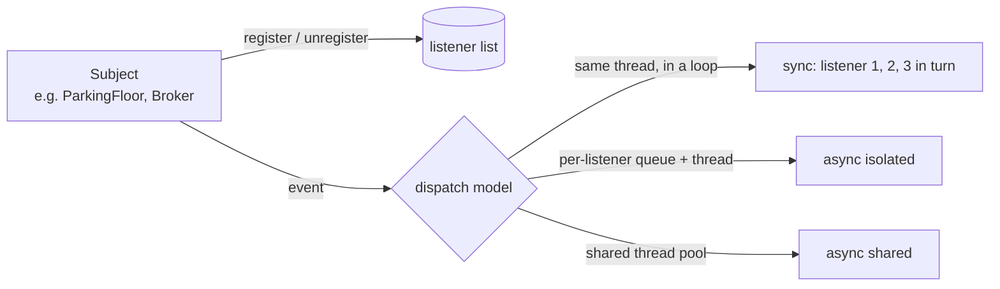

# Observer and Event Dispatch

## 1. One-line summary

The **Observer pattern** lets an object (the **subject**) notify a list of registered **listeners** (observers) when something happens, without knowing what they do; **event dispatch** is the part the textbook skips: *on which thread, in what order, with what buffering and what happens on failure* those listeners get called.

💡 **Listener / observer / subscriber / handler** all mean "code that asked to be called back". **Callback** = a function you hand to someone else so they can call it later. **Dispatch** = the act of delivering an event to a listener.

---

## 2. The problem it solves

**The pain:** a parking floor's free-spot count changes. Without Observer, the floor class must call every interested party itself:

```java
void spotFreed() {
    free++;
    displayBoard.update(free);         // the floor now depends on the display board,
    mobileApp.push(free);              // the mobile app,
    metrics.gauge("free_spots", free); // and metrics. A fourth team means editing this class.
}
```

Or the interested parties **poll** ("any change?") every second, wasting work and still being up to a second late.

**The fix (Observer, from the 1994 "Gang of Four" *Design Patterns* book):** the floor keeps a list of listeners behind an interface and calls `listener.onChange(free)` for each. New listeners register themselves; the floor never changes. You already use this everywhere: `addEventListener` in browsers, Node's `EventEmitter`, Kubernetes **watches** (the API server pushes every change to every watcher), Spring's `@EventListener`.

**The second pain (what this page is really about):** "call each listener" hides decisions. If a listener is slow, the subject is slow. If it throws, the rest may not be called. If it subscribes another listener while being called, the list changes mid-loop. If it's never removed, it's never garbage-collected. Those are **dispatch** problems, and they're where interview answers and production incidents live.

---

## 3. How it works



### 3.1 The dispatch models

| Model | How | Good | Bad | Examples |
|---|---|---|---|---|
| **Synchronous** | Subject loops over listeners on its own thread | Simple; listener sees the state at the moment of the event; exceptions can propagate to the caller | Subject is as slow as the slowest listener; a blocking listener blocks it; re-entrancy | Node `EventEmitter`, Guava `EventBus`, Spring events (default), Swing (Java's desktop UI toolkit) |
| **Async, queue per listener** | Subject appends to each listener's queue; each has its own dispatcher thread | Isolation: a slow listener hurts only itself; per-listener order kept | A thread (or virtual thread) per listener; must bound the queues ([back-pressure](back-pressure.md)) | `SubmissionPublisher` (JDK, a buffer per subscriber), the [pub-sub broker](../interviews/pub-sub-broker/README.md) |
| **Async, shared pool** | Each (event, listener) pair becomes a task on a thread pool | Few threads | Two events for one listener may run **in parallel or out of order**, unless each listener is made a "serial executor" (one task at a time) | Guava `AsyncEventBus`, Spring `@Async` listeners |
| **Through a broker** | Subject publishes to a topic; listeners are subscriptions, maybe in other processes | Decoupled in time and space; durable | A network and a broker to run | Kafka, RabbitMQ, Pub/Sub ([pub/sub](../../HLD/technologies/pub-sub.md)) |

### 3.2 The five dispatch pitfalls

1. **Exceptions.** In a plain loop, listener 2 throwing means listener 3 never hears about it. Catch **per listener**, log, count. In an async dispatcher, an uncaught exception ends the dispatcher thread: that listener silently stops forever.
2. **Re-entrancy.** A listener publishes another event *while being called*. Synchronously, the nested event is delivered to all listeners **before** the outer one finishes reaching the rest, so some listeners see event 2 before event 1. Queued dispatch avoids it (the nested event goes to the back of each queue).
3. **Changing the list during dispatch.** A listener unsubscribes itself (or subscribes another) mid-loop: `ConcurrentModificationException` with an `ArrayList`. Use a `CopyOnWriteArrayList` (each write copies the array, so a loop iterates a stable snapshot; [concurrent collections](../libraries/java/concurrent-collections.md)) and document that a listener removed during a dispatch may still get that one event.
4. **The lapsed listener (a memory leak).** The subject holds a strong reference to every listener; a listener that is never unregistered (a closed screen, a finished request handler) can never be garbage-collected, nor can everything it references. Fixes: return a handle (`Subscription.close()`, `AutoCloseable` for try-with-resources), tie the subscription to a lifecycle, or hold listeners via weak references (rarely a good idea: the listener can vanish while you still want it; [references & GC](../libraries/java/references-and-gc.md)). Node warns at 11 listeners for one event: `MaxListenersExceededWarning: Possible EventEmitter memory leak detected`.
5. **Holding a lock while calling listeners.** The subject locks its state, calls a listener, the listener calls back into the subject (or another thread needs the lock): a **deadlock** (threads waiting for each other forever) or long stalls ([deadlocks & lock ordering](deadlocks-and-lock-ordering.md)). Copy what you need under the lock, release it, then dispatch.

### 3.3 Push vs pull

| | **Push** (callback) | **Pull** (poll) |
|---|---|---|
| Who controls the pace | The subject | The listener |
| Back-pressure | Must be added (bounded queues, policies) | Built in: a slow listener just polls less |
| Latency | Immediate | Up to one poll interval (or **long-polling**: the request waits open until there is something to return) |
| Examples | `EventEmitter`, webhooks (HTTP calls to a URL you registered), Pub/Sub push subscriptions | Kafka consumers (`poll()`), SQS `ReceiveMessage`, Prometheus scraping |

**Reactive Streams** (a 2015 specification; Java 9's `java.util.concurrent.Flow` copies its interfaces) mixes them: the subscriber **pulls a credit** with `request(n)`, and the publisher may then **push** up to n items. That `request(n)` is back-pressure in one method call.

### 3.4 A minimal correct synchronous version

```java
public final class EventSource<E> {
    private final List<Consumer<E>> listeners = new CopyOnWriteArrayList<>();   // snapshot iteration

    public AutoCloseable subscribe(Consumer<E> l) {
        listeners.add(l);
        return () -> listeners.remove(l);       // a handle: removes this exact object
    }

    public void emit(E event) {                 // call WITHOUT holding any lock
        for (Consumer<E> l : listeners) {
            try { l.accept(event); }
            catch (RuntimeException e) { log.warn("listener failed", e); }   // one failure doesn't stop the rest
        }
    }
}
```

For isolation (a slow listener must not slow `emit`), replace the loop body with "append to that listener's bounded queue", one dispatcher per listener: the L4 step of the [pub-sub broker](../interviews/pub-sub-broker/L4-mid.md#52-a-queue-and-a-thread-per-subscription).

---

## 4. When to use it

- One event, several independent reactions, and the source shouldn't know them (domain events: "order placed" → email, analytics).
- UI and state changes: views observing a model; config reloads notifying components; k8s-style watches.
- Plug-in points: let other modules hook in without changing the core.
- Synchronous dispatch when listeners are fast, local and trusted (updating an in-memory index); async when any listener does I/O.

---

## 5. When NOT to use it

- **When the caller needs the result.** "Validate this order" with three validators isn't an event: call them and combine the answers (or use [Chain of Responsibility](../interviews/logging-framework/L5-senior.md)). Events are for "this happened", not "please decide".
- **When the order between reactions matters and spans listeners** ("reserve stock, then charge, then email"): that's a workflow; make the sequence explicit (a **saga**: a sequence of steps with an undo for each, or an orchestrator that calls them in order; [sagas](../../HLD/concepts/sagas-and-distributed-transactions.md)). Listener order is an accident you shouldn't depend on.
- **When the event must survive a crash.** An in-memory listener list forgets everything on restart; write the event to durable storage (a **transactional outbox**: an events table written in the same database transaction, published afterwards) or a broker.
- **For one fixed collaborator.** A single, known dependency is clearer as a direct method call; an event bus with one listener is indirection without benefit, and makes "who calls this?" hard to answer in the IDE.

---

## 6. Commonly confused with

| | **Observer** | **Pub-Sub (broker)** | **Message queue** | **Mediator** | **Callback** |
|---|---|---|---|---|---|
| Who knows whom | Subject holds listener references | Neither side knows the other; both know a topic name | Producer knows the queue | Colleagues know only the mediator | Caller knows the one function |
| Receivers per event | All listeners | All subscriptions | **One** worker | Mediator decides | One |
| Usually | In-process, often synchronous | Async, often cross-process | Async, cross-process | In-process | In-process |
| Buffering | None (sync) | Per subscription | One shared queue | None | None |
| Example | `addEventListener`, `EventEmitter` | Kafka topic, Redis `PUBLISH` | SQS, RabbitMQ work queue | A chat room object routing messages between users | `CompletableFuture.thenAccept` |

Pub-sub is "Observer with a middleman and a buffer"; a queue is "one receiver per message, not all".

---

## 7. Common mistakes / misuse

1. **Calling listeners on the publisher's thread when one does I/O** — the publisher inherits its latency and its outages.
2. **No per-listener `try/catch`** — one bad listener hides events from the rest, or kills an async dispatcher thread.
3. **Unbounded per-listener queues** — a slow listener becomes an `OutOfMemoryError` for everyone.
4. **Never unsubscribing** — the lapsed-listener leak; return a handle and close it.
5. **Unsubscribe by passing the same lambda again** — two lambdas with the same code are different objects; the remove silently does nothing.
6. **Mutable event objects** — one listener's change is seen by the next; make events immutable (records, `Map.copyOf`).
7. **Relying on listener order** — registration order is not a contract; if B needs A's result, B should listen to an event A publishes.
8. **Assuming "async" keeps order** — on a shared thread pool, two events to the same listener can run in parallel.

---

## 8. Interview cheat-sheet

> "Observer is the right decoupling idea, but the dispatch model is the real design. Synchronous dispatch is simple and keeps causality, but makes the publisher as slow and fragile as the worst listener, and has re-entrancy and list-mutation traps; so I catch per listener, iterate a snapshot like a CopyOnWriteArrayList, and never call listeners under a lock. If any listener can be slow, I give each one a bounded queue and its own dispatcher, so it only hurts itself, and choose an overflow policy and count drops. I return a handle from subscribe so listeners can be removed, because a forgotten listener is a memory leak. And if the event has to survive a crash or leave the process, it isn't an observer any more, it's a broker."

---

## 9. Used in

- [LLD: Pub-Sub Broker](../interviews/pub-sub-broker/README.md) — the whole interview: synchronous Observer → queue + dispatcher per subscription (L4), bounded queues, acks, consumer groups (L5), log model and wildcards (L6).
- [LLD: Parking Lot](../interviews/parking-lot/README.md) — `AvailabilityListener` for display boards (synchronous, `CopyOnWriteArrayList`).
- [LLD: Elevator System](../interviews/elevator-system/README.md) — `ElevatorListener` for displays (ARRIVED, DOORS_OPENED).
- [LLD: Logging Framework](../interviews/logging-framework/README.md) — appenders as observers of log events; the async appender is "a queue per listener".
- Related: [design patterns](design-patterns.md) (the short Observer entry), [back-pressure](back-pressure.md), [thread-safety basics](thread-safety-basics.md), [blocking queues & producer-consumer](../libraries/java/blocking-queues-and-producer-consumer.md), [event loop & concurrency in Node](../libraries/js/event-loop-and-concurrency.md), [fan-out](../../HLD/concepts/fan-out.md), [pub/sub](../../HLD/technologies/pub-sub.md).
