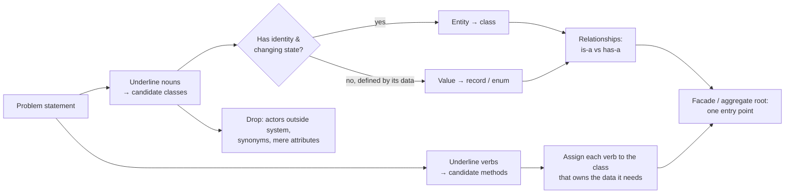

# OOP Modeling (from problem statement to classes)

## 1. One-line summary

OOP modeling is the step where you turn a fuzzy problem ("design a parking lot") into a **small set of classes with clear responsibilities** — nouns become candidate classes, verbs become methods, and you decide what is an entity, what is a value, and what *has* (not *is*) what.

💡 **Entity / value / responsibility:** an entity is an object with its own identity that changes over time (a parking spot); a value is defined only by its data (an amount of money). A *responsibility* is the one job a class is in charge of. Both ideas are explained in Step 2.

## 2. The problem it solves

Most LLD interviews are lost in the first ten minutes, not in the code. Two typical failures:

- **Too many classes:** `Car extends Vehicle`, `Truck extends Vehicle`, `SmallSpot extends Spot`, `ElectricLargeSpot extends LargeSpot`, `EntrancePanel`, `ExitPanel`, `Attendant`, `Admin`... 25 boxes, nothing runs, and adding "electric vehicle" means four new subclasses.
- **Too few classes:** one `ParkingLotService` with 600 lines and a `Map<String, Object>` for everything — a "god class".

💡 **God class / `extends` / subclass:** a god class is one giant class that does everything. `extends` makes a class inherit from another; the inheriting class is the subclass.

Good modeling is like designing a k8s deployment: each component has one job (ingress routes, service balances, pod runs), the boundaries are explicit, and you can change one without redeploying the others.

💡 **Facade / aggregate root / observer / record / enum:** the Mermaid diagram below uses these terms. A *facade* is one simple front class hiding a messy subsystem (like an ingress). An *aggregate root* is the single object outsiders must go through (Step 4). An *observer* is a listener that gets called when something changes. A *record* is a short Java class for immutable data. An *enum* is a fixed set of named constants.

## 3. How it works



### Step 1 — Nouns and verbs

> "A parking lot has several **floors**. Each floor has **spots** of different **sizes**. **Vehicles** (motorcycles, cars, trucks) **enter** through a **gate**, get a **ticket**, **park** in a spot that **fits**, and **pay** a **fee** based on time when they **exit**. **Display boards** show free spots per floor."

| Noun | Keep? | Why |
|---|---|---|
| ParkingLot | class | the system boundary / facade |
| Floor | class | owns spots, reports availability |
| Spot | class | has identity, free/occupied changes |
| Size, vehicle "kinds" | enums | fixed categories, not classes |
| Vehicle | record | plate + type; we don't track its state |
| Ticket | record | issued once, a fact |
| Fee / Receipt | record (Money via BigDecimal) | value |
| Gate | maybe | a *caller* of `park()`; often just a thread, not a class |
| Display board | interface (observer) | reacts to events |
| Customer, attendant | drop | actors outside the software |

| Verb | Goes to | Because it needs |
|---|---|---|
| park / unpark | `ParkingLot` | coordinates floors, tickets, pricing |
| find a fitting spot | `SpotAllocationStrategy` | an algorithm that may vary |
| occupy / release | `ParkingSpot` | its own state |
| compute fee | `PricingStrategy` | rates and time rules that vary |
| show free count | `DisplayBoard` (observer) | notified by floor |

Rule of thumb: **put a method where the data it uses lives** ("tell, don't ask") — `spot.tryOccupy()`, not `if (!spot.isOccupied()) spot.setOccupied(true)` in some service.

💡 **"Tell, don't ask":** tell the object what you want done (`spot.tryOccupy()`) instead of reading its state, deciding, and writing it back from outside. The check and the change then happen in one place, which also makes it possible to make them atomic (indivisible) later.

### Step 2 — Entity vs value object

- **Entity**: has an identity that stays the same while its state changes. Spot "F2-17" is the same spot whether free or occupied. → mutable class, `equals` by id or identity.
- **Value object**: defined entirely by its data; no identity; immutable. Two `Money(₹40, INR)` are interchangeable. → [record](../libraries/java/records-and-immutability.md).

💡 **`equals` / mutable / immutable:** `equals` decides when two Java objects count as "the same". Mutable = fields can change after creation; immutable = they cannot, so the object can be shared freely, even across threads.

### Step 3 — is-a vs has-a, and the subclass explosion

The classic trap:

```java
abstract class Vehicle { }
class Car extends Vehicle { }       class Truck extends Vehicle { }
abstract class ParkingSpot { abstract boolean canFit(Vehicle v); }
class CompactSpot extends ParkingSpot { ... instanceof checks ... }
class LargeSpot extends ParkingSpot { ... }
// then: ElectricCar? HandicappedLargeSpot? CoveredElectricCompactSpot?
```

Every new dimension multiplies classes (sizes × features), and `canFit` fills with `instanceof`. The subclasses add **no behaviour** — only a different value of "size". That's data, not type.

💡 **`instanceof`:** a Java check of an object's concrete class (`if (v instanceof Car)`); long chains of it are a sign the types should be data or use polymorphism (calling the same method and letting each class respond its own way).

```java
public enum SpotSize { SMALL, MEDIUM, LARGE }
public enum VehicleType {
    MOTORCYCLE(java.util.EnumSet.allOf(SpotSize.class)),
    CAR(java.util.EnumSet.of(SpotSize.MEDIUM, SpotSize.LARGE)),
    TRUCK(java.util.EnumSet.of(SpotSize.LARGE));
    private final java.util.Set<SpotSize> fits;
    VehicleType(java.util.Set<SpotSize> fits) { this.fits = fits; }
    public boolean fitsIn(SpotSize s) { return fits.contains(s); }
}
public record Vehicle(String licensePlate, VehicleType type) {}
public final class ParkingSpot {
    private final String id;
    private final SpotSize size;
    private final java.util.Set<String> features;   // "EV_CHARGER", "COVERED": capabilities, not subclasses
    // ...
    public ParkingSpot(String id, SpotSize size, java.util.Set<String> features) {
        this.id = id; this.size = size; this.features = java.util.Set.copyOf(features);
    }
}
```

New vehicle type = one enum constant. New feature = one value in a set. Use **inheritance only when subtypes really behave differently** and honour the parent's contract (Liskov, see [solid-principles](solid-principles.md)); prefer **interfaces + composition** for behaviour that varies (pricing, allocation → [Strategy](design-patterns.md)). Enum details: [enums-and-enummap](../libraries/java/enums-and-enummap.md).

💡 **Liskov / composition:** the Liskov Substitution Principle says a subclass must work anywhere its parent is expected without surprises (see [solid-principles](solid-principles.md)). Composition = a class holds another object in a field and uses it, instead of inheriting from it. **Strategy** = an interface with swappable implementations for one algorithm, e.g. pricing.

| Question | is-a (inheritance) | has-a (composition) |
|---|---|---|
| Test | "a B is always a valid A everywhere an A is used" | "A uses / contains a B" |
| Parking example | `HourlyPricing` *implements* `PricingStrategy` | `ParkingLot` *has a* `PricingStrategy` |
| Changing at runtime | no | yes (swap the field) |
| Coupling | tight to parent internals | only to an interface |

### Step 4 — Aggregate and facade boundary

An **aggregate** is a cluster of objects that must stay consistent together, with one **root** that outsiders talk to (term from Domain-Driven Design). Here, `ParkingLot` is the root: gates call `lot.park(vehicle)` and never touch `ParkingFloor` or `ParkingSpot` directly. That gives one place to enforce invariants ("one vehicle, one active ticket", "a spot holds one vehicle") and to add locking. It's also the **Facade** pattern — a simple front over a subsystem, like an ingress in front of many services.

💡 **Domain-Driven Design (DDD) / invariants / locking:** DDD is a way of structuring code around the business concepts. An invariant is a rule that must always hold (e.g. "a spot holds one vehicle"). Locking means making sure only one thread changes the data at a time; doing it in the root means one lock location instead of many.

```java
public interface ParkingService {           // what the outside world sees
    Ticket park(Vehicle vehicle);           // throws if lot full for that type
    Receipt unpark(String ticketId);
}
```

### Step 5 — Keep classes small

A class should have **one reason to change** (Single Responsibility). If you can't describe it in one sentence without "and", split it. `ParkingLot` coordinates; it doesn't compute fees (strategy), pick spots (strategy), or render boards (observer).

💡 **Single Responsibility Principle (SRP):** the "S" in SOLID, a set of five design guidelines covered in [solid-principles](solid-principles.md).

## 4. When to use it

- The first 5–10 minutes of every LLD interview, right after clarifying requirements: list entities, values, relationships, then draw a [class diagram](uml-class-diagrams.md).
- Whenever a class grows past ~200 lines or a method needs `instanceof` chains.

## 5. When NOT to use it

- **Modeling every noun.** Actors (customer, attendant), synonyms (lot/garage) and simple attributes (colour) aren't classes.
- **Inheritance for code reuse alone.** If the subclass only exists to borrow methods, compose.
- **Deep up-front taxonomies** before you have requirements — model what the use cases need, then extend.
- **Rich OOP for data pipelines/scripts** — sometimes a function over records is the clearest design.

## 6. Commonly confused with

| | Entity | Value object | Service / Strategy |
|---|---|---|---|
| Identity | yes (id) | no | n/a (stateless or config only) |
| Mutable | yes, through its own methods | no | usually no |
| Java form | class | record / enum | interface + class |
| Parking example | `ParkingSpot`, `ParkingFloor`, `ParkingLot` | `Vehicle`, `Ticket`, `Money` | `PricingStrategy`, `SpotAllocationStrategy` |

| | Aggregation | Composition | Inheritance |
|---|---|---|---|
| Relationship | has-a, parts can live alone | owns-a, parts die with whole | is-a |

💡 **Aggregation vs composition (UML):** both mean "has-a"; in aggregation the parts can exist on their own (a display board outlives a lot), in composition they are destroyed with the owner (spots die with their floor). See [uml-class-diagrams](uml-class-diagrams.md).

| Example | lot → display boards | floor → spots | `HourlyPricing` → `PricingStrategy` |

## 7. Common mistakes / misuse

1. Subclass per vehicle type / spot size → class explosion and `instanceof`.
2. God class: all logic in `ParkingLotManager`; other classes are data bags with getters/setters (an "anemic model").
3. Making entities records (or values mutable).
4. Exposing internals: `lot.getFloors().get(2).getSpots().get(17).setOccupied(true)` from a gate — breaks the aggregate boundary (and the Law of Demeter: talk only to your direct collaborators).

💡 **Anemic model / getters and setters:** classes that only hold fields with `getX()/setX()` while all the logic sits in a separate manager class; it throws away the benefit of objects owning their behaviour.

💡 **Law of Demeter:** "only talk to your direct neighbours": a caller should not chain through several objects (`a.getB().getC().doIt()`) because then it depends on how all of them are wired internally.

5. Modeling actors (Customer, Admin) with no behaviour in the software.
6. Interfaces with one implementation and no reason to vary.
7. Spending 20 minutes on classes and never reaching `park()`.

## 8. Interview cheat-sheet

- "I'll pull out the nouns — lot, floor, spot, vehicle, ticket — and decide which are entities and which are values."
- "Vehicle types and spot sizes are enums with a fits-in rule, not subclasses; a new type is one constant, not a hierarchy."
- "Spots are entities with changing state; tickets, vehicles and money are immutable records."
- "Pricing and spot allocation vary, so they're strategies injected into the lot — composition over inheritance."
- "`ParkingLot` is the facade and aggregate root: gates only call `park` and `unpark`, so invariants and locking live in one place."

## 9. Used in

- [LLD: Design a Parking Lot](../interviews/parking-lot/README.md) — nouns → classes, enum + capability instead of subclasses, `ParkingLot` facade.
- [LLD: Design a Rate Limiter](../interviews/rate-limiter/README.md) — limiter interface, config as a value, registry as the entry point.
- [LLD: Design an Elevator System](../interviews/elevator-system/README.md) — `Elevator`, `ElevatorSystem` facade, hall calls vs car calls as distinct concepts, enums for direction and status.
- [LLD: Design Splitwise](../interviews/splitwise/README.md) — `User`, `Group`, `Expense`, `Money`, `SplitSpec` and `Ledger`; balances as a derived value, not a stored field (see [ledgers-and-event-sourcing](ledgers-and-event-sourcing.md)).
- [LLD: Design a Movie Ticket Booking System](../interviews/movie-booking/README.md) — `Movie`, `Screen` (seat layout), `Seat`, `Show` (movie + screen + time + prices), per-show seat state separate from the physical seat, `Hold` and `Booking` as distinct concepts.
- [Chess](../interviews/chess/README.md): board, pieces (enum + record), rules and game kept separate.
- Related: [uml-class-diagrams](uml-class-diagrams.md), [solid-principles](solid-principles.md), [design-patterns](design-patterns.md).
