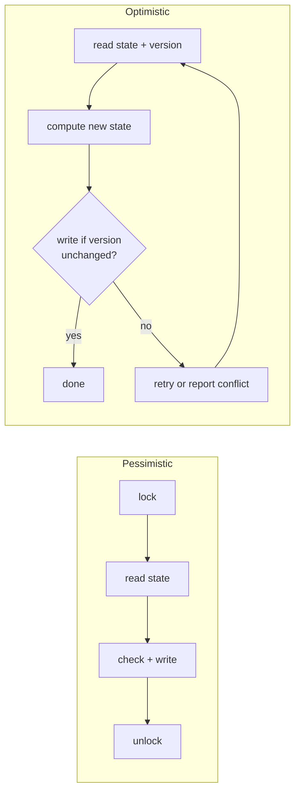

# Optimistic vs Pessimistic Locking

## 1. One-line summary

**Pessimistic** locking assumes a conflict *will* happen, so it takes a lock before touching the data; **optimistic** locking assumes a conflict is *rare*, so it does the work, then checks at write time whether someone else changed the data, and retries or gives up if so.

## 2. The problem it solves

Two users tap "Book C7" for the same show within the same millisecond. Both read "C7 is AVAILABLE", both write "C7 is BOOKED", and the theatre has sold one seat twice. This is the classic **check-then-act** race (decide based on a value that may change before you act, see [thread-safety-basics](thread-safety-basics.md)).

There are two ways to stop it:

- **Pessimistic:** "Nobody else touches C7 while I'm deciding." Take a lock, read, write, release. Others wait in line.
- **Optimistic:** "Go ahead, but the write only lands if C7 still looks the way I read it." Nobody waits; the loser finds out at write time.

Infra analogy: pessimistic is a **change freeze** (only one team may deploy to the cluster at a time). Optimistic is `kubectl apply` with a `resourceVersion`: anyone may edit, but if the object changed since you read it, the API server rejects your write with `409 Conflict` and you re-read and retry.

## 3. How it works



### Pessimistic, in memory: a lock

A **lock** (mutex, "mutual exclusion") lets only one thread at a time run a block of code; others are paused until it's released. Java gives you `synchronized` and `ReentrantLock` (see [locks-and-synchronized](../libraries/java/locks-and-synchronized.md)).

```java
import java.util.HashMap;
import java.util.Map;
import java.util.concurrent.locks.ReentrantLock;

final class LockedSeatMap {
    enum State { AVAILABLE, BOOKED }
    private final Map<String, State> seats = new HashMap<>();   // guarded by lock
    private final ReentrantLock lock = new ReentrantLock();

    LockedSeatMap(Iterable<String> ids) { ids.forEach(id -> seats.put(id, State.AVAILABLE)); }

    boolean book(String seatId) {
        lock.lock();
        try {
            if (seats.get(seatId) != State.AVAILABLE) return false; // check...
            seats.put(seatId, State.BOOKED);                         // ...then act, same lock
            return true;
        } finally {
            lock.unlock();
        }
    }
}
```

### Optimistic, in memory: compare-and-set (CAS)

**CAS** is a single CPU instruction: "set this to X, but only if it is still Y" (see [atomics-and-cas](../libraries/java/atomics-and-cas.md)). No thread ever waits; a failed CAS just tells you you lost.

```java
import java.util.concurrent.atomic.AtomicReference;

final class CasSeat {
    enum State { AVAILABLE, BOOKED }
    private final AtomicReference<State> state = new AtomicReference<>(State.AVAILABLE);

    boolean book() {
        // expected = AVAILABLE; if someone booked first, CAS fails and we return false
        return state.compareAndSet(State.AVAILABLE, State.BOOKED);
    }
}
```

For a seat there's nothing to retry: if the CAS fails, the seat is gone, so we tell the user. For a counter you would loop and retry.

### Pessimistic, in a database: `SELECT ... FOR UPDATE`

A **transaction** is a group of SQL statements that commit (become visible) together or not at all. `SELECT ... FOR UPDATE` takes a **row lock**: other transactions that try to lock or update the same row block until you commit.

```sql
BEGIN;
SELECT state FROM show_seat WHERE show_id = 42 AND seat_id = 'C7' FOR UPDATE;  -- others wait here
-- application checks state = 'AVAILABLE'
UPDATE show_seat SET state = 'BOOKED', booking_id = 'b-91' WHERE show_id = 42 AND seat_id = 'C7';
COMMIT;                                                                          -- lock released
```

### Optimistic, in a database: a version column

Add an integer `version` column. Read it, then make the update conditional on it and bump it:

```sql
SELECT state, version FROM show_seat WHERE show_id = 42 AND seat_id = 'C7';    -- AVAILABLE, 7
UPDATE show_seat SET state = 'BOOKED', booking_id = 'b-91', version = version + 1
 WHERE show_id = 42 AND seat_id = 'C7' AND version = 7;
-- rows affected = 1 → we won; 0 → someone changed it, re-read
```

The `WHERE version = ?` is the database's CAS. JPA/Hibernate does this for you with an `@Version` field and throws `OptimisticLockException` on 0 rows. For seats you can often skip the version and put the business condition in the `WHERE` directly: `... WHERE state = 'AVAILABLE'`.

### ABA

Optimistic checks compare a value, not a history. If C7 went AVAILABLE → HELD → AVAILABLE (the hold expired) between your read and your CAS, your CAS still succeeds. For seats that's fine (it *is* available). When it isn't fine, compare a version number that only ever goes up instead of the state itself; see ABA in [atomics-and-cas](../libraries/java/atomics-and-cas.md).

## 4. When to use it

| Situation | Winner | Why |
|---|---|---|
| Low contention (most seats, most shows) | **Optimistic** | No lock overhead; conflicts rare, so retries are rare |
| Very hot single row (a counter everyone bumps) | **Pessimistic** | Optimistic retries would spin and waste work |
| Work between read and write is expensive (calls a pricing service, renders a PDF) | **Pessimistic** | Redoing it on every conflict is wasteful |
| Work is cheap, conflict just means "seat taken" | **Optimistic** | Nothing to redo; just tell the user |
| A human is "editing" for minutes (a form, a wiki page) | **Optimistic** | You can't hold a DB lock for minutes; check the version on save |
| Multi-row update must be all-or-nothing, high conflict | **Pessimistic**, locks taken in a fixed order | See [deadlocks-and-lock-ordering](deadlocks-and-lock-ordering.md) |

## 5. When NOT to use it

- **Don't use pessimistic locks across user think-time.** Holding `FOR UPDATE` while the user enters card details pins a DB connection and blocks everyone. That's what a *hold* with a TTL is for (see [holds-reservations-and-ttl](holds-reservations-and-ttl.md)).
- **Don't use optimistic retries in a tight loop under heavy contention.** 10,000 users fighting for the front row means 9,999 failed CASes, each re-reading and retrying. Either fail fast ("seat taken") or queue requests.
- **Don't build optimistic multi-object updates by hand** unless you also handle rollback of the parts you already changed (the movie-booking `CasSeatInventory` does this explicitly).

## 6. Commonly confused with

| | Pessimistic | Optimistic |
|---|---|---|
| Mindset | "Conflicts are likely, prevent them" | "Conflicts are rare, detect them" |
| Java tool | `synchronized`, `ReentrantLock` | `AtomicReference.compareAndSet`, `StampedLock` optimistic read |
| SQL tool | `SELECT ... FOR UPDATE` | `UPDATE ... WHERE version = ?` (or `WHERE state = 'AVAILABLE'`) |
| Who waits | losers block until the lock frees | nobody; losers retry or fail |
| Deadlock possible? | yes, with several locks | no (nobody waits), but livelock under heavy retry |
| Cost when no conflict | lock acquire/release | almost nothing |
| Cost when conflict | waiting | redoing work |

Also: **optimistic locking vs a distributed lock** (Redis `SET NX`). A distributed lock is pessimistic across machines; see [HLD: distributed locks and leases](../../HLD/concepts/distributed-locks-and-leases.md).

## 7. Common mistakes / misuse

1. **Reading and checking outside the lock, writing inside it.** The check must be inside the same critical section.
2. **Optimistic update that ignores the row count.** `UPDATE ... WHERE version = 7` returning 0 rows is the conflict signal; if you don't check it, you silently lost.
3. **Retrying forever.** Cap retries and surface the conflict.
4. **`FOR UPDATE` without an index on the `WHERE` columns.** The database may lock far more rows than you meant (in MySQL, gap locks over a range).
5. **Calling "CAS" lock-free and therefore always faster.** Under heavy contention a lock that parks losers can beat spinning.

## 8. Interview cheat-sheet

- "Pessimistic means lock, then read and write; optimistic means read, then write only if nothing changed, using CAS in memory or `WHERE version = ?` in SQL."
- "Seat booking is mostly low contention, and a conflict just means 'seat taken', so optimistic fits: nothing to redo, nobody waits."
- "I'd keep the version in the `WHERE` clause and treat 0 rows affected as a conflict."
- "I never hold a database lock across user think-time; for a payment window I use a hold with a TTL instead."
- "Under extreme contention, like a blockbuster's opening night, optimistic retries waste work, so I'd add a waiting room or queue in front."

## 9. Used in

- [LLD: Design a Movie Ticket Booking System](../interviews/movie-booking/README.md) — `LockingSeatInventory` (one lock per show, pessimistic) vs `CasSeatInventory` (per-seat `AtomicReference<SeatState>`, optimistic with rollback); at L6, `UPDATE ... WHERE state = 'AVAILABLE'`, `SELECT ... FOR UPDATE SKIP LOCKED` and version columns.
- [LLD: Design a Parking Lot](../interviews/parking-lot/README.md) — `AtomicBoolean.compareAndSet` spot claim; conditional `UPDATE` vs `FOR UPDATE SKIP LOCKED` at L6.
- [HLD: File storage & sync](../../HLD/interviews/file-storage-sync/README.md): every commit carries a **parentVersion**; a stale one is rejected and resolved on the client.
- [Payment system (HLD)](../../HLD/interviews/payment-system/README.md): optimistic locking on seller balances (L5 §3.6).
- [Meeting-Room / Hotel Booking](../interviews/meeting-room-booking/README.md): a lock per room calendar so 32 concurrent requests for one slot produce exactly one booking.
- Related: [thread-safety-basics](thread-safety-basics.md), [deadlocks-and-lock-ordering](deadlocks-and-lock-ordering.md), [locks-and-synchronized](../libraries/java/locks-and-synchronized.md), [atomics-and-cas](../libraries/java/atomics-and-cas.md).
