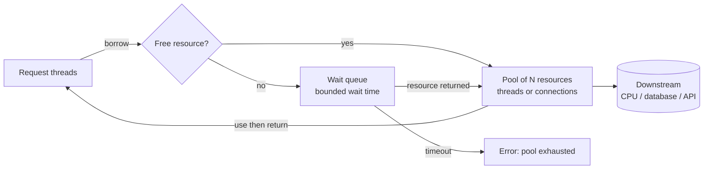

# Resource Pools and Sizing

## 1. One-line summary

A **resource pool** keeps a fixed set of expensive, reusable things (threads, database connections, HTTP connections, buffers) ready, lends one to each task and takes it back afterwards; the hard part isn't the code, it's **sizing**: too small and requests queue, too big and you overload the CPU or the database you were trying to protect. **Little's law** and a few rules of thumb give you a starting number; metrics tell you the real one.

💡 **Expensive** here means costly to create or to hold: a platform thread reserves ~1 MB of stack memory by default and needs a syscall (a call into the OS kernel) to create; a Postgres connection is a whole server process plus a TCP + TLS handshake (several network round trips to set up a connection, plus encryption setup) and authentication.

---

## 2. The problem it solves

**The pain (no pool):** a Spring service opens a new JDBC connection per request.

```
TCP handshake + TLS + Postgres auth + session setup ≈ 5–20 ms (more across regions)
the actual query                                     ≈ 1–2 ms
```

So 80–95% of each request's database time is setup. Under a spike of 2,000 req/s you also open 2,000 connections/s; Postgres forks a process per connection and runs out of memory or hits `max_connections`. Same story with threads: `new Thread()` per task at 10,000 tasks/s means 10,000 × ~1 MB stacks reserved and the OS scheduler juggling all of them.

**The fix:** create a bounded number once, reuse them, and make callers **wait (with a timeout)** when all are busy. The bound is the important part: a pool is also a **limit** that protects whatever sits behind it.

> Infra analogy: a pool is like a k8s `Deployment` with a fixed replica count behind a Service: requests queue in front, a fixed number of workers serve them, and you size replicas from load and latency, not by guessing. HPA max replicas plays the role of `maximumPoolSize`.

---

## 3. How it works

### 3.1 The queue + workers model

Every pool is the same shape: a **queue** of waiting requests in front of **N workers/resources**.



- **Thread pool** ([ThreadPoolExecutor](../libraries/java/executors-and-threads.md)): tasks wait in a [BlockingQueue](../libraries/java/blocking-queues-and-producer-consumer.md); N threads take them.
- **Connection pool** ([HikariCP](../libraries/java/hikaricp-and-jdbc-pools.md)): request threads wait for a connection; N connections are lent out.
- **Node** ([libuv pool, pg Pool](../libraries/js/worker-threads-and-libuv-pool.md)): same model, different runtime.

What happens when the queue is full or the wait times out is a [back-pressure](back-pressure.md) policy decision.

### 3.2 Little's law: how many resources are busy?

**Little's law**: average items in a system `L` = arrival rate `λ` × average time each spends inside `W`.

```
busy resources = throughput × time each request holds the resource
```

Example: an API at **500 req/s**, each request holds a DB connection for **20 ms** (query + result read):

```
connections busy on average = 500 × 0.020 = 10
```

And it needs a thread for the whole request, **200 ms** end to end:

```
threads busy on average = 500 × 0.200 = 100
```

Add headroom for bursts and variance (often 1.5–2× the average), and you have a first guess. Note the asymmetry: 100 threads but only ~10 connections, because a request holds the connection for only a tenth of its life. That's why "connection pool size = thread pool size" is wrong.

Little's law also tells you the ceiling: a pool of 10 connections held for 20 ms each can serve at most `10 / 0.020 = 500 req/s`. Beyond that, requests queue and latency climbs no matter what.

### 3.3 Sizing thread pools: CPU-bound vs IO-bound

From *Java Concurrency in Practice* (Goetz et al., 2006):

```
N_threads = N_cpu × U_cpu × (1 + W/C)
  N_cpu = number of cores
  U_cpu = target CPU utilisation (0..1)
  W/C   = ratio of wait time (IO, blocked) to compute time
```

| Workload | W/C | 8 cores, U = 1 |
|---|---|---|
| **CPU-bound** (image resize, JSON parsing, hashing) | ≈ 0 | `8 × 1 × (1 + 0) = 8` threads (often N + 1) |
| **IO-bound** (each request: 10 ms CPU, 90 ms waiting on DB/HTTP) | 90/10 = 9 | `8 × 1 × (1 + 9) = 80` threads |
| **Very IO-heavy** (10 ms CPU, 990 ms waiting) | 99 | `8 × 100 = 800` threads: now thread memory and scheduling hurt; this is where [virtual threads](virtual-threads.md) or async IO win |

More threads than that for CPU work just adds **context switching**: the OS pausing one thread, saving its registers, and loading another, which costs microseconds each time and pollutes CPU caches (small, fast memory next to each core holding recently used data).

### 3.4 Sizing connection pools: smaller than you think

The HikariCP wiki page *"About Pool Sizing"* gives this **rule of thumb** as a starting point (their words: a formula that "has held up pretty well across a lot of benchmarks"):

```
connections = (core_count × 2) + effective_spindle_count
```

- `core_count` = physical cores of the **database server** (the surrounding discussion is about DB capacity; don't count hyperthreads).
- `effective_spindle_count` = roughly how many disks can seek in parallel; **0** if the working set is fully cached in RAM.
- Their example: a 4-core DB server with one disk → `(4 × 2) + 1 = 9`, "call it 10".

**Why bigger pools can be slower:** a database with 8 cores can only *run* ~8 queries at once. With 200 active connections, 192 are waiting while the DB burns CPU on context switching, lock contention (sessions waiting on the same rows/latches) and cache thrashing. The wiki cites an Oracle performance demo where cutting a pool from 2,048 to 96 connections dropped response times from ~100 ms to ~2 ms. Queueing in the **app's pool** (cheap, in memory) beats queueing **inside the database** (expensive, contended).

### 3.5 Fleet math: the number that actually bites

The pool size is per **pod**; the database sees the sum.

```
30 pods × maximumPoolSize 20                = 600 connections
Postgres default max_connections            = 100
HPA scales to 60 pods during a spike        = 60 × 20 = 1,200 connections
```

So the autoscaler, adding pods to fix latency, makes the DB refuse connections. Fixes:

- Size per pod from the **DB's** budget: `max_connections (minus admin/replication reserve) / max pods`, e.g. `(100 − 10) / 30 = 3` per pod. Tiny, and fine if each pod only needs ~3 by Little's law.
- Put a **connection proxy** (pgBouncer, RDS Proxy) in front to multiplex many client connections onto few server ones ([PostgreSQL](../../HLD/technologies/postgresql.md)).
- Cap HPA max replicas with the DB in mind; read replicas for read traffic.

### 3.6 Bulkheads

A **bulkhead** (named after the walls that stop one flooded ship compartment sinking the ship) = **separate pools per downstream**. If the payments API hangs and all 200 shared threads block on it, the healthy inventory endpoint dies too. With 50 threads (or a semaphore of 50) reserved per downstream, only payments calls fail. See [resilience patterns](../../HLD/concepts/resilience-patterns.md).

### 3.7 Leaks

A **leak** = a resource borrowed and never returned, e.g. a JDBC connection not closed on an exception path. Each leak shrinks the pool by one until it's empty and every request times out, typically hours after a deploy. Prevent with **try-with-resources**, detect with leak detection (HikariCP's `leakDetectionThreshold` logs the stack trace of the borrower) and by watching "active" stay high while traffic is low.

---

## 4. When to use it

- Anything costly to create and reusable: DB connections, HTTP/gRPC connections (keep-alive), platform threads, large byte buffers (Netty's pooled allocator).
- Whenever you need a **concurrency limit** to protect a downstream, even if the resource itself is cheap.

## 5. When NOT to use it (and why it's a mistake)

| Situation | Why it's a mistake |
|---|---|
| Pooling cheap objects (small DTOs, `StringBuilder`) | Modern GC makes short-lived objects nearly free; a pool adds locking, bugs and state leaking between users. |
| Pooling virtual threads | They are cheap by design; limit concurrency with a semaphore instead ([virtual threads](virtual-threads.md)). |
| One giant shared pool for every downstream | No isolation: one slow dependency starves everything (3.6). |
| "Make the pool bigger" as the fix for timeouts | Usually the DB is saturated or connections leak; a bigger pool moves the queue into the DB and makes it worse. |

---

## 6. Commonly confused with

| | **Thread pool** | **Connection pool** | **Semaphore** | **Rate limiter** |
|---|---|---|---|---|
| Limits | concurrent tasks executing | concurrent DB sessions | concurrent holders of a permit | operations per second |
| Holds a real object? | yes (threads) | yes (sockets + sessions) | no, just a counter | no |
| Sized by | cores and W/C | DB cores, Little's law, fleet budget | downstream capacity | contract / quota |
| When full | queue, then reject policy | wait up to timeout, then error | `acquire` blocks / `tryAcquire` fails | reject / delay |

---

## 7. Common mistakes / misuse

1. **Pool size = thread count** ("200 threads, so 200 connections").
2. **Ignoring the fleet**: per-pod sizing that exceeds `max_connections` when scaled out.
3. **Unbounded queues** in front of pools: latency grows silently instead of failing fast ([back-pressure](back-pressure.md)).
4. **No acquire timeout**, or 30 s timeouts on a 200 ms API: callers hang long after the user gave up.
5. **Holding a connection during slow non-DB work** (calling an HTTP API inside a transaction): Little's `W` balloons.
6. **CPU-bound work on a huge IO pool**: context switching without extra throughput.
7. **Leaks** from missing `close()`.

---

## 8. Interview cheat-sheet

> "A pool is a queue in front of N reusable resources, and N is also a concurrency limit that protects the downstream. I size it with Little's law: at 500 requests per second holding a connection for 20 milliseconds, that's 10 connections busy on average, so maybe 15 to 20 with headroom, far fewer than the 100 request threads. For threads I use the Goetz formula, cores times utilisation times one plus wait over compute: about 8 for CPU-bound work on 8 cores, about 80 if requests wait 90% of the time. Connection pools should be small, HikariCP's rule of thumb is about twice the database's cores plus spindles, because a database can only run that many queries in parallel and the rest just contend. And I always check fleet math: pods times pool size must fit under the database's max connections even at max autoscale, otherwise I add pgBouncer or shrink per-pod pools."

---

## 9. Used in

- [Thread Pool / Connection Pool](../interviews/thread-pool/README.md): the core sizing reasoning behind the design, the queue-plus-workers model, what to do when the pool is exhausted, bulkheads and leak detection.
- Related: [HikariCP and JDBC pools](../libraries/java/hikaricp-and-jdbc-pools.md), [virtual threads](virtual-threads.md), [Node worker threads and libuv pool](../libraries/js/worker-threads-and-libuv-pool.md), [executors and threads](../libraries/java/executors-and-threads.md), [back-pressure](back-pressure.md), [thread-safety basics](thread-safety-basics.md), [resilience patterns](../../HLD/concepts/resilience-patterns.md).
