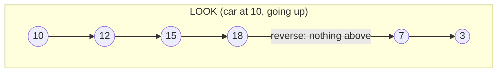

# Scheduling Algorithms (Elevator / Disk Scheduling)

## 1. One-line summary

Elevator and disk-arm scheduling are the same problem — **one head moving along a line, serving requests at positions** — and the classic answers (FCFS, SSTF, SCAN, LOOK, C-SCAN) trade **total travel (throughput)** against **how long the unluckiest request waits (fairness)**; real elevators run LOOK per car plus a **dispatcher** that picks which car serves each hall call.

## 2. The problem it solves

Five people press buttons while the car is at floor 10. Serving them in press order sends the car zig-zagging up and down the shaft; always going to the nearest one is efficient but someone on floor 1 may wait forever while the busy middle floors keep the car occupied. Both are bad in different ways — like a load balancer that is either "round-robin and ignore latency" or "least-latency and starve the slow zone".

Operating systems had the same problem with hard disks: a **disk arm** (the part that moves the read head across the spinning platter) is slow to move, so the order in which pending reads are served decides throughput. The algorithms were named there; the most famous one is literally called "the elevator algorithm".

> 💡 **Throughput** = how much work gets done per unit of time (here: requests served per floor travelled). **Starvation** = a request that never gets served because others keep jumping ahead of it.

## 3. How it works

Worked example used for every algorithm: floors 0–20, car at **10**, currently heading **up**; requests (in arrival order) for floors **3, 18, 7, 15, 12**.

### FCFS — first come, first served

Serve in arrival order: 10→3→18→7→15→12.
Travel = 7 + 15 + 11 + 8 + 3 = **44 floors**. Fair (nobody overtakes), but wasteful: the car passes floors 12 and 15 without stopping.

### SSTF — shortest seek time first

Always go to the **nearest** pending request: 10→12→15→18→7→3.
Travel = 2 + 3 + 3 + 11 + 4 = **23 floors**. Efficient, but **starvation**: if new requests keep arriving around floors 10–18, floor 3 is never the nearest and never gets served. Unacceptable for people.

### SCAN — "the elevator algorithm"

Keep moving in one direction, serving every request on the way, **all the way to the end** of the shaft; then reverse: 10→12→15→18→(20)→7→3.
Travel = (20 − 10) + (20 − 3) = 10 + 17 = **27 floors**. No starvation: every request is reached within at most two sweeps.

### LOOK — SCAN without the pointless trip to the end

Same as SCAN, but reverse as soon as there is **nothing further ahead**: 10→12→15→18→7→3.
Travel = (18 − 10) + (18 − 3) = 8 + 15 = **23 floors**. As efficient as SSTF here, but starvation-free. **This is what the elevator interview implements**: two sorted stop sets, `ceiling(current)` while going up, `floor(current)` while going down ([treeset-and-priorityqueue](../libraries/java/treeset-and-priorityqueue.md)).

### C-SCAN / C-LOOK — circular

Serve only while moving **up**; then jump back to the bottom without serving and sweep up again.
C-SCAN: 10→12→15→18→(20)→(0)→3→7 = 10 + 20 + 7 = **37 floors** (counting the return trip).
C-LOOK: 10→12→15→18, jump down to the lowest request 3 (passing 7 without serving it), then 3→7 = 8 + 15 + 4 = **27 floors**.
More uniform waiting time (the ends aren't visited twice as often as the middle), which matters for disks. For elevators it's wrong: people at floor 7 wanting to go down don't want to ride to the bottom first.



### Summary

| Algorithm | Order from floor 10 | Travel | Starvation? | Used by |
|---|---|---|---|---|
| FCFS | 3, 18, 7, 15, 12 | 44 | no | simple queues; SSDs (no arm to move) |
| SSTF | 12, 15, 18, 7, 3 | 23 | **yes** | rarely, alone |
| SCAN | 12, 15, 18, (20), 7, 3 | 27 | no | textbook "elevator algorithm" |
| LOOK | 12, 15, 18, 7, 3 | 23 | no | **real elevators** |
| C-SCAN | 12, 15, 18, (20), (0), 3, 7 | 37 | no | disks wanting uniform wait |
| C-LOOK | 12, 15, 18, 3, 7 | 27 | no | disks (classic OS schedulers sort requests this way) |

The OS analogy today: spinning disks used schedulers like Linux's old `deadline` (sort by position + a per-request deadline so nothing starves); SSDs have no arm, so Linux often uses `none`/`mq-deadline` — the cost model changed, so the algorithm changed. Good interview lesson: **pick the algorithm from the cost model.**

### Hall calls vs car calls — direction matters

A **car call** (button inside the car) is just "stop at floor 9". A **hall call** (button on the landing) is "floor 5, wants to go UP". An elevator going down past floor 5 should **not** stop for an UP hall call — the passenger would get in and ride the wrong way. That's why the design keeps separate up-stop and down-stop sets: a hall call UP at 5 joins the up set and is served on the next upward sweep.

### Dispatching across multiple cars

LOOK decides the order **within** one car. With 4–8 cars, a **dispatcher** decides **which car** gets each hall call (car calls always belong to the car they were pressed in). In the interview this is the `ElevatorSelectionStrategy` interface — a Strategy ([design-patterns](design-patterns.md)).

| Strategy | Plain words | Good | Bad |
|---|---|---|---|
| **Nearest car** (with cost) | pick the car with the lowest cost: distance, plus a penalty if it's moving away or in the opposite direction | simple, good wait times | ignores how loaded a car is |
| **Least busy** | pick the car with the fewest pending stops | spreads load | may send a far-away car |
| **Zoning** | each car serves a range of floors (car A: 0–10, car B: 11–20), like sharding by key range | predictable, fewer stops per car | idle cars while one zone is busy |
| **Destination dispatch** | passengers enter the destination on a keypad in the lobby; the system groups people going to the same floors into the same car | fewer stops per trip, big throughput gain in tall office towers | needs keypads; a car assignment can't change once displayed |

A typical nearest-car cost function:

```java
enum Direction { UP, DOWN, IDLE }
record CarView(int id, int floor, Direction direction, int pendingStops) {}

final class NearestCarCost {
    static int cost(CarView car, int callFloor, Direction callDir) {
        int distance = Math.abs(car.floor() - callFloor);
        if (car.direction() == Direction.IDLE) return distance;                     // free car: just distance
        boolean onTheWay = (car.direction() == Direction.UP && callFloor >= car.floor())
                        || (car.direction() == Direction.DOWN && callFloor <= car.floor());
        if (onTheWay && car.direction() == callDir) return distance;                 // can pick up en route
        return distance + 20 + 2 * car.pendingStops();                               // must finish sweep first
    }
}
```

The penalty constants are tuning knobs — say so, and say you'd tune them from metrics (average wait time, and p95 wait: the time that 95% of passengers beat), the same way you'd tune load-balancer weights.

## 4. When to use it

- **LOOK** per car for any "head moving along a line" problem: elevators, disk arms, a robot on a rail, a delivery route on one street.
- **SSTF** only with an anti-starvation guard (aging: a request's priority grows the longer it waits).
- **Nearest-car with cost** as the default dispatcher in an interview; mention zoning and destination dispatch as L5/L6 extensions.

## 5. When NOT to use it

- **FCFS for elevators** — wasteful; people notice the car passing their floor.
- **Pure SSTF** — starvation is a correctness bug for humans.
- **C-SCAN for elevators** — forces down-going passengers to ride up first.
- **Seek-ordering for SSDs** — no physical seek, so the reordering only adds latency.
- **Complex optimisation (global re-planning every tick)** in a 45-minute interview — state the idea, implement the simple cost function.

## 6. Commonly confused with

| | Scheduling (within a car) | Dispatching (across cars) |
|---|---|---|
| Question | "in what order do I visit my stops?" | "which car takes this hall call?" |
| Algorithms | FCFS, SSTF, SCAN, LOOK | nearest car, least busy, zoning, destination dispatch |
| Infra analogy | a disk's I/O queue order | a load balancer choosing a backend |
| Interview class | `Elevator` (stop sets) | `ElevatorSelectionStrategy` |

Also: **SCAN vs LOOK** — SCAN always goes to the physical end; LOOK reverses at the last request. Many people say "SCAN" meaning LOOK; be precise.

## 7. Common mistakes / misuse

1. **One sorted list of stops ignoring direction** — the car stops for an UP hall call while going down.
2. **SSTF without mentioning starvation** — the first follow-up will be "what about floor 1?".
3. **Dispatcher reassigning hall calls every tick** — passengers see the assigned car change; reassign only on failure/maintenance.
4. **Ignoring car calls when choosing a car** — a car "near" floor 5 with 12 stops queued is not really near.
5. **Hard-coding the cost penalties** without saying they're tunable and measured.

## 8. Interview cheat-sheet

- "Each car runs LOOK: keep going in the current direction while there are stops ahead, then reverse — no starvation and no pointless trip to the top."
- "SSTF minimises travel but starves far floors; FCFS is fair but zig-zags."
- "Hall calls carry a direction, so I keep separate up and down stop sets and only stop for calls going my way."
- "A pluggable `ElevatorSelectionStrategy` picks the car: by default a cost of distance plus penalties for moving away or the wrong direction."
- "For a tall office tower I'd discuss zoning or destination dispatch, which groups passengers by destination."

## 9. Used in

- [LLD: Design an Elevator System](../interviews/elevator-system/README.md) — LOOK per car with two `TreeSet`s; `NearestCarStrategy` / `LeastBusyStrategy` dispatching.
- Related: [treeset-and-priorityqueue](../libraries/java/treeset-and-priorityqueue.md), [sorted-collections-in-js](../libraries/js/sorted-collections-in-js.md), [design-patterns](design-patterns.md), [big-o-complexity](big-o-complexity.md).
