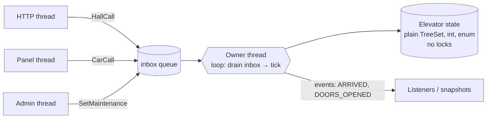

# Single-Writer Principle (Concurrency by Ownership)

## 1. One-line summary

Instead of letting many threads change shared data under locks, make **exactly one thread the owner** of each piece of mutable state; every other thread **sends it a message** through a queue — no locks on the state, deterministic order, and a single place to reason about.

## 2. The problem it solves

Classic shared-memory concurrency: many threads, one object, protect it with locks ([locks-and-synchronized](../libraries/java/locks-and-synchronized.md)). In an elevator system that means:

- the dispatcher reads every car's floor and direction to pick the nearest car,
- each car's thread updates its floor and its stop sets,
- request threads add stops,
- the admin thread flips a car into maintenance.

Now every method needs the right lock, multi-object operations ("assign this hall call to car 3 *and* remove it from the pending list") need several locks in a consistent order to avoid **deadlock** (two threads each holding a lock the other needs, both waiting forever), and tests are timing-dependent. The bugs show up as "car 3 occasionally skips a floor" on a Friday night page.

The single-writer fix: **the elevators are owned by one simulation thread.** Everyone else enqueues a command ([blocking-queues-and-producer-consumer](../libraries/java/blocking-queues-and-producer-consumer.md)). The owner applies commands one at a time, in order. The only thread-safe object in the design is the queue.

Infra analogy: a Kubernetes controller. Many clients write desired state to the API server; **one** controller (with leader election) reconciles each resource. Nobody else patches the pods directly.

## 3. How it works



The rules:

1. **Only the owner writes** the state. (Ideally only the owner *reads* it too.)
2. Other threads communicate by **immutable messages** ([records-and-immutability](../libraries/java/records-and-immutability.md)) through a thread-safe queue.
3. Readers that need the state get an **immutable snapshot** published by the owner (e.g. a `volatile` reference to a record list, replaced each tick), or ask via a message with a reply (`CompletableFuture`).
4. The owner never blocks on slow I/O inside its loop — that stalls everything.

```java
import java.util.List;
import java.util.concurrent.*;

record ElevatorSnapshot(int id, int floor, String status) {}

final class Owner {
    private final BlockingQueue<Runnable> inbox = new LinkedBlockingQueue<>(10_000);
    private int floor = 0;                                   // owned: no lock, no volatile
    private volatile List<ElevatorSnapshot> snapshot = List.of(new ElevatorSnapshot(1, 0, "IDLE"));

    // any thread
    boolean send(Runnable command) { return inbox.offer(command); }
    List<ElevatorSnapshot> view() { return snapshot; }        // safe: immutable list, volatile publish

    // owner thread only
    void tick() {
        Runnable c;
        while ((c = inbox.poll()) != null) c.run();          // apply all pending commands
        floor++;                                              // advance simulation
        snapshot = List.of(new ElevatorSnapshot(1, floor, "MOVING"));
    }
}
```

> 💡 **`volatile`** makes a write by one thread visible to reads by other threads immediately (no stale CPU-cache copy). Here it publishes a new immutable snapshot; it doesn't make compound updates atomic. See [thread-safety-basics](thread-safety-basics.md).

### The same idea everywhere

| System | Owner | Messages arrive via |
|---|---|---|
| **Elevator interview** | simulation thread | `LinkedBlockingQueue<Command>`, applied in `tick()` |
| **Node.js** | the one JS thread | event queue; callbacks run to completion ([event-loop-and-concurrency](../libraries/js/event-loop-and-concurrency.md)) |
| **Redis** | main thread executes commands one by one | client sockets; that's why `INCR` is atomic without locks ([Redis](../../HLD/technologies/redis.md)) |
| **Kafka consumer** | one consumer per partition in a group | the partition log; per-key ordering for free ([Kafka](../../HLD/technologies/kafka.md)) |
| **Actor model** (Akka, Erlang) | each actor | its mailbox |
| **LMAX Disruptor** | one business-logic thread processing ~millions of orders/sec | a pre-allocated ring buffer instead of a locking queue |

> 💡 **LMAX Disruptor**: a Java library from an exchange (LMAX) that showed one thread, with no locks and data kept in CPU cache, can outrun many threads fighting over locks. **Ring buffer**: a fixed-size array used as a circular queue, so no allocation per message.

### Scaling past one thread: shard the ownership

One owner = one core. When that's not enough, **partition**: owner A handles elevator bank 1, owner B handles bank 2; or Kafka-style, hash the key to pick the owner. Each piece of state still has exactly one writer. Cross-shard operations become messages between owners.

## 4. When to use it

- State that changes often and has **multi-field invariants** (a car's floor, direction, stop sets and status must agree) — one owner keeps them consistent trivially.
- **Simulations and game loops** — determinism: same input queue + same ticks = same result, so tests are exact.
- **Ordering matters** — commands must apply in arrival order (order books, ledgers per account).
- The work per message is small (microseconds), so one thread keeps up.

## 5. When NOT to use it

- **Work per message is heavy or blocking** (DB calls, CPU-heavy computation) — one thread becomes the bottleneck; use a pool, or keep the owner and push slow work to helpers that reply with messages.
- **Callers need an immediate synchronous answer** with very low latency — the queue adds a hop (wait for the next drain/tick). If every operation needs a reply, a short lock may be simpler.
- **Read-heavy shared data that rarely changes** (config, routing tables) — `CopyOnWriteArrayList` / an immutable map swapped atomically is simpler.
- **Tiny state with one simple invariant** — an `AtomicInteger` counter doesn't need an actor.

## 6. Commonly confused with

| | Single writer + queue | Locks (`synchronized`, `ReentrantLock`) | Lock-free (CAS / atomics) |
|---|---|---|---|
| Who changes state | one owner thread | any thread holding the lock | any thread, retrying on conflict |
| Multi-field invariants | easy | easy if the lock covers all fields | hard |
| Deadlock risk | none on the state | yes (lock ordering) | none |
| Determinism | high | low (who gets the lock varies) | low |
| Throughput ceiling | one core per owner (shard to scale) | contention on hot locks | contention retries |
| Latency | + queue hop | lock wait | retry loops |
| Example | elevator sim, Node, Redis | per-bucket rate limiter | `LongAdder`, `ConcurrentHashMap` |

Also: **single-thread *executor*** is a tool for implementing a single writer; it only works if nobody *else* touches the state directly.

## 7. Common mistakes / misuse

1. **"Owner" thread plus a few direct reads/writes from other threads** "because it's just a getter" — data races are back. Publish snapshots instead.
2. **Mutable messages** — a producer changes a command after sending it.
3. **Blocking I/O inside the owner loop** — every other command waits.
4. **Unbounded inbox** — a slow owner silently accumulates millions of messages; bound it and reject.
5. **Synchronous listeners doing slow work on the owner thread** — hand events to another queue.
6. **Claiming "no concurrency issues" while two owners share a sub-object** — ownership must be exclusive.

## 8. Interview cheat-sheet

- "I use the single-writer principle: one simulation thread owns all elevator state; request threads only enqueue immutable commands."
- "That means no locks on elevators and deterministic tests — feed commands, call `tick()`, assert."
- "It's the same model as Node's event loop, Redis's command thread, or a Kafka partition consumer."
- "The cost is one core of throughput and a queue hop of latency; for elevators a tick is microseconds, so that's fine."
- "If one owner weren't enough I'd shard ownership — one owner per elevator bank — rather than add locks."

## 9. Used in

- [LLD: Design an Elevator System](../interviews/elevator-system/README.md) — `ElevatorSystem` receives `HallCall` / `CarCall` / `SetMaintenance` on any thread and applies them only inside `tick()` on the simulation thread.
- Related: [thread-safety-basics](thread-safety-basics.md), [blocking-queues-and-producer-consumer](../libraries/java/blocking-queues-and-producer-consumer.md), [executors-and-threads](../libraries/java/executors-and-threads.md), [state-machines](state-machines.md), [HLD message ordering](../../HLD/concepts/message-ordering-and-sequencing.md).
