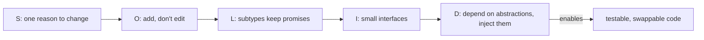

# SOLID Principles

## 1. One-line summary

SOLID is five guidelines for object-oriented design — **S**ingle responsibility, **O**pen/closed, **L**iskov substitution, **I**nterface segregation, **D**ependency inversion — that keep classes small, swappable and testable.

## 2. The problem it solves

Code rots in predictable ways: one class does five things, so every change risks breaking the other four; adding a feature means editing a growing `if/else`; a subclass quietly breaks callers; tests need a real database because a class `new`s its own dependencies. It's the codebase equivalent of a single giant Helm chart that deploys everything — every change is scary.

SOLID names the five most common causes and their fixes. In LLD interviews, interviewers rarely ask "what is SOLID?" — they watch whether your class diagram and code follow it.

## 3. How it works



### S — Single Responsibility Principle

A class should have **one reason to change** (one owner / one concern).

```java
// BAD: algorithm + HTTP + logging + config parsing in one class
class RateLimiter {
    boolean tryAcquire(String key) { /* token math */ return true; }
    void writeHttp429(java.io.OutputStream out) { /* ... */ }
    void loadLimitsFromYaml(String path) { /* ... */ }
}
```

```java
// GOOD: each class changes for one reason
interface RateLimiter { boolean tryAcquire(String key); }      // algorithm
final class RateLimitFilter { /* maps decisions to 429 + headers */ }
final class LimitConfigLoader { /* reads YAML into LimiterConfig records */ }
```

### O — Open/Closed Principle

Open for **extension**, closed for **modification**: add new behavior by adding code, not by editing working code.

```java
// BAD: every new algorithm edits this method
boolean tryAcquire(String algo, String key) {
    if (algo.equals("token")) { /* ... */ }
    else if (algo.equals("fixed")) { /* ... */ }
    // add "sliding" here, risk breaking the others
    return false;
}
```

```java
// GOOD: new algorithm = new class implementing RateLimiter (Strategy)
final class SlidingWindowCounterLimiter implements RateLimiter {
    public boolean tryAcquire(String key) { /* ... */ return true; }
}
```

The [factory](design-patterns.md) still has one `switch` to update — that's fine; creation is the one place that must know concrete types.

### L — Liskov Substitution Principle

Any implementation must be usable wherever the interface is expected **without surprising the caller**: same preconditions or looser, same guarantees or stronger.

```java
// BAD: breaks the RateLimiter contract
final class RemoteLimiter implements RateLimiter {
    public boolean tryAcquire(String key) {
        if (key.length() > 32) throw new IllegalArgumentException(); // new precondition
        sleep(2000);               // blocks; callers assumed tryAcquire is non-blocking
        return true;
    }
    private static void sleep(long ms) { try { Thread.sleep(ms); } catch (InterruptedException e) { Thread.currentThread().interrupt(); } }
}
```

```java
// GOOD: honors the contract — fast, never throws for valid keys, decides immediately
final class RemoteLimiter implements RateLimiter {
    private final RateLimiter fallback;
    RemoteLimiter(RateLimiter fallback) { this.fallback = fallback; }
    public boolean tryAcquire(String key) {
        try { return callRedisWithTimeout(key, 5); }       // bounded latency
        catch (RuntimeException e) { return fallback.tryAcquire(key); } // documented fail-over
    }
    private boolean callRedisWithTimeout(String key, int ms) { return true; }
}
```

Write the contract in the interface's Javadoc ("non-blocking, thread-safe, returns false when limited") so implementers know what to keep.

### I — Interface Segregation Principle

Clients shouldn't depend on methods they don't use. Prefer several small interfaces over one fat one.

```java
// BAD: every limiter must implement admin/stat methods, even ones that can't support them
interface RateLimiter {
    boolean tryAcquire(String key);
    void reset(String key);
    long remaining(String key);
    void exportPrometheus(java.io.Writer w);
}
```

```java
// GOOD
interface RateLimiter      { boolean tryAcquire(String key); }
interface ResettableLimiter { void reset(String key); }
interface QuotaReporter     { long remaining(String key); }
```

The request path depends only on `RateLimiter`; an admin endpoint depends on `ResettableLimiter`.

### D — Dependency Inversion Principle

High-level code depends on **abstractions**, and concrete dependencies are **passed in** (dependency injection), not created inside.

```java
// BAD: hard-wired to wall-clock time and a concrete algorithm — untestable
final class ApiGateway {
    private final TokenBucketLimiter limiter = new TokenBucketLimiter(10, 5);
    boolean allow(String user) { return limiter.tryAcquire(user); }
}
```

```java
// GOOD: depends on interfaces, injected via constructor
final class ApiGateway {
    private final RateLimiter limiter;
    ApiGateway(RateLimiter limiter) { this.limiter = limiter; }
    boolean allow(String user) { return limiter.tryAcquire(user); }
}
// production: new ApiGateway(factory.create(config))
// test:       new ApiGateway(key -> false)    // lambda as a fake, since RateLimiter has one method
```

The same idea makes time testable: inject a `TimeSource` instead of calling `System.nanoTime()` directly — see [time-and-clock](../libraries/java/time-and-clock.md).

## 4. When to use it

- As a **review lens** on your own class diagram: "does any class have two reasons to change? would a new requirement force editing existing code?"
- When a requirement says "support multiple X" (algorithms, payment methods, notification channels) → O + D via Strategy.
- When you need tests → D, always.

## 5. When NOT to use it

- **As a rule to maximize.** Splitting every class into three, or an interface per class, produces "ravioli code" — many tiny pieces, no one can follow the flow.
- **Open/closed against imagined change.** Extension points should follow real variation, not guesses (YAGNI).
- **ISP to the extreme** — one-method interfaces for every method make wiring painful.
- **DI frameworks in an interview** — constructor injection by hand is enough and clearer.

## 6. Commonly confused with

| | Is | Is not |
|---|---|---|
| SRP | one reason to change / one stakeholder | "one method per class" |
| OCP | extend via new types (Strategy, Decorator) | "never edit any file" |
| LSP | behavioral compatibility of subtypes | "it compiles because it implements the interface" |
| ISP | small, client-focused interfaces | "one method per interface" always |
| DIP (principle) | depend on abstractions | the same as **DI** (the technique: pass dependencies in) or **IoC containers** (Spring, which automates DI) |

## 7. Common mistakes / misuse

1. **Interface for every class** "for DIP", with one implementation and no tests using fakes.
2. **Fat interfaces** that force `UnsupportedOperationException` — a sign of both ISP and LSP violations.
3. **Calling `new` on dependencies inside business classes** — kills testability.
4. **Static utility calls for time/randomness/IO** inside logic — hidden dependencies.
5. **Reciting definitions** without pointing at your own design.
6. **Over-splitting in a 45-minute interview** — you run out of time before the core algorithm works.

### How interviewers check it

- They add a requirement mid-interview: "now support sliding window" (OCP — do you add a class or edit a switch everywhere?), "make it testable" (DIP — can you inject time?), "add metrics" (OCP/SRP — decorator or edits in every algorithm?).
- They read your interfaces for size and coherence (ISP) and ask "can I swap this implementation?" (LSP).

## 8. Interview cheat-sheet

- "Each class has one job: the algorithm decides, the filter turns decisions into HTTP responses, the loader reads config."
- "Adding an algorithm means adding a class that implements `RateLimiter`; only the factory learns its name."
- "The `RateLimiter` contract is non-blocking and thread-safe, and every implementation keeps it — that's Liskov."
- "Request code depends only on `tryAcquire`; admin operations live on a separate interface."
- "Dependencies — the limiter, the clock — are injected through constructors, so tests pass fakes. I apply SOLID where there's real variation, not everywhere."

## 9. Used in

- [LLD: Design a Rate Limiter](../interviews/rate-limiter/README.md) — interface design, extension with new algorithms, injected clock.
- [LLD: Design a Parking Lot](../interviews/parking-lot/README.md) — pricing and allocation strategies (Open/Closed), small focused classes (SRP), injected `Clock` and strategies (Dependency Inversion).
- [LLD: Design an LRU Cache](../interviews/lru-cache/README.md) — small `Cache<K,V>` interface (Interface Segregation), LRU/LFU as interchangeable implementations (Liskov, Open/Closed), injected `Clock` and eviction listener (Dependency Inversion).
- [LLD: Design an Elevator System](../interviews/elevator-system/README.md) — `ElevatorSelectionStrategy` (Open/Closed, Dependency Inversion), `ElevatorListener` observers, small focused classes (SRP).
- Related: [design-patterns](design-patterns.md).
