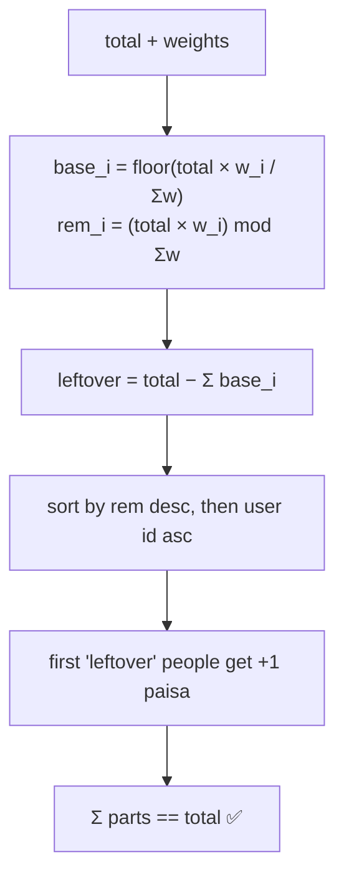

# Splitting Money and Rounding (largest remainder method)

## 1. One-line summary

When you divide an amount of money into parts, the exact parts usually have fractions of the smallest coin; you must **round each part and still make the parts add up exactly to the total**, and the standard way to do that is the **largest remainder (Hamilton) method** with a deterministic tie-break.

## 2. The problem it solves

Three friends split a ₹100 dinner. ₹100 / 3 = ₹33.333... — but nobody can pay a third of a paisa (1 rupee = 100 paise; a paisa is the smallest unit, like a cent).

- Round each share to ₹33.33 → the shares sum to ₹99.99. **One paisa vanished.** The payer is short, and the group's balances no longer sum to zero.
- Round each share up to ₹33.34 → the shares sum to ₹100.02. **Two paise appeared from nowhere.**

A paisa sounds harmless, but the invariant "**sum of parts == total**" is what lets you trust the ledger. Break it, and every reconciliation job (the nightly check that your numbers match the bank's) finds drift; in a payments company, that's an incident. So the rule is: compute the fair fractional shares, round them, then **hand out the leftover paise one at a time** in a defined, repeatable order.

## 3. How it works

Work in **integer minor units** (`long` paise in Java, integer `number` in JS) so the arithmetic itself is exact — see [bigdecimal-and-money](../libraries/java/bigdecimal-and-money.md) and [money-and-numbers-in-js](../libraries/js/money-and-numbers-in-js.md).

### Rounding modes in one table

A **rounding mode** is the rule for what to do with the digits you're dropping.

| Mode | 2.5 → | 3.5 → | -2.5 → | Plain words |
|---|---|---|---|---|
| `HALF_UP` | 3 | 4 | -3 | school rounding: .5 goes away from zero |
| `HALF_EVEN` (banker's) | 2 | 4 | -2 | .5 goes to the even neighbour |
| `DOWN` (truncate) | 2 | 3 | -2 | chop the fraction (toward zero) |
| `FLOOR` | 2 | 3 | -3 | always toward −∞ |
| `CEILING` | 3 | 4 | -2 | always toward +∞ |

💡 **Banker's rounding** (`HALF_EVEN`): with `HALF_UP`, every exact .5 rounds up, so over millions of rows the total drifts upward. Rounding ties to the even digit sends half of them up and half down, so the errors cancel on average. Accounting systems use it for aggregates. It still doesn't fix the ₹100 / 3 problem — no per-part rounding mode can guarantee the parts sum to the total. That needs an *allocation* method.

### The largest remainder (Hamilton) method, step by step

💡 Named after Alexander Hamilton, who proposed it for dividing US congressional seats among states by population — the same problem: whole seats (whole paise) shared in proportion to weights.

1. Turn the split into **integer weights**: equal → 1 each; shares 2:2:3 → 2, 2, 3; percent → basis points (1 bp = 0.01%, so 33.33% = 3333); exact amounts → the amounts themselves.
2. For each person, the exact share is `total × weight / sumOfWeights`. Take the **floor** (integer division) as their base part, and keep the **remainder** (`total × weight % sumOfWeights`).
3. `leftover = total − sum(base parts)`. It is always smaller than the number of people.
4. Sort people by remainder, **largest first**; break ties by **user id** (or any fixed order). Give the first `leftover` people **+1 paisa** each.



**Example — ₹500 split by shares 2:2:3 (asha, bala, chen).** Total 50000 paise, Σw = 7.

| User | exact share (paise) | base (floor) | remainder (out of 7) | +1? | final |
|---|---|---|---|---|---|
| asha | 14285.71 | 14285 | 5 | yes | 14286 |
| bala | 14285.71 | 14285 | 5 | yes | 14286 |
| chen | 21428.57 | 21428 | 4 | no | 21428 |
| sum | 50000 | 49998 | leftover = 2 | | **50000** |

**Example — ₹100 equally (1:1:1).** Bases 3333 each = 9999, leftover 1, all remainders equal (1) → tie → lowest user id wins: asha 3334, bala 3333, chen 3333.

### Code (Node 22, integer paise)

```js
function splitByWeights(totalPaise, weights) {           // weights: { userId: integer }
  const users = Object.keys(weights);
  const sumW = users.reduce((s, u) => s + weights[u], 0);
  const parts = {}, rems = [];
  let assigned = 0;
  for (const u of users) {
    const num = totalPaise * weights[u];                 // integer; must stay below 2^53
    parts[u] = Math.floor(num / sumW);
    assigned += parts[u];
    rems.push({ u, rem: num % sumW });
  }
  rems.sort((a, b) => b.rem - a.rem || (a.u < b.u ? -1 : a.u > b.u ? 1 : 0));
  for (let i = 0; i < totalPaise - assigned; i++) parts[rems[i].u] += 1;
  return parts;
}
splitByWeights(50000, { asha: 2, bala: 2, chen: 3 });   // { asha: 14286, bala: 14286, chen: 21428 }
splitByWeights(99999, { asha: 3333, bala: 3333, chen: 3334 }); // percent in bp: 33330 / 33330 / 33339
```

The Java version is the same loop with `long` and `Math.multiplyExact` (throws on overflow instead of wrapping). Note: for **negative** totals (refunds), `/` in Java truncates toward zero (`-10000 / 3 == -3333`) while `Math.floorDiv` rounds toward −∞ (`-3334`). Simplest rule: split the absolute value, then negate every part.

### Why the tie-break must be deterministic

If ties are broken by `HashMap` iteration order, the same expense can produce different splits on two servers, or after a JVM upgrade. Then a replay of the ledger (see [ledgers-and-event-sourcing](ledgers-and-event-sourcing.md)) doesn't reproduce the same balances. Sort by a stable key (user id), always.

## 4. When to use it

- **Splitting bills** among people: equal, by shares, by percent (Splitwise, restaurant bills, rent).
- **Apportioning a total across line items**: an invoice-level ₹50 discount spread across 3 items in proportion to their price, so the item-level discounts sum to exactly ₹50.
- **Tax apportionment**: GST (India's Goods and Services Tax) computed on a whole invoice but shown per line item; or a tax split into CGST + SGST halves (central + state) where an odd paisa must land somewhere.
- **Payouts**: a marketplace splitting a payment between seller, platform fee and delivery partner.

## 5. When NOT to use it

- **When each part has its own legally defined rounding** — e.g. some tax rules say "compute GST per line and round each line". Then you round per line and accept that the invoice total is the sum of rounded lines, not a re-split of a rounded total. Follow the rule, don't "fix" it.
- **Exact splits that already sum to the total** — nothing to allocate; just validate the sum and reject if it doesn't match.
- **Non-money metrics** (CPU share, percentages on a dashboard) — tiny rounding errors don't matter; `double` is fine.

## 6. Commonly confused with

| | Round each part (`HALF_UP` / `HALF_EVEN`) | Last person absorbs the difference | Largest remainder |
|---|---|---|---|
| Parts sum to total | no | yes | yes |
| Fair | yes per part | no — always the same person pays the extra | yes — extra goes to whoever was "closest" to deserving it |
| Deterministic | yes | yes (if "last" is well-defined) | yes, with a fixed tie-break |
| Max error per person | 0.5 paisa | up to (n−1) paise | < 1 paisa |

| | Banker's rounding | Largest remainder |
|---|---|---|
| Solves | upward bias when rounding many independent numbers | parts of one total not summing to the total |
| Works on | one number at a time | a whole set of parts together |

## 7. Common mistakes / misuse

1. Using `double` for the shares (`100.0 / 3`) and rounding later — floating-point error leaks in before you round.
2. Rounding each part independently and never checking `Σ parts == total`.
3. Giving the leftover to "the payer" or "the first user" every time — consistently unfair, and someone notices.
4. Non-deterministic tie-breaks (hash-map order) — replays and retries give different answers.
5. Percent splits that don't add up to 100% (or basis points to 10000) — validate the input before splitting.
6. Overflow: `total × weight` in `long` can overflow for huge totals × huge weights; use `Math.multiplyExact` (Java) or `BigInt` (JS) if inputs are unbounded.
7. Re-splitting on every read: store the computed parts with the expense, so a later change to the algorithm doesn't silently rewrite history.

## 8. Interview cheat-sheet

- "₹100 split three ways can't be 33.33 × 3 — that's ₹99.99, so a paisa disappears. My invariant is: parts always sum to the total."
- "I store paise as integers and use the largest remainder method: floor every share, then give the leftover paise to the largest fractional remainders, ties broken by user id."
- "Equal, percent and share splits all reduce to integer weights, so one splitter handles all of them."
- "The tie-break is deterministic so replaying the ledger always gives the same balances."
- "Banker's rounding removes bias across many numbers, but it doesn't make parts sum to a total — that needs allocation."

## 9. Used in

- [LLD: Design Splitwise](../interviews/splitwise/README.md) — the `Splitter` turns `Equal` / `Exact` / `Percent` / `Shares` into per-user paise with the largest remainder method, ties broken by user id.
- [Vending Machine](../interviews/vending-machine/README.md): all money in **integer paise**, with a conservation test (coins in = coins out + box delta + revenue).
- Related: [bigdecimal-and-money](../libraries/java/bigdecimal-and-money.md), [money-and-numbers-in-js](../libraries/js/money-and-numbers-in-js.md), [sealed-interfaces-and-pattern-matching](../libraries/java/sealed-interfaces-and-pattern-matching.md), [ledgers-and-event-sourcing](ledgers-and-event-sourcing.md).
