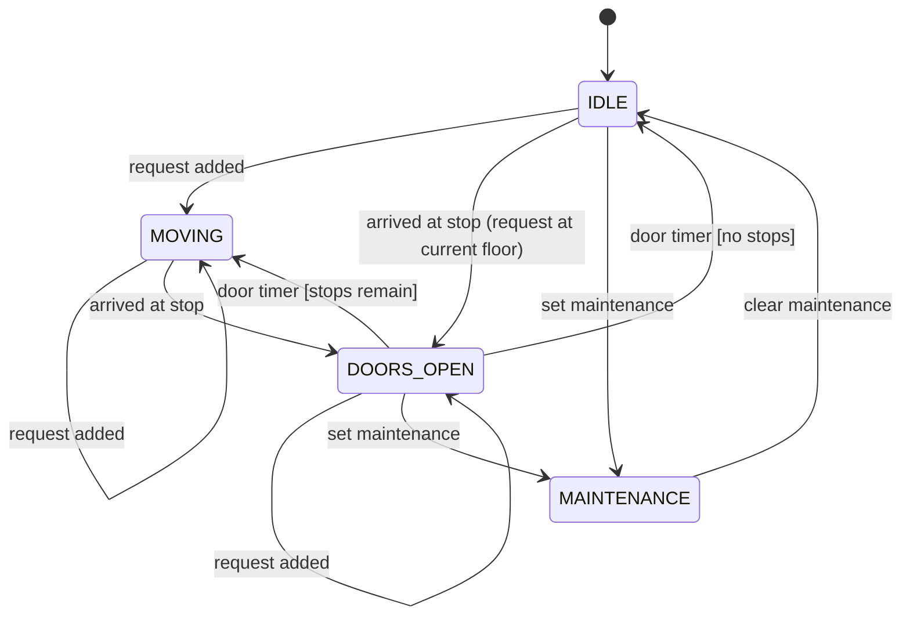

# State Machines (Finite State Machines)

## 1. One-line summary

A **finite state machine (FSM)** describes an object that is always in exactly **one of a fixed set of states**, and moves between them only through **allowed transitions** triggered by **events** — drawing it first and coding it explicitly makes "impossible" situations (doors open while moving) actually impossible.

## 2. The problem it solves

An elevator without an explicit state machine tends to grow booleans: `isMoving`, `doorsOpen`, `inMaintenance`, `hasRequests`. Four booleans = 16 combinations, and most are nonsense — `isMoving && doorsOpen` is a lawsuit. Every method then starts with a defensive `if` chain, and each new feature (fire mode, overload) adds another boolean and another 2× combinations.

A state machine replaces that with **one field** (`status`) whose value set is small and named, plus **one place** that decides which changes are legal. You already work with these daily:

- **Kubernetes pod phases**: `Pending → Running → Succeeded / Failed` (plus `Unknown`). You can't go from `Succeeded` back to `Running`; a new pod is created instead.
- **TCP connection states**: `CLOSED → SYN_SENT → ESTABLISHED → FIN_WAIT_1 → … → TIME_WAIT → CLOSED`. Those `TIME_WAIT` sockets in `ss -tan` output are a state machine you've debugged. (💡 **TCP** is the protocol that gives reliable, ordered byte streams; the **handshake** — SYN, SYN-ACK, ACK — is the sequence of messages that moves both sides to `ESTABLISHED`.)
- **Parking-lot ticket**: `ACTIVE → PAID → EXITED` ([parking lot interview](../interviews/parking-lot/README.md)).

## 3. How it works

### The vocabulary

| Term | Plain words | Elevator example |
|---|---|---|
| **State** | a named situation the object is in | `IDLE`, `MOVING`, `DOORS_OPEN`, `MAINTENANCE` |
| **Event** | something that happens to it | `REQUEST_ADDED`, `ARRIVED_AT_STOP`, `DOOR_TIMER_EXPIRED`, `SET_MAINTENANCE` |
| **Transition** | "in state S, on event E, go to state T" | `MOVING` + `ARRIVED_AT_STOP` → `DOORS_OPEN` |
| **Guard** | a condition that must also hold | `DOORS_OPEN` + timer → `MOVING` **only if** stops remain, else `IDLE` |
| **Action** | side effect of a transition | open doors, notify listeners (`DOORS_OPENED`) |

"Finite" just means the set of states is fixed and small — an enum, not a free-form string.

### Draw it first



Drawing it in the interview does three things: it shows the interviewer you've thought about lifecycle, it surfaces questions ("can maintenance interrupt a moving car?" — here: no, the request waits until the car stops. The [interview code](../interviews/elevator-system/java/src/elevator/ElevatorSystem.java) makes the other choice: `SetMaintenance` applies immediately, modelling a *fault*, with the physical safety layer bringing the car to the nearest floor. Both are fine: the point is to decide explicitly and say why), and it becomes your test list (one test per arrow, plus one per *missing* arrow).

### Implementation 1 — enum + switch (default choice)

```java
enum ElevatorStatus { IDLE, MOVING, DOORS_OPEN, MAINTENANCE }
enum ElevatorEvent { REQUEST_ADDED, ARRIVED_AT_STOP, DOOR_TIMER_EXPIRED, SET_MAINTENANCE, CLEAR_MAINTENANCE }

final class ElevatorFsm {
    private ElevatorStatus status = ElevatorStatus.IDLE;

    ElevatorStatus status() { return status; }

    /** Returns the new status; throws on an invalid transition. */
    ElevatorStatus on(ElevatorEvent event, boolean stopsRemain) {
        ElevatorStatus next = switch (status) {
            case IDLE -> switch (event) {
                case REQUEST_ADDED   -> ElevatorStatus.MOVING;
                case ARRIVED_AT_STOP -> ElevatorStatus.DOORS_OPEN;      // request at current floor
                case SET_MAINTENANCE -> ElevatorStatus.MAINTENANCE;
                default -> null;
            };
            case MOVING -> switch (event) {
                case ARRIVED_AT_STOP -> ElevatorStatus.DOORS_OPEN;
                case REQUEST_ADDED   -> ElevatorStatus.MOVING;          // just another stop
                default -> null;
            };
            case DOORS_OPEN -> switch (event) {
                case DOOR_TIMER_EXPIRED -> stopsRemain ? ElevatorStatus.MOVING : ElevatorStatus.IDLE; // guard
                case REQUEST_ADDED      -> ElevatorStatus.DOORS_OPEN;
                case SET_MAINTENANCE    -> ElevatorStatus.MAINTENANCE;
                default -> null;
            };
            case MAINTENANCE -> event == ElevatorEvent.CLEAR_MAINTENANCE ? ElevatorStatus.IDLE : null;
        };
        if (next == null) throw new IllegalStateException(event + " not allowed in " + status);
        status = next;
        return next;
    }
}
```

The outer `switch` has no `default`, so adding a new `ElevatorStatus` constant is a **compile error** until you handle it (exhaustive switch on an enum, Java 21; see [enums-and-enummap](../libraries/java/enums-and-enummap.md)).

### Implementation 2 — transition table

Put the arrows in **data** instead of code:

```java
import java.util.EnumMap;
import java.util.Map;

Map<ElevatorStatus, Map<ElevatorEvent, ElevatorStatus>> table = new EnumMap<>(ElevatorStatus.class);
table.put(ElevatorStatus.IDLE, Map.of(
        ElevatorEvent.REQUEST_ADDED, ElevatorStatus.MOVING,
        ElevatorEvent.SET_MAINTENANCE, ElevatorStatus.MAINTENANCE));
// ... one entry per arrow; lookup = table.get(status).get(event), null = invalid
```

Easy to print, diff, or render as a diagram; good for many states with simple transitions. Guards and actions get awkward (you end up storing lambdas).

### Implementation 3 — State pattern (one class per state)

Each state is a class implementing `ElevatorState { ElevatorState onArrive(Elevator e); ElevatorState onTimer(Elevator e); ... }` with its own behaviour. Worth it when **behaviour** (not just the next state) differs a lot per state — a vending machine, a TCP implementation. See State in [design-patterns](design-patterns.md). For four elevator states with small behaviour, it's ceremony.

### Invalid transitions

Decide explicitly what happens on an event that has no arrow:

| Policy | When |
|---|---|
| **Throw** (`IllegalStateException`) | programming error — a caller should never do this (exit an unpaid ticket) |
| **Ignore** (stay in state, maybe log) | harmless repeats from the outside world — pressing the call button twice |
| **Queue / defer** | valid later — maintenance requested while moving: apply when the car next stops |

In concurrent code, the check-and-change must be **atomic** — either one owner thread ([single-writer-principle](single-writer-principle.md)) or `AtomicReference.compareAndSet(old, new)` ([atomics-and-cas](../libraries/java/atomics-and-cas.md)).

## 4. When to use it

- An entity has a **lifecycle** with 3+ states and rules about order: orders, payments, tickets, elevators, deployments, connections, circuit breakers (`CLOSED → OPEN → HALF_OPEN`).
- You catch yourself writing `if (a && !b && c)` to decide what's allowed.
- You need an audit trail — log every transition `(from, event, to, time)`.

## 5. When NOT to use it

- **Two states, one transition** — a `boolean` is clearer.
- **States that aren't really exclusive** — "has VIP badge" and "is parked" are independent attributes, not states; forcing them into one enum causes a combinatorial explosion (`PARKED_VIP`, `PARKED_NON_VIP`…).
- **Full State-pattern classes for simple lifecycles** — over-engineering at L4/L5.
- **A workflow engine library** for an in-memory interview object.

## 6. Commonly confused with

| | enum + switch | Transition table | State pattern | Booleans |
|---|---|---|---|---|
| Transitions live in | one method | data (map) | each state class | scattered `if`s |
| Compiler checks new states | yes (exhaustive switch) | no | yes (interface methods) | no |
| Per-state behaviour | small | none | rich | — |
| Best for | most LLD answers | many states, config-driven | complex per-state logic | 1–2 flags |

Also: **state machine vs workflow/saga** — a saga coordinates a multi-step process across services; each step's object may itself be a state machine.

## 7. Common mistakes / misuse

1. **Status as a `String`** — typos compile; use an enum.
2. **Setter for status** (`setStatus(MOVING)`) callable from anywhere — bypasses the rules. Expose events, not setters.
3. **No decision on invalid events** — silent corruption. Throw, ignore, or defer, explicitly.
4. **Mixing independent attributes into one state enum.**
5. **Non-atomic transitions under concurrency** — two threads both see `ACTIVE` and both move to `PAID`.
6. **Forgetting terminal states** — what can happen after `EXITED` / `Succeeded`? (Nothing.)

## 8. Interview cheat-sheet

- "Each elevator has an explicit status: IDLE, MOVING, DOORS_OPEN, MAINTENANCE — let me draw the transitions."
- "The transition logic lives in one place; doors can only open from MOVING on arrival or from IDLE, so 'moving with doors open' can't happen."
- "A guard decides whether a closing door goes to MOVING or IDLE: are there stops left?"
- "Maintenance requested mid-trip is deferred until the car stops, rather than rejected."
- "I'd use an enum with an exhaustive switch; the State pattern with classes is worth it only if per-state behaviour grows."

## 9. Used in

- [LLD: Design an Elevator System](../interviews/elevator-system/README.md) — `ElevatorStatus` lifecycle (IDLE / MOVING / DOORS_OPEN / MAINTENANCE).
- [LLD: Design a Parking Lot](../interviews/parking-lot/README.md) — ticket lifecycle `ACTIVE → PAID → EXITED`.
- [LLD: Design a Movie Ticket Booking System](../interviews/movie-booking/README.md) — per-show seat state `AVAILABLE → HELD(holdId, expiresAt) → BOOKED(bookingId)` (an expired hold counts as AVAILABLE, see [holds-reservations-and-ttl](holds-reservations-and-ttl.md)) and the booking lifecycle `CONFIRMED → CANCELLED` with refunds.
- [LLD: Design an In-Memory Key-Value Store with Transactions](../interviews/kv-store/README.md) — session transaction state: no transaction → in transaction (depth n) via `BEGIN`, back down via `COMMIT`/`ROLLBACK`; `ROLLBACK`/`COMMIT` with no transaction is an error state to handle explicitly.
- Related: [design-patterns](design-patterns.md) (State), [enums-and-enummap](../libraries/java/enums-and-enummap.md), [single-writer-principle](single-writer-principle.md).
