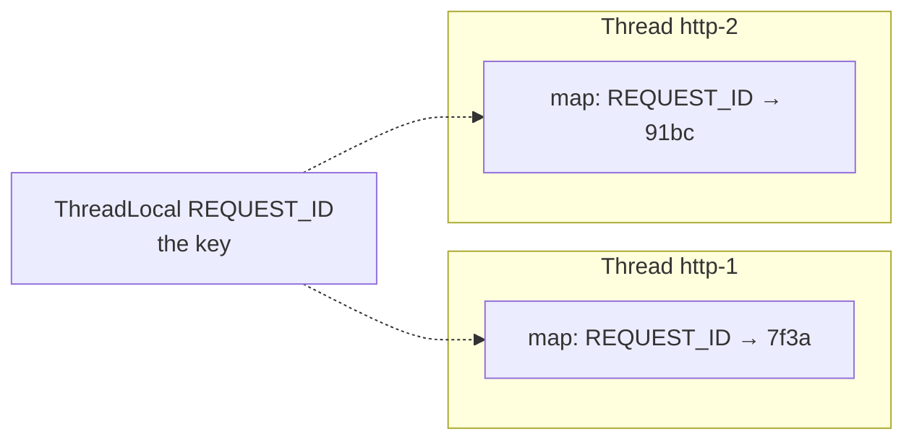
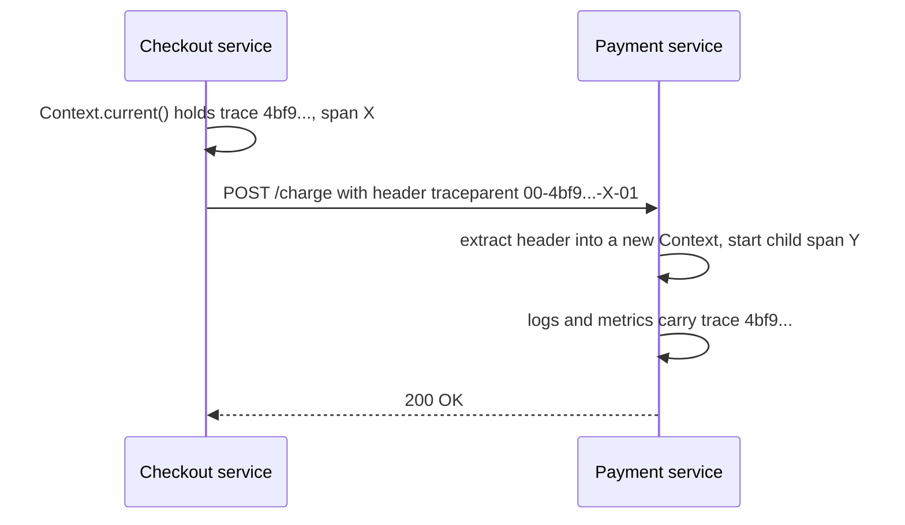

# ThreadLocal and Context Propagation

## 1. One-line summary

A **`ThreadLocal`** is a variable where **each thread sees its own value**, which is how Java frameworks carry "who is this request for" (request ID, user, trace ID) through deep call stacks without passing it as a parameter; the hard part is **context propagation**: the value doesn't follow your work onto other threads (executors, `CompletableFuture`), and it **stays behind** on pooled threads unless you remove it.

💡 **Context** here means small per-request facts that many layers want to read but few should have to pass along: request ID, user ID, tenant, trace ID, locale.

---

## 2. The problem it solves

**The pain:** your service handles 500 requests at once on 200 threads. You want every log line to include the request ID so you can `grep` one request's story out of the interleaved mess:

```
12:00:01 INFO  [req=7f3a] Charging card
12:00:01 INFO  [req=91bc] Charging card
12:00:01 WARN  [req=7f3a] Card declined, retrying
```

Options:

- **Pass `requestId` as a parameter** to every method, including ones that only call a logger. Noisy, and third-party code in the middle won't pass it on.
- **A `static` field**: shared by all 200 threads, so request A's log lines get request B's ID. Wrong ([thread-safety basics](thread-safety-basics.md)).
- **A `ThreadLocal`**: set it once when the request starts (in a servlet filter), read it anywhere on that thread, clear it when the request ends. This is what SLF4J's **MDC** does.

> Infra analogy: it's like the environment variables of a process. Every process sees its own `$REQUEST_ID`, children may or may not inherit it, and nothing carries it across a network call unless you pass it explicitly (that's what trace headers are for, section 3.8).

---

## 3. How it works

### 3.1 Inside `ThreadLocal`

Each `Thread` object holds a small hash map (`ThreadLocalMap`). The `ThreadLocal` object is just the **key**:



`REQUEST_ID.get()` means "look up `REQUEST_ID` in the **current thread's** map". No locks are needed because no other thread touches that map. The map holds the key through a **weak reference** (the GC may clear it if nothing else points to the `ThreadLocal`), but the **value is held strongly** for as long as the thread lives ([references and GC](../libraries/java/references-and-gc.md)). With pooled threads that live for days, that's the root of every leak below.

### 3.2 MDC is a ThreadLocal map

SLF4J's **MDC** (Mapped Diagnostic Context) is a `ThreadLocal<Map<String, String>>` exposed through static methods: `MDC.put("requestId", id)`, `MDC.remove(...)`, `MDC.clear()`. The log pattern `%X{requestId}` prints it on every line ([SLF4J, Logback and Log4j2](../libraries/java/slf4j-logback-and-log4j2.md)). The standard usage is set-in-filter, clear-in-`finally`:

```java
try {
    MDC.put("requestId", requestIdFrom(request));
    chain.doFilter(request, response);
} finally {
    MDC.clear();            // the thread goes back to the pool after this
}
```

### 3.3 Three failure modes, in one runnable demo

Java 21, `java ContextDemo.java`:

```java
import java.util.concurrent.*;

public class ContextDemo {
    static final ThreadLocal<String> REQUEST_ID = new ThreadLocal<>();

    // Capture the caller's value now, restore it on the worker, always clean up.
    static Runnable withContext(Runnable task) {
        String captured = REQUEST_ID.get();
        return () -> {
            String previous = REQUEST_ID.get();
            REQUEST_ID.set(captured);
            try { task.run(); }
            finally {
                if (previous == null) REQUEST_ID.remove(); else REQUEST_ID.set(previous);
            }
        };
    }

    static void log(String msg) {
        System.out.printf("[%s] [req=%s] %s%n", Thread.currentThread().getName(), REQUEST_ID.get(), msg);
    }

    public static void main(String[] args) throws Exception {
        ExecutorService pool = Executors.newSingleThreadExecutor();

        // 1. Leak: request A sets the value on a pooled thread and never removes it.
        pool.submit(() -> { REQUEST_ID.set("A"); log("handling request A"); }).get();
        pool.submit(() -> log("handling request B (never set an id)")).get();

        // 2. Lost context: the caller's value doesn't travel to the worker thread.
        pool.submit(() -> REQUEST_ID.remove()).get();       // clean the worker for the next demos
        REQUEST_ID.set("C");
        log("caller, before submit");
        pool.submit(() -> log("worker, plain Runnable")).get();

        // 3. Fixed: wrap the Runnable so it carries the caller's value.
        pool.submit(withContext(() -> log("worker, wrapped Runnable"))).get();
        pool.submit(() -> log("worker, next task after the wrapped one")).get();

        // 4. CompletableFuture without an executor runs on the common ForkJoinPool: context lost.
        CompletableFuture.runAsync(() -> log("CompletableFuture.runAsync")).get();
        pool.shutdown();
    }
}
```

Output:

```
[pool-1-thread-1] [req=A] handling request A
[pool-1-thread-1] [req=A] handling request B (never set an id)
[main] [req=C] caller, before submit
[pool-1-thread-1] [req=null] worker, plain Runnable
[pool-1-thread-1] [req=C] worker, wrapped Runnable
[pool-1-thread-1] [req=null] worker, next task after the wrapped one
[ForkJoinPool.commonPool-worker-1] [req=null] CompletableFuture.runAsync
```

**Failure 1, leak into the next task.** Request B's log line says `req=A`. In real life that's request B's error logged under user A's ID, or worse, a `ThreadLocal` holding the *security principal* (the logged-in user), so B runs with A's permissions. **Always `remove()` in a `finally`.**

**Failure 2, context lost on hand-off.** The worker thread has its own (empty) map. Anything you `submit` to an [executor](../libraries/java/executors-and-threads.md) loses the caller's context.

**The fix: capture and restore.** `withContext` reads the value on the **submitting** thread, then sets it on the worker for the duration of the task and restores the previous value afterwards. Wrap the whole executor (a decorator, [design patterns](design-patterns.md)) so nobody has to remember: for MDC, capture `MDC.getCopyOfContextMap()` and call `MDC.setContextMap(...)` on the worker. Spring's `TaskDecorator` and OpenTelemetry's `Context.taskWrapping(executor)` are ready-made versions.

### 3.4 `CompletableFuture` pitfalls

- `supplyAsync` / `runAsync` **without an executor argument** run on `ForkJoinPool.commonPool()` (failure 4 above): no context, and shared with every other library in the JVM. Pass your own context-wrapping executor ([CompletableFuture](../libraries/java/completablefuture.md)).
- Non-async stages (`thenApply`, `thenAccept`) run on **whichever thread completes the previous stage**, or on the calling thread if it's already complete. So the context you see in a callback depends on timing: it can work in tests and fail under load.
- Use the `...Async(fn, executor)` variants with a wrapped executor when context matters.

### 3.5 Classloader leaks in app servers

In Tomcat-style app servers, the server's thread pool outlives your web application. If your code leaves a value in a `ThreadLocal` on a server thread, and that value's class was loaded by your app's **classloader** (the object that loads your app's classes; each deployed app gets its own), then after a redeploy the old classloader can't be garbage-collected: one leftover object pins **every class of the old version**. A few redeploys later the JVM fails with `OutOfMemoryError: Metaspace` (Metaspace is where the JVM keeps class metadata). Tomcat warns about such leftover `ThreadLocal`s when an app is stopped. Same fix: `remove()` in `finally`.

### 3.6 `InheritableThreadLocal`: copied once, at thread creation

An `InheritableThreadLocal` copies the parent thread's value into a **new** thread when it's created. With thread pools, threads are created once and reused, so the copy is stale:

```java
import java.util.concurrent.*;

public class InheritDemo {
    static final InheritableThreadLocal<String> USER = new InheritableThreadLocal<>();

    public static void main(String[] args) throws Exception {
        ExecutorService pool = Executors.newSingleThreadExecutor();
        USER.set("alice");
        pool.submit(() -> System.out.println("task 1 sees " + USER.get())).get(); // worker created now: copies "alice"
        USER.set("bob");
        pool.submit(() -> System.out.println("task 2 sees " + USER.get())).get(); // same worker: still "alice"
        pool.shutdown();
    }
}
```

```
task 1 sees alice
task 2 sees alice
```

Bob's task runs as Alice. Don't rely on inheritance with pools; capture and restore explicitly.

### 3.7 Virtual threads and `ScopedValue`

**Virtual threads** (final in Java 21) are lightweight threads managed by the JVM: you can have millions, and you create a new one per task instead of pooling. 💡 A **platform thread** maps 1:1 to an OS thread and costs ~1 MB of reserved stack; a virtual thread is a small heap object that the JVM mounts on a platform thread only while it's running.

`ThreadLocal` works on virtual threads, and since each task gets a fresh thread, the "leak into the next task" problem mostly disappears. The cost moves elsewhere: ThreadLocals used as **per-thread caches** (a reusable buffer, a `SimpleDateFormat`) no longer get reused, and they multiply:

```
1,000,000 virtual threads × 1 KB cached buffer each = 1 GB of heap
```

**`ScopedValue`** is the newer alternative: an **immutable** value bound for the duration of a method call, readable by everything that call invokes, and automatically gone when the call returns. No `set`, no `remove`, nothing to leak. In **Java 21 it's a preview API** (JEP 446): you must compile and run with `--enable-preview`, and the API may change between releases. (It was previewed again in later releases and finalised in JDK 25 by JEP 506; check before relying on it.)

```java
public class ScopedDemo {
    static final ScopedValue<String> REQUEST_ID = ScopedValue.newInstance();

    public static void main(String[] args) throws Exception {
        ScopedValue.where(REQUEST_ID, "req-42").run(() -> handle());
        System.out.println("after the scope, bound? " + REQUEST_ID.isBound());
    }

    static void handle() {
        System.out.println("inside the scope: " + REQUEST_ID.get());  // no parameter passing needed
    }
}
```

`java --enable-preview --source 21 ScopedDemo.java`:

```
Note: ScopedDemo.java uses preview features of Java SE 21.
Note: Recompile with -Xlint:preview for details.
inside the scope: req-42
after the scope, bound? false
```

### 3.8 Node.js: `AsyncLocalStorage`

Node runs your JavaScript on one thread ([event loop](../libraries/js/event-loop-and-concurrency.md)), so a "thread-local" makes no sense: many requests interleave on the same thread at every `await`. **`AsyncLocalStorage`** (in `node:async_hooks`) follows the **async call chain** instead: a value set with `run()` is visible in everything that continues from that call, including after `await`s and timers.

```js
import { AsyncLocalStorage } from 'node:async_hooks';

const context = new AsyncLocalStorage();

function log(msg) {
  const store = context.getStore();          // whatever run() set for THIS async chain
  console.log(`[req=${store?.requestId ?? '-'}] ${msg}`);
}

async function handleRequest(requestId, delayMs) {
  return context.run({ requestId }, async () => {
    log('start');
    await new Promise((r) => setTimeout(r, delayMs));   // other requests run meanwhile
    log('after await');
  });
}

// Two "requests" interleave on the single thread, yet each log line keeps its own id.
await Promise.all([handleRequest('A', 30), handleRequest('B', 10)]);
log('outside any request');
```

Output (`node als.mjs`, Node 22):

```
[req=A] start
[req=B] start
[req=B] after await
[req=A] after await
[req=-] outside any request
```

See [logging in Node](../libraries/js/logging-in-node.md) for using it in a logger.

### 3.9 Across services: OpenTelemetry Context and trace headers

`ThreadLocal`, MDC and `AsyncLocalStorage` stop at the process boundary. To follow a request through five services, the context must travel **in the request itself**. The W3C Trace Context standard defines a `traceparent` HTTP header:

```
traceparent: 00-4bf92f3577b34da6a3ce929d0e0e4736-00f067aa0ba902b7-01
             version-trace id (16 bytes hex)-parent span id (8 bytes hex)-flags (01 = sampled)
```



**OpenTelemetry** (the vendor-neutral standard for traces, metrics and logs) keeps the current trace in its own `Context` object (in Java, stored in a `ThreadLocal`; in Node, in `AsyncLocalStorage`), **injects** it into outgoing headers, and **extracts** it from incoming ones. It's the same capture-and-restore idea as 3.3, with HTTP headers or Kafka message headers as the transport ([observability](../../HLD/concepts/observability.md)). Log appenders can copy the trace ID into MDC so logs and traces link up.

---

## 4. When to use it

- **Request-scoped data for cross-cutting concerns**: request/trace IDs in logs, tenant ID, locale, the authenticated user (Spring Security's `SecurityContextHolder` uses a `ThreadLocal` by default).
- **Per-thread reusable objects** that aren't thread-safe, on a *bounded* platform-thread pool (a buffer, a legacy `SimpleDateFormat`).
- **Transaction or connection binding** inside frameworks (Spring binds the current transaction's connection to the thread).

## 5. When NOT to use it (and why it's a mistake)

| Situation | Why |
|---|---|
| Passing **business data** between your own methods | Hidden inputs make code hard to test and reason about. Use parameters. |
| Reactive / callback-heavy code (Reactor, RxJava) | Work hops between threads constantly; use the framework's own context (Reactor's `Context`) or ScopedValue-style APIs. |
| Per-thread caches on **virtual threads** | No reuse, memory multiplies by the number of threads. |
| Anything that must survive a thread hop **without** a wrapper | It won't. Wrap executors or pass values explicitly. |

---

## 6. Commonly confused with

| | **ThreadLocal** | **InheritableThreadLocal** | **ScopedValue** (preview in 21) | **AsyncLocalStorage** (Node) | **OTel Context + headers** |
|---|---|---|---|---|---|
| Scope | one thread, until removed | copied into threads created later | one method call and what it calls | one async call chain | across services |
| Mutable | yes (`set`) | yes | no (rebind in a nested scope) | store object is mutable | immutable, new context per change |
| Cleanup | manual `remove()` | manual | automatic | automatic when the chain ends | automatic per request |
| Pitfall | leaks on pooled threads | stale with pools | preview API in 21 | small overhead per async hop | must inject/extract at every hop |

---

## 7. Common mistakes / misuse

1. **No `remove()` in `finally`** on a pooled thread: the next request inherits the previous user's context.
2. **Assuming context follows `submit()`** or `CompletableFuture.supplyAsync()`: wrap the executor.
3. **`InheritableThreadLocal` with thread pools**: the value is from whoever first created the thread.
4. **Static `ThreadLocal` holding app classes in an app server**: classloader leak, Metaspace OOM after redeploys.
5. **Heavy per-thread caches on virtual threads**: a million threads, a million caches.
6. **Forgetting the network boundary**: MDC doesn't cross HTTP. Propagate `traceparent` (or at least an `X-Request-Id` header) and re-populate MDC on the other side.

---

## 8. Interview cheat-sheet

> "For per-request context like a request ID I'd use a ThreadLocal, which is what SLF4J's MDC is: set in a filter at the start of the request and cleared in a finally block, because pooled threads otherwise carry one request's context into the next. Context doesn't follow work onto other threads, so I wrap the executor to capture the caller's context map at submit time and restore it around the task, and I never use CompletableFuture's async methods without an executor. I avoid InheritableThreadLocal with pools since it copies only at thread creation. With virtual threads ThreadLocal still works, but per-thread caches get expensive; ScopedValue, a preview in Java 21, is the immutable, auto-cleaned alternative. In Node the equivalent is AsyncLocalStorage, and across services the context travels as a W3C traceparent header via OpenTelemetry."

---

## 9. Used in

- [LLD: Logging Framework](../interviews/logging-framework/README.md): the MDC / context map that adds request IDs to every log line, cleaning it up on pooled threads, and carrying it across executors and async hand-offs.
- Related: [back-pressure](back-pressure.md), [SLF4J, Logback and Log4j2](../libraries/java/slf4j-logback-and-log4j2.md), [logging in Node](../libraries/js/logging-in-node.md), [executors and threads](../libraries/java/executors-and-threads.md), [CompletableFuture](../libraries/java/completablefuture.md), [observability](../../HLD/concepts/observability.md).
