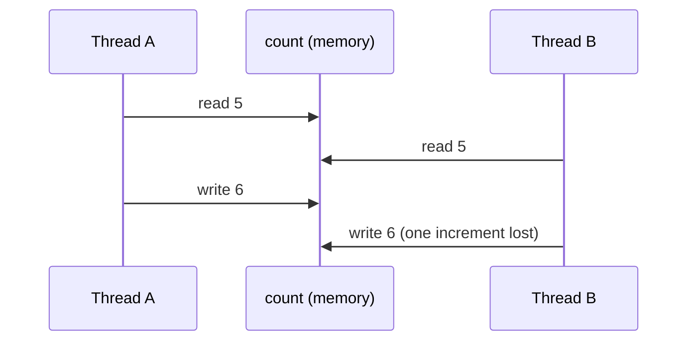

# Thread-Safety Basics

## 1. One-line summary

A class is **thread-safe** if it behaves correctly when many threads call it at the same time, with no extra coordination by the caller; getting there means handling three things — **atomicity**, **visibility**, and **ordering**.

## 2. The problem it solves

A Java web server (Tomcat, Netty, Jetty) handles requests on many threads. A rate limiter object is shared by all of them. Code that is perfectly correct on one thread can, under load:

- let 12 requests through when the limit is 10,
- read a stale value that another thread already changed,
- see an object "half-constructed".

These bugs don't show up in unit tests, appear only under production traffic, and can't be reproduced on demand — like a flaky health check that only fails at peak. Understanding a few core ideas lets you prevent them by design and explain your reasoning in an interview.

## 3. How it works

### Race condition

A **race condition** is when the result depends on the timing of threads. Two classic shapes:

**Read-modify-write** — `count++` is really read, add, write:



**Check-then-act** — decide based on a value that may change before you act:

```java
// Fixed window counter, BROKEN under concurrency
if (count < limit) {   // A and B both see 9 (limit 10)
    count++;           // both increment → 11 requests allowed
    return true;
}
return false;
```

Same shape: `if (!map.containsKey(k)) map.put(k, v)` — see [concurrent-hashmap](../libraries/java/concurrent-hashmap.md).

### Atomicity

An operation is **atomic** if other threads see it as all-or-nothing — never halfway. Tools:

- `synchronized` / `ReentrantLock` around the whole check-and-update ([locks-and-synchronized](../libraries/java/locks-and-synchronized.md)).
- `AtomicLong.compareAndSet` / `getAndUpdate` for single values ([atomics-and-cas](../libraries/java/atomics-and-cas.md)).
- Single-call compound ops like `ConcurrentHashMap.computeIfAbsent`.

The key insight: **thread-safe parts don't make a thread-safe whole.** Two individually atomic calls in a row are not atomic together.

### Visibility

Each CPU core has caches, and the JIT compiler may keep a value in a register. Without synchronization, a write by one thread **may never be seen** by another.

```java
class Evictor implements Runnable {
    private boolean running = true;          // BROKEN: may loop forever
    public void stop() { running = false; }
    public void run() { while (running) { /* sweep */ } }
}
```

The JIT may hoist `running` out of the loop. Fix: `private volatile boolean running = true;`

`volatile` guarantees **visibility and ordering** for that one variable — every read sees the latest write. It does **not** make `count++` atomic. Rule of thumb: `volatile` is for flags and for publishing a reference to an immutable object; anything read-modify-write needs atomics or a lock.

### Ordering and happens-before (in plain words)

Compilers and CPUs reorder instructions when a single thread can't tell the difference. Another thread can. The Java Memory Model's **happens-before** rule says: if action X happens-before action Y, then Y sees everything X (and everything before X) wrote. The edges you'll use:

| Edge | Meaning |
|---|---|
| Unlock → later lock of the **same** lock | everything written before unlock is visible after lock |
| Write to a `volatile` → later read of it | same, for that variable and earlier writes |
| `Thread.start()` → anything in the new thread | the new thread sees what the parent set up |
| Everything in a thread → another thread's `join()` returning | |
| Putting into a concurrent collection → getting it out | safe hand-off between threads |
| Constructor end → reads of `final` fields | properly constructed immutable objects are safe to share |

In plain words: **threads only reliably see each other's writes through a shared "meeting point"** — a lock, a volatile, a concurrent collection, or thread start/join. No meeting point, no guarantee.

### How to make a class thread-safe (in order of preference)

1. **Don't share** — confine state to one thread (local variables, per-request objects).
2. **Don't mutate** — immutable objects (`record`s with `final` fields) are always thread-safe.
3. **Delegate** — store state in thread-safe classes (`ConcurrentHashMap`, `AtomicLong`), as long as there's no invariant spanning several of them.
4. **Lock** — guard all fields that participate in one invariant with the **same** lock, on every read and write.

### A thread-safe bucket in an interview

```java
public final class FixedWindowCounter {
    private final int limit;
    private final long windowNanos;
    private final TimeSource time;          // injected, see time-and-clock.md
    private long windowStart;               // guarded by this
    private int count;                      // guarded by this

    public FixedWindowCounter(int limit, long windowNanos, TimeSource time) {
        this.limit = limit;
        this.windowNanos = windowNanos;
        this.time = time;
        this.windowStart = time.nanoTime();
    }

    public synchronized boolean tryAcquire() {
        long now = time.nanoTime();
        if (now - windowStart >= windowNanos) {   // new window
            windowStart = now;
            count = 0;
        }
        if (count >= limit) return false;
        count++;
        return true;
    }
}
```

Why it's safe: `windowStart` and `count` form one invariant and are only touched under one lock (`this`); `final` fields are safely published; the check and the increment are in the same critical section.

### Reasoning checklist: "Is this class thread-safe?"

1. **What state is shared?** List fields reachable by more than one thread.
2. **Which fields are tied by an invariant?** (`tokens` and `lastRefill`; `count` and `windowStart`.) They need the same lock or one atomic swap.
3. **Find every read-modify-write and check-then-act.** Is each one inside a single atomic unit?
4. **Is every read of a mutable field synchronized or `volatile`?** Unsynchronized reads = visibility bug.
5. **Does anything escape?** Returning a mutable internal list, or leaking `this` from a constructor (e.g. starting a thread in it).
6. **What's the lock scope?** Too wide = throughput dies; too narrow = races. Never hold a lock during I/O.
7. **Compound actions by callers?** Document it: "each method is atomic; sequences are not".

## 4. When to use it

- Any object shared across request threads: registries, caches, counters, connection pools, rate limiters.
- Every LLD interview that says "multiple users concurrently" — which is nearly all of them.

## 5. When NOT to use it

- **Thread-confined objects** — adding locks to per-request objects is overhead and noise, and signals you don't know what's shared.
- **Node.js synchronous code** — one thread runs your JS, so locks are unnecessary there (but races across `await` still exist; see [event-loop-and-concurrency](../libraries/js/event-loop-and-concurrency.md)).
- **Across processes** — JVM thread-safety says nothing about two pods; that's a distributed-systems problem (atomic ops in Redis, idempotency).
- **"Make everything `synchronized` just in case"** — it hides the real design question (what's shared?) and serializes the app.

## 6. Commonly confused with

| | Atomicity | Visibility | Ordering |
|---|---|---|---|
| Question | can another thread see it half-done? | will another thread see it at all? | will others see writes in program order? |
| Broken example | `count++` | non-volatile `running` flag | publishing an object before its fields are set |
| `volatile` fixes | no | yes | yes |
| `Atomic*` fixes | yes (single var) | yes | yes |
| `synchronized` / lock fixes | yes | yes | yes |

Also: **thread-safe vs concurrent** — `Collections.synchronizedMap` is thread-safe but not concurrent (one lock); `ConcurrentHashMap` is both. **Race condition vs data race** — a data race is unsynchronized access to the same memory (a JMM term); a race condition is a logic bug from timing and can exist even with all-atomic operations (check-then-act across two atomic calls).

## 7. Common mistakes / misuse

1. "I used `ConcurrentHashMap`, so my class is thread-safe" — the values and multi-call sequences aren't covered.
2. `volatile int count; count++` — visible but not atomic.
3. Synchronizing writes but not reads.
4. Different locks guarding the same invariant.
5. A global lock where per-key locks suffice.
6. Doing I/O while holding a lock.
7. Starting a thread or registering a listener in a constructor (leaks `this` before construction ends).

## 8. Interview cheat-sheet

- "The shared state is the per-key bucket; its fields form one invariant, so they're guarded by the bucket's own lock, and the map is a `ConcurrentHashMap` with `computeIfAbsent`."
- "The two bugs I watch for are check-then-act and read-modify-write — both must happen inside one atomic unit."
- "`volatile` gives visibility, not atomicity; I use it for flags like `running`, and atomics or locks for counters."
- "Happens-before just means threads see each other's writes only through a lock, a volatile, a concurrent collection, or thread start/join."
- "Lock per key, never during I/O, and across pods the problem moves to Redis atomic operations."

## 9. Used in

- [LLD: Design a Rate Limiter](../interviews/rate-limiter/README.md) — per-bucket synchronization, registry races, eviction safety.
- [LLD: Design a Parking Lot](../interviews/parking-lot/README.md) — concurrent entry gates, atomic spot claim, check-then-act races on free spots.
- [LLD: Design an LRU Cache](../interviews/lru-cache/README.md) — why even reads need the lock in an LRU (`get` mutates the recency list), lock striping with `StripedCache`, and check-then-act on cache misses (single-flight loading).
- [LLD: Design an Elevator System](../interviews/elevator-system/README.md) — thread safety by ownership: many caller threads, one simulation thread, no locks on elevator state (see [single-writer-principle](single-writer-principle.md)).
- [LLD: Design Splitwise](../interviews/splitwise/README.md) — per-group locking around ledger appends, check-then-act on idempotency keys (a retried `addExpense` must not be applied twice).
- [LLD: Design a Movie Ticket Booking System](../interviews/movie-booking/README.md) — check-then-act on seat availability, all-or-nothing multi-seat holds with one lock per show vs per-seat CAS with rollback ([optimistic-vs-pessimistic-locking](optimistic-vs-pessimistic-locking.md), [deadlocks-and-lock-ordering](deadlocks-and-lock-ordering.md)).
- [LLD: Design an In-Memory Key-Value Store with Transactions](../interviews/kv-store/README.md) — thread safety by single-threaded command execution (Redis model, see [single-writer-principle](single-writer-principle.md)); at L6, multiple client sessions and isolation ([transactions-and-isolation](transactions-and-isolation.md)).
- Related: [design-patterns](design-patterns.md), [solid-principles](solid-principles.md).
