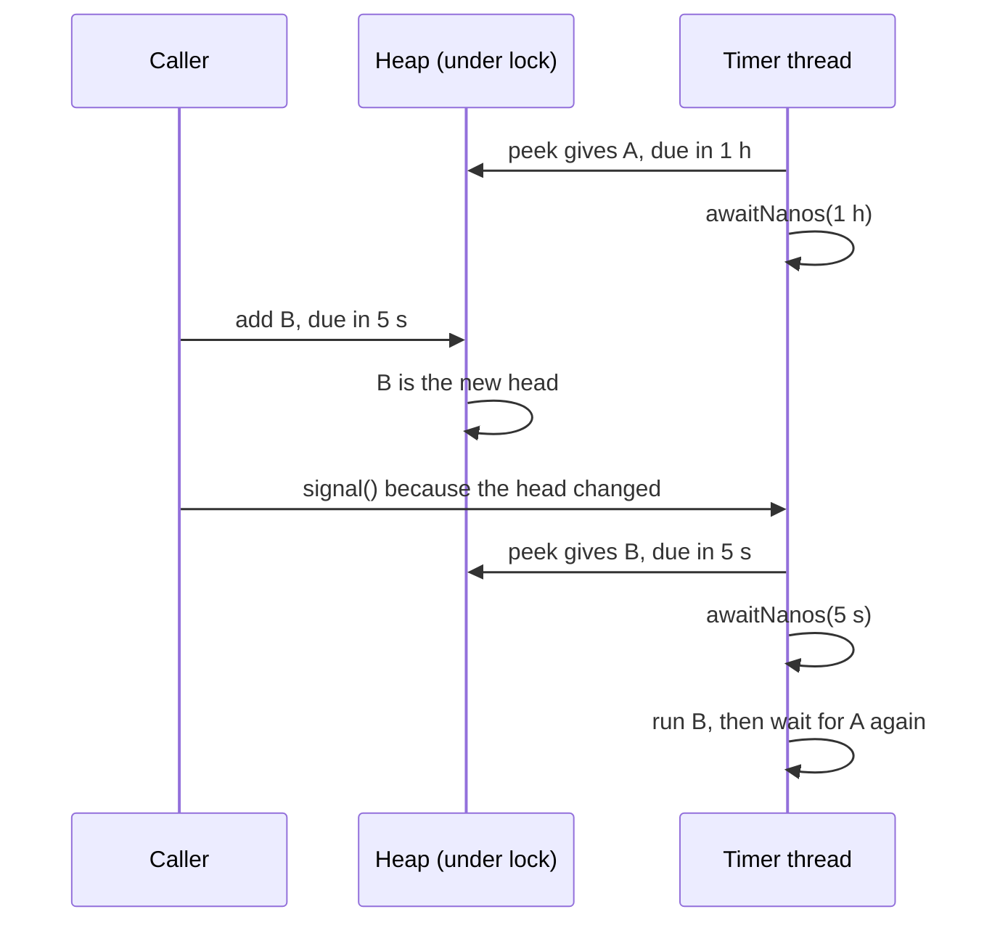
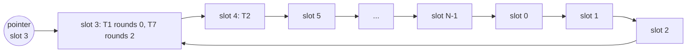

# Timers, Delay Queues and Timing Wheels

## 1. One-line summary

A **timer facility** is the part of a program that runs things "later" ("retry in 30 s", "expire this hold at 10:00", "time out this request after 5 s"); the standard design is a **priority queue of deadlines plus one thread that sleeps until the earliest one**, and when there are millions of timers with coarse precision, a **timing wheel** (an array of time buckets, like a clock face) makes insert and cancel O(1).

---

## 2. The problem it solves

**The pain:** a task scheduler holds **1 million** delayed tasks (reminders, retries, timeouts). Two obvious designs fail:

**Option 1: one sleeping thread per task.**

```
1,000,000 platform threads × ~1 MB reserved stack each (default -Xss on 64-bit Linux) ≈ 1 TB of virtual memory
```

The OS refuses long before that, and **context switching** (the OS saving one thread's state and loading another's) between that many threads is slow. 💡 A **platform thread** is a normal Java thread backed by an OS thread; its **stack** is the memory holding its method calls and local variables. Java 21 **virtual threads** make a sleeping thread cheap (it's parked on the heap, not holding an OS thread), but you still get no ordering, no "what's due next?" view, and nothing survives a restart.

**Option 2: polling.** Keep tasks in a list and every 100 ms scan for due ones:

```
1,000,000 tasks × 10 scans/s = 10,000,000 checks per second, to find maybe 10 due tasks
```

And precision is capped at the poll interval.

**The fix:** keep tasks **sorted by deadline**, and let a single thread sleep **exactly until the earliest deadline**. That costs nothing while idle and wakes precisely when needed.

> Infra analogy: a k8s controller's **work queue with `AddAfter`** (requeue this object in 30 s) is exactly this: a heap of "not before" times and workers that wait on it. So is a message broker's delayed delivery.

---

## 3. How it works

### 3.1 Min-heap of deadlines plus one waiting thread

A **min-heap** (Java's `PriorityQueue`, see [TreeSet and PriorityQueue](../libraries/java/treeset-and-priorityqueue.md)) always has the smallest element on top: O(log n) to add or remove the top, O(1) to peek. Store `(dueTime, task)` with the earliest `dueTime` on top. The loop:

1. Peek the head. If the heap is empty, wait until something is added.
2. If the head is due (`dueTime <= now`), remove it and run it.
3. Otherwise wait for `dueTime - now`, then go to step 1.

This is how `java.util.Timer`, `ScheduledThreadPoolExecutor` (its internal `DelayedWorkQueue`) and `java.util.concurrent.DelayQueue` all work ([ScheduledExecutorService](../libraries/java/scheduled-executor-service.md), [blocking queues](../libraries/java/blocking-queues-and-producer-consumer.md)).

### 3.2 The wake-up problem: an earlier task arrives while sleeping

The thread is sleeping for 1 hour until task A. Now task B arrives, due in 5 seconds. If nobody wakes the thread, **B runs 1 hour late**.



The rule: **when an insert changes the head, signal the waiting thread** so it recomputes its sleep. `java.util.Timer` does this with `notify()`; `DelayQueue.offer` does it with `available.signal()` when the new element is the head. Here is a minimal, runnable version:

```java
import java.util.PriorityQueue;
import java.util.concurrent.TimeUnit;
import java.util.concurrent.locks.Condition;
import java.util.concurrent.locks.ReentrantLock;

public class MiniTimer {
    private record Entry(long dueNanos, long seq, Runnable task) {}

    // nanoTime values may overflow, so compare by subtraction, never with Long.compare(a, b)
    private final PriorityQueue<Entry> heap = new PriorityQueue<>((a, b) -> {
        long d = a.dueNanos() - b.dueNanos();
        return d != 0 ? Long.signum(d) : Long.compare(a.seq(), b.seq());   // FIFO for equal deadlines
    });
    private final ReentrantLock lock = new ReentrantLock();
    private final Condition changed = lock.newCondition();
    private long seq = 0;

    public void schedule(Runnable task, long delay, TimeUnit unit) {
        lock.lock();
        try {
            Entry e = new Entry(System.nanoTime() + unit.toNanos(delay), seq++, task);
            heap.add(e);
            if (heap.peek() == e) changed.signal();   // new earliest deadline: wake the sleeper
        } finally {
            lock.unlock();
        }
    }

    void runLoop() {
        while (true) {
            Entry next;
            lock.lock();
            try {
                while (true) {
                    Entry head = heap.peek();
                    if (head == null) { changed.await(); continue; }
                    long wait = head.dueNanos() - System.nanoTime();
                    if (wait <= 0) { next = heap.poll(); break; }
                    changed.awaitNanos(wait);   // may wake early (signal or spurious): loop re-checks
                }
            } catch (InterruptedException ie) {
                return;                         // shutdown
            } finally {
                lock.unlock();
            }
            try { next.task().run(); }          // run OUTSIDE the lock
            catch (RuntimeException ex) { ex.printStackTrace(); }   // one bad task must not kill the timer
        }
    }

    public static void main(String[] args) throws InterruptedException {
        MiniTimer timer = new MiniTimer();
        Thread.ofPlatform().daemon().name("mini-timer").start(timer::runLoop);
        long t0 = System.nanoTime();
        timer.schedule(() -> System.out.printf("A fired at %d ms%n", (System.nanoTime() - t0) / 1_000_000), 2, TimeUnit.SECONDS);
        Thread.sleep(100);   // the timer thread is now sleeping until A is due
        timer.schedule(() -> System.out.printf("B fired at %d ms%n", (System.nanoTime() - t0) / 1_000_000), 500, TimeUnit.MILLISECONDS);
        Thread.sleep(2_500);
    }
}
```

Output (`javac MiniTimer.java && java MiniTimer`): `B fired at 604 ms`, then `A fired at 2002 ms`. Change the condition to `if (heap.size() == 1)` ("only wake it when the heap was empty") and the bug appears: `B fired at 2002 ms`, `A fired at 2020 ms`. B waited behind A's sleep. Remove the signal entirely and nothing fires, because the thread started on an empty heap and waits forever. 💡 A **`Condition`** is a wait/notify channel tied to a lock: `await` releases the lock while sleeping; `signal` wakes one waiter ([thread safety basics](thread-safety-basics.md)).

**With a thread pool**, `ScheduledThreadPoolExecutor` uses the **leader-follower** pattern: one worker (the "leader") does the timed wait for the head task; the others wait without a timeout. When the leader takes the task, it signals a follower to become the next leader. This avoids all N workers waking up for the same deadline.

### 3.3 Timing wheels: O(1) insert for millions of timers

A heap costs O(log n) per insert. With 1M timers that's ~20 comparisons, which is fine for most apps. But some systems create and **cancel** huge numbers of timers per second (network timeouts that almost never fire). For them, **Varghese & Lauck (1987)**, *Hashed and Hierarchical Timing Wheels*, proposed a clock-face design.

**Hashed timing wheel:** an array of `N` slots, each a list of timers. A pointer advances one slot every **tick** (say 100 ms).

```
insert(delay):  ticks = delay / tickDuration
                slot  = (current + ticks) % N
                rounds = ticks / N        // how many full turns to wait
on each tick:   walk the current slot: rounds == 0 → fire, else rounds--
```



**Netty's `HashedWheelTimer`** works this way, with defaults of 100 ms ticks and 512 slots, so one full turn covers 512 × 100 ms = 51.2 s. Insert is O(1) (compute the slot, append), cancel is O(1) (unlink from the slot's list). The price is **precision**: a timer fires on the tick after its deadline, up to one tick (100 ms) late. Netty uses it for things like idle-connection and read timeouts, where ±100 ms doesn't matter.

**Hierarchical timing wheel:** like a clock with second, minute and hour hands. A timer 3 hours away sits in the coarse "hours" wheel; as time gets close it **cascades** down into finer wheels. Each level covers `wheelSize ×` the range of the level below, so a few small wheels cover very long delays without a huge array or many "rounds".

**Kafka** uses a hierarchical timing wheel for its **request purgatory** (requests waiting for a condition or a timeout, e.g. a produce with `acks=all` waiting for replicas, or a consumer fetch waiting for data). Its tick is 1 ms with 20 slots per level, so level ranges grow 20 ms → 400 ms → 8 s → 160 s (each ×20). Most of these requests complete *before* their timeout and must be cancelled, which is why O(1) cancel matters. To avoid ticking through empty slots, Kafka puts only the non-empty buckets into a `DelayQueue` and advances the wheel's clock to the next bucket's time.

### 3.4 Wall clock vs monotonic clock

- **Wall clock** (`System.currentTimeMillis`, `Instant.now()`): the calendar time. NTP (the network time sync daemon) can **jump it** forward or back.
- **Monotonic clock** (`System.nanoTime`): only measures elapsed time, never jumps, meaningless across machines or restarts.

`java.util.Timer` schedules on the wall clock: if the clock is stepped back 1 hour, pending tasks run 1 hour late. `ScheduledThreadPoolExecutor` and `DelayQueue`-based code use `nanoTime`, so a "run in 30 s" stays 30 s. Rule: **delays use the monotonic clock**; "run at 09:00 Asia/Kolkata" needs the wall clock and time zones, which is the job of [cron and recurring schedules](cron-and-recurring-schedules.md). Details in [time and clock](../libraries/java/time-and-clock.md).

### 3.5 Node.js timers

`setTimeout(fn, ms)` registers a timer with Node's event loop (run by **libuv**, the C library underneath Node), which keeps timers ordered by expiry and uses a monotonic clock ([async/await and timers](../libraries/js/async-await-and-timers.md)). Things to know:

- A timer fires **no earlier** than `ms`, but late if the event loop is busy with synchronous work.
- The maximum delay is 2³¹ − 1 ms = 2,147,483,647 ms ÷ 86,400,000 ms/day ≈ **24.8 days**. Larger values print a `TimeoutOverflowWarning` and the delay **becomes 1 ms**, so a "30-day reminder" fires immediately. Store far-future jobs elsewhere and arm a timer only for near ones.
- `timer.unref()` lets the process exit even if the timer is pending.

### 3.6 Big-O comparison

| Structure | Insert | Cancel | Get next due | Per-tick cost | Precision |
|---|---|---|---|---|---|
| Unsorted list + polling | O(1) | O(n) or O(1) with handle | O(n) scan | O(n) every poll | poll interval |
| Sorted list | O(n) | O(1) with handle | O(1) | none | exact |
| Binary heap (`PriorityQueue`) | O(log n) | O(n) search, O(log n) if entry knows its index | O(1) peek, O(log n) pop | none (sleep until head) | exact |
| Balanced tree (`TreeMap`) | O(log n) | O(log n) | O(log n) | none | exact |
| Hashed timing wheel | O(1) | O(1) | n/a | O(timers in slot) | one tick |
| Hierarchical timing wheel | O(1) per level | O(1) | n/a | O(timers in slot) + cascades | one tick of the finest wheel |

See [Big-O complexity](big-o-complexity.md) for the notation.

---

## 4. When to use it

- **Heap + one thread** (`ScheduledExecutorService`, `DelayQueue`): the default for in-process delays: retries with backoff, hold expiry, session timeouts, up to hundreds of thousands of timers.
- **Timing wheel**: very many short timers that are mostly cancelled (network timeouts, connection idle checks, broker request timeouts), where ±1 tick is fine.
- **Durable store + poller** (DB table indexed by `run_at`, Redis sorted set): timers that must survive restarts or be shared across nodes, like a distributed task scheduler.

## 5. When NOT to use it (and why it's a mistake)

| Situation | Why |
|---|---|
| Timers that must survive a crash | All of the above live in memory. Persist `(run_at, task)` and rebuild the in-memory heap on startup. |
| Exact-millisecond deadlines with a wheel | A wheel is up to one tick late by design. |
| Days/weeks-ahead jobs in an in-memory heap | Millions of far-future entries sit in RAM for nothing; keep them in storage and load only the next window (e.g. next 5 minutes). |
| Expiry you can check lazily | If correctness only needs "is it expired?" on read, compare timestamps on read ([holds and TTL](holds-reservations-and-ttl.md)). No timer at all. |

---

## 6. Commonly confused with

| | **`java.util.Timer`** | **`ScheduledThreadPoolExecutor`** | **`DelayQueue`** | **Netty `HashedWheelTimer`** |
|---|---|---|---|---|
| Structure | binary heap | binary heap (`DelayedWorkQueue`) | `PriorityQueue` of `Delayed` | hashed wheel |
| Threads | exactly 1 | pool, leader-follower | you take() from your own threads | 1 worker |
| Clock | wall (`currentTimeMillis`) | monotonic (`nanoTime`) | monotonic (`getDelay`) | monotonic |
| One task throws | **whole Timer dies** | only that periodic task stops | your problem | logged, others continue |
| Use today? | no | yes, default choice | yes, for consumer-style delayed items | high-volume coarse timeouts |

---

## 7. Common mistakes / misuse

1. **Not waking the sleeper on a new earliest task**: the classic bug in hand-written schedulers.
2. **Comparing `nanoTime` values with `<` or `Long.compare`** instead of `a - b < 0`; overflow breaks ordering.
3. **Running tasks while holding the queue lock**: a slow task blocks every `schedule()` call.
4. **Letting an exception escape the loop**: the timer thread dies silently (the `java.util.Timer` failure).
5. **Cancelled tasks piling up**: by default `ScheduledThreadPoolExecutor` leaves cancelled tasks in the queue until their time. With many long, cancelled timeouts that's a memory leak; call `setRemoveOnCancelPolicy(true)`.
6. **`setTimeout` with more than ~24.8 days** in Node: it fires after 1 ms.
7. **Using wall-clock time for delays**, so an NTP step shifts every timer.

---

## 8. Interview cheat-sheet

> "In memory I keep tasks in a min-heap ordered by due time, and a single thread waits until the head's deadline using awaitNanos on a monotonic clock. The subtle part: if a new task becomes the head while the thread sleeps, insert must signal it so it recomputes the wait. That's what DelayQueue and ScheduledThreadPoolExecutor do, and the executor adds leader-follower so only one worker does the timed wait. Insert is O(log n), which is fine up to a few hundred thousand timers. For millions of mostly cancelled timeouts, a hashed or hierarchical timing wheel gives O(1) insert and cancel at the cost of one tick of precision; Netty and Kafka's purgatory use them. Anything that must survive restarts goes in a durable store, and the in-memory heap only holds the next few minutes."

---

## 9. Used in

- [LLD: Task Scheduler](../interviews/task-scheduler/README.md): the **in-memory delay queue** (min-heap + waiting worker, wake-up on earlier task), monotonic clock for delays, and the timing-wheel alternative for very many timers.
- Related: [cron and recurring schedules](cron-and-recurring-schedules.md) (computing the *next* due time), [ScheduledExecutorService](../libraries/java/scheduled-executor-service.md), [holds, reservations and TTL](holds-reservations-and-ttl.md), [retries, backoff and DLQ](../../HLD/concepts/retries-backoff-and-dlq.md), [URL frontier and politeness](../../HLD/concepts/url-frontier-and-politeness.md) (a per-host next-allowed-time heap is the same structure).
