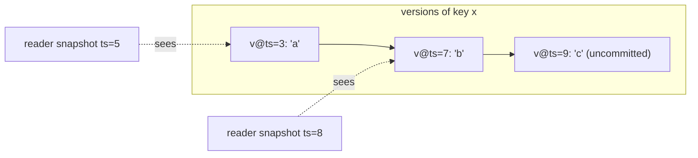

# Transactions and Isolation (ACID, anomalies, isolation levels, MVCC)

## 1. One-line summary

A **transaction** is a group of reads and writes that the system treats as one unit — all of it happens or none of it does — and the **isolation level** says how much one running transaction is allowed to see of other, unfinished transactions.

## 2. The problem it solves

Moving ₹500 from Asha to Bala is two writes: `asha -= 500`, `bala += 500`. Without transactions:

- The process crashes between the two writes → ₹500 vanishes.
- A report running at the same moment reads Asha *after* the debit and Bala *before* the credit → the bank's total looks ₹500 short.
- Two transfers read Asha's balance (₹600) at the same time, both see "enough money", both debit → balance goes negative.

Transactions fix the first problem (all-or-nothing) and isolation fixes the other two (concurrent transactions don't trip over each other). Infra analogy: a `kubectl apply` of a whole manifest that either fully rolls out or is fully rolled back — never "half the Deployments updated".

## 3. How it works

### ACID in plain words

| Letter | Means | Plain words |
|---|---|---|
| **A**tomicity | all or nothing | if anything fails, every change of the transaction is undone (**rollback**); **commit** makes them all permanent |
| **C**onsistency | invariants hold | the app's rules (balance ≥ 0, foreign keys) are true before and after; mostly *your* job, the DB helps with constraints |
| **I**solation | concurrent txns don't interfere | each transaction behaves *as if* it ran alone — to a degree chosen by the isolation level |
| **D**urability | committed = survives a crash | once commit returns, the change is on disk (see [durability-wal-and-snapshots](durability-wal-and-snapshots.md)) |

How databases implement A and D with logs is in [undo-logs-and-redo-logs](undo-logs-and-redo-logs.md).

### The anomalies (what weak isolation lets through)

💡 An **anomaly** is a result that could never happen if transactions ran one after another (**serially**).

| Anomaly | Tiny example (T1, T2 run at the same time) |
|---|---|
| **Dirty read** | T2 sets `x = 5` but hasn't committed; T1 reads `5`; T2 rolls back. T1 acted on a value that never existed. |
| **Non-repeatable read** | T1 reads `x = 1`; T2 updates `x = 2` and commits; T1 reads `x` again and gets `2` inside the same transaction. |
| **Phantom** | T1 runs `COUNT(*) WHERE status='open'` → 3; T2 inserts an open row and commits; T1 counts again → 4. A *new row* appeared, not a changed one. |
| **Lost update** | T1 and T2 both read `counter = 10`, both write `10 + 1`. Final value `11`, not `12` — one increment is lost. |
| **Write skew** | Rule: at least one doctor on call. Alice and Bob are both on call. T1 (Alice) checks "2 on call → I can leave" and removes herself; T2 (Bob) does the same check on the same snapshot and removes himself. Each wrote a *different* row, so nothing conflicted, yet now 0 doctors are on call. |

### Isolation levels (SQL standard names, weakest → strongest)

| Level | Prevents | Still allows |
|---|---|---|
| Read uncommitted | (almost nothing) | dirty reads and everything below |
| **Read committed** | dirty reads | non-repeatable reads, phantoms, lost updates, write skew |
| **Repeatable read** | + non-repeatable reads | phantoms (by the standard), write skew |
| **Snapshot isolation** | reads come from one snapshot taken at txn start; lost updates detected ("first committer wins") | **write skew** |
| **Serializable** | everything: result equals *some* serial order | — (cost: blocking or aborts that the app must retry) |

What real databases default to:

- **PostgreSQL**: *Read Committed*. Its "Repeatable Read" is actually snapshot isolation (no phantoms, but write skew possible); "Serializable" is **SSI** (Serializable Snapshot Isolation: snapshot isolation plus tracking of read/write dependencies, aborting a transaction that would break serial order). See [PostgreSQL](../../HLD/technologies/postgresql.md).
- **MySQL InnoDB**: *Repeatable Read*, using snapshot reads plus **gap locks** (locks on the space *between* index entries so no one can insert a phantom row there) for locking reads.
- **Oracle**: Read Committed; its "Serializable" is snapshot isolation.

### Two ways to implement isolation: locking vs MVCC

💡 **Two-phase locking (2PL)**: a transaction takes a shared lock to read a row and an exclusive lock to write it, and releases nothing until commit. Readers block writers and writers block readers. Correct, but slow under contention and prone to deadlocks ([deadlocks-and-lock-ordering](deadlocks-and-lock-ordering.md)).

💡 **MVCC (multi-version concurrency control)**: every write creates a **new version** of the row tagged with the writing transaction's id/timestamp, instead of overwriting. A reader picks a **snapshot** ("everything committed before time T") and sees only versions visible at T. **Readers never block writers and writers never block readers.** Writers on the *same* row still conflict. Old versions are garbage-collected later (Postgres `VACUUM`, InnoDB purge).



A tiny MVCC store (single-threaded, to show the visibility rule only):

```java
import java.util.*;

record Version(long commitTs, String value) {}          // value == null means "deleted"

final class MvccStore {
    private final Map<String, List<Version>> versions = new HashMap<>();
    private long clock = 0;                               // logical commit timestamp

    long beginSnapshot() { return clock; }                // "see everything committed so far"

    String read(String key, long snapshotTs) {
        List<Version> vs = versions.getOrDefault(key, List.of());
        for (int i = vs.size() - 1; i >= 0; i--)          // newest → oldest
            if (vs.get(i).commitTs() <= snapshotTs) return vs.get(i).value();
        return null;
    }

    void commit(Map<String, String> writes) {             // all writes get the same timestamp
        long ts = ++clock;
        writes.forEach((k, v) -> versions.computeIfAbsent(k, x -> new ArrayList<>()).add(new Version(ts, v)));
    }
}
```

In JDBC you pick the level per connection:

```java
conn.setAutoCommit(false);                                     // start an explicit transaction
conn.setTransactionIsolation(Connection.TRANSACTION_REPEATABLE_READ);
// ... statements ...
conn.commit();                                                 // or conn.rollback()
```

### Redis MULTI/EXEC is NOT a rollback-able transaction

This trips up many candidates. In [Redis](../../HLD/technologies/redis.md):

- `MULTI` starts **queuing** commands; nothing runs yet. `EXEC` runs the whole queue **back-to-back** on Redis's single command thread, so no other client's command interleaves (that's the isolation you get).
- If a queued command **fails at run time** (e.g. `INCR` on a string), the *other* commands still run. **There is no rollback.** Only errors detected while queuing (unknown command, wrong number of args) make `EXEC` abort the whole batch.
- `DISCARD` just throws the queue away before `EXEC`.
- `WATCH key` adds **optimistic concurrency**: if a watched key changed before `EXEC`, the whole `EXEC` returns null and you retry (see [optimistic-vs-pessimistic-locking](optimistic-vs-pessimistic-locking.md)).
- Reads inside `MULTI` return `QUEUED`, not values — you can't branch on them; read before `MULTI` (with `WATCH`) or use a Lua script.

The kv-store interview's `BEGIN/ROLLBACK/COMMIT` is deliberately *stronger*: changes apply immediately, are visible to the same session, and `ROLLBACK` really undoes them.

## 4. When to use it

- Any multi-step change that must be all-or-nothing (transfers, booking a seat + creating an order).
- Read Committed for most OLTP (short user-facing transactions) code; add `SELECT ... FOR UPDATE` or an atomic `UPDATE ... SET x = x + 1` where you read-then-write.
- Serializable when invariants span rows (write skew risk: on-call rotas, "max 10 bookings per user") and you can retry on abort.
- MVCC when reads are heavy and must not wait for writers (reports, analytics on live data).

## 5. When NOT to use it

- **Long transactions** (minutes) — they hold locks or pin old MVCC versions, so the DB bloats and others block. Keep transactions short, never wait on a user or an HTTP call inside one.
- **Across services** — a DB transaction can't span two microservices' databases; use a saga ([sagas-and-distributed-transactions](../../HLD/concepts/sagas-and-distributed-transactions.md)).
- **Serializable everywhere "to be safe"** — throughput drops and every caller needs retry logic.
- **Redis MULTI as if it were SQL BEGIN** — it won't undo a half-applied batch.

## 6. Commonly confused with

| | Locking (2PL) | MVCC / snapshot |
|---|---|---|
| Readers vs writers | block each other | never block each other |
| Writer vs writer on same row | block | block or abort (first committer wins) |
| Storage | one version | many versions + garbage collection |
| Write skew | prevented (under serializable) | possible unless SSI |

| | SQL transaction | Redis `MULTI/EXEC` | kv-store `BEGIN/COMMIT` |
|---|---|---|---|
| Rollback on error | yes | **no** | yes (`ROLLBACK`) |
| See own writes before commit | yes | no (replies are `QUEUED`) | yes |
| Nested | savepoints | no | yes (stack of undo logs) |

Also: **C in ACID ≠ C in CAP.** ACID consistency = "app invariants hold"; CAP consistency = "all replicas agree" ([cap-and-consistency](../../HLD/concepts/cap-and-consistency.md)).

## 7. Common mistakes / misuse

1. Read-modify-write in application code under Read Committed (`read balance → compute → write`) → lost updates. Use an atomic update, `FOR UPDATE`, or optimistic version checks.
2. Assuming "Repeatable Read" means the same thing in Postgres and MySQL.
3. Believing snapshot isolation is serializable — write skew slips through.
4. Not retrying serialization failures (Postgres SQLSTATE `40001`).
5. Claiming Redis `MULTI/EXEC` gives atomic rollback.
6. Opening a transaction, then calling a slow external API inside it.

## 8. Interview cheat-sheet

- "ACID: all-or-nothing, invariants hold, concurrent transactions don't see each other's half-done work, and commit survives a crash."
- "The anomalies ladder is dirty read, non-repeatable read, phantom, lost update, write skew; each isolation level removes some of them."
- "Postgres defaults to Read Committed, MySQL to Repeatable Read; both use MVCC so readers see a snapshot and don't block writers."
- "Snapshot isolation still allows write skew; for cross-row invariants I'd use Serializable with retries or an explicit lock."
- "Redis MULTI/EXEC only queues and runs commands back-to-back — no rollback — so my kv-store's ROLLBACK needs an undo log."

## 9. Used in

- [LLD: Design an In-Memory Key-Value Store with Transactions](../interviews/kv-store/README.md) — `BEGIN/ROLLBACK/COMMIT` semantics, why Redis `MULTI/EXEC` is different, and at L6 MVCC snapshots and isolation levels for multi-client sessions.
- [Payment system (HLD)](../../HLD/interviews/payment-system/README.md): "check balance, then debit" for payouts under row locks or SERIALIZABLE (L5 §3.6).
- Related: [undo-logs-and-redo-logs](undo-logs-and-redo-logs.md), [durability-wal-and-snapshots](durability-wal-and-snapshots.md), [optimistic-vs-pessimistic-locking](optimistic-vs-pessimistic-locking.md), [single-writer-principle](single-writer-principle.md), [thread-safety-basics](thread-safety-basics.md).
