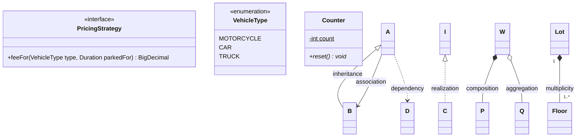
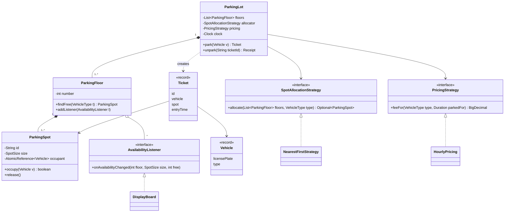

# UML Class Diagrams (read and draw them fast)

## 1. One-line summary

A UML class diagram is a box-and-arrow picture of **classes, their key fields/methods, and how they relate** (inherits, implements, owns, uses); in an LLD interview it's the 5-minute sketch that shows your design before you write code.

## 2. The problem it solves

Describing a design in words — "the lot has floors, each floor has spots, the lot uses a pricing strategy which has three implementations..." — loses the interviewer by the third clause. Jumping straight into code hides structure behind syntax. A diagram is the architecture diagram of LLD: like a box diagram of ingress → service → pods → DB, it lets both sides agree on the shape *before* debating details, and makes missing pieces obvious ("who creates tickets?").

UML (Unified Modeling Language) has many diagram types; for interviews you only need class diagrams (this page) and occasionally sequence diagrams.

## 3. How it works

### A class box

```
+------------------------------+
| ParkingSpot                  |   name (<<interface>>, <<enum>>, <<record>> as stereotypes)
+------------------------------+
| - id: String                 |   fields:   visibility name: Type
| - size: SpotSize             |
+------------------------------+
| + tryOccupy(): boolean       |   methods:  visibility name(params): ReturnType
| + release(): void            |
+------------------------------+
```

Visibility: `+` public, `-` private, `#` protected, `~` package-private. Static members are underlined (Mermaid: `$` suffix); abstract ones italic (Mermaid: `*` suffix).

### The six relationships

| Relationship | Meaning | UML arrow | Mermaid | Parking example |
|---|---|---|---|---|
| Inheritance (generalization) | is-a (`extends`) | solid line, hollow triangle | `Parent <\|-- Child` | (rare here) `AbstractPricing <\|-- HourlyPricing` |
| Realization | implements an interface | dashed line, hollow triangle | `Interface <\|.. Impl` | `PricingStrategy <\|.. HourlyPricing` |
| Composition | owns; part dies with whole | solid line, filled diamond at owner | `Whole *-- Part` | `ParkingFloor *-- ParkingSpot` |
| Aggregation | has; part can live alone | solid line, hollow diamond at owner | `Whole o-- Part` | `ParkingLot o-- DisplayBoard` |
| Association | knows about / holds a reference | solid line (arrow = navigable direction) | `A --> B` | `Ticket --> ParkingSpot` |
| Dependency | uses temporarily (param, local, creates) | dashed arrow | `A ..> B` | `ParkingLot ..> Receipt : creates` |

Quick test: **would the part be deleted with the whole?** Yes → composition. **Is it a field?** Association/aggregation. **Only a parameter or return type?** Dependency.

### Multiplicity

Written at the ends of a line: `1`, `0..1`, `*` (many), `1..*` (at least one), `n` exact. `ParkingLot "1" *-- "1..*" ParkingFloor` reads "a lot has one or more floors; each floor belongs to exactly one lot".

### Mermaid classDiagram cheat sheet

````

````

Gotchas: generics use tildes (`List~ParkingSpot~`), not `<>`; labels after ` : `; one relationship per line; `%%` starts a comment and must be on its own line.

### Worked example — parking lot in one diagram



### Draw it in 5 minutes

1. **Minute 1:** boxes for the core entities only (lot, floor, spot), with composition diamonds and multiplicity.
2. **Minute 2:** values (vehicle, ticket, receipt) as `<<record>>` boxes, enums as `<<enumeration>>`.
3. **Minute 3:** interfaces for what varies (pricing, allocation, listeners) with one or two implementations each.
4. **Minute 4:** only the **public** methods that serve the use cases (`park`, `unpark`, `tryOccupy`). Skip getters/setters and private helpers.
5. **Minute 5:** walk one use case across the diagram out loud ("gate calls `park` → allocator picks a spot → `tryOccupy` → ticket created → floor notifies boards"). Missing arrows show up immediately.

## 4. When to use it

- Every LLD interview, after clarifying requirements and listing entities (see [oop-modeling](oop-modeling.md)), before code.
- Design docs and PR descriptions for a new module.
- Reading unfamiliar code: sketching the class diagram of a library is a fast way to learn it.

## 5. When NOT to use it

- **Exhaustive UML** with every field, getter and private method — noise; the interviewer wants structure.
- **To show runtime flow** — that's a sequence diagram (who calls whom, in what order); class diagrams are static.
- **Perfect arrow pedantry over progress.** If unsure aggregation vs composition, draw a plain association and say what you mean; nobody fails for a hollow diamond.
- **HLD** — services and data stores go in architecture/flow diagrams, not class diagrams.

## 6. Commonly confused with

| | Composition | Aggregation | Association | Dependency |
|---|---|---|---|---|
| Lifetime | part dies with whole | independent | independent | n/a |
| Ownership | exclusive | shared possible | none | none |
| In code | field, created inside owner | field, passed in | field | parameter / local / return |
| Example | floor → spots | lot → display boards | ticket → spot | lot ..> receipt |

| | Class diagram | Sequence diagram | ER diagram |
|---|---|---|---|
| Shows | static structure | calls over time | tables and keys |
| Use for | LLD structure | one use case's flow | database schema |

## 7. Common mistakes / misuse

1. Arrowhead on the wrong end: the triangle points **to the parent/interface**, the diamond sits **at the owner**.
2. Inheritance arrows for has-a relationships (`ParkingLot <|-- ParkingFloor`).
3. Drawing every class in the system, including DTOs and utility helpers.
4. Methods with no types, or getters/setters listed for every field.
5. No multiplicity on key associations — "one lot, many floors" is a requirement you should show.
6. Diagram and code drifting apart — if you rename in code, rename in the diagram.
7. Mermaid syntax slips: `List<Spot>` instead of `List~Spot~`, two relations on one line.

## 8. Interview cheat-sheet

- "Let me sketch the classes first: lot, floors, spots with composition, then the values and the strategy interfaces."
- "Filled diamond: the floor owns its spots; hollow triangle with dashes: `HourlyPricing` implements `PricingStrategy`."
- "One lot has one-or-more floors, each floor one-or-more spots — I'll mark multiplicity."
- "I'm showing only the public methods the use cases need; I'll fill in internals as we go."
- "Let me trace `park()` across the diagram to check nothing is missing."

## 9. Used in

- [LLD: Design a Parking Lot](../interviews/parking-lot/README.md) — class diagram of lot, floors, spots, strategies and observers.
- [LLD: Design a Rate Limiter](../interviews/rate-limiter/README.md) — limiter interface and implementations.
- [LLD: Design an Elevator System](../interviews/elevator-system/README.md) — class diagram of `ElevatorSystem`, `Elevator`, selection strategies, commands and listeners.
- Related: [oop-modeling](oop-modeling.md), [design-patterns](design-patterns.md).
