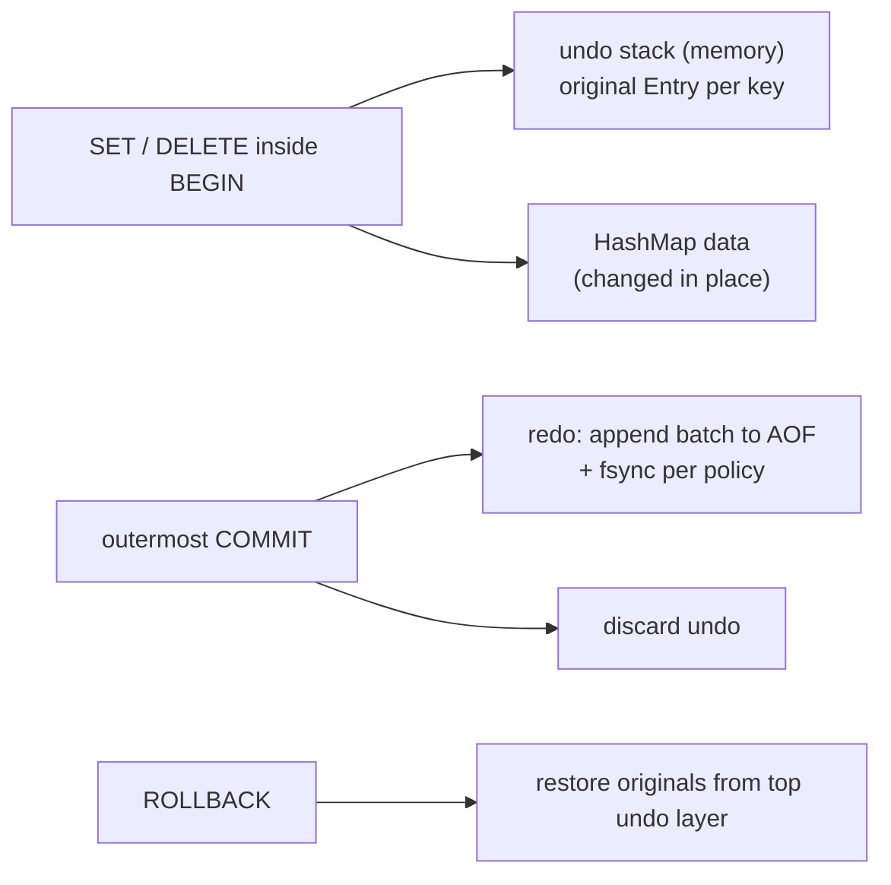

# Undo Logs and Redo Logs (rollback, crash recovery, nested transactions)

## 1. One-line summary

An **undo log** records the **old** value of everything a transaction changes so you can put it back (rollback); a **redo log** (a.k.a. **WAL**, write-ahead log) records the **new** values so you can re-apply them after a crash (durability) — most databases keep both.

## 2. The problem it solves

You change data in place: `SET a 10` overwrites `a = 5`. Two questions follow:

1. **"Undo that."** The user types `ROLLBACK`. The `5` is gone — you overwrote it. → You needed to save the *before* value: **undo log**.
2. **"The power went out."** Memory is wiped. Which committed changes made it? → You needed a durable record of the *after* values, written *before* you told the client "OK": **redo log**.

Infra analogy: undo is like keeping the previous Helm release so `helm rollback` works; redo is like the audit log of every `kubectl apply` that lets you rebuild a cluster from scratch by re-applying them in order.

## 3. How it works

### Undo vs redo side by side

| | Undo log | Redo log / WAL |
|---|---|---|
| Records | old value (**before-image**) | new value (**after-image**) or the command |
| Answers | "how do I go back?" | "how do I get forward again after a crash?" |
| Used for | `ROLLBACK`, aborting after an error, MVCC old versions (InnoDB) | crash recovery, replication (ship the log to replicas) |
| Lives | memory (our kv-store) or disk (InnoDB) | disk, append-only, fsync'd ([durability-wal-and-snapshots](durability-wal-and-snapshots.md)) |
| Thrown away | when the transaction ends | after a checkpoint/snapshot makes it unnecessary |

💡 **WAL rule** ("write-ahead"): the log record describing a change must reach disk **before** the changed data page does, and before the commit is acknowledged. Then any crash can be repaired from the log.

### How real databases combine them

💡 **Buffer pool**: the database's own in-memory cache of disk pages (fixed-size blocks, e.g. 8–16 KB). Changes go to the page in memory first; the page is written to disk later.

- **MySQL InnoDB**: *redo log* for durability (committed changes are replayed after a crash even if their pages weren't flushed), plus *undo logs* that hold before-images. Undo serves two jobs: rolling back aborted transactions, and **MVCC** — a reader with an old snapshot rebuilds the old row version by applying undo records. A background *purge* thread deletes undo no snapshot needs.
- **PostgreSQL**: **WAL only (redo)**, no undo log. Instead, an `UPDATE` writes a **new row version** next to the old one in the table itself (MVCC, see [transactions-and-isolation](transactions-and-isolation.md)). An aborted transaction's versions are simply marked invisible; `VACUUM` later reclaims them.
- **Redis AOF**: redo-only. It never needs undo because `MULTI/EXEC` never rolls back.

💡 Why both? Classic recovery theory (ARIES) names two policies: **steal** — the buffer pool may write an *uncommitted* page to disk to free memory → after a crash you need **undo** to remove it; **no-force** — commit does *not* wait for data pages to be written → you need **redo** to restore them. Steal + no-force is fastest, so big databases keep both logs.

### Our kv-store: undo in memory, redo on disk



Only **committed** changes are written to the append-only file, so the on-disk log never contains uncommitted data and recovery never needs undo — the same "redo-only" trick as Redis and Postgres.

### Nested transactions = a stack of undo logs

Each `BEGIN` pushes a fresh undo layer: a map `key → original Entry` (or "absent"). The rule: record a key's original **only the first time** this layer touches it — later writes in the same layer would otherwise overwrite the true original.

- `ROLLBACK` pops the top layer and restores each key's original (deletes keys that were absent).
- `COMMIT` of a **nested** layer pops it and **merges into the parent**: for each key, `parent.putIfAbsent(key, original)`. If the parent already had an original for that key, the parent's is **older**, so it wins. Now a later `ROLLBACK` of the parent undoes the child's changes too.
- `COMMIT` of the **outermost** layer: changes become permanent; drop the undo info (and write the redo batch).

```java
import java.util.*;

record Entry(String value, long expiresAtMillis) {}

final class TxStore {
    private final Map<String, Entry> data = new HashMap<>();
    private final Deque<Map<String, Optional<Entry>>> undo = new ArrayDeque<>(); // top = innermost

    void begin()                  { undo.push(new HashMap<>()); }
    void set(String k, String v)  { remember(k); data.put(k, new Entry(v, Long.MAX_VALUE)); }
    void delete(String k)         { remember(k); data.remove(k); }
    String get(String k)          { Entry e = data.get(k); return e == null ? null : e.value(); }

    private void remember(String k) {                        // first touch in this layer only
        var top = undo.peek();
        if (top != null && !top.containsKey(k)) top.put(k, Optional.ofNullable(data.get(k)));
    }

    boolean rollback() {
        var top = undo.poll();
        if (top == null) return false;                       // "NO TRANSACTION"
        top.forEach((k, old) -> old.ifPresentOrElse(e -> data.put(k, e), () -> data.remove(k)));
        return true;
    }

    boolean commit() {
        var top = undo.poll();
        if (top == null) return false;
        var parent = undo.peek();
        if (parent != null) top.forEach(parent::putIfAbsent); // parent's older original wins
        return true;                                          // outermost: undo info just dropped
    }
}
```

💡 `Optional<Entry>` distinguishes "key had value X" from "key did not exist" — a plain `null` value in a `HashMap` would be ambiguous with "not recorded". A secondary index (like a value → count map for `COUNT`) must be updated on every restore too, or it drifts.

SQL has the same thing under another name: **savepoints** — `SAVEPOINT s1; ... ROLLBACK TO SAVEPOINT s1; RELEASE SAVEPOINT s1;` — a named marker inside one transaction you can roll back to.

### The alternative: copy-on-write snapshots

💡 **Copy-on-write**: instead of logging changes, copy the state when a transaction starts and work on the copy (or keep the copy as the "restore point").

| | Undo log stack | Copy whole map on `BEGIN` |
|---|---|---|
| `BEGIN` cost | O(1) | **O(n)** — n = all keys in the store |
| Write cost | O(1) extra | O(1) |
| `ROLLBACK` | O(keys touched) | O(1) — swap the copy back |
| Memory | O(keys touched) | **O(n × nesting depth)** |
| Simplicity | needs the first-touch rule | trivially correct |

With 1M keys at ~100 bytes each, every `BEGIN` copies ~100 MB (1,000,000 × 100 B). That's why the naive copy is great as a **test oracle** (a property test runs random commands against both and compares) but not as the real implementation. Production systems that want cheap snapshots use **persistent data structures** (immutable trees that share unchanged parts, so a "copy" costs O(log n) per write) or OS-level copy-on-write (Redis forks a child process for RDB snapshots; the kernel copies only pages that change).

## 4. When to use it

- **Undo log**: in-place updates that must be reversible — `ROLLBACK`, savepoints, editor undo, "compensate on error" inside one process.
- **Redo log / WAL**: any state that must survive a crash, and replication (replicas replay the leader's log).
- **Both**: a storage engine that flushes pages lazily and supports long transactions.

## 5. When NOT to use it

- **Undo log for cross-service rollback** — another service's database isn't yours to restore; use compensating actions ([sagas-and-distributed-transactions](../../HLD/concepts/sagas-and-distributed-transactions.md)).
- **Undo when the data is already immutable** (event-sourced ledger, MVCC versions) — just discard or ignore the new versions.
- **A redo log for a pure cache** — if it can be rebuilt from the source of truth, durability is wasted fsyncs.
- **Copy-on-write of a huge mutable map** for every transaction — O(n) per `BEGIN`.

## 6. Commonly confused with

| | Undo log | Redo log | Event-sourcing ledger |
|---|---|---|---|
| Purpose | go back | go forward after crash | the source of truth itself |
| Kept forever? | no | no (until snapshot) | yes |
| Contains | before-images | after-images | business facts |

See [ledgers-and-event-sourcing](ledgers-and-event-sourcing.md): a ledger is a redo log promoted to "the truth", kept forever. Also: **Memento pattern** ([design-patterns](design-patterns.md)) = save an object's state to restore later; an undo layer is a memento of only the keys touched.

## 7. Common mistakes / misuse

1. Recording the original on **every** write instead of the first → rollback restores an intermediate value.
2. Nested commit that **overwrites** the parent's originals with the child's → the parent's rollback stops at the child's start state.
3. Forgetting "key was absent" → rollback leaves a key that should be deleted.
4. Updating the main map on rollback but not secondary indexes (counts, TTL info).
5. Writing uncommitted changes to the WAL without an abort marker → recovery replays a rolled-back transaction.
6. Saying "Postgres uses an undo log" — it uses WAL + multi-version rows.

## 8. Interview cheat-sheet

- "Undo records old values so I can roll back; redo records new values so I can recover after a crash. InnoDB uses both; Postgres uses WAL plus row versions."
- "Nested transactions are a stack of undo maps; each layer saves a key's original only on first touch."
- "Nested COMMIT merges the child's undo into the parent with putIfAbsent, so the parent's older original wins."
- "Only committed batches go to the append-only file, so recovery is redo-only."
- "Copying the whole map on BEGIN is O(n) per BEGIN — I keep it as the oracle in a property test."

## 9. Used in

- [LLD: Design an In-Memory Key-Value Store with Transactions](../interviews/kv-store/README.md) — stack of undo logs for nested `BEGIN/ROLLBACK/COMMIT`, merge-on-nested-commit rule, AOF as the redo log, copy-on-`BEGIN` model as test oracle.
- Related: [transactions-and-isolation](transactions-and-isolation.md), [durability-wal-and-snapshots](durability-wal-and-snapshots.md), [ledgers-and-event-sourcing](ledgers-and-event-sourcing.md), [HLD: PostgreSQL](../../HLD/technologies/postgresql.md), [HLD: Redis](../../HLD/technologies/redis.md).
