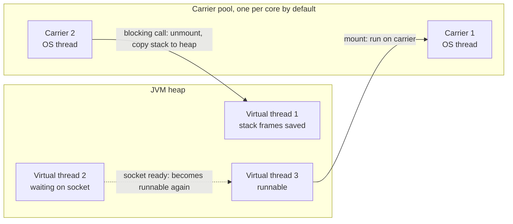

# Virtual Threads (Java 21)

## 1. One-line summary

**Virtual threads** (JEP 444, final in Java 21) are `java.lang.Thread`s managed by the JVM instead of the OS: they cost a few hundred bytes to a few KB, so you can have **millions**, and when one blocks on IO, `sleep` or a lock, the JVM **unmounts** it and reuses the underlying OS thread for another; so plain blocking code scales like async code, but they **don't make the CPU, the database or downstream APIs any bigger**, so you still limit concurrency with connection pools and semaphores.

💡 A **platform thread** is the classic Java thread: a thin wrapper around one **OS thread**, which the kernel schedules and which reserves ~1 MB of stack memory by default. A **carrier thread** is a platform thread that a virtual thread runs *on* while it's executing.

---

## 2. The problem it solves

**The pain:** a typical Spring MVC service handles each request on one thread, and each request mostly **waits**: 5 ms of CPU, 95 ms waiting on the database and an HTTP call. At 2,000 req/s, Little's law says ([resource pools and sizing](resource-pools-and-sizing.md)):

```
threads busy = 2,000 req/s × 0.100 s = 200 threads
at 10,000 req/s, or if the downstream slows to 1 s: 10,000 × 1 s = 10,000 threads
10,000 platform threads × ~1 MB reserved stack ≈ 10 GB of address space, plus OS scheduling overhead
```

The usual escapes were painful: cap the pool (Tomcat's default max is 200 threads) and let requests queue, or rewrite everything as async/reactive (`CompletableFuture` chains, WebFlux) where stack traces, debugging, `ThreadLocal`s and try/catch all get harder ([CompletableFuture](../libraries/java/completablefuture.md)).

**The fix:** keep writing simple blocking code, one thread per request, but make threads so cheap that "one per request" (or one per task) is fine.

> Infra analogy: platform threads are like VMs: heavy, you plan capacity in dozens. Virtual threads are like containers sharing a few nodes: the scheduler (kubelet ↔ JVM) packs many onto a few real workers (nodes ↔ carrier threads), and an idle one costs almost nothing.

---

## 3. How it works

### 3.1 Mounting and unmounting



- The JVM schedules virtual threads onto a small `ForkJoinPool` of carriers; by default, **as many carriers as CPU cores**.
- When a virtual thread hits a blocking operation that the JDK has made virtual-thread-aware (socket IO, `Thread.sleep`, `BlockingQueue.take`, `ReentrantLock`, `Semaphore`...), the JVM **unmounts** it: its stack frames are kept on the heap, and the carrier picks up another runnable virtual thread. When the IO completes, the virtual thread is **remounted** (possibly on another carrier) and continues.
- To your code it's just a `Thread`: same stack traces, debugger, `try/catch`, `ThreadLocal`.

Create them with:

```java
Thread.ofVirtual().start(() -> handle(request));
Executors.newVirtualThreadPerTaskExecutor()   // a new virtual thread per submitted task
```

Spring Boot 3.2+ switches Tomcat and `@Async` to virtual threads with `spring.threads.virtual.enabled=true`.

### 3.2 Demo: 10,000 sleeping threads in about a second

Runnable with Java 21: `java VirtualThreadsDemo.java`.

```java
import java.time.Duration;
import java.util.concurrent.Executors;
import java.util.concurrent.atomic.AtomicInteger;

public class VirtualThreadsDemo {
    public static void main(String[] args) {
        AtomicInteger done = new AtomicInteger();
        long start = System.nanoTime();
        // One new virtual thread per task; close() waits for all of them
        try (var executor = Executors.newVirtualThreadPerTaskExecutor()) {
            for (int i = 0; i < 10_000; i++) {
                executor.submit(() -> {
                    Thread.sleep(Duration.ofSeconds(1));   // blocking call: frees the carrier thread
                    done.incrementAndGet();
                    return null;
                });
            }
        }
        long ms = (System.nanoTime() - start) / 1_000_000;
        System.out.printf("%d tasks, each sleeping 1 s, finished in %d ms%n", done.get(), ms);
        System.out.printf("CPU cores (default carrier threads): %d%n",
                Runtime.getRuntime().availableProcessors());
    }
}
```

Real output (4-core machine):

```
10000 tasks, each sleeping 1 s, finished in 1106 ms
CPU cores (default carrier threads): 4
```

10,000 blocking tasks on **4** OS threads in ~1.1 s. The same work on a fixed pool of 200 platform threads would take `10,000 / 200 × 1 s = 50 s`.

Virtual threads help **waiting**, not computing: 10,000 tasks each burning 1 s of CPU still take `10,000 / 4 cores = 2,500 s`.

### 3.3 Pinning: when a virtual thread can't let go of its carrier

A virtual thread is **pinned** when it blocks but can't unmount, so its carrier OS thread blocks too. With only one carrier per core, a few pinned threads can stall the whole application. In Java 21 this happens when blocking:

1. **inside a `synchronized` block or method** (the monitor was tied to the carrier thread), and
2. **inside a native method or foreign function call** (C code frames can't be moved to the heap).

Runnable demo on Java 21 (`java PinningDemo.java`): 16 tasks on 4 carriers, each blocking 500 ms while holding a lock no one else wants.

```java
import java.util.concurrent.Executors;
import java.util.concurrent.locks.ReentrantLock;

public class PinningDemo {
    public static void main(String[] args) {
        int tasks = Runtime.getRuntime().availableProcessors() * 4;   // 4× more tasks than carriers
        System.out.printf("carriers: %d, tasks: %d, each blocks 500 ms%n",
                Runtime.getRuntime().availableProcessors(), tasks);
        run("synchronized  ", tasks, () -> {
            Object lock = new Object();                 // one lock per task: no contention
            synchronized (lock) { sleep(500); }         // blocking while holding a monitor
        });
        run("ReentrantLock ", tasks, () -> {
            ReentrantLock lock = new ReentrantLock();
            lock.lock();
            try { sleep(500); } finally { lock.unlock(); }
        });
    }

    static void run(String label, int tasks, Runnable body) {
        long start = System.nanoTime();
        try (var ex = Executors.newVirtualThreadPerTaskExecutor()) {
            for (int i = 0; i < tasks; i++) ex.submit(body);
        }
        System.out.printf("%s took %d ms%n", label, (System.nanoTime() - start) / 1_000_000);
    }

    static void sleep(long ms) {
        try { Thread.sleep(ms); } catch (InterruptedException e) { Thread.currentThread().interrupt(); }
    }
}
```

Real output on Java 21:

```
carriers: 4, tasks: 16, each blocks 500 ms
synchronized   took 2021 ms
ReentrantLock  took 501 ms
```

With `synchronized`, only 4 tasks can sleep at a time (`16 / 4 × 500 ms = 2,000 ms`): virtual threads degraded into a 4-thread pool. With `ReentrantLock` all 16 unmount and finish together. On Java 21–23, find pinning with the JFR event `jdk.VirtualThreadPinned` (JFR = Java Flight Recorder, the JVM's built-in low-overhead profiler/event recorder), and on hot blocking paths replace `synchronized` with `ReentrantLock` ([locks and synchronized](../libraries/java/locks-and-synchronized.md)).

**JEP 491** ("Synchronize Virtual Threads without Pinning", delivered in **JDK 24**) ties monitors to the virtual thread instead of the carrier, so virtual threads can unmount inside `synchronized`, while waiting to enter it, and in `Object.wait()`. That removes nearly all `synchronized` pinning; native frames (JNI, foreign function calls) and class initialisation can still pin. If you're on Java 21 (a long-term-support, LTS, release many teams stay on), the advice above still applies.

### 3.4 Don't pool virtual threads

A pool exists to **reuse** something expensive. Virtual threads are cheap to create and are meant to be **one per task**, then thrown away. A "pool of 100 virtual threads" is just a clumsy concurrency limit, and it leaks `ThreadLocal` state between tasks like platform pools do. If what you want is a **limit**, say so with a `Semaphore`.

### 3.5 You still need connection pools and semaphores

Virtual threads remove the *thread* limit, which used to be an accidental **protection**: with 200 Tomcat threads, at most 200 requests could hit the database at once. With virtual threads, 10,000 concurrent requests can all try. The database still runs ~2 queries per core in parallel and the payment API still allows 50 concurrent calls. So:

- Keep a **bounded connection pool** ([HikariCP](../libraries/java/hikaricp-and-jdbc-pools.md)): 10,000 virtual threads simply wait for one of its 20 connections (waiting is cheap now). Set its `connectionTimeout` sensibly.
- Use a **`Semaphore` per downstream** (a [bulkhead](../../HLD/concepts/resilience-patterns.md)) for HTTP APIs and anything without its own pool.

Runnable (`java SemaphoreDemo.java`): 100 virtual threads, a downstream that accepts 10 at once.

```java
import java.util.concurrent.Executors;
import java.util.concurrent.Semaphore;
import java.util.concurrent.atomic.AtomicInteger;

public class SemaphoreDemo {
    static final Semaphore DB_PERMITS = new Semaphore(10);   // the downstream can take 10 at once
    static final AtomicInteger inFlight = new AtomicInteger(), peak = new AtomicInteger();

    public static void main(String[] args) {
        long start = System.nanoTime();
        try (var executor = Executors.newVirtualThreadPerTaskExecutor()) {
            for (int i = 0; i < 100; i++) {
                executor.submit(() -> {
                    DB_PERMITS.acquire();                 // virtual thread parks cheaply here
                    try {
                        peak.accumulateAndGet(inFlight.incrementAndGet(), Math::max);
                        Thread.sleep(100);                // pretend: a 100 ms query
                    } finally {
                        inFlight.decrementAndGet();
                        DB_PERMITS.release();
                    }
                    return null;
                });
            }
        }
        System.out.printf("100 tasks, peak concurrency %d, took %d ms%n",
                peak.get(), (System.nanoTime() - start) / 1_000_000);
    }
}
```

Real output: `100 tasks, peak concurrency 10, took 1022 ms` (`100 / 10 × 100 ms = 1,000 ms`). The limit holds and the waiting threads cost almost nothing.

### 3.6 ThreadLocal cost

`ThreadLocal`s work on virtual threads, but each virtual thread gets its **own copy**. The old trick of caching an expensive object per thread (a `SimpleDateFormat`, a 64 KB buffer) assumed ~200 long-lived threads; with one virtual thread per request it's a fresh object per request:

```
1,000,000 concurrent virtual threads × 64 KB cached buffer = 64 GB
```

Use ThreadLocals only for small per-request context (trace ID, user), and look at **scoped values** (`ScopedValue`, preview in Java 21) for immutable context passed down a call tree. See [thread-local and context propagation](thread-local-and-context-propagation.md).

### 3.7 Structured concurrency (preview)

`StructuredTaskScope` (JEP 453, preview in Java 21; still evolving through later releases) treats a group of subtasks as one unit: fork the "fetch user" and "fetch orders" calls on virtual threads, `join()` both, and if one fails the other is cancelled automatically and nothing leaks. Think of it as `try-with-resources` for concurrent subtasks. Preview means the API may still change and needs `--enable-preview`.

---

## 4. When to use it

- Thread-per-request servers with mostly IO-bound work (Tomcat/Jetty, Spring MVC with `spring.threads.virtual.enabled`).
- Fan-out to many slow APIs, crawlers, batch jobs making lots of blocking calls.
- Replacing complex async chains where the only reason for async was the cost of threads.

## 5. When NOT to use it (and why it's a mistake)

| Situation | Why it's a mistake |
|---|---|
| CPU-bound work (encoding, hashing, number crunching) | Only N cores exist; use a fixed pool of ~N platform threads ([executors and threads](../libraries/java/executors-and-threads.md)). |
| Java 21–23 code blocking inside `synchronized` on hot paths (old drivers, libraries) | Pinning turns millions of virtual threads into a few carriers (3.3). Upgrade, switch to `ReentrantLock`, or test with JFR first. |
| As a replacement for connection pools / limits | Downstreams get flooded (3.5). |
| Pooling them | Pointless; they're meant to be disposable (3.4). |

---

## 6. Commonly confused with

| | **Platform thread pool** | **Virtual threads** | **Reactive / async (CompletableFuture, WebFlux)** | **Node event loop** |
|---|---|---|---|---|
| Code style | blocking | blocking | callbacks / chains | callbacks / `async`-`await` |
| Cost per waiting task | ~1 MB stack + OS thread | a few KB on heap | a small object | a closure |
| Max concurrent waits | hundreds to a few thousand | millions | millions | millions |
| CPU parallelism | pool size | carriers = cores | event-loop threads | 1 (plus workers) |
| Debugging | easy | easy | hard (stack traces split) | medium |

Also: **virtual threads vs green threads** (Java 1.1's old user-space threads ran on a single OS thread and were dropped early on; virtual threads run on many carriers), and **virtual threads vs coroutines** (Kotlin coroutines need `suspend` marked in code; virtual threads work with existing blocking code).

---

## 7. Common mistakes / misuse

1. **Expecting speed-ups for CPU work.** Virtual threads improve throughput for waiting, not latency or CPU.
2. **Removing all limits** and flooding your own database (a self-inflicted denial of service).
3. **Pooling** virtual threads.
4. **Heavy `ThreadLocal` caches**, multiplied by millions of threads.
5. **Ignoring pinning on Java 21** in drivers and libraries that block under `synchronized`.
6. **Long CPU loops** on virtual threads: the scheduler doesn't preempt them, so they hog a carrier.

---

## 8. Interview cheat-sheet

> "Virtual threads, final in Java 21 through JEP 444, are threads scheduled by the JVM onto a small pool of carrier threads, one per core by default. When one blocks on IO, the JVM saves its stack on the heap and reuses the carrier, so I can keep simple thread-per-request code and have tens of thousands of concurrent requests: 10,000 tasks sleeping one second finish in about a second on 4 carriers. They don't add CPU, so CPU-bound work still goes to a fixed pool sized to the cores, and they remove the accidental limit that a 200-thread pool gave us, so I keep the Hikari pool and add semaphores per downstream. I don't pool virtual threads, I limit concurrency explicitly. On Java 21 I watch for pinning, blocking inside synchronized or native code, which keeps the carrier busy; JEP 491 in Java 24 removed nearly all synchronized pinning."

---

## 9. Used in

- [Thread Pool / Connection Pool](../interviews/thread-pool/README.md): the modern alternative to a large IO-bound thread pool, why connection pools and semaphores are still needed with it, and the pinning trap.
- Related: [resource pools and sizing](resource-pools-and-sizing.md), [HikariCP and JDBC pools](../libraries/java/hikaricp-and-jdbc-pools.md), [Node worker threads and libuv pool](../libraries/js/worker-threads-and-libuv-pool.md), [executors and threads](../libraries/java/executors-and-threads.md), [locks and synchronized](../libraries/java/locks-and-synchronized.md), [thread-local and context propagation](thread-local-and-context-propagation.md), [back-pressure](back-pressure.md), [thread-safety basics](thread-safety-basics.md).
