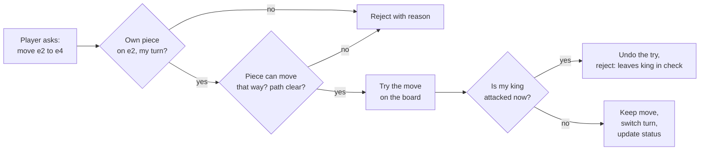

# Understand the product: a chess game

> Read this before the interview files. It explains chess **as a player experiences it**, so every rule in the design has a reason you can picture. No chess knowledge is assumed.

## 1. The problem as a short story

Asha and Ben want to play chess on a website. Each has 16 pieces on an 8x8 board and takes turns moving one piece. The goal: trap the other player's **king** so it cannot escape capture.

Without software, the two players police each other: "you can't move a bishop like that", "your king is in danger, you must deal with it", "that's the third time this position has appeared, it's a draw". Beginners get these wrong all the time. A chess program is a **referee** that knows every rule and refuses illegal moves. The interview question is: *how do you model the board and rules so the referee is correct, readable, and easy to extend?*

> 💡 **Rank and file:** columns are called *files* (`a` to `h`), rows are *ranks* (`1` to `8`). A square is a file plus a rank: `e4`. White starts on ranks 1-2, black on 7-8.

## 2. Where you have already seen it

- **Your Kubernetes admission controller**: a request (a move) arrives, a set of rules says allow or reject, and a good rejection message says *which* rule failed. Move validation is the same pipeline.
- **A config validator** that must not leave the system in a bad state: "no move may leave your own king in check" is an invariant (a rule that must always hold) checked after every change.
- **`git revert` / an undo button**: undoing a move must restore *everything*, including things that are not visible on the board.
- **Online play** on lichess.org or chess.com: the server, not your browser, decides what is legal.

## 3. The pieces and how they move

| Piece | Moves | Notes |
|---|---|---|
| King | one square any direction | may never end its turn attacked |
| Queen | any distance in a straight or diagonal line | strongest piece |
| Rook | any distance along a rank or file | |
| Bishop | any distance diagonally | stays on one square colour |
| Knight | an "L": two one way, one sideways | the only piece that **jumps** over others |
| Pawn | forward one (two from its start square); captures **diagonally** forward | moves differently from how it captures |

Every piece except the knight is **blocked** by the first piece in its path: it cannot jump over it, it stops before a friendly piece, and it may capture an enemy piece by landing on it.

## 4. Each feature, through a situation

| Situation | Rule | Leads to the interview question |
|---|---|---|
| Ben moves a bishop in a straight line. | The referee says no. | How do we represent movement rules? Class per piece, or data? (L4) |
| Asha's rook tries to go through her own pawn. | Blocked. | How do we detect obstacles on a path? (L4) |
| Ben tries to move twice in a row. | Turns alternate. | Who owns turn order: `Game` or `Board`? (L4) |
| Asha has a bishop standing between her king and Ben's rook. She moves the bishop away. | **Illegal**: that would expose her own king. A piece in that spot is *pinned*. | Pseudo-legal vs **legal** moves (L5) |
| Ben's queen attacks Asha's king. | **Check**: Asha must get out of it this turn (move the king, block, or capture the attacker). | How to detect an attack on a square (L5) |
| Asha is in check and nothing helps. | **Checkmate**: game over, Ben wins. | Game-status detection (L4 basic, L5 complete) |
| Ben's king is *not* attacked, but every move he has would put it in danger. | **Stalemate**: a draw, not a win. | Why "no legal moves" has two outcomes (L5) |
| Asha wants to tuck her king away and activate a rook. | **Castling**: king moves two squares toward a rook, the rook hops over to the king's other side. Allowed only if neither has moved yet, the squares between are empty, the king is not in check, and does not pass through or land on an attacked square. | "Has this piece moved?" needs memory; rules with many conditions (L5) |
| Ben's pawn jumps two squares and lands next to Asha's pawn. | **En passant** ("in passing"): for exactly one turn, Asha may capture it *as if it had moved only one square*. The captured pawn is **not** on the square she lands on. | A move whose capture is somewhere else; one-turn memory (L5) |
| Asha's pawn reaches the far rank. | **Promotion**: it must become a queen, rook, bishop or knight (almost always a queen). | A move with a choice attached (L5) |
| Ben plays a terrible move and wants it back (friendly game). | **Undo** (not a real chess rule, but every app has it). | Command pattern, restoring hidden state (L5) |
| Both players shuffle knights back and forth. | **Threefold repetition**: the same position three times = draw (a player claims it). | Detecting "same position" cheaply: hashing (L5) |
| 50 moves each pass with no capture and no pawn move. | **Fifty-move rule**: draw. | A counter that resets (L5) |
| Only two bare kings are left. | **Insufficient material**: nobody can win. | (L5) |
| Games are timed: 5 minutes each, +3 seconds per move. | **Clock**: run out of time and you lose. | Testable time, online play (L6) |
| Asha plays from her phone, Ben from a laptop. | Server decides what is legal; reconnecting restores the game. | Multiplayer architecture (L6) |

## 5. The key mechanism: "legal" is two questions

Most of the design hangs on one idea, shown below. First ask *"could this piece go there by its own movement rules?"* (pseudo-legal). Then ask *"after doing it, is my own king safe?"* (legal).

"Try it, look, take it back" is why **undo** is so central: the engine itself does it thousands of times per second.

## 6. Notations you will meet

- **FEN** (Forsyth-Edwards Notation): one line of text describing a position, e.g. the starting position is `rnbqkbnr/pppppppp/8/8/8/8/PPPPPPPP/RNBQKBNR w KQkq - 0 1`. Reading it: ranks 8 down to 1 separated by `/`, upper case = white, digits = empty squares, `w` = white to move, `KQkq` = who may still castle, `-` = no en-passant square, then the half-move counter (for the fifty-move rule) and the move number.
- **SAN** (Standard Algebraic Notation): how humans write moves: `e4`, `Nf3` (knight to f3), `exd5` (pawn from the e-file captures on d5), `O-O` (castle kingside), `e8=Q` (promote), `+` check, `#` checkmate.
- **PGN** (Portable Game Notation): a text file of a whole game: tags (players, date, result) plus SAN moves. Every chess site can export and import it.

## 7. Try it yourself

1. Open **lichess.org** and play a game against the computer ("Play with the computer"). Try to break the rules: drag a pinned piece, castle through an attacked square. The board refuses, which is the referee at work.
2. **Board editor** (lichess.org/editor): set up a position, then open **analysis** and look at which moves are offered. Paste the FEN `7k/5Q2/6K1/8/8/8/8/8 b - - 0 1` and you get a stalemate: black has no moves, but is not in check.
3. Lichess has a public HTTP API. For example `curl https://lichess.org/api/puzzle/daily` returns today's puzzle as JSON (documented at lichess.org/api). I could not reach lichess from the sandbox used to write this page, so I have not quoted its output: run it yourself and look at the position and the move list in the response.
4. Run the code in this folder: `./java/run.sh` prints the test list, a fool's-mate game and the perft numbers.

## 8. Experience to requirements

| Experience | Functional requirement | Non-functional requirement |
|---|---|---|
| Illegal moves are refused with a reason | Validate every move; return which rule failed | Rules are correct in all corner cases (castling, en passant) |
| Games end correctly | Detect checkmate, stalemate, draws | Same answer every time (deterministic) |
| Undo / redo | Reverse any move exactly | Undo restores hidden state (rights, counters) too |
| Notation | Read and write moves as text | Round-trips: parse(print(move)) = move |
| Timed games | Clock per player | Clock is testable without waiting |
| Online play | Server-side validation, reconnect | Cannot be cheated by a modified client |
| Save and resume | Export/import FEN and PGN | Format is standard so other tools can read it |

## 9. Mini glossary

**Attacked square**: one an enemy piece could capture on. **Check**: your king is attacked. **Checkmate**: in check with no way out. **Stalemate**: not in check but no legal move. **Pinned**: unable to move because it shields your king. **Castling rights**: whether castling is still allowed in principle (king and rook never moved). **En-passant square**: the square a pawn skipped over with its double step. **Pseudo-legal move**: follows the piece's movement rules but may leave your own king in check. **Legal move**: pseudo-legal and leaves your king safe. **Ply**: one move by one side (a "move" in chess talk is two plies). **FEN / SAN / PGN**: see section 6.

➡️ Next: [README.md](README.md)
