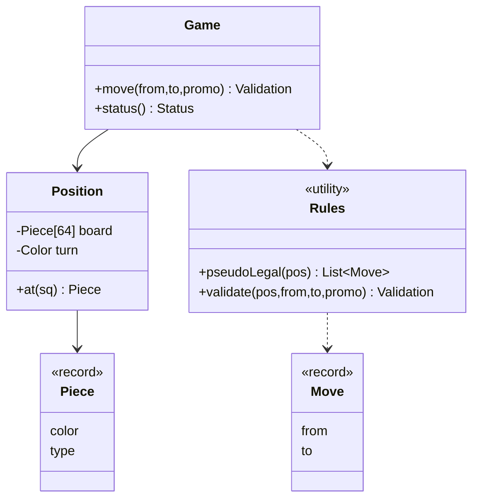

# Chess — L4 (Mid-level / SDE2) LLD Interview

> **Level expectation:** a clean object model that plays legal piece movement. Entities `Game`, `Board`, `Square`, `Piece`, `Move`, `Player`; a clear choice between **a class per piece** and **an enum plus move rules**, with the trade-off stated; sliding vs stepping pieces; **path blocking**; turn order; capture; a **validation pipeline** that returns a reason; basic game status. You are not expected to know castling/en passant details or to detect stalemate; the king-in-check rule is the L5 centrepiece, but you should notice it exists.

> 🆕 New to chess? Read [00-understand-the-product.md](00-understand-the-product.md) first.

Legend: **🧑‍💼 Interviewer** · **🧑‍💻 Candidate** · **📝 Note** = commentary for you.

---

## 1. Clarifying requirements

**🧑‍💼 Interviewer:** Design a chess game.

**🧑‍💻 Candidate:** Some questions first:
- **Two humans on one machine?** I assume two players alternate; no AI, no network yet.
- **All the rules?** Basic movement, capture, check and checkmate. May I treat castling, en passant and promotion as a later extension?
- **Undo, clocks, move history?** Later, but I'll keep the design open for them.
- **Interface?** I'll expose methods like `move(from, to)`; a UI or console sits on top.

**🧑‍💼 Interviewer:** Yes: core movement, capture, turns, check and checkmate. Special moves later. Tell me what you'd do about them.

**🧑‍💻 Candidate:**

**Functional:** start a game; each turn the player on move picks a piece and a target; the system validates and applies it; captures remove the enemy piece; the game reports its state (ongoing, check, checkmate).

**Non-functional:** illegal moves never change the board; the failure reason is reportable ("not your piece", "path blocked"); adding a rule or a special move touches few places; deterministic and easy to unit test (no UI dependency in the model).

> 📝 **Note:** Splitting out "special moves later" shows scoping judgment. The interviewer is checking that the design *can* absorb them: that is why the question about piece-vs-data below matters.

---

## 2. Core entities

**🧑‍💻 Candidate:**

| Entity | Responsibility |
|---|---|
| `Game` | Owns the board, whose turn it is, the players, the status. The only class the UI talks to |
| `Board` (we call it `Position`) | 64 squares and what stands on them |
| `Square` | A coordinate. I'd use an `int` 0..63 (a1 = 0, h8 = 63): cheap, easy to loop over, `rank*8 + file` |
| `Piece` | Colour + type. Immutable (`record Piece(Color, PieceType)`) |
| `PieceType` | `KING, QUEEN, ROOK, BISHOP, KNIGHT, PAWN` |
| `Move` | `from`, `to`, plus what the move is (normal, ...). Immutable |
| `Player` | A name and a colour. Barely behaviour yet, but a real entity: later it carries a clock and a rating |
| `Status` | `ONGOING, CHECKMATE, STALEMATE, DRAW...` |

> 💡 **Record:** a Java class whose fields are fixed at creation, with `equals`/`hashCode` generated. A piece never changes, so a record fits ([records & immutability](../../libraries/java/records-and-immutability.md)). **Enum:** a fixed set of named constants ([enums & EnumMap](../../libraries/java/enums-and-enummap.md)).

### The central design decision: class per piece, or data?

**🧑‍💼 Interviewer:** Where does "a bishop moves diagonally" live?

**🧑‍💻 Candidate:** Two options.

**A. Class hierarchy (classic OOP):**

```java
abstract class Piece { abstract List<Move> moves(Board b, int from); }
class Bishop extends Piece { ... }   // 6 subclasses
```

Reads naturally and each piece's rule is in its own file. But: pieces are *shared everywhere* (copied, compared, printed, hashed), pawns need board context (en passant) and history, and "a pawn becomes a queen" means **replacing an object of one class with another**.

**B. Enum + rules (data-driven):** `Piece` is just (colour, type). One `Rules` class has the movement logic keyed by type: steps for knight/king, rays for bishop/rook/queen, special code for pawns.

I'd pick **B**. Here's why: the six piece types differ in *data* (a list of directions, slide or step) far more than in *behaviour*; promotion becomes "change the type field"; there are no 64 object allocations per board copy; and tests need only a FEN string (a one-line board snapshot, see the glossary in 00) to build a position. The cost: `Rules` has a `switch` on type. That's acceptable because the set of piece types is **closed** (chess will never get a seventh piece); the open-closed worry ([SOLID](../../concepts/solid-principles.md)) applies to sets that grow.

> 📝 **Note:** Both answers can pass. The interviewer is looking for the *reasoning*. A candidate who says "polymorphism, because OOP" without noticing the promotion problem has memorised, not designed. Mentioning **when A wins** (variants with new piece types, like fairy chess) shows judgment; see [OOP modelling](../../concepts/oop-modeling.md).

### Sliding vs stepping

Piece movement splits into two shapes:
- **Stepping** (king, knight): a fixed list of offsets, one hop each. The knight ignores what is in between.
- **Sliding** (rook, bishop, queen): a list of *directions*; keep going until the board edge, a friendly piece (stop before it) or an enemy piece (capture it, then stop).
- **Pawn**: its own rule: forward only, two from the start rank, captures diagonally, never captures straight.

---

## 3. API

```java
public final class Game {
    Game(Player white, Player black);
    Rules.Validation move(int from, int to, PieceType promotion);  // applies if valid, otherwise says why not
    List<Move> legalMoves();
    Status status();
    Player toMove();
    boolean inCheck();
}
```

`Validation` is a record: either the `Move` to be applied or an `error` string. Returning a reason instead of throwing is deliberate: a human typing a wrong move is not exceptional, and the UI wants the text.

> 📝 **Note:** Exceptions are for "the caller broke the contract" (like asking for a move after the game ended: we throw there). Expected user mistakes are values.

---

## 4. High-level design



**Flow of one move** (the **validation pipeline**: a chain of checks, cheapest first, each with its own failure message):

1. Is there a piece on `from`? → else "there is no piece on e5".
2. Is it the mover's colour? → else "that piece belongs to the other player".
3. Can this piece type reach `to` by its movement rule, with the path clear? → else "BISHOP cannot move from c1 to c3".
4. (L5) Would my king be attacked afterwards? → else "move would leave your king in check".
5. Apply: remove any captured piece, move the piece, switch turn.
6. Recompute status.

---

## 5. Deep dives

### 5.1 Generating a piece's moves

```java
// sliding: walk each direction until blocked
for (int i = from; i < to; i++) {
    int f = file(s) + DIRS[i][0], r = rank(s) + DIRS[i][1];
    while (on(f, r)) {
        Piece t = p.at(sq(f, r));
        if (t == null) add(move);                 // empty: keep going
        else { if (t.color() != me) add(move);    // enemy: capture, then stop
               break; }                           // friend or enemy: path ends here
        f += dx; r += dy;
    }
}
```

The rook uses directions 0-3 (straight), the bishop 4-7 (diagonal), the queen all eight. **One loop serves three pieces**, which is the payoff of the data-driven choice. The knight and king use the same "offset list" idea without the `while`.

Pawn: forward one if empty; forward two if on its start rank and *both* squares are empty; diagonal forward only if an enemy stands there.

### 5.2 Board representation

A flat array of 64 (`Piece[64]`) beats an 8x8 matrix for this problem: one index, `+8` is "one rank up", off-board checks are a pair of comparisons. The trap with the flat array is wrap-around: from `h4` (31), `+1` lands on `a5`. That is why the code works with (file, rank) pairs and checks `on(f, r)` before converting to an index.

### 5.3 Turn order and applying a move

`Game` holds the turn (inside `Position`) and flips it only after a *valid* move. A rejected move changes nothing. Capture is just "whatever was on `to` is overwritten", but the L4 answer should keep the captured piece in the move record because you will need it for undo later.

### 5.4 Game status without full rules

At L4 a reasonable plan: after each move, find the opponent's king and ask "is it attacked?". If it is, it is *check*. To say *checkmate* you also need: "does the player on move have any move that leaves their king safe?" If none → checkmate (if in check) or stalemate (if not). Say this out loud even if you cannot finish coding it: it shows you know the shape of the L5 problem. The honest cost to flag: `legalMoves()` is the expensive call (up to ~40 candidates, each tried and undone), so call it once per turn, not once per UI repaint.

### 5.5 Design patterns, briefly

- **State** ([state machines](../../concepts/state-machines.md)): the game status (`ONGOING → CHECKMATE/STALEMATE/DRAW`) is a small state machine; once over, no moves are accepted.
- **Strategy** ([design patterns](../../concepts/design-patterns.md)): if you chose class-per-piece, each piece is a strategy for generating moves. With the data-driven choice, the strategy is a table of directions.
- Don't force more: no Singleton for the board, no Factory for six pieces.

---

## 6. Interviewer follow-ups / curveballs

**🧑‍💼 Interviewer:** How would you add castling?

**🧑‍💻 Candidate:** It's a king move that also moves a rook, and it needs memory: neither piece may have moved. I would *not* put a `hasMoved` flag on every piece, because the flag has to be undone with the move and copied with the board. I'd keep **castling rights** (four booleans or a 4-bit mask) on the position and clear them when the king moves, a rook moves, or a rook is captured. Then the move needs a `kind = CASTLE` so applying it also moves the rook. (L5 does this in detail.)

**🧑‍💼 Interviewer:** And a pawn reaching the last rank?

**🧑‍💻 Candidate:** The `Move` gets an optional `promotion` type, and I generate four moves (queen, rook, bishop, knight) for that pawn step. Applying it puts a new `Piece(color, promotion)` on the square. That is where the record/enum choice pays off.

**🧑‍💼 Interviewer:** Does the UI call `Game` or `Board`?

**🧑‍💻 Candidate:** `Game` only. `Position` is mutable, and if the UI could poke it, a bug could skip validation. Expose read access (`at(sq)`) and keep mutation behind `Game.move`.

**🧑‍💼 Interviewer:** How would you test it?

**🧑‍💻 Candidate:** Build positions from FEN strings and assert on the set of target squares: a knight on `b1` reaches `a3` and `c3`; a rook with a pawn in front has no forward moves; a bishop stops at the first enemy and captures it; a pawn on its start rank can go one or two squares but not through a blocker. The shipped tests do exactly this ([java/src/chess/ChessTests.java](java/src/chess/ChessTests.java)).

---

## 7. What the interviewer was evaluating

- [ ] Sensible entities with single responsibilities (`Game` vs board vs rules)
- [ ] An explicit, reasoned choice: class per piece or enum + rules, with the promotion argument
- [ ] Movement split into stepping / sliding / pawn, with path blocking and capture handled once
- [ ] Immutable `Move` and `Piece`; the mutation point is `Game`
- [ ] A validation pipeline that returns *why* a move failed
- [ ] Turn order enforced by the model, not by the UI
- [ ] Knows that "legal" also depends on the king's safety, even if coding it comes at L5
- [ ] Testable without a UI

## 8. Common mistakes at this level

| Mistake | Why it's wrong |
|---|---|
| Rules scattered in `Game`, `Board`, and each piece, with no single owner | A rule change touches many files; two places disagree |
| `hasMoved` boolean on each piece for castling | Must be saved/restored with undo and copies; castling rights belong to the position |
| Checking only the destination square, not the path | A rook "jumps" over a pawn |
| Letting a pawn capture straight ahead, or move diagonally onto an empty square | Pawn movement and capture are different |
| Forgetting that a flat-array `+1` wraps from `h` to `a` | Phantom moves across board edges |
| Throwing exceptions for every illegal move | Normal user error becomes control flow; no friendly message |
| UI mutates the board directly | Validation can be bypassed |
| Declaring checkmate whenever the king is attacked | Checkmate needs "and no legal reply" |

➡️ Next: [L5-senior.md](L5-senior.md) (legal moves, special rules, undo, draws)
