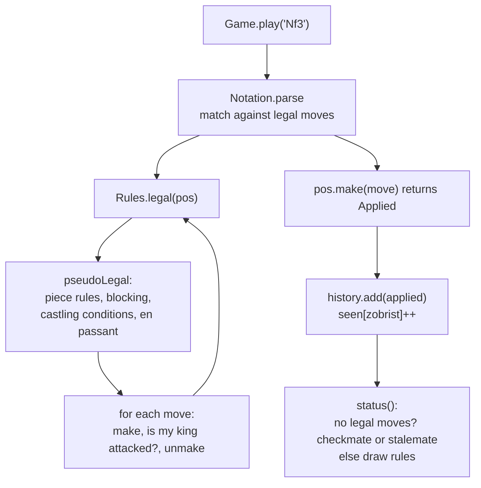

# Chess — L5 (Senior) LLD Interview

> **Level expectation:** a *correct* rules engine. You separate **pseudo-legal** from **legal** moves and implement king safety by "try, look, take back". You detect check, checkmate and stalemate; implement **castling** (all five conditions), **en passant** and **promotion**; build **undo/redo** with the **Command + Memento** idea; parse **algebraic notation**; and detect **draws** (50-move rule, threefold repetition using **Zobrist hashing**). You know which state is hidden (not visible on the board) and keep it with the position.

> 🆕 Not sure what en passant or stalemate are? [00-understand-the-product.md](00-understand-the-product.md) covers each rule with a situation. Basics (entities, enum vs class-per-piece, sliding pieces) are in [L4-mid.md](L4-mid.md).

Legend: **🧑‍💼 Interviewer** · **🧑‍💻 Candidate** · **📝 Note** = commentary for you.

---

## 1. Clarifying requirements

**🧑‍💼 Interviewer:** Take your chess design and make it a complete rules engine.

**🧑‍💻 Candidate:** Confirming scope:
- Full FIDE rules (the international federation's official rules): castling, en passant, promotion, check/checkmate/stalemate, and the automatic draws?
- Undo and redo for any number of moves?
- Text input in standard notation (`Nf3`, `O-O`, `e8=Q`) as well as coordinates?
- Is the 50-move and threefold draw *claimed* by a player, or automatic? (Real rules: claimed; I'll make them automatic and say so, since there is no UI to claim with.)

**Functional:** legal-move list for the side to move; apply a move; report status; undo/redo; parse and print algebraic notation; export a FEN snapshot and movetext.

**Non-functional:** correctness above all (verifiable against published move counts, see L6); `make`/`unmake` must be exact inverses; checking legality must be fast enough to run for every candidate move; no state hidden from the tests.

> 📝 **Note:** Asking "claimed or automatic?" signals you know the real rules. The code takes the simpler path (automatic) and documents it.

---

## 2. Core entities (what changes from L4)

| Entity | Change |
|---|---|
| `Position` | Now holds all of: board, side to move, **castling rights** (4-bit mask), **en-passant square**, **half-move clock** (plies since a capture or pawn move), full-move number |
| `Move` | Gains `promotion` and a `Kind`: `NORMAL`, `DOUBLE_PUSH`, `EN_PASSANT`, `CASTLE`. Applying needs the kind; the board squares alone are not enough |
| `Applied` (memento) | A `Move` that has been executed plus everything needed to reverse it: moved piece, captured piece, old rights, old en-passant square, old counters |
| `Rules` | `attacked`, `pseudoLegal`, `legal`, `validate` |
| `Game` | History of `Applied`, a redo stack, repetition counts |
| `Notation`, `Fen`, `Zobrist` | Text in/out, and the position fingerprint |

> 💡 **Hidden state:** things that decide what is legal but are not visible as pieces on squares: castling rights, the en-passant square, the move counters, and the history (for repetition). Two boards that look identical can differ in what moves are allowed.

---

## 3. API

```java
List<Move> Rules.pseudoLegal(Position p);     // follows piece rules; king may be left in check
List<Move> Rules.legal(Position p);           // + king safe afterwards
boolean    Rules.attacked(Position p, int sq, Color by);
Applied    Position.make(Move m);             // execute, return the memento
void       Position.unmake(Applied a);        // exact inverse
Status     Game.status();
Move       Game.play(String san);             // "Nf3", "O-O", "e8=Q", "e2e4"
boolean    Game.undo();  boolean Game.redo();
```

---

## 4. High-level design



The engine's heartbeat is **make → look → unmake**. It is used for legality, for notation (`+`/`#` suffixes), for status and for the user's undo button.

---

## 5. Deep dives

### 5.1 Legal vs pseudo-legal, and "try, look, take back"

**🧑‍💼 Interviewer:** A pinned bishop's moves are all valid for a bishop. How do you stop them?

**🧑‍💻 Candidate:** I split generation in two: **pseudo-legal** follows only the piece's movement rule. **Legal** is the subset after which the mover's king is not attacked. I get the subset by simulating:

```java
static boolean leavesKingSafe(Position p, Move m) {
    Color me = p.turn();
    Applied a = p.make(m);          // try
    boolean safe = !inCheck(p, me); // look
    p.unmake(a);                    // take back
    return safe;
}
```

This one filter covers everything at once: moving a pinned piece, moving the king onto an attacked square, ignoring a check, and the nasty en-passant case below. The alternative, special-casing pins and checks in the generator, is faster but is where the bugs live.

> 📝 **Note:** This is the single most important idea at L5. Candidates who write separate "is the piece pinned?" logic usually miss a case (discovered attacks, en passant). "Simulate and check" is correct by construction.

### 5.2 Attack detection

`attacked(pos, sq, by)` answers "could a piece of colour `by` capture on `sq`?" without generating moves: check the squares a pawn could attack from (one rank behind, diagonal), the 8 knight offsets, the 8 king-adjacent squares, and then **walk the 8 rays outward**; the first piece hit decides: an enemy queen attacks along any ray, a rook only on straight rays, a bishop only on diagonals. A friendly or any other piece blocks the ray. Pins don't matter here: a pinned piece still *gives check* (it can still capture the king; the game would just be over).

### 5.3 Check, checkmate, stalemate

```
legal = Rules.legal(pos)
if legal.isEmpty():  inCheck ? CHECKMATE : STALEMATE
```

Same condition ("no legal move"), two outcomes, decided by whether the king is attacked. Checkmate is checked first, so a checkmating move on the 100th ply beats the 50-move draw.

### 5.4 Castling

**🧑‍💼 Interviewer:** Walk me through castling.

**🧑‍💻 Candidate:** Five conditions:
1. The right is still held (king and that rook never moved; rook not captured).
2. The rook is actually on its corner (defensive check).
3. The squares between king and rook are empty.
4. The king is **not currently in check**.
5. The king does not **pass through or land on** an attacked square.

Two subtleties: (a) the final king-safety filter only sees where the king *lands*, so conditions 4 and 5 for the *passed-over* square must be checked inside move generation. (b) On the queenside the rook passes over the b-file square, which must be **empty but is allowed to be attacked**, because the king never goes there.

Rights live as a bitmask on the position, and a single lookup table updates them:

```java
castling &= ~rightsLostAt(m.from()) & ~rightsLostAt(m.to());
// e1 -> loses WK|WQ, a1 -> WQ, h1 -> WK ... (same for rank 8)
```

Using both `from` and `to` handles "king moved", "rook moved" and "rook was captured on its home square" with no special cases. Applying a castle also moves the rook (`Kind.CASTLE`; the rook's squares follow from the king's target).

### 5.5 En passant

When a pawn moves two squares, the generator records the **skipped square** as `ep`. For exactly one reply an enemy pawn diagonally next to the landing square may capture *onto the skipped square*. Three traps:

1. The captured pawn is **not** on the destination: it stands beside the capturer (`capSq = to - 8*dir`). `make` must remove it, and `unmake` must put it back there, not on `to`.
2. The right expires after one move: `ep = -1` after every move that is not a double push.
3. **The horizontal pin:** king on a5, white pawn e5, black pawn d5 just double-pushed, black rook on h5. Capturing `exd6` removes *both* pawns from rank 5 and exposes the king to the rook. A piece-by-piece pin test misses this; "make, look, unmake" catches it because `make` really removes the victim.

### 5.6 Promotion

A pawn move to the last rank produces **four** moves (queen, rook, bishop, knight) differing in `promotion`. `make` places `new Piece(color, promotion)`; `unmake` restores the pawn from the memento. The UI-style `move(from, to, null)` defaults to a queen; the parser accepts `e8=N`.

### 5.7 Undo/redo: Command + Memento

A **Command** is an action turned into an object so it can be stored, replayed and undone. A **Memento** is a saved snapshot of what a later undo needs ([Command & Memento](../../concepts/command-and-memento.md); the same machinery as [undo logs](../../concepts/undo-logs-and-redo-logs.md)). Here they merge into one record:

```java
record Applied(Move move, Piece moved, Piece captured,
               int castling, int ep, int halfmove, int fullmove) {}
```

`make(move)` returns it; `unmake(applied)` is the exact inverse. Why store the old fields instead of recomputing? Because they are *not recoverable*: once a rook has moved you cannot tell from the board that castling is gone; once a capture happened, the half-move clock was reset.

```java
public boolean undo() {
    seen.merge(hash(), -1, Integer::sum);          // un-count the repetition of the position we leave
    Applied a = history.remove(history.size() - 1);
    pos.unmake(a);
    redoStack.add(a.move());                       // redo needs only the Move; it is re-applied
    return true;
}
```

A **new** move clears the redo stack (the future is gone). **Test:** play a line containing en passant, castling, a capture and a promotion, undo all, and assert the FEN *and* the hash equal the start; redo all and assert they equal the end. FEN covers the visible and rights state; the hash covers repetition.

> 📝 **Note:** "Snapshot the whole board before each move" (full-copy memento) also works and is simpler. The delta approach is cheaper (a few ints per move instead of 64 squares) and is what an engine needs. Mention both.

### 5.8 Algebraic notation (SAN) as a subset

Don't write a grammar parser. **Generate the SAN of every legal move and compare strings.** `toSan` produces: `O-O`/`O-O-O`, piece letter (none for pawns), disambiguation, `x` for capture, destination, `=Q` for promotion, then `+` or `#`. Parsing = "which legal move prints as this text?":

```java
for (Move m : legal) if (toSan(p, m).replaceAll("[+#]+$", "").equals(s)) return m;
throw new IllegalArgumentException("no legal move matches '" + text + "'");
```

**Disambiguation:** if two same-type pieces can reach the same square, add the file (`Rad1`), else the rank (`R1d2`), else both. An ambiguous short form (`Rd1`) simply matches nothing and is rejected. Parsing by comparison is correct by construction and gives round-tripping for free.

### 5.9 Draws

**Fifty-move rule:** `halfmove` counts plies since the last capture or pawn move; at 100 (50 moves each) the game is drawn. `make` resets it on a pawn move or capture.

**Threefold repetition:** the same *position* three times. "Same position" means same pieces, same side to move, same castling rights, same en-passant possibility. Comparing positions by value each time is slow and clumsy, so we use **Zobrist hashing**:

1. Once, at start-up: give every (piece kind, square) pair a random 64-bit number (12 kinds x 64 squares), plus one for "black to move", one per castling-rights value, one per en-passant file.
2. A position's hash = XOR of the numbers for everything present. XOR (`^`) is its own inverse and order does not matter.
3. A `Map<Long,Integer>` counts how often each hash occurred; reaching 3 is a draw.

Equal positions always give equal hashes. Different positions collide with probability about 1 in 2^64 (for a casual game, ignorable; for a tournament server you may compare the FEN on a hash hit). Real engines update the hash *incrementally* (XOR out the piece leaving a square, XOR in the piece arriving) instead of recomputing; the code recomputes for clarity.

The subtle part: include the en-passant file **only if a pawn could actually capture** there, otherwise a position after a double push never "equals" its later repeat. Undo must decrement the count.

**Insufficient material:** bare kings, or king + one bishop/knight versus king, cannot checkmate: draw. (Same-coloured bishops and a few others are left out; say so.)

---

## 6. Interviewer follow-ups / curveballs

**🧑‍💼 Interviewer:** Your `legal()` is O(moves x make/unmake). Fast enough?

**🧑‍💻 Candidate:** For a human game, yes: about 30 candidates per turn. The shipped code runs ~197,000 move sequences of depth 4 in around 0.1 s. For an engine searching millions of positions I'd generate legal moves directly with pin/check masks and bitboards (an L6 topic), but I would keep this simple version as the *reference* to test the fast one against.

**🧑‍💼 Interviewer:** How do you know castling and en passant are right?

**🧑‍💻 Candidate:** Targeted tests for each rule, then **perft**: count every legal move sequence to depth N from positions whose counts are published. The tricky "Kiwipete" position, full of castling, pins and promotions, gives 48 / 2,039 / 97,862 moves at depths 1-3 (L6 explains perft).

**🧑‍💼 Interviewer:** Is the board itself thread-safe?

**🧑‍💻 Candidate:** No, and it shouldn't be: `make`/`unmake` mutate shared state. A game is a single-writer thing ([single-writer principle](../../concepts/single-writer-principle.md)): one `Game` object, moves applied one at a time. For a search that runs in parallel, give each thread its own `Position` copy.

**🧑‍💼 Interviewer:** The engine takes back a move after a promotion. What breaks if `Applied` does not store `moved`?

**🧑‍💻 Candidate:** `unmake` would find a queen on the target square and have no way to know it was a pawn. The moved piece is part of the memento for exactly that reason.

---

## 7. What the interviewer was evaluating

- [ ] Pseudo-legal vs legal separation; king safety as one filter via make/look/unmake
- [ ] Attack detection by ray-walking from the target square, not by generating all enemy moves
- [ ] Checkmate vs stalemate: same "no legal move", different king status
- [ ] All castling conditions, including *through* check and the b-file subtlety
- [ ] En passant: capture square differs from destination, one-move lifetime, the horizontal-pin case
- [ ] Promotion modelled as four moves; undo restores the pawn
- [ ] Castling rights as position state updated from `from` and `to`, not `hasMoved` flags
- [ ] Undo with Command + Memento; knows what must be stored and why it can't be recomputed
- [ ] SAN by comparing against generated legal moves; disambiguation
- [ ] Draw rules with correct counters; Zobrist hashing explained, with its collision caveat
- [ ] Tests that verify the tricky rules, not only the happy path

## 8. Common mistakes at this level

| Mistake | Why it's wrong |
|---|---|
| Checking king safety only for king moves | A pinned piece or an ignored check slips through |
| Pin detection separate from move generation | Misses discovered attacks and the en-passant horizontal pin |
| Castling checks only the destination | King may pass through an attacked square |
| Refusing queenside castling when the b-file square is attacked | The king never stands there; castling is legal |
| `hasMoved` on pieces | Not restorable by undo; rook captured on its home square is missed |
| En passant removes the piece on the destination square | The victim is beside the capturer |
| Not clearing the en-passant square after the next move | The capture stays "available" forever |
| Undo that restores the board but not rights, ep square or clocks | Silent corruption several moves later |
| Counting repetition with `ep` set even when no capture is possible | Misses real repetitions |
| Not decrementing repetition counts on undo | False draws after undo |
| Declaring a draw by 50-move before checkmate | Checkmate on the last ply wins the game |

➡️ Next: [L6-staff.md](L6-staff.md) (variants, clocks, online play, testing at scale)
