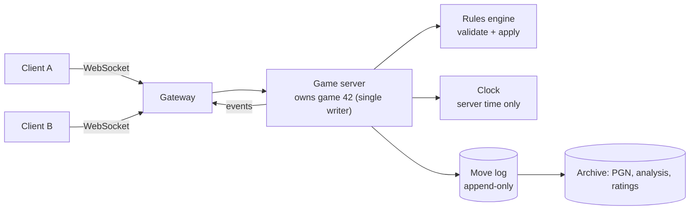

# Chess — L6 (Staff) LLD Interview

> **Level expectation:** you treat the rules engine as a **platform component**. Variants such as Chess960 are configuration, not a fork; clocks are injectable and testable; online play is **server-authoritative**, with the game as an **append-only move log**, reconnects and a cheating story; persistence uses the standard **FEN/PGN** formats with a size estimate; correctness is proven with **perft** against published numbers, plus property and mutation testing; and you can explain why real engines use **bitboards** without having to write one.

> 🆕 Start with [L4-mid.md](L4-mid.md) (model) and [L5-senior.md](L5-senior.md) (rules engine) if you haven't. Rules background: [00-understand-the-product.md](00-understand-the-product.md).

Legend: **🧑‍💼 Interviewer** · **🧑‍💻 Candidate** · **📝 Note** = commentary for you.

---

## 1. Clarifying requirements

**🧑‍💼 Interviewer:** You own the chess platform. Product wants Chess960, timed games, and online play for millions of users. What's your design?

**🧑‍💻 Candidate:**
- **Variants:** which first? Chess960 (random back rank), maybe "three-check" or "king of the hill" later? Does the UI need to know anything variant-specific?
- **Time controls:** bullet/blitz/rapid/classical, increment or delay? What is the maximum tolerated clock error?
- **Online:** real-time moves between two clients, spectators, resign/draw offers, reconnect, anti-cheat. Scale: say 5M games a day, 200k simultaneous.
- **Persistence:** keep every game forever (analysis, replays, ratings)? Export as PGN?

**Non-functional:** a move is validated on the server in well under a millisecond of CPU; clocks are authoritative on the server; no client can make an illegal move or gain time; a game survives a server crash and a reconnect; the same engine runs on the server, in tests and (compiled) on clients for instant feedback.

> 📝 **Note:** At L6 the clarifying questions are about *consequences* (time error tolerance, forever retention), not about rules. The interviewer wants to see you size and bound things.

---

## 2. Core entities and layers

| Layer | Entities | Notes |
|---|---|---|
| Rules (pure, no I/O) | `Position`, `Move`, `Rules`, `Notation`, `Fen`, `Zobrist` | The code in this folder. Deterministic, single-threaded, trivially unit-testable |
| Game session | `Game`, `ChessClock`, `Player`, draw/resign offers | One object per live game; owns move application |
| Platform | `GameService`, move log, matchmaking, `GameRepository` | I/O, concurrency, persistence |

Keeping the rules layer free of clocks, sockets and databases is the key staff-level move: it is what lets the same code run everywhere and be tested to death.

---

## 3. API (platform)

```
POST /games                       -> {gameId, color}            (from matchmaking)
WS   /games/{id}   (a WebSocket: one long-lived two-way connection, so the server can push moves)
                   client -> {type:"move", uci:"e2e4", ply:12, moveId:"..."}
                   server -> {type:"move", san:"e4", ply:12, clocks:{w:..., b:...}}
                   server -> {type:"state", fen:"...", moves:[...], clocks:{...}}   (on connect/reconnect)
GET  /games/{id}/pgn              -> PGN text
```

`ply` is the number of half-moves played so far. The client says "I am making move number 12"; the server rejects it if the game is already at ply 13. That is **optimistic concurrency** (assume no conflict, detect it by a version number and reject the loser; the same idea as a version column in SQL) and also makes retries safe: the same `(gameId, ply)` applied twice is one move ([idempotency](../../../HLD/concepts/idempotency-and-delivery-semantics.md)).

---

## 4. High-level design



All moves of one game go to **one** game server (route by `gameId` with a hash that keeps assignments stable when servers join or leave, see [sharding](../../../HLD/concepts/sharding-and-replication.md)), so applying a move needs no locks: one writer per game, many games in parallel ([single-writer principle](../../concepts/single-writer-principle.md)).

---

## 5. Deep dives

### 5.1 Variants: rules as configuration (Strategy)

**🧑‍💼 Interviewer:** Add Chess960.

**🧑‍💻 Candidate:** In Chess960 the back rank is shuffled (960 legal arrangements, with the bishops on opposite colours and the king between the rooks), but pieces move the same way. What changes:
1. **Starting position:** a different FEN. Trivial, if positions come from FEN.
2. **Castling:** king and rook can start on many squares, but they always *finish* on the same squares as in normal chess (king to `g`/`c`, rook to `f`/`d`). My engine hard-codes e1/h1/a1 in two places (`rightsLostAt` and `castles`). I would replace them with data in the position: "the king's home file and each rook's start file". The conditions are the same five, using the real squares.
3. Everything else (attacks, pins, en passant, promotion) is untouched.

So the structure is a **Strategy** ([design patterns](../../concepts/design-patterns.md)): a `Variant` object supplies the pieces that differ; the engine core never branches on "is this Chess960".

```java
interface Variant {
    Position initial(long seed);                        // standard: fixed FEN; 960: pick 1 of 960
    List<Move> castlingMoves(Position p);               // which squares king and rooks use
    Status extraTermination(Position p);                // e.g. king of the hill: king reaches the centre
    // pseudo-legal generation, attacks, make/unmake stay in the shared core
}
```

I would not make *every* rule pluggable up front. Tempting, but three variants teach you where the real seams are; one variant does not. Start with the seams that obviously differ (start position, castling, extra end conditions) and refactor when variant #3 arrives.

> 📝 **Note:** "Don't over-abstract" is a senior-to-staff signal. The interviewer will often push: "make *everything* pluggable". A good answer names the 2-3 seams and the cost of speculation. Compare [SOLID](../../concepts/solid-principles.md): open for extension *where change is expected*.

### 5.2 Clocks

A chess clock is a small state machine: *who is running, how much time each side has left, since when the running side is thinking*. The class in this folder ([ChessClock](java/src/chess/ChessClock.java)) takes a `LongSupplier` for "now in milliseconds" instead of calling the system clock:

```java
ChessClock c = new ChessClock(60_000, 2_000, () -> now[0]);   // 1 minute + 2 s per move
c.start(Color.WHITE);
now[0] = 5_000; c.press();     // white thought 5 s: left = 60 - 5 + 2 = 57 s
```

Tests then move time by assigning a variable, with no `sleep` and no flakiness ([time & Clock](../../libraries/java/time-and-clock.md)). Key rules:
- **Increment** (Fischer): added after a move. **Delay** (Bronstein/US): a grace period per move that is not consumed. Model the control as `TimeControl(initial, increment, delay)`.
- **Flagging:** a player loses when their remaining time reaches 0. Check at three moments: when their move arrives (was it before the flag?), when the *opponent* queries, and with a **server-side timer** set to fire at the exact flag time so a player who walked away is still flagged.
- **Never trust client time.** The server stamps arrival. Network lag is a fairness problem: lichess-style servers compensate by crediting a bounded amount of lag; say "a lag allowance, capped, per move" and that the policy is a product decision.
- Clocks pause while the game is waiting for a reconnect (up to a grace period), then the opponent may claim a win.

### 5.3 Online multiplayer: server-authoritative, event log

**Server-authoritative** means the server holds the real game state and runs the real rules; clients only *propose* moves. A modified client can then, at worst, have its illegal moves rejected. Clients may run the same engine locally to show legal moves instantly (the code is deterministic, so both agree), but that is a convenience, not a source of truth.

**The game is an event log.** A game is fully described by *starting position + the list of moves*; everything else (board, clocks, status, repetition counts) is a *replay*. That is the shape of [event sourcing](../../concepts/ledgers-and-event-sourcing.md): append moves, never edit. Benefits: trivial persistence, perfect replays, crash recovery by replaying, and spectators/analysis tools read the same stream.

```
event: {gameId, ply, uci, serverTimeMs, clockAfterMs}   // append-only, ply is the sequence number
```

**Reconnect:** the client sends the last `ply` it saw; the server replies with the moves after it (or a FEN + clocks snapshot if far behind), then resumes live events. Because moves carry a `ply` sequence ([ordering](../../../HLD/concepts/message-ordering-and-sequencing.md)), duplicates and gaps are detectable.

**Crash of a game server:** the log is stored durably *before* the move is acknowledged to both players; another server loads the log, replays it through `Game`, and takes over (use a **lease**, a time-limited claim of ownership that must be renewed, see [leases](../../../HLD/concepts/distributed-locks-and-leases.md), so two servers never both think they own game 42).

**Cheating, honestly:**

| Cheat | Defence |
|---|---|
| Illegal moves, forged state | Server validates everything; clients never send positions |
| Extra time / clock tampering | Server-only clock |
| Using an engine for suggestions | Cannot be prevented, only detected: statistical comparison of a player's moves with top engine moves, move-time patterns, account history, human review |
| Multi-accounting, rating manipulation | Matchmaking and rating rules, account signals |
| Disconnect-to-avoid-loss | Grace period, then forfeit; track abuse |

### 5.4 Persistence: FEN, PGN and cost

- **FEN** is the snapshot of one position (used for tests, puzzles, resuming).
- **PGN** is one game as text:

```
[White "Asha"]
[Black "Ben"]
[Result "0-1"]

1. f3 e5 2. g4 Qh4# 0-1
```

`Game.movetext()` produces the move line. Import is `Notation.parse` per move on a fresh `Game`; a PGN with an illegal move is therefore rejected, which doubles as validation.

For storage, text is wasteful. A move fits in 16 bits: 6 (from) + 6 (to) + 3 (promotion piece, 0 = none) = 15. Estimate: 5,000,000 games/day x 80 plies x 2 bytes = 800,000,000 B = 0.8 GB/day, about 290 GB/year before compression and indexes. Store `(gameId, players, result, start FEN if non-standard, moves as one binary column, time control)` in a relational or wide-column table; keep per-ply clock times separately (they compress well) if you need them. Rebuilding positions is cheap (replay 80 plies in microseconds), so don't store a position per move.

### 5.5 Testing a rules engine

1. **Rule-by-rule unit tests** from FEN positions (as in `ChessTests`): easy to read, targeted.
2. **Perft** ("performance test"): from a position, count *all* sequences of legal moves of exactly N plies. Because correct counts are published for famous positions, one wrong rule (a missing castling condition, an en passant capture that exposes the king) changes a number, and you learn *that you are wrong* without knowing where. The tests assert:

| Position | Depth 1 | 2 | 3 | 4 |
|---|---|---|---|---|
| Start | 20 | 400 | 8,902 | 197,281 |
| "Kiwipete" (castling, pins, promotions) | 48 | 2,039 | 97,862 | (4,085,603, not run in tests) |
| Endgame with en-passant pins | 14 | 191 | 2,812 | 43,238 |

The start position at depth 5 is 4,865,609, which this engine reproduces in about 0.7 s on the machine used to write this; depth 4 takes about 0.1 s, so the unit test stays fast. When a perft number is wrong, **divide**: print the count per first move, compare with a reference engine's output, descend into the move that differs.
3. **Property tests:** play random legal moves for a few hundred plies, then undo all: FEN and hash must equal the start at every step; `parse(toSan(m)) == m`; hash after a transposition (different move order, same position) is equal.
4. **Mutation checks:** deliberately break a rule and confirm a test fails. During development of this folder: dropping the king-safety filter failed 9 tests; breaking the en-passant capture square failed 4; removing the through-attack check on castling failed 2; not restoring castling rights in `unmake` failed 9. A suite that survives a mutation has a hole.
5. **Differential testing:** the day you write a fast engine (bitboards), run it against this slow reference on millions of random positions.

### 5.6 Performance: where the time goes, and bitboards

Profile shape: `legal()` makes and unmakes every candidate; each check scans for the king and walks rays. At roughly 6.6 M leaf positions per second (4,865,609 in 0.73 s, a single warm-up-free run, so treat as rough) this is plenty for a server validating one move per second per game. An **engine** (a program that searches for the best move) needs 100x-1000x more. The standard answer is a **bitboard**: a 64-bit integer with one bit per square, one integer per (colour, piece kind). "All squares white rooks attack" becomes a few shifts and ANDs on whole boards at once instead of a loop per square, and "is this square empty?" is a single bit test. Sliding pieces use lookup tables (*magic bitboards*, a hashing trick to find a rook's reachable squares in one table read). Other engine staples: incremental Zobrist hashing, and a **transposition table** (a cache keyed by Zobrist hash: "I have already evaluated this position"). None of that is needed for a server that only validates moves, which is the point to make: *match the engine to the load*.

---

## 6. Interviewer follow-ups / curveballs

**🧑‍💼 Interviewer:** Two moves arrive at the same time: Asha's move and Ben's resignation.

**🧑‍💻 Candidate:** The game server processes one event at a time per game, in arrival order, so one wins deterministically. Asha's move is applied, the resignation then ends the game (or vice versa). Both clients get the same ordered stream, so no divergence.

**🧑‍💼 Interviewer:** The server crashes between applying a move and telling the players.

**🧑‍💻 Candidate:** The log append is the commit point. If the append happened, the new server replays it and re-broadcasts the move with the same `ply`; clients ignore duplicates. If it didn't, the move was never accepted and the client's resend (same `ply`) succeeds.

**🧑‍💼 Interviewer:** How would you add "takeback" (undo) to online play?

**🧑‍💻 Candidate:** As a *request* the opponent must accept, recorded in the log as an event (`takeback accepted at ply 12`). Then the in-memory `Game.undo()` runs. Never delete log entries; a takeback is a new fact that supersedes older ones.

**🧑‍💼 Interviewer:** 200,000 simultaneous games: how many servers?

**🧑‍💻 Candidate:** Memory per game is small (a 64-slot position, a few hundred moves, clocks): well under 10 KB, so 200,000 x 10 KB = 2 GB total. CPU is tiny too: each game sees a move every ~10 s on average, so about 20,000 moves/s overall, each validated in microseconds. The limit is **connections** (200,000 x 2 players = 400,000 WebSockets), so I would size by connections, say 20k per node → about 20 gateway nodes, plus redundancy.

**🧑‍💼 Interviewer:** Where would the rules engine live: server only, or also the client?

**🧑‍💻 Candidate:** Both, same source (or a port checked by shared test vectors like perft and FEN fixtures). Client for instant legality hints and premoves, server as the only authority. The folder's `js/chess.js` is the same engine in a different language, checked by the same perft numbers.

---

## 7. What the interviewer was evaluating

- [ ] Rules engine kept pure and separate from clocks, I/O, persistence
- [ ] Variants as Strategy at the right seams (start position, castling, termination), without speculative everything-pluggable design
- [ ] Testable clock (injected time), correct increment/flag semantics, server as the only time source
- [ ] Server-authoritative design; game as append-only move log; `ply` sequence for idempotency and reconnect
- [ ] Single writer per game; failover by replaying the log with a lease
- [ ] Honest cheating analysis: what is preventable and what is only detectable
- [ ] FEN/PGN knowledge and a storage estimate with arithmetic
- [ ] Perft explained and used; property and mutation testing; differential testing of a faster engine
- [ ] Bitboards and transposition tables placed correctly: needed for engines, not for a validating server
- [ ] Sizing by the actual bottleneck (connections), not by CPU guesses

## 8. Common mistakes at this level

| Mistake | Why it's wrong |
|---|---|
| Trusting client-side validation or client clocks | Trivial to cheat |
| Clock code that calls the system time directly | Tests need `sleep`; flaky; impossible to simulate flagging |
| Everything pluggable "just in case" | Abstractions designed around one example guess the seams wrong |
| Storing positions per move, or only the final board | Costs space or loses the game; the move list is both smaller and complete |
| Mutating or deleting log entries for takeback | Loses audit and breaks replay for spectators and reconnects |
| Two servers both driving one game after a failover | Needs a lease plus a fencing token (a counter the log checks so a stale owner is refused); otherwise moves interleave |
| "We'll prevent engine cheating" | Not possible; only detection and policy |
| Reaching for bitboards for a move-validating server | Complexity with no benefit at this load |
| Declaring the engine correct after a few unit tests | Chess rules interact; perft against published numbers is the standard check |
| Treating a move and a resignation as unordered | Needs per-game serial processing so everyone sees one history |

➡️ Back to: [README.md](README.md)
