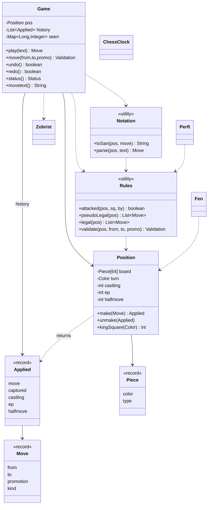

# LLD Interview: Design a Chess Game

> "Design a chess game for two players. Pieces move by their rules, you can't leave your king in check, the game ends in checkmate or a draw, and I'd like undo. Then: how would you add a clock, variants, and online play?"

A favourite because it tests **object modelling** (pieces: class hierarchy or data?) and then punishes sloppy thinking with corner cases (castling, en passant, pins). L4 is the **core model**: board, pieces, moves, turns, path blocking, a validation pipeline, basic game status. L5 is the **real rules engine**: legal vs pseudo-legal moves, check/checkmate/stalemate, castling, en passant, promotion, **undo/redo as Command + Memento**, algebraic notation, and draws (50-move rule, threefold repetition with **Zobrist hashing**). L6 is the platform: **variants** (Chess960) as configuration, **clocks**, **server-authoritative online play** with the game as an event log, **PGN/FEN** persistence, **perft** testing and performance (bitboards).

> 💡 **Terms in one line each** (details in the files):
> **Pseudo-legal move**: follows the piece's movement rule but may leave your own king in check. **Legal move**: pseudo-legal and your king is safe afterwards. **FEN**: one-line text snapshot of a position. **SAN/PGN**: human move notation / a text file of a whole game. **Command pattern**: an action as an object that knows how to do and undo itself. **Memento**: a saved snapshot used to restore earlier state. **Zobrist hash**: a 64-bit fingerprint of a position built by XOR-ing random numbers. **Perft**: counting all move sequences to a depth, to prove a move generator correct. **Bitboard**: a 64-bit integer with one bit per square.

## How to read this folder

> 👉 **Never played chess? Start with [00-understand-the-product.md](00-understand-the-product.md).** Rules are explained through situations, each tied to the interview question it creates.

| File | Level | What "good" looks like |
|---|---|---|
| [00-understand-the-product.md](00-understand-the-product.md) | Everyone, first | Know every rule and why it exists; FEN/SAN/PGN; the "two questions" behind legality |
| [L4-mid.md](L4-mid.md) | Mid / SDE2 | Entities (`Game`, `Board`, `Square`, `Piece`, `Move`, `Player`); **class-per-piece vs enum + move rules** and the trade-off; sliding vs stepping pieces; path blocking; turn order; capture; a validation pipeline with reasons; checkmate noticed as "king attacked and no escape" |
| [L5-senior.md](L5-senior.md) | Senior | Legal vs pseudo-legal; "try, look, take back"; attack detection; castling's five conditions; en passant (capture beside the target); promotion; **Command + Memento undo**; SAN parsing; 50-move rule; threefold repetition via Zobrist hashing |
| [L6-staff.md](L6-staff.md) | Staff | Rules engine as pluggable policy (Chess960, other variants); testable clocks; server-authoritative online play, move log, reconnect, cheating; FEN/PGN persistence; **perft** with published numbers; bitboards and engine performance |

## Code (runnable, no dependencies)

| | Run | Files |
|---|---|---|
| ☕ Java 21 | `./java/run.sh` | [java/src/chess/](java/src/chess/). **Model:** `Color`, `PieceType` (enum), `Piece` (record), `Sq` (square helpers), `Move` (record with `Kind`), `Applied` (move + memento), `Position` (board, rights, counters; `make`/`unmake`), `Player`, `Status`. **Rules:** `Rules` (attack detection, pseudo-legal and legal moves, validation with reasons, insufficient material). **Game:** `Game` (history, undo/redo, repetition counts, status, movetext), `Notation` (SAN/coordinate parsing and printing), `Fen`, `Zobrist`. **Extras:** `Perft`, `ChessClock`. 39 tests in `ChessTests.java`; `Demo.java` |
| 🟨 Node 22 | `cd js && node --test` | [js/chess.js](js/chess.js), [js/chess.test.js](js/chess.test.js): the same engine in one ES module (`Position`, `legalMoves`, `perft`, `Game` with undo/redo and draws; coordinate moves only, repetition key is the FEN without counters). 12 tests incl. perft |

**Design decisions in the code:** pieces are **data** (an enum plus a `Piece` record) and all movement lives in `Rules`, so a rule change touches one file. A `Position` holds everything that defines a position (pieces, side to move, castling rights, en-passant square, counters); "has this piece moved?" is stored as **rights bits** that are cleared when a king or rook moves or a rook is captured, not as a flag on each piece. `make` returns an `Applied` record (the memento) and `unmake` is its exact inverse, so the engine can try a move, look, and take it back. Legality is the filter `pseudoLegal` then `leavesKingSafe`. Castling checks the attacked-square rules inside move generation, because the final king-safety filter only sees the king's destination. Repetition uses a Zobrist hash that counts an en-passant square only if a pawn could really capture there.

**Tests:** piece moves and blocking, pins, check evasion, a validation message per failure, six castling cases, en passant (including the horizontal-pin trap), promotion, fool's mate, stalemate, threefold repetition, fifty-move rule, insufficient material, SAN disambiguation, undo/redo restoring FEN and hash through castle + en passant + capture + promotion, **perft** from the start position (depth 1-4 = 20, 400, 8,902, 197,281), the Kiwipete position (48, 2,039, 97,862) and an en-passant-pin endgame (14, 191, 2,812, 43,238), clock tests. **Mutation checks** (on copies, reverted): removing the king-safety filter fails 9 tests; breaking the en-passant capture square fails 4; removing the "passes through attack" check on castling fails 2; never clearing castling rights fails 2; not restoring castling rights in `unmake` fails 9.

Sample demo output:

```
> fool's mate: f3 e5 g4 Qh4#
Ben tries to move White's pawn g4-g5: that piece belongs to the other player
Ben tries Qd8-d4 (own pawn d7 in the way): QUEEN cannot move from d8 to d4
status: CHECKMATE   movetext: 1. f3 e5 2. g4 Qh4#
after undo: ONGOING   FEN: rnbqkbnr/pppp1ppp/8/4p3/6P1/5P2/PPPPP2P/RNBQKBNR b KQkq g3 0 2

> king steps to d2 (rook on e2 guards the whole rank): move would leave your king in check
> king captures the undefended rook: ok

> perft from the start position
  depth 3: 8,902 positions
  depth 4: 197,281 positions
```

## Class diagram (matches the code)



## Libraries & concepts used

**Java:** [Records & immutability](../../libraries/java/records-and-immutability.md) · [Enums & EnumMap](../../libraries/java/enums-and-enummap.md) · [Time & Clock](../../libraries/java/time-and-clock.md)

**Concepts:** [OOP modelling](../../concepts/oop-modeling.md) · [Design patterns](../../concepts/design-patterns.md) · [Command & Memento](../../concepts/command-and-memento.md) · [State machines](../../concepts/state-machines.md) · [SOLID principles](../../concepts/solid-principles.md) · [UML class diagrams](../../concepts/uml-class-diagrams.md) · [Undo logs & redo logs](../../concepts/undo-logs-and-redo-logs.md) · [Ledgers & event sourcing](../../concepts/ledgers-and-event-sourcing.md)

**Related (HLD):** pair: [Distributed job scheduler](../../../HLD/interviews/distributed-job-scheduler/README.md)

**Related LLD interviews:** [Text editor](../text-editor/README.md) (undo/redo with commands) · [Vending machine](../vending-machine/README.md) (state machine) · [Movie booking](../movie-booking/README.md) (validation under concurrency)

## The core insight

1. **Legal = pseudo-legal + "my king is safe afterwards".** Keep the movement rules dumb and local to each piece, and put the one global rule (king safety) in a single filter that tries the move and takes it back.
2. **Undo is a design input, not a feature.** If `make` returns exactly what `unmake` needs (captured piece, old rights, old en-passant square, old counters), the same machinery powers legality checks, the user's undo button, the search in an engine and perft testing.
3. **Hidden state is the trap.** The board alone does not define a position: castling rights, the en-passant square and the repetition history all matter. Every famous chess bug is a piece of hidden state that was forgotten.
4. **Test rules engines against published numbers.** Perft counts for known positions turn "I think it is right" into "it matches the reference to the last move".
