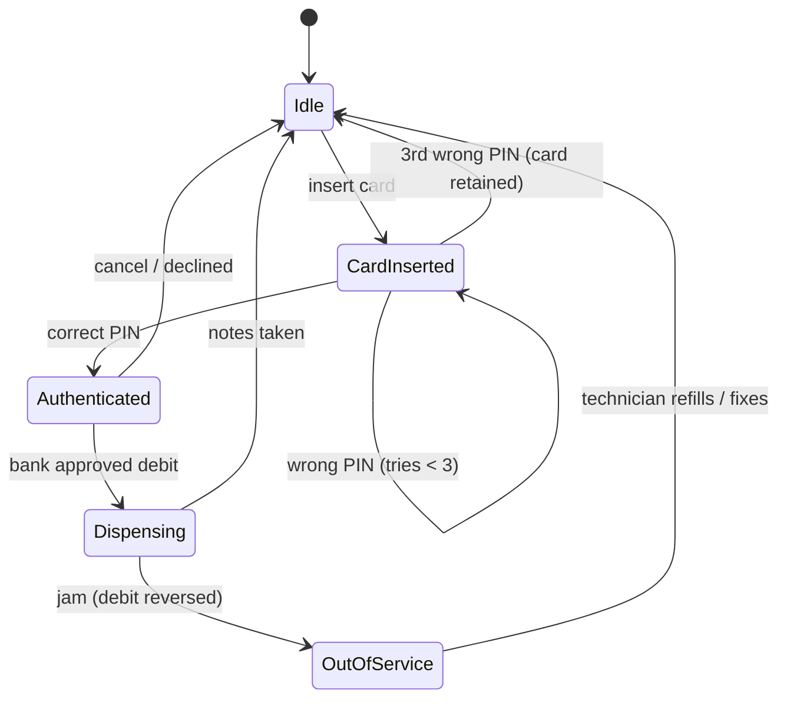
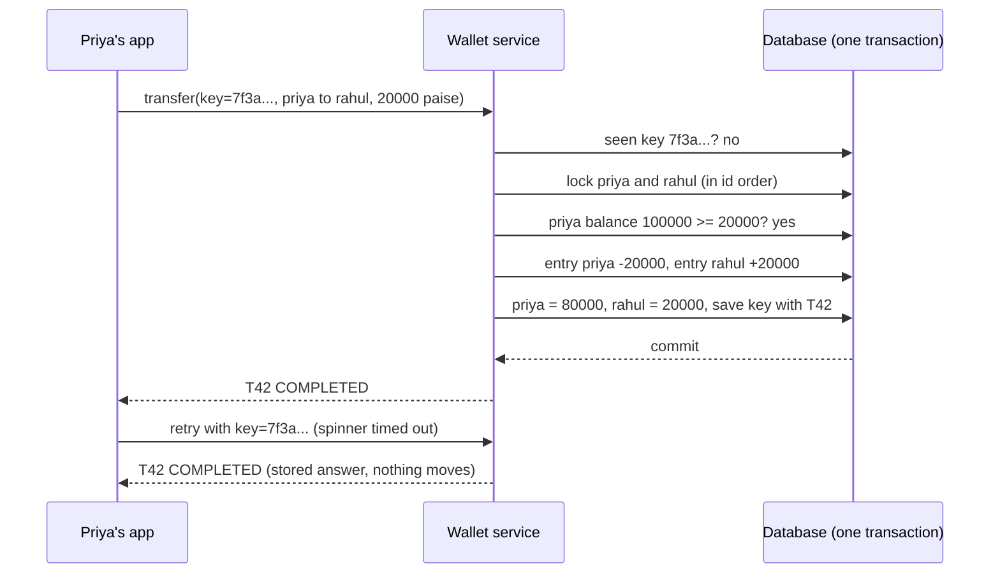

# Start Here: What Are an ATM and a Digital Wallet? (Before the Interview)

> You have used both: a cash machine outside a bank branch, and "Paytm karo" or a PhonePe wallet at a chai stall. This interview asks you to build the software behind them: an **ATM** that hands out real notes and must never lose track of money, and a **digital wallet** that moves money between people, where a retry must never charge twice.
>
> Time: ~10 minutes. Then: [L4](L4-mid.md) (ATM) → [L5](L5-senior.md) (wallet) → [L6](L6-staff.md) (production).

---

## 1. The problem as a story

### 1.1 ₹5,000 at an ATM

It's Friday night, and Ravi needs ₹5,000 for the weekend. At the ATM he:

1. **Inserts his card.** The machine reads the card number from the chip.
2. **Types his PIN** (Personal Identification Number, the 4-digit secret that proves he holds the card).
3. **Chooses "Withdrawal" and types 5000.**
4. **Hears the counting whirr, takes ten ₹500 notes**, and gets a **receipt** showing his new balance.

Four steps that hide four ways to lose money:

| What goes wrong | Who loses | What the software must do |
|---|---|---|
| The machine **debits** (takes money from) his account, then the notes **jam** inside | Ravi: ₹5,000 gone, no cash | Notice the jam and **reverse** the debit (put the money back) |
| The network drops after the bank debits but before the ATM hears "approved" | Ravi, if the ATM gives up silently; the bank, if the ATM pays out anyway on a guess | Never dispense on "maybe"; send a reversal for that exact request |
| Someone who found Ravi's card guesses PINs | Ravi | Block the card after 3 wrong tries |
| Only one ₹500 note left, lots of ₹200, no ₹100 | Nobody, but Ravi is confused | Work out a note combination that exists (25 × ₹200), or say "try another amount" |

### 1.2 ₹200 to a friend from a wallet

Priya owes Rahul ₹200 for lunch. In her wallet app she picks Rahul, types 200, taps **Pay**. The spinner spins... and spins. The metro just went underground. She taps **Pay** again.

**Did she pay twice?** In a well-built wallet, no: the app attached a unique **idempotency key** (a request ID that makes a repeat harmless) to the first tap, the retry carries the same key, and the server answers "already done, here's the same receipt". In a badly built one, Rahul gets ₹400 and Priya opens a support ticket.

Behind the screen, the wallet must also: never let two simultaneous payments spend the same ₹200, keep a **ledger** (an append-only record of every money movement) that always adds up, enforce **KYC limits** (KYC = Know Your Customer: how much identity you've proven decides how much you may hold and send), and handle refunds without rewriting history.

---

## 2. Where you've seen this

| Place | What you saw |
|---|---|
| **Any bank ATM** | Card, PIN, amount, notes, receipt. "Unable to process" screens. An SMS saying "debited" and, days later, "reversed" |
| **Paytm / PhonePe / Amazon Pay wallets** | A balance inside the app, "Add money" from a bank, pay a merchant, cashback credited as a separate line |
| **UPI apps** (Unified Payments Interface: India's instant bank-to-bank system) | "Payment pending" screens that resolve minutes later: a payment whose outcome isn't known yet (L6) |
| **Metro cards, prepaid gift cards, FASTag** | Stored value you top up and spend: a wallet without a phone |
| **Bank app mini statement** | Lines with date, description, debit/credit, running balance: a view of a ledger |
| **At work: idempotent APIs** | `PUT` with a request ID, Kafka consumers that de-duplicate, Terraform applies that are safe to re-run |
| **At work: state machines** | A k8s Pod going Pending → Running → Succeeded; a deployment that can't skip from "building" to "live" |

---

## 3. The features, one situation at a time

### 3.1 Card + PIN, and lockout after 3 tries
A thief has the card but not the PIN. Each wrong try is counted; the third blocks the card, and the ATM keeps it ("card retained"). A correct PIN resets the counter.

👉 Interview: *states CardInserted → Authenticated; who counts tries (the bank, so it survives a new session) (L4).*

### 3.2 Balance enquiry
Ravi checks before withdrawing. Only possible after a correct PIN.

👉 Interview: *the State pattern refuses "balance" or "withdraw" before authentication by construction (L4).*

### 3.3 Withdrawal with notes from limited cassettes
An ATM holds notes in **cassettes** (one locked box per denomination; typically 4, here ₹500, ₹200, ₹100). Each has a count that runs down. ₹600 with one ₹500, three ₹200 and no ₹100: "biggest note first" (**greedy**) takes the ₹500 and is stuck; 3 × ₹200 works.

👉 Interview: *greedy vs exact search, and why counts break greedy (L4, [coin change](../../concepts/coin-change-and-dynamic-programming.md)).*

### 3.4 Daily withdrawal limit
If the card is stolen *with* the PIN, the bank caps the loss: e.g. ₹25,000 per day (each bank and card type sets its own number).

👉 Interview: *the limit lives at the bank, resets at midnight, and a reversal gives the room back (L4).*

### 3.5 Reversal when dispense fails
The notes jam. The account was already debited. The ATM must send a **reversal** for that transaction and take itself **out of service** until a technician checks it.

👉 Interview: *"debit, then dispense, reverse on failure": why that order and not the other (L4).*

### 3.6 Receipt and journal
The paper receipt is for Ravi. The machine also writes an **electronic journal** (its own log of every transaction and outcome), which the bank uses to settle disputes.

👉 Interview: *journal entries per outcome; reconciliation of journal vs bank vs cash counted (L4, L6).*

### 3.7 Wallet: add money, pay a merchant, send to a friend
Priya adds ₹1,000 from her bank (**top-up**), pays a café (**merchant payment**), sends Rahul ₹200 (**P2P**, person-to-person).

👉 Interview: *every movement is one transaction with two ledger entries: money out of one account, into another (L5, [ledgers](../../concepts/ledgers-and-event-sourcing.md)).*

### 3.8 Refunds
The food order was missing an item: ₹120 comes back. The original ₹400 payment still shows in the history; the refund is a **new line**.

👉 Interview: *refunds as reversing entries, never edits or deletes; partial refunds capped at the original (L5).*

### 3.9 Holds: reserve now, charge later
A cab app blocks ₹300 (estimate) when you book and charges ₹250 (actual) at the end; the other ₹50 comes back. Hotels do this with deposits.

👉 Interview: *authorize → capture or void; holds that expire (L5, [holds & TTL](../../concepts/holds-reservations-and-ttl.md)).*

### 3.10 Transaction history and statements
"Where did my ₹1,000 go?" The app lists every entry with a running balance.

👉 Interview: *balance = sum of entries; the cached balance must always agree (L5).*

### 3.11 KYC limits
A wallet opened with just a phone number has small limits; after full KYC (Aadhaar/PAN verification) limits go up. **Illustrative** numbers used in this folder: min-KYC holds up to ₹10,000; full-KYC up to ₹2,00,000. These are shaped like RBI's rules for **PPIs** (Prepaid Payment Instruments, the legal name for wallets in India), but the exact figures change: check the current RBI Master Direction on PPIs.

👉 Interview: *per-transaction, daily and balance-cap checks done atomically with the transfer (L5).*

### 3.12 Idempotency key on transfers
The double tap from section 1.2. The key is generated **once per user intent** on the phone and resent on every retry.

👉 Interview: *store key → result; concurrent duplicates; same key with a different amount (L5, [idempotency](../../../HLD/concepts/idempotency-and-delivery-semantics.md)).*

---

## 4. The key mechanisms

### 4.1 The ATM is a state machine



A **state machine** is a fixed set of states plus the allowed moves between them ([state machines](../../concepts/state-machines.md)). Anything not drawn is refused: no "withdraw" from `Idle`.

### 4.2 A wallet transfer is two ledger entries in one step

**Double-entry** bookkeeping (used by accountants since at least Luca Pacioli's 1494 textbook): every transaction writes entries that add up to zero, so money is never created or lost, only moved.



---

## 5. Try it yourself (no toys: real things you can look at)

- **ATM mini statement:** next time, choose "Mini statement". You'll get the last ~10 lines of your account's ledger: date, amount, debit/credit, balance.
- **Wallet history:** open your Paytm/PhonePe/Amazon Pay transaction history. Find a refund: it is its own line with its own ID, and the original payment is still there.
- **A failed ATM withdrawal SMS:** if you ever get "debited" without cash, watch for the separate "reversed" SMS later. RBI's 2019 turnaround-time rules ask banks to reverse such failures within T+5 days (5 days after the transaction day) and pay ₹100/day compensation after that (verify current rules on rbi.org.in).
- **The shape of an idempotent payment API** (Stripe documents this publicly; this is the request shape from their docs, **don't send it**, it needs a real key):

```bash
curl https://api.stripe.com/v1/payment_intents \
  -u "sk_test_...:" \
  -H "Idempotency-Key: 7f3a9c1e-order-881" \
  -d amount=45000 -d currency=inr
# Same command again within the key's lifetime → the same PaymentIntent back, no second charge.
# Same key with amount=50000 → an error: the key was used for a different request.
```

- **Why money is never a `double`** (run `jshell`, which ships with the JDK; real output below):

```
jshell> double d = 0; for (int i = 0; i < 10; i++) d += 0.10;
jshell> d                                   ==> 0.9999999999999999
jshell> new java.math.BigDecimal(0.1)       ==> 0.1000000000000000055511151231257827021181583404541015625
jshell> java.math.BigDecimal.valueOf(0.1)   ==> 0.1
jshell> new java.math.BigDecimal("100.00").divide(new java.math.BigDecimal("3"))
|  Exception java.lang.ArithmeticException: Non-terminating decimal expansion; no exact representable decimal result.
jshell> long paise = 10_000_00; paise / 3   ==> 333333      (and paise % 3 ==> 1 paisa left over)
```

Ten ₹0.10 payments as `double` are not ₹1. `BigDecimal` is exact but must be built from a string, and division forces you to choose rounding. This folder stores **whole paise in a `long`**: exact, fast, and the leftover paisa is visible ([BigDecimal & money](../../libraries/java/bigdecimal-and-money.md), [splitting money & rounding](../../concepts/splitting-money-and-rounding.md)).

**Run this folder's code:** `./java/run.sh` prints the tests, an ATM session and a wallet statement; `cd js && node --test`.

---

## 6. From experience to requirements

| What you experienced | Requirement | Type |
|---|---|---|
| Card, PIN, 3 tries | Authenticate; block after 3 wrong PINs; retain card | Functional |
| Balance, withdrawal | Only after PIN; amounts in multiples of ₹100 | Functional |
| Notes from cassettes | Find a note combination from limited counts, or refuse | Functional |
| Daily limit | Bank-side cap per card per day | Functional |
| Jam after debit | Reverse the debit; go out of service | Functional |
| Receipt, SMS | Receipt + journal entry per outcome | Functional |
| Add money, pay, send | Top-up, merchant payment, P2P transfer | Functional |
| Refund | Partial/full refunds as new entries, capped at the original | Functional |
| Cab estimate vs fare | Authorize → capture/void; holds expire | Functional |
| History | Statement with running balance | Functional |
| KYC tiers | Per-txn, daily and balance limits | Functional |
| Double tap | Same idempotency key → same result, one movement | Non-functional (correctness) |
| Two payments at once | No overdraft, no lost update, no deadlock | Non-functional |
| Money adds up | Sum of all balances never changes except via top-ups; balance = sum of entries | Non-functional (invariant) |
| Network drop | Unknown outcome never leads to double debit or free cash | Non-functional |

---

## 7. Mini glossary

| Term | Meaning in plain words |
|---|---|
| **Paise** | 1/100 of a rupee. We store money as a whole number of paise |
| **Debit / credit** | Money out of / into an account (from that account's point of view) |
| **Reversal** | A message that undoes an earlier debit, referring to it by its unique reference |
| **Cassette** | A locked box of one note type inside the ATM |
| **Electronic journal** | The ATM's own log of what happened, used in disputes |
| **Ledger** | Append-only list of money movements; balances are derived from it |
| **Double-entry** | Every transaction's entries sum to zero: what leaves one account enters another |
| **Idempotency key** | A unique request ID; repeating the request with it has no extra effect |
| **Hold / authorization** | Money reserved but not yet paid; later captured (paid) or voided (released) |
| **KYC** | Know Your Customer: identity checks that decide your limits |
| **PPI** | Prepaid Payment Instrument: RBI's term for wallets, gift cards, metro cards |
| **Switch** | The network between an ATM and the card's bank (in India, NPCI's NFS for interbank ATM use) |

➡️ **Now build it:** [L4-mid.md](L4-mid.md)
