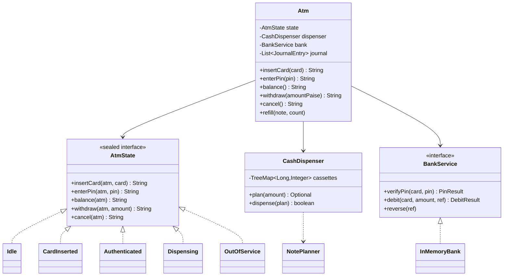
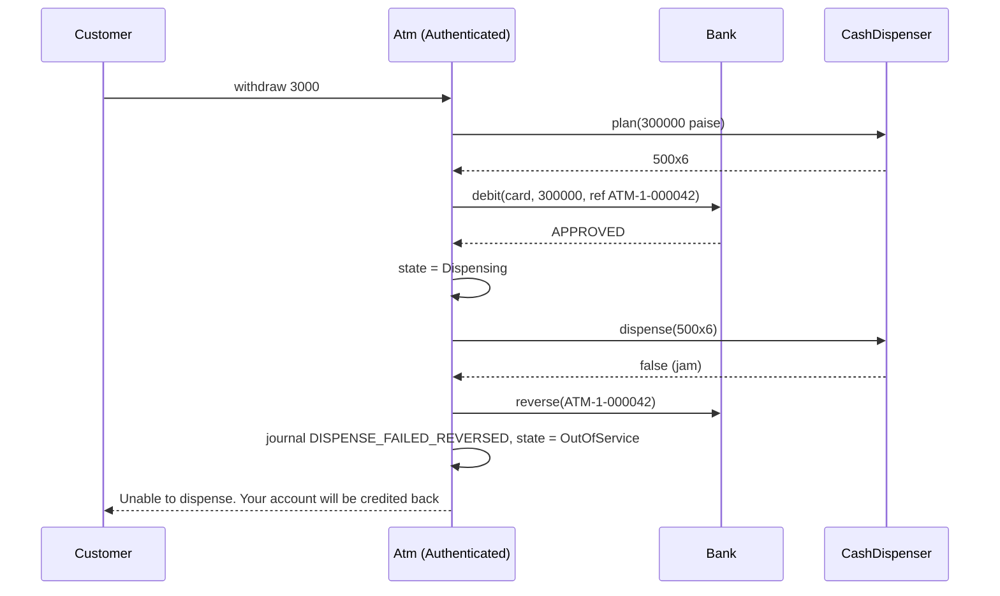

# ATM and Digital Wallet — L4 (Mid-level / SDE2) LLD Interview: the ATM

> **Level expectation:** model an ATM with clean classes: `Atm`, `CashDispenser` with **cassettes**, a `BankService` interface, a transaction journal, and the machine's states (`Idle`, `CardInserted`, `Authenticated`, `Dispensing`, `OutOfService`) written with the **State pattern** instead of an if/else maze. Store money as **integer paise**. Handle **PIN lockout**, **note planning from limited cassettes** (and know when greedy fails), the **daily limit**, and the order "**debit, then dispense, reverse on failure**". The wallet comes at [L5](L5-senior.md).

> 🆕 Never thought about what happens inside an ATM? Read [00-understand-the-product.md](00-understand-the-product.md) first.

Legend: **🧑‍💼 Interviewer** · **🧑‍💻 Candidate** · **📝 Note** = commentary for you.

---

## 1. Clarifying requirements

**🧑‍💼 Interviewer:** Design an ATM.

**🧑‍💻 Candidate:** Some questions first:
- **Which operations?** Balance enquiry and cash withdrawal? Deposits, PIN change, mini statement?
- **Who owns the account?** I assume the ATM doesn't store balances; it asks the card's bank over the network.
- **Which notes?** ₹100, ₹200, ₹500? Limited counts per cassette?
- **Limits:** per withdrawal, per day?
- **Failures:** what if the notes jam, or the bank doesn't answer?
- **One customer at a time?** Yes for a physical machine, but an operator may refill it.

**🧑‍💼 Interviewer:** Balance and withdrawal only. The bank owns accounts. ₹100/₹200/₹500 cassettes with counts. Daily limit at the bank. Jams and timeouts: you tell me.

**🧑‍💻 Candidate:**

**Functional:** insert card → PIN (3 wrong tries block the card) → balance or withdraw (multiples of ₹100) → notes + receipt → card back. Refuse amounts the cassettes can't make. Reverse the debit if cash isn't dispensed. Go out of service when broken or empty; an operator refill brings it back.

**Non-functional:** never pay out cash that wasn't debited; never keep a debit for cash not paid out; every transaction leaves a journal line; impossible steps (withdraw before PIN) can't happen.

> 📝 **Note:** Asking "who owns the balance?" early shows you see the ATM as a **client** of the bank, not the bank itself. That decides where limits, PIN tries and balances live.

---

## 2. Core entities

**🧑‍💻 Candidate:**

| Entity | Responsibility |
|---|---|
| `Atm` | The **context** (in State-pattern terms: the object whose behaviour changes with its state). Holds the current state, the devices, the journal. Delegates every customer action to the state |
| `AtmState` (sealed) | `Idle`, `CardInserted(card)`, `Authenticated(card)`, `Dispensing(card, ref)`, `OutOfService(reason)` |
| `CashDispenser` | Cassettes: note value → count. Plans a combination, pushes notes out through a `Hardware` interface that can report a jam |
| `NotePlanner` | Pure algorithm: greedy, and exact search when greedy fails |
| `BankService` (interface) | `verifyPin`, `balance`, `debit(card, amount, ref)`, `reverse(ref)`. In real life: network messages |
| `InMemoryBank` | Test implementation that can be told to time out before or after applying a debit |
| `JournalEntry` (record) | ref, card, amount, outcome (`DISPENSED`, `DECLINED`, `DISPENSE_FAILED_REVERSED`, `TIMEOUT_REVERSED`, `REVERSAL_PENDING`), time |

Money is a `long` of **paise** (1/100 rupee): `500_00` is ₹500. A `double` can't hold 0.10 exactly, and ten ₹0.10 additions give 0.9999999999999999 ([BigDecimal & money](../../libraries/java/bigdecimal-and-money.md)). `JournalEntry` is a **record** (a Java class whose fields are fixed at construction, with equals/hashCode generated) because a journal line must never change after it's written ([records & immutability](../../libraries/java/records-and-immutability.md)).

---

## 3. API

```java
final class Atm {
    String insertCard(String card);
    String enterPin(String pin);
    String balance();
    String withdraw(long amountPaise);
    String cancel();
    void refill(long notePaise, int count);      // operator
}

interface BankService {
    PinResult verifyPin(String card, String pin);                  // OK, WRONG, CARD_BLOCKED
    long balance(String card);
    DebitResult debit(String card, long amountPaise, String ref) throws BankTimeoutException;
    void reverse(String ref) throws BankTimeoutException;
}
```

Each customer method returns the screen text, which keeps the [code](java/src/wallet/Atm.java) testable without a UI. `ref` is a unique transaction reference (ATM id + sequence number) that the bank uses to recognise retries and reversals.

---

## 4. Class diagram and state diagram



Notation: [UML class diagrams](../../concepts/uml-class-diagrams.md). The state diagram is in [00-understand-the-product.md](00-understand-the-product.md#41-the-atm-is-a-state-machine); the full class diagram with the wallet is in the [README](README.md#class-diagram-matches-the-code).

---

## 5. Deep dives

### 5.1 The State pattern

**🧑‍💼 Interviewer:** Why not one `withdraw()` with `if (state == ...)` checks?

**🧑‍💻 Candidate:** With 5 states and 5 events that's 25 cases spread over every method, and adding a state means touching all of them. The **State pattern** ([design patterns](../../concepts/design-patterns.md), [state machines](../../concepts/state-machines.md)) gives each state its own class; the interface's **default methods** (methods with a body in an interface) say "not available now", and each state overrides only the events it accepts:

```java
sealed interface AtmState permits Idle, CardInserted, Authenticated, Dispensing, OutOfService {
    default String withdraw(Atm atm, long amount) { return reject("withdraw"); }
    // ... same for the other events
    record Idle() implements AtmState {
        public String insertCard(Atm atm, String card) { atm.moveTo(new CardInserted(card)); return "Enter PIN"; }
    }
}
```

`sealed` means only these five classes may implement it, so a `switch` over states is checked by the compiler ([sealed interfaces & pattern matching](../../libraries/java/sealed-interfaces-and-pattern-matching.md)). The states are records: `Authenticated("4111...")` carries the card it was created for, so there's no stale "current card" field to forget to clear.

### 5.2 PIN lockout

**🧑‍💼 Interviewer:** Where do you count wrong PINs?

**🧑‍💻 Candidate:** At the **bank**, per card. If the ATM counted, the thief would eject the card after 2 tries and start a fresh session, or walk to the next ATM. In the code, `verifyPin` returns `WRONG` for tries 1–2 and `CARD_BLOCKED` on the 3rd; a correct PIN resets the count. On `CARD_BLOCKED` the ATM **retains** the card and goes back to `Idle`. (Real cards also keep a PIN try counter on the chip; the details are in [card & PIN security](../../concepts/card-and-pin-security.md).)

### 5.3 Which notes? Greedy, and when it fails

**🧑‍💼 Interviewer:** How do you pick notes for ₹2,800?

**🧑‍💻 Candidate:** **Greedy** (always take the biggest note that fits, [greedy algorithms](../../concepts/greedy-algorithms.md)): 5 × ₹500 = 2,500, then 1 × ₹200, then 1 × ₹100. With unlimited notes, {100, 200, 500} is a **canonical** set (greedy always gives the fewest notes). But cassettes have **counts**:

| Amount | Cassettes (500 / 200 / 100) | Greedy | Exact search |
|---|---|---|---|
| ₹2,800 | 10 / 10 / 10 | 500×5, 200×1, 100×1 ✅ | same |
| ₹600 | 1 / 3 / 0 | takes 500, needs 100, none left ❌ | 200×3 ✅ |
| ₹5,000 | 1 / 30 / 0 | 500 + ₹4,500 in 200s (22.5) ❌ | 200×25 ✅ |
| ₹100 | 5 / 5 / 0 | ❌ | ❌ truly impossible: "try another amount" |

So I run greedy first and fall back to an **exact search**: try every count of the biggest note (from the most down to 0), then of the next, and keep the plan with the fewest notes. It's **bounded**: per note at most `min(count, amount / note)` choices, and branches already using as many notes as the best plan, or more than the ATM's per-withdrawal note cap (40 here; a typical figure, it varies by machine), are cut. For ₹10,000 that's at most 21 × 51 combinations of the two bigger notes. The general tool is bounded **dynamic programming** (solve each smaller amount once and reuse it), covered in [coin change & DP](../../concepts/coin-change-and-dynamic-programming.md); the [vending machine](../vending-machine/README.md) uses that version for change.

> 📝 **Note:** Saying "greedy is optimal for Indian notes" and stopping is the classic miss. The interviewer wants "...with unlimited notes; with counts it can fail, here's the counterexample".

### 5.4 The order: debit, then dispense, reverse on failure

**🧑‍💼 Interviewer:** Dispense first, then debit? Or the other way?

**🧑‍💻 Candidate:** Debit first. If I dispense first and the debit then fails (insufficient funds, network), cash is gone and can't be pulled back. A debit can be **reversed** with one message. So the risky irreversible step (cash) goes last, after the reversible one (debit):



Plan **before** the debit too: if the cassettes can't make the amount, there's nothing to reverse. And if the reversal itself gets no answer, the ref goes into a **pending reversals** queue retried on the next operator visit (in production: by a background job), journaled as `REVERSAL_PENDING`, so it's never forgotten.

### 5.5 The bank doesn't answer

**🧑‍💼 Interviewer:** The debit request times out. What do you do?

**🧑‍💻 Candidate:** A **timeout** means "unknown outcome": the request may have been lost on the way (no debit) or the reply lost on the way back (debited). Two rules:
1. **Never dispense on "maybe".**
2. **Send a reversal for that ref.** The bank's `reverse` is **idempotent** (doing it twice has the same effect as once): if the debit happened, it's undone; if it didn't, the bank remembers the ref as reversed, so a late copy of the lost request is refused (`ALREADY_REVERSED`).

The bank also treats `debit` with a ref it has seen as a retry and returns the first answer, so a network-level retry can't debit twice. Test `bankTimeoutNeverDoubleDebits` covers both directions. This is the same idea as the wallet's idempotency keys at [L5](L5-senior.md).

### 5.6 Daily limit and thread safety

The daily limit (₹25,000 in the tests, each bank sets its own) is checked **at the bank** inside `debit`, using an injected `Clock` (the time source is passed in from outside, so tests can control it) ([time & clock](../../libraries/java/time-and-clock.md)) so tests can jump to tomorrow; a reversal gives the room back. On the ATM side, every public method is `synchronized` (only one thread at a time inside, [locks & synchronized](../../libraries/java/locks-and-synchronized.md)): there's one customer, but an operator `refill` must not interleave with a withdrawal halfway through ([thread safety basics](../../concepts/thread-safety-basics.md)).

---

## 6. Follow-ups

**🧑‍💼 Interviewer:** What if the customer doesn't take the cash?

**🧑‍💻 Candidate:** Many ATMs **retract** the notes after ~30 seconds into a reject bin. Whether to reverse then is a bank policy question (did the person take some?), so I'd add a `CashPresented` state with a timer, journal `RETRACTED`, and let reconciliation (matching the ATM's journal against the bank's records and the cash counted, L6) decide.

**🧑‍💼 Interviewer:** Partial dispense: 4 of 6 notes came out?

**🧑‍💻 Candidate:** The dispenser must report what it actually pushed; then I'd send a **partial reversal** for the rest. My `Hardware` returns only true/false; I'd change it to return the notes counted out by the sensor.

**🧑‍💼 Interviewer:** Add deposits?

**🧑‍💻 Candidate:** A new event `deposit` handled only by `Authenticated`, plus a `CashAcceptor` device. Other states inherit the default "not available". That's the State pattern paying off.

---

## 7. What the interviewer was evaluating (L4)

- [ ] Asked who owns balances, which notes, limits, failure behaviour
- [ ] Money as integer paise, not `double`
- [ ] State pattern with explicit states; impossible steps refused by construction
- [ ] PIN tries counted at the bank; lockout after 3; card retained
- [ ] Greedy note planning **and** the limited-cassette counterexample; exact fallback
- [ ] Plan → debit → dispense; reverse on failure; out of service on a jam
- [ ] Timeout = unknown outcome: no cash, reversal by ref, no double debit
- [ ] Journal entry per outcome

## 8. Common mistakes at this level

| Mistake | Why it's wrong |
|---|---|
| `double balance` | ₹0.10 isn't exact; totals drift |
| Dispense, then debit | Cash out can't be undone if the debit fails |
| Treating a timeout as "declined" and doing nothing | If the bank did debit, the customer loses money silently |
| Treating a timeout as "approved" and dispensing | Free cash if the request never arrived |
| PIN tries counted per ATM session | Eject and retry gives unlimited guesses |
| Pure greedy for notes | Fails on ₹600 with one ₹500 and no ₹100 |
| One big `if/else` on a `state` string | Easy to allow withdraw before PIN; every new state touches every method |
| No unique ref per transaction | Retries and reversals can't say which debit they mean |

➡️ Next: [L5-senior.md](L5-senior.md) (the digital wallet)
