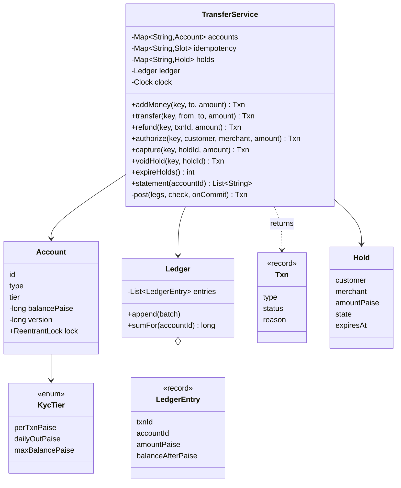
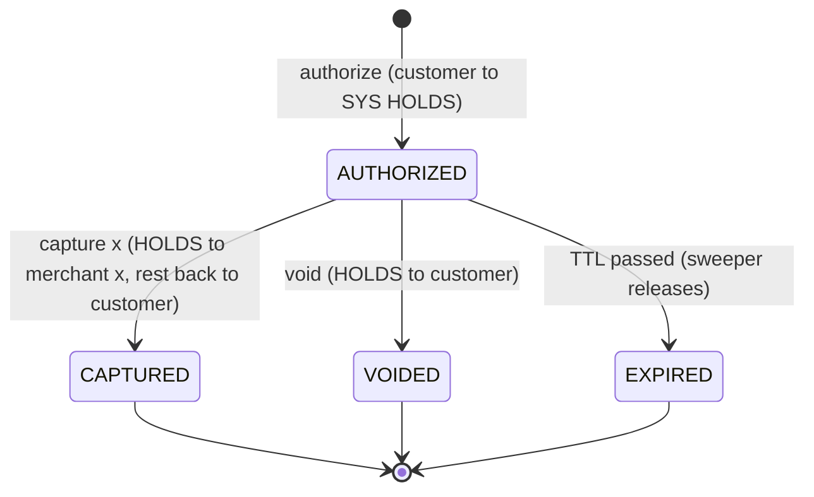

# ATM and Digital Wallet — L5 (Senior) LLD Interview: the Wallet

> **Level expectation:** design a Paytm/PhonePe-style wallet where money is a **double-entry ledger**: every transfer writes balanced entries in one atomic step, balances equal the sum of entries, **idempotency keys** make retries (even simultaneous ones) safe, two transfers on the same wallet can't overdraw or **deadlock**, **limits** are checked atomically, **refunds** are new reversing entries, and merchant payments can use **holds** (authorize → capture/void). Explain why floats are forbidden. Read [L4-mid.md](L4-mid.md) for the ATM half.

Legend: **🧑‍💼 Interviewer** · **🧑‍💻 Candidate** · **📝 Note** = commentary for you.

---

## 1. Clarifying requirements

**🧑‍💼 Interviewer:** Now design the wallet inside a payments app.

**🧑‍💻 Candidate:**
- **Operations:** add money from a bank, pay a merchant, send to another user, refund, history. Withdraw to bank?
- **Retries:** do mobile clients retry? (Yes, always: so every money call needs an **idempotency key**, a unique ID per user intent.)
- **Limits:** KYC tiers (KYC = Know Your Customer, the identity checks that set limits) with per-transaction, daily, and balance caps?
- **Merchant flows:** pay-now only, or reserve-then-charge like cab apps?
- **Consistency:** a balance must never go negative and the books must always balance. Single region and one relational database for now?

**🧑‍💼 Interviewer:** All of those except withdraw-to-bank. Holds yes. One database.

**Functional:** top-up, P2P transfer, merchant payment, partial/full refunds, holds with capture/void/expiry, statement. **Non-functional:** no money created or lost; no double charge on retry; no overdraft under concurrency; no deadlocks; full audit history.

---

## 2. Core entities: accounts and a ledger

**🧑‍💻 Candidate:** Every party is an **account** in a ledger, including the company's own:

| Entity | What it is |
|---|---|
| `Account` | id, type (`USER`, `MERCHANT`, `SYSTEM`), KYC tier, **cached** balance, version, lock |
| `LedgerEntry` (record) | id, txnId, accountId, signed `amountPaise` (+ in, − out), `balanceAfterPaise`, timestamp. Immutable |
| `Txn` (record) | The business request: type (`TOP_UP`, `TRANSFER`, `REFUND`, `HOLD`, `CAPTURE`, `RELEASE`), from, to, amount, status (`COMPLETED`/`REJECTED`), reason, idempotency key |
| `Ledger` | Append-only list; `append(batch)` refuses a batch whose amounts don't sum to 0 |
| `Hold` | Reserved money: customer, merchant, amount, state, expiry |
| `TransferService` | The only code that moves money |
| System accounts | `SYS:BANK` (money that came in from banks; goes **negative** as users top up) and `SYS:HOLDS` (money reserved for merchants) |

**🧑‍💼 Interviewer:** Why a `SYS:BANK` account? Just add to the user's balance on top-up.

**🧑‍💻 Candidate:** Because then money appears from nowhere and I can't check the books. With **double entry** ([ledgers & event sourcing](../../concepts/ledgers-and-event-sourcing.md), deeper in [how double-entry ledgers work](../../../under-the-hood/double-entry-ledgers.md)) every transaction's entries sum to zero, so **the sum of all balances is always exactly 0**. If ₹10,000 sits in user wallets, `SYS:BANK` shows −₹10,000: "we owe users ₹10,000, backed by money in our bank account". That one invariant (a rule that must always be true) catches whole classes of bugs.

> 📝 **Note:** Accountants use "debit" and "credit" with meanings that flip by account type (for a bank, a customer deposit is a *liability*, so a credit increases it). In an interview, a **signed amount from the account's point of view** is clearer; mention that you know the accounting terms exist.

---

## 3. API

```java
Txn addMoney(String key, String to, long amountPaise);
Txn transfer(String key, String from, String to, long amountPaise);
Txn refund(String key, String originalTxnId, long amountPaise);
Txn authorize(String key, String customer, String merchant, long amountPaise);   // hold
Txn capture(String key, String holdTxnId, long amountPaise);
Txn voidHold(String key, String holdTxnId);
List<String> statement(String accountId);
```

Business "no" (insufficient funds, limit) is a `Txn` with status `REJECTED` and a reason, not an exception, so it can be **stored under the key** and replayed. Programmer errors (negative amount, same from and to) throw.

---

## 4. Class diagram



---

## 5. Deep dives

### 5.1 One transfer = one atomic step

**🧑‍💻 Candidate:** Every operation becomes a list of **legs** (from, to, amount) passed to one private method, `post`:

1. Lock every involved account, **sorted by id** (§5.3).
2. Run the operation's own check (e.g. "refund ≤ refundable") and the common checks: funds, limits.
3. If OK: create the `Txn`, write one − and one + entry per leg, update cached balances and versions.
4. Unlock.

In a relational database that's one **transaction** (a group of statements that commit together or not at all, [transactions & isolation](../../concepts/transactions-and-isolation.md)):

```sql
BEGIN;
SELECT id, balance, version FROM accounts WHERE id IN ('bob','priya') ORDER BY id FOR UPDATE;
-- app checks: priya.balance >= 20000, limits
INSERT INTO ledger_entries (txn_id, account_id, amount) VALUES ('T42','priya',-20000), ('T42','bob',20000);
UPDATE accounts SET balance = balance - 20000, version = version + 1 WHERE id = 'priya';
UPDATE accounts SET balance = balance + 20000, version = version + 1 WHERE id = 'bob';
INSERT INTO idempotency_keys (key, request_hash, txn_id) VALUES ('7f3a...', 'h...', 'T42');
COMMIT;
```

`FOR UPDATE` takes a **row lock** (other transactions wanting to change those rows wait until commit). How Postgres keeps readers unblocked meanwhile is in [Postgres MVCC](../../../under-the-hood/postgres-mvcc.md).

### 5.2 Balance: stored or summed?

| | Sum entries on every read | Cached balance column |
|---|---|---|
| Correctness | Always right by definition | Right only if updated in the **same** transaction as the entries |
| Read cost | O(entries); a 5-year-old wallet has thousands | O(1) |
| Overdraft check | Needs a lock anyway | Lock the row, compare, update |

**🧑‍💻 Candidate:** Both: the entries are the **source of truth**, the column is a cache updated in the same step, and every entry also stores `balanceAfter` so statements don't re-add history. A test asserts `balance == sum(entries)` for every account after every scenario, and a nightly job does the same in production (L6).

### 5.3 Two transfers at once: locks and deadlocks

**🧑‍💼 Interviewer:** Priya pays ₹200 to Bob and ₹200 to Carol at the same moment with ₹300 in her wallet.

**🧑‍💻 Candidate:** Without a lock both read 300, both pass the check, and she ends at −100: a **lost update** (two read-modify-write cycles overlap and one's effect is overwritten). Each `Account` has a `ReentrantLock` (a lock object; "reentrant" means the thread holding it may take it again without blocking itself, [locks & synchronized](../../libraries/java/locks-and-synchronized.md)); the check and the write happen while holding it.

**🧑‍💼 Interviewer:** Priya → Bob and Bob → Priya at the same time?

**🧑‍💻 Candidate:** If each thread locks "from" then "to", thread 1 holds Priya and waits for Bob while thread 2 holds Bob and waits for Priya: a **deadlock** (each waits forever for a lock the other holds). Fix: always lock in one global order, here by account id ([deadlocks & lock ordering](../../concepts/deadlocks-and-lock-ordering.md)). Test `oppositeTransfersDoNotDeadlock` runs 20,000 transfers each way on two threads with a 20 s timeout; with the sort removed it hangs and fails on the timeout.

**Alternative: optimistic locking** ([optimistic vs pessimistic](../../concepts/optimistic-vs-pessimistic-locking.md)): no lock, but the update says *"only if nothing changed since I read"*:

```sql
UPDATE accounts SET balance = balance - 20000, version = version + 1
WHERE id = 'priya' AND version = 41 AND balance >= 20000;   -- 0 rows updated → re-read and retry
```

Good when conflicts are rare (most wallets); bad for a **hot account** (one that many transactions touch, like a big merchant), where retries pile up (L6). My code uses pessimistic locks and keeps a `version` field for the optimistic variant.

### 5.4 Idempotency, including simultaneous duplicates

**🧑‍💼 Interviewer:** The app retries. How do you avoid a double payment?

**🧑‍💻 Candidate:** The client creates one key per **intent** (a **UUID**, a random 128-bit ID, generated when the user taps Pay) and resends it on every retry ([idempotency & delivery semantics](../../../HLD/concepts/idempotency-and-delivery-semantics.md)). The server keeps key → (request fingerprint, result):

| Case | Response |
|---|---|
| New key | Do the work, store the result |
| Same key, same request, finished | Return the stored `Txn` (even a `REJECTED` one) |
| Same key, same request, **still running** | Wait for the first and return its result |
| Same key, **different** request | Refuse: client bug (Stripe returns an error here) |
| First attempt crashed (exception, not a business "no") | Forget the key so a retry can run |

The tricky row is "still running". A check-then-insert (`if (!map.containsKey(k)) map.put(...)`) lets two threads both see "absent". I use one atomic step, `ConcurrentHashMap.putIfAbsent(key, slot)` ([ConcurrentHashMap](../../libraries/java/concurrent-hashmap.md)), where the slot holds a `CompletableFuture` (a result that may arrive later): the winner does the work and completes it; losers `join()` it. Test: 16 threads released together by a `CountDownLatch` (a gate that opens for all waiting threads at once) send the same key → one txn id, two entries. In SQL, the same guarantee comes from a **unique index** on the key, inserted in the same transaction as the transfer: the duplicate's insert blocks, then fails, and it reads the stored result.

> 📝 **Note:** Storing **rejections** too is deliberate: if "insufficient funds" weren't stored, a retry after the user tops up would succeed, and a request they saw fail would silently go through later. A new attempt needs a new key.

### 5.5 Limits checked atomically

`KycTier` holds per-transaction, daily-outgoing and balance-cap limits (the numbers are **illustrative**, shaped like RBI's PPI rules: check the current Master Direction). They're checked **inside** `post`, under the same locks as the balance check. Checking limits before taking the lock lets two ₹6,000 transfers both pass a ₹10,000 daily limit. The "day" is the calendar day in **IST** (Indian Standard Time, zone `Asia/Kolkata`), computed from an injected `Clock`, so the test moves to tomorrow without sleeping ([time & clock](../../libraries/java/time-and-clock.md)).

### 5.6 Refunds: never delete, reverse

A refund is a new `REFUND` txn whose legs go merchant → customer, linked to the original by `relatedTxnId`. The original stays. The running total refunded per original is checked under the locks (so two concurrent refunds can't exceed the original). Deleting or editing entries would make yesterday's statement and today's disagree and destroy the audit trail; the same rule appears in [Splitwise](../splitwise/README.md) (deleting an expense writes a reversal).

### 5.7 Holds: authorize, then capture or void



The held money really moves into `SYS:HOLDS`, so "available balance" drops at once and conservation still holds. Each hold has a **TTL** (time to live: how long it stays valid). Capture after expiry is refused; a **sweeper** (a background job that cleans up, here `expireHolds`) releases expired holds with a deterministic key (`expire:<holdId>`), so running it twice is harmless. Same pattern as seat holds in [movie booking](../movie-booking/README.md) ([holds, reservations & TTL](../../concepts/holds-reservations-and-ttl.md)).

### 5.8 Why floats are forbidden

`0.1 + 0.2 == 0.30000000000000004` in binary floating point. Ten ₹0.10 payments as `double` are 0.9999999999999999 (test `moneyAsLongPaiseIsExact`). Use `long` paise (exact; `Math.addExact` throws on overflow instead of wrapping) or `BigDecimal` built from strings ([BigDecimal & money](../../libraries/java/bigdecimal-and-money.md)); in JS, integer Numbers checked with `Number.isSafeInteger`, or `BigInt` ([money & numbers in JS](../../libraries/js/money-and-numbers-in-js.md)). Splitting (₹100 ÷ 3) needs an explicit rule for the leftover paisa ([splitting money & rounding](../../concepts/splitting-money-and-rounding.md)).

---

## 6. Follow-ups

**🧑‍💼 Interviewer:** Statements for a month?

**🧑‍💻 Candidate:** Query entries by account and time range (index on `(account_id, created_at)`); each line already has `balanceAfter`. The opening balance is the `balanceAfter` of the last entry before the range. Monthly PDFs come from a batch job reading a **read replica** (a copy of the database that serves reads, so heavy reports don't slow payments).

**🧑‍💼 Interviewer:** How long do you keep idempotency keys?

**🧑‍💻 Candidate:** Longer than any client retries: Stripe documents at least 24 hours. Then expire them; the ledger keeps the txn forever.

**🧑‍💼 Interviewer:** Top-up from a bank: when do you credit?

**🧑‍💻 Candidate:** Only when the bank/PSP (payment service provider) confirms. Until then it's a pending payment, not a ledger entry: the unknown-outcome problem from the ATM, at L6 scale.

---

## 7. What the interviewer was evaluating (L5)

- [ ] Accounts for everyone incl. system accounts; double entry; sum of balances = 0
- [ ] One atomic step: entries + cached balances + idempotency record
- [ ] Balance = sum of entries; cache updated in the same step
- [ ] Locks with a global order (or optimistic version check) and why
- [ ] Idempotency incl. concurrent duplicates, mismatched requests, stored rejections
- [ ] Limits checked under the same lock as funds
- [ ] Refunds as reversing entries with a cap; holds with capture/void/expiry
- [ ] Integer money; tests for conservation, concurrency and deadlocks

## 8. Common mistakes at this level

| Mistake | Why it's wrong |
|---|---|
| `balance += x` with no entries | No audit trail; can't prove the balance |
| Entries and balance updated in separate transactions | A crash in between makes them disagree |
| Locking "from" then "to" | A→B and B→A deadlock |
| `if (!seen(key)) { process(); save(key); }` | Two simultaneous retries both process |
| Not storing rejected results | A failed payment succeeds later on retry |
| Refund by deleting the original | Statements change retroactively; audit lost |
| Limits checked before the lock | Concurrent requests together exceed the limit |
| `double` for money | Drift, and rounding nobody chose |

➡️ Next: [L6-staff.md](L6-staff.md)
