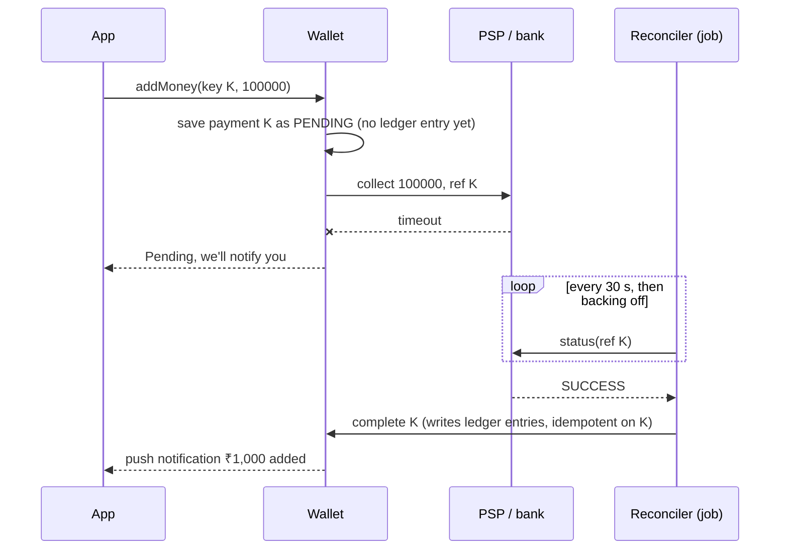

# ATM and Digital Wallet — L6 (Staff) LLD Interview: Production

> **Level expectation:** take the L5 wallet and the L4 ATM to production. **Shard** accounts and handle transfers that cross shards; tame **hot accounts** (a big merchant's wallet); treat every external call (bank, PSP, UPI, ATM switch) as having an **unknown outcome** and resolve it with status checks and **reconciliation**; keep the ledger **immutable and auditable**; put **fraud checks** on the path; respect **RBI** rules; run an **ATM fleet** (switch, ISO 8583, HSMs); **test money invariants**; and argue **build vs buy**. Read [L5-senior.md](L5-senior.md) first. The payment flow as a whole service is the [Payment System HLD](../../../HLD/interviews/payment-system/README.md).

Legend: **🧑‍💼 Interviewer** · **🧑‍💻 Candidate** · **📝 Note** = commentary for you.

> ⚠️ Regulatory and network details below (RBI limits, ISO 8583 codes, HSM flows) are from memory of public material and are marked where unverified. Check the current RBI Master Directions and network specs before relying on them.

---

## 1. What changes at scale

**🧑‍💼 Interviewer:** 100 million wallets, 50 million transfers a day, peaks during sales. What breaks first?

**🧑‍💻 Candidate:** Arithmetic first. 50M/day ÷ 86,400 s ≈ **580 transfers/s** average; sales peaks at ~10× ≈ **6,000/s**. Each writes 2 entries, so ~12,000 entry rows/s at peak, ~100M rows/day; at ~200 bytes/row with indexes that's ~20 GB/day, ~7 TB/year. One well-tuned Postgres **primary** (the single server that accepts writes) can take a few thousand small write transactions/s, so peak load needs either **sharding** or a ledger store built for it. Second to break: **hot accounts** (§3). Third: everything that talks to the outside world (§4).

---

## 2. Sharding accounts

**🧑‍💻 Candidate:** **Shard** (split data across database servers by a key) by `account_id`. Each account's entries and balance live on one shard, so a transfer **within** a shard is still the L5 single transaction. A transfer **across** shards (Priya on shard 3, Rahul on shard 7) can't be one local transaction. Options:

| Option | How | Cost |
|---|---|---|
| **2PC** (two-phase commit: a coordinator asks both shards to *prepare*, then tells both to *commit*) | Atomic across shards | Locks held across a network round trip; a dead coordinator blocks both rows |
| **Saga with a transit account** ([sagas](../../../HLD/concepts/sagas-and-distributed-transactions.md)) | Step 1 on shard 3: Priya → `TRANSIT`. Step 2 on shard 7: `TRANSIT` → Rahul. Step 2 retried until done (idempotent by txn id); if Rahul's account is closed, a compensating step returns the money | Brief window where money is "in transit"; totals still balance because `TRANSIT` is an account |
| **Single ledger service** | All money movement goes through one specialised store that does multi-account atomic batches (e.g. TigerBeetle, an open-source database built only for double-entry transfers) | A new critical dependency; but sharding becomes its problem |

I'd pick the saga: **debits must be synchronous** (we need to know Priya had the money), but a **credit can't fail** for lack of funds, so step 2 can be asynchronous and retried. The invariant "sum of all accounts = 0" still holds at every instant if `TRANSIT` is counted.

---

## 3. Hot accounts

**🧑‍💼 Interviewer:** During a sale, 3,000 payments/s go to one merchant's wallet. Your per-account lock serialises them.

**🧑‍💻 Candidate:** At ~2 ms per locked transaction, one row maxes out near 500/s. Fixes, cheapest first:

1. **Credits don't need the lock to check anything.** Append the credit entries immediately; update the merchant's cached balance asynchronously in batches (one `UPDATE ... balance = balance + sum` per 100 ms). Only debits from the merchant (refunds, payouts) need an up-to-date balance.
2. **Sub-accounts (sharded balance):** split the merchant into N buckets `merchant#0..#15`; each payment credits a random bucket; the real balance is the sum. Refunds debit a bucket with enough money, or first sweep buckets together.
3. **Netting:** for system accounts like `SYS:HOLDS` or `SYS:BANK` (touched by *every* hold or top-up), don't write their side per transaction at all; post one summary entry per batch. My L5 code locks `SYS:HOLDS` on every hold, which is exactly this hotspot.

> 📝 **Note:** The staff move is to separate what must be **strongly consistent** (a debit's balance check) from what can be **eventually consistent** (correct after a short delay: a credit's effect on a cached number), and say which invariant still holds during the gap.

---

## 4. External calls: the outcome is unknown

**🧑‍💻 Candidate:** Top-up = "ask the bank/PSP (payment service provider: Razorpay, a UPI app's bank, a card network) to pull ₹1,000". The call can time out after the bank debited the user. The L4 ATM rule applies: **never assume**. Model it as a state machine with a **pending** state:

Rules: the ref we send is our idempotency key, so asking twice can't pull twice; the ledger entry is written **once**, by whichever path learns the outcome first (callback, status poll, or the daily file), each keyed on the same ref; a payment stuck in PENDING past a deadline is escalated, not auto-failed (a "failed" top-up that actually succeeded means the user paid and got nothing). UPI shows this as "payment pending" ([how UPI works](../../../under-the-hood/upi.md)).

---

## 5. Reconciliation

**🧑‍💻 Candidate:** **Reconciliation** = matching our records against someone else's, independently produced, to find differences ("breaks"). Daily, per partner:

| Source | Says |
|---|---|
| Our ledger | What we think happened (txn id, amount, status) |
| PSP / bank **settlement file** (a daily report of what they processed and will pay us) | What they think happened |
| Our **bank statement** for the escrow/nodal account (the regulated bank account that holds customers' wallet money) | What money actually arrived |

A **three-way match** joins them on reference and amount:

| Break | Likely cause | Action |
|---|---|---|
| In PSP file, not in ledger (or ledger says PENDING) | Lost callback, timeout | Complete the payment (idempotent on ref) |
| In ledger as SUCCESS, not in PSP file | Our bug, or PSP late | Investigate; maybe reverse |
| Amounts differ | Fees, partial capture, bug | Post fee entries or fix |
| Ledger total ≠ bank balance | Any of the above, or fraud | Page finance on-call |

For the **ATM fleet**, the match is: the ATM's electronic journal vs the switch's records vs the cash physically counted when the cassettes are swapped. A "debited but no cash" complaint is resolved from the journal and the dispenser's sensor log.

---

## 6. Audit and immutability

- Ledger tables are **append-only**: the app's DB user has `INSERT` and `SELECT`, no `UPDATE`/`DELETE` on entries. Corrections are new entries with a reason and an operator id.
- Each entry can carry a hash of the previous entry's hash + its own content (a **hash chain**), so tampering with history is detectable.
- Archive old **partitions** (chunks of a table, e.g. one per month) to **WORM** storage (write once, read many: object storage with a retention lock).
- The ledger *is* an event log; balances are a **projection** of it (a view computed from the log), which is [event sourcing](../../concepts/ledgers-and-event-sourcing.md). Rebuilding all balances from entries and comparing with the cached ones is the nightly integrity job.

---

## 7. Fraud checks

On the synchronous path, before `post`, with a strict time budget (e.g. 50 ms; on timeout, fall back to rules only): **velocity limits** (more than N transfers or ₹X in 10 minutes), new device + large amount, first transfer to a new payee, **mule**-account patterns (accounts used to pass stolen money along) (many small credits in, one big debit out). After the transaction: asynchronous models score it and can **freeze** an account (a flag checked in `post`), never edit entries. The JS version in this folder awaits a `riskCheck` hook and does the balance check **after** it, which is the important ordering detail: a check before an `await` is stale by the time you write.

---

## 8. Regulatory (India; verify specifics)

- Wallets are **PPIs** under the RBI Master Direction on Prepaid Payment Instruments (2021, amended since). As I remember it (unverified): small/minimum-KYC PPIs have a ₹10,000 outstanding limit and can't send money to bank accounts; full-KYC PPIs up to ₹2,00,000; non-bank issuers keep customer money in an **escrow account** at a scheduled bank. That escrow balance is what `SYS:BANK` mirrors.
- **Payment data must be stored in India** (RBI directive on storage of payment system data, 2018): constrains region choice for databases and backups.
- **Failed transaction rules:** RBI's 2019 turnaround-time circular sets reversal deadlines (e.g. T+5 days for ATM "debited, no cash") with per-day compensation after that (verify current values).
- Regulators can stop a business overnight: in January 2024 the RBI barred Paytm Payments Bank from accepting new deposits/top-ups (effective March 2024). Design for **portability** (moving users' wallets to a partner bank) and clean, exportable ledgers.

---

## 9. The ATM fleet

**🧑‍💻 Candidate:** An ATM talks to its bank through a **switch** (a router for card transactions). For a card from another bank, the request goes from the acquirer's switch (the ATM owner's bank) to the national switch (NPCI's **NFS** in India, unverified details) to the issuer.

- Messages use **ISO 8583** (a card-message standard from 1987): a 4-digit message type, e.g. `0200` financial request, `0210` response, `0420` reversal advice (typical usage; networks differ), then numbered fields (amount, terminal id, trace number, PIN block). My `debit(card, amount, ref)` and `reverse(ref)` are a toy version of `0200` and `0420`.
- The PIN never travels in clear. The ATM's **EPP** (encrypting PIN pad) encrypts it into a **PIN block**; switches re-encrypt it inside **HSMs** (hardware security modules: tamper-proof boxes that hold keys and do crypto without ever exposing them); the issuer's HSM verifies it. Details in [card & PIN security](../../concepts/card-and-pin-security.md) (mark: flows vary by network).
- Fleet operations: remote monitoring (cassette levels, faults), **cash forecasting** per ATM (run out on a holiday weekend = angry customers; overfill = idle money), journal upload for disputes, software updates with rollback. ₹2,000 notes were withdrawn from circulation in 2023, so cassette mixes are ₹100/₹200/₹500; RBI has pushed banks to dispense more ₹100/₹200 notes (2025 circular, unverified details).

---

## 10. Testing money invariants

| Invariant | Test in this folder |
|---|---|
| Sum of all balances (incl. system) = 0 | `assertLedgerConsistent` after every wallet test |
| Cached balance = sum of entries | same helper, every account |
| Total user money constant under transfers | 10,000 random transfers on 8 threads, seeded; JS: 3 seeds × 5,000 with interleaved `await`s |
| One effect per idempotency key | 16 simultaneous duplicates → 1 txn |
| No deadlock | opposite transfers with a timeout |
| ATM: no cash on unknown outcome, no double debit | `bankTimeoutNeverDoubleDebits` |

**Mutation checks** (proof the tests can fail; each done on a copy, then reverted): removing the idempotency check fails `idempotentRetryReturnsSameTxn` and, run alone, the concurrent duplicates test (16 ids instead of 1); removing the lock-ordering sort makes `oppositeTransfersDoNotDeadlock` time out; dropping the reversal after a jam fails `dispenseFailureReversesTheDebit`; greedy-only planning fails the note tests. In production add: **property-based tests with shrinking** (jqwik, fast-check: they cut a failing random run down to the few steps that matter), **fault injection** (kill the process between "debit" and "credit" of a saga and check the recovery job finishes it), and a **shadow ledger** (replay production events into the new ledger version and compare balances before switching).

---

## 11. Build vs buy

| Layer | Build when | Buy / use |
|---|---|---|
| Ledger | Money movement is your core product and you need custom flows | Ledger services or databases (Modern Treasury Ledgers, Formance, TigerBeetle) give double entry, idempotency and balances out of the box |
| Core banking (a bank's main account system) | You are a bank (rare) | Finacle, Temenos and similar run most Indian banks' accounts |
| Payment collection | Almost never | PSPs / payment gateways (Razorpay, Cashfree, Juspay...) and UPI via a partner bank |
| ATM switching | You're a large bank | Managed switch providers; the network (NFS) itself |

Names are examples, not endorsements. Whatever you buy, **keep your own ledger of what you asked for and what you were told**: reconciliation needs your side of the story.

---

## 12. What the interviewer was evaluating (L6)

- [ ] Load arithmetic; when one database stops being enough
- [ ] Cross-shard transfers: 2PC vs saga with a transit account vs ledger service; credits async, debits sync
- [ ] Hot accounts: async credits, sub-accounts, netting
- [ ] Unknown outcomes: pending state, status polling, idempotent completion, no auto-fail
- [ ] Three-way reconciliation and break handling; ATM journal vs switch vs cash
- [ ] Append-only ledger, no UPDATE grants, hash chain, nightly rebuild check
- [ ] Fraud checks with a time budget; check after the await
- [ ] RBI PPI constraints, data localisation, regulator risk
- [ ] ATM fleet: switch, ISO 8583, HSM/PIN block, cash forecasting
- [ ] Invariant, property, mutation and fault-injection testing; build vs buy

## 13. Common mistakes at this level

| Mistake | Why it hurts at L6 |
|---|---|
| Treating a PSP timeout as failure | The user paid; you show "failed"; support load and regulatory complaints |
| Two independent writes for a cross-shard transfer | A crash between them creates or destroys money |
| One row for a merchant with 3,000 payments/s | Lock queue, timeouts during the biggest sale |
| Fixing balances with `UPDATE` | No audit trail; reconciliation can't explain the difference |
| No reconciliation job | Breaks are found by customers, months later |
| Fraud check that blocks with no timeout | A slow model takes payments down |
| Ignoring data-localisation rules in region design | A compliance finding that forces a migration |

⬅️ Previous: [L5-senior.md](L5-senior.md) · 🏠 [Problem overview](README.md)
