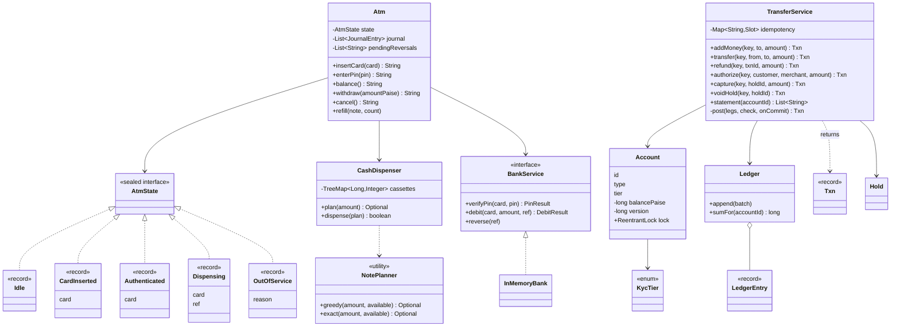

# LLD Interview: Design an ATM and a Digital Wallet

> "Design an ATM: card, PIN, withdraw cash. Then design a wallet like Paytm or PhonePe: add money, pay, send to a friend, refunds. What happens when the network drops, the notes jam, or the user taps Pay twice?"

One folder, two machines that share one lesson: **money must never be created, lost or moved twice**. L4 is the **ATM** as a state machine handling real cash: the **State pattern**, **PIN lockout**, **note planning from limited cassettes** (greedy fails; bounded exact search doesn't), and the order **debit → dispense → reverse on failure**, including what to do when the bank doesn't answer. L5 is the **digital wallet**: a **double-entry ledger** where every transfer writes balanced entries atomically, **balance = sum of entries**, **idempotency keys** that survive simultaneous retries, **lock ordering** against deadlocks, **KYC limits** checked atomically, **refunds** as reversing entries, and **holds** (authorize → capture/void). L6 is production: **sharding** and cross-shard sagas, **hot merchant accounts**, external calls with **unknown outcomes**, **reconciliation**, audit, fraud, **RBI rules**, the **ATM fleet** (switch, ISO 8583, HSMs), invariant testing and build vs buy.

> 💡 **Terms in one line each** (details in the files):
> **Paise**: 1/100 rupee; all money here is a whole number of paise in a `long`. **State pattern**: one class per state, each handling events its own way. **Cassette**: a locked box of one note type inside an ATM. **Reversal**: a message that undoes an earlier debit by its reference. **Ledger**: append-only list of money movements. **Double entry**: each transaction's entries sum to zero. **Idempotency key**: a request ID that makes a repeat harmless. **Hold**: money reserved now, captured or released later. **Deadlock**: threads each waiting forever for a lock another holds. **Lock ordering**: always taking locks in one global order so deadlocks can't happen. **KYC**: identity checks that set a wallet's limits. **PPI**: Prepaid Payment Instrument, RBI's term for wallets. **Reconciliation**: matching our records with a bank's to find differences. **Switch**: the network between an ATM and the card's bank. **HSM**: tamper-proof hardware that holds encryption keys.

## How to read this folder

> 👉 **Never thought about what happens between "Pay" and "Paid"? Start with [00-understand-the-product.md](00-understand-the-product.md).** It walks through ₹5,000 at an ATM (and the four ways it can lose money) and a double-tapped ₹200 wallet payment.

| File | Level | What "good" looks like |
|---|---|---|
| [00-understand-the-product.md](00-understand-the-product.md) | Everyone, first | Know the features (card + PIN + lockout, cassettes, daily limit, reversal, journal; top-up, P2P, merchant pay, refunds, holds, KYC limits, idempotency) and why each exists; real jshell output on `double` vs paise |
| [L4-mid.md](L4-mid.md) | Mid / SDE2 | The **ATM**: sealed `AtmState` with five record states; `CashDispenser` + `NotePlanner` (greedy, exact fallback, the ₹600 counterexample); PIN tries counted at the bank; plan → debit → dispense → reverse; timeouts as unknown outcomes; journal |
| [L5-senior.md](L5-senior.md) | Senior | The **wallet**: accounts incl. system accounts; double entry with sum = 0; one atomic `post` of legs; cached balance = sum of entries; per-account locks in id order vs optimistic versions; idempotency with concurrent duplicates and stored rejections; atomic KYC limits; refunds; holds with expiry; no floats |
| [L6-staff.md](L6-staff.md) | Staff | Load arithmetic; sharding + saga with a transit account; hot accounts; pending states and status polling; three-way reconciliation; append-only audit; fraud checks; RBI PPI rules and data localisation; ATM switch, ISO 8583, HSMs; invariant/mutation/fault-injection testing; build vs buy |

## Code (runnable, no dependencies)

| | Run | Files |
|---|---|---|
| ☕ Java 21 | `./java/run.sh` | [java/src/wallet/](java/src/wallet/). **ATM:** `Atm` (context, journal, pending reversals), sealed `AtmState` (`Idle`, `CardInserted`, `Authenticated`, `Dispensing`, `OutOfService`), `CashDispenser` (cassettes + injectable `Hardware`), `NotePlanner` (greedy + bounded exact search, 40-note cap), `BankService` + `InMemoryBank` (PIN tries, daily limit, idempotent debit/reverse by ref, injectable timeouts). **Wallet:** `TransferService` (top-up, transfer, refund, authorize/capture/void/expire, statement), `Account`, `Ledger`, `LedgerEntry`, `Txn`, `Hold`, `KycTier`. Shared: `Money`, `MutableClock`. 21 tests in `WalletTests.java`; `Demo.java` |
| 🟨 Node 22 | `cd js && node --test` | [js/wallet.js](js/wallet.js), [js/wallet.test.js](js/wallet.test.js): `Wallet` with private `#fields`: ledger, top-up, transfer, refund, idempotency storing the **promise** so simultaneous duplicates share it, an async `riskCheck` hook with the balance check **after** the `await`; integer paise checked with `Number.isSafeInteger` (BigInt discussed). 8 tests incl. a seeded conservation property test |

**Design decisions in the code:** the ATM's **bank counts PIN tries** (so a new session doesn't reset them) and enforces the daily limit; the ATM journal records one outcome per withdrawal, and a reversal that gets no answer is **queued**, retried on the next operator visit. In the wallet, **every** money movement goes through one private `post(legs, check, onCommit)` that locks all involved accounts **sorted by id**, runs checks, writes balanced entries and updates cached balances. **Business rejections are `Txn`s with status `REJECTED`** and are stored under the idempotency key like successes; exceptions (crashes, programmer errors) free the key. Holds move money into a `SYS:HOLDS` account so conservation always holds. KYC numbers are **illustrative**.

**Tests:** ATM happy path (incl. seeing `Dispensing` from inside the hardware callback), PIN lockout and counter reset, insufficient funds, note planning incl. the greedy-fails case and the 40-note cap, jam → reversal → out of service, reversal timeout → queued → retried, bank timeouts before and after applying (no double debit, a late copy refused), daily limit across days. Wallet: two entries per transfer, balance = sum of entries, insufficient funds writes nothing, idempotent retry (same object back, mismatched reuse refused, stored rejection), **16 simultaneous duplicates → 1 txn**, **A→B vs B→A 20,000 each without deadlock** (20 s guard), **10,000 random transfers on 8 threads conserve money**, refunds (partial, over-refund rejected), hold → capture (partial, remainder back), hold → void and expiry, KYC limits incl. next-day reset, `double` vs paise. **Mutation checks** (on copies, reverted): removing the idempotency check fails the retry test and, alone, the concurrent-duplicates test (16 ids instead of 1); removing the lock sort makes the deadlock test time out; skipping the reversal after a jam and greedy-only planning each fail their tests. JS: removing idempotency fails 2 tests; checking the balance before the `await` fails the race and property tests.

Sample demo output:

```
> withdraw ₹5,000
  Please take your cash: 25 x ₹200.00
  (greedy would take the one ₹500 and get stuck at ₹4,500 = 22.5 x ₹200; exact search found 25 x ₹200)
> withdraw ₹1,000 (bank reply lost)
  Transaction failed (no reply from bank). Any amount debited will be reversed. Card returned
  balance at the bank afterwards: ₹15,000.00
> send ₹200 to rahul                   T2 COMPLETED
> app hung, tapped again (same key)    T2 COMPLETED
> send ₹5,000 to rahul                 R3 REJECTED (insufficient funds in priya)

  Statement for priya:
  09-Oct 10:00  T1   TOP_UP    from SYS:BANK         +₹1,000.00  bal  ₹1,000.00
  09-Oct 10:05  T2   TRANSFER  to rahul                -₹200.00  bal    ₹800.00
  09-Oct 10:35  T4   HOLD      to zomato-merchant      -₹450.00  bal    ₹350.00
  09-Oct 10:37  T5   CAPTURE   unused hold back         +₹50.00  bal    ₹400.00
  09-Oct 11:37  T6   REFUND    from zomato-merchant    +₹120.00  bal    ₹520.00
  balance ₹520.00 (sum of entries: ₹520.00)
```

## Class diagram (matches the code)



## Libraries & concepts used

**Java:** [BigDecimal & money](../../libraries/java/bigdecimal-and-money.md) · [Records & immutability](../../libraries/java/records-and-immutability.md) · [Sealed interfaces & pattern matching](../../libraries/java/sealed-interfaces-and-pattern-matching.md) · [Locks & synchronized](../../libraries/java/locks-and-synchronized.md) · [ConcurrentHashMap](../../libraries/java/concurrent-hashmap.md) · [Time & Clock](../../libraries/java/time-and-clock.md)

**JS:** [Money & numbers in JS](../../libraries/js/money-and-numbers-in-js.md) · [node:test runner](../../libraries/js/node-test-runner.md)

**Concepts:** [State machines](../../concepts/state-machines.md) · [Design patterns](../../concepts/design-patterns.md) · [Ledgers & event sourcing](../../concepts/ledgers-and-event-sourcing.md) · [Splitting money & rounding](../../concepts/splitting-money-and-rounding.md) · [Deadlocks & lock ordering](../../concepts/deadlocks-and-lock-ordering.md) · [Optimistic vs pessimistic locking](../../concepts/optimistic-vs-pessimistic-locking.md) · [Transactions & isolation](../../concepts/transactions-and-isolation.md) · [Coin change & dynamic programming](../../concepts/coin-change-and-dynamic-programming.md) · [Greedy algorithms](../../concepts/greedy-algorithms.md) · [Thread-safety basics](../../concepts/thread-safety-basics.md) · [Holds, reservations & TTL](../../concepts/holds-reservations-and-ttl.md) · [Card & PIN security](../../concepts/card-and-pin-security.md) · [UML class diagrams](../../concepts/uml-class-diagrams.md)

**Related (HLD):** [Payment System](../../../HLD/interviews/payment-system/README.md) (the same money flow as a distributed service) · [Idempotency & delivery semantics](../../../HLD/concepts/idempotency-and-delivery-semantics.md) · [Sagas & distributed transactions](../../../HLD/concepts/sagas-and-distributed-transactions.md)

**Under the hood:** [How double-entry ledgers work](../../../under-the-hood/double-entry-ledgers.md) · [How UPI works](../../../under-the-hood/upi.md) · [Postgres MVCC](../../../under-the-hood/postgres-mvcc.md) (how row locks and snapshots behave under `SELECT ... FOR UPDATE`)

**Related LLD interviews:** [Vending machine](../vending-machine/README.md) (State pattern, change from limited coins with bounded DP, refund on jam) · [Splitwise](../splitwise/README.md) (integer paise, append-only ledger with reversals, idempotency) · [Movie booking](../movie-booking/README.md) (holds with TTL, concurrency on shared seats)

## The core insight

1. **Irreversible steps go last, and "unknown" is its own outcome.** The ATM plans notes, debits (reversible), then dispenses (irreversible), and reverses on any failure. A timeout is neither yes nor no: never act on "maybe", send a reversal or ask for the status, keyed by a unique reference.
2. **Money is a ledger, not a number.** Every movement is balanced entries written in one atomic step with the cached balances; the sum of all accounts stays zero, and each balance equals its history. Refunds and corrections are new entries; nothing is edited.
3. **Correctness under retries and concurrency is designed, not hoped for.** One idempotency key per user intent, claimed atomically (so even simultaneous duplicates collapse to one), locks taken in a global order, limits checked under the same lock as funds, and tests that prove it: conservation over thousands of concurrent random transfers, and mutation checks that show the tests fail when a guard is removed.
