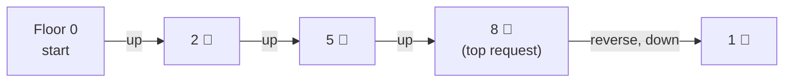
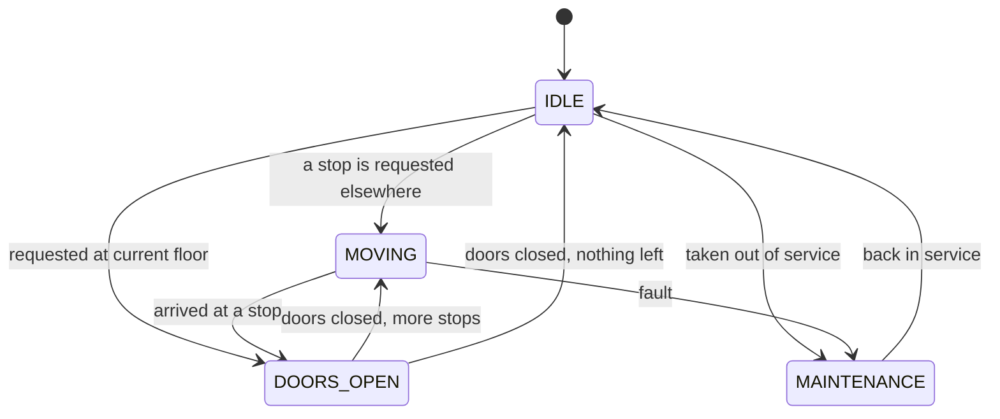

# Start Here: How Does an Elevator Decide Where to Go? (Before the Interview)

> You ride elevators every day, but you've probably never thought about the software deciding *which* car comes, *why* it sometimes passes your floor, or *in what order* it stops. This page turns your everyday lift ride into the requirements for the interview.
>
> Time: ~10 minutes. Then: [L4](L4-mid.md) → [L5](L5-senior.md) → [L6](L6-staff.md).

---

## 1. A 9 am rush in an office tower

Karthik arrives at his office building's lobby. There are **4 elevators** and 20 floors.

| What Karthik sees | What the software is doing |
|---|---|
| He presses **▲ (UP)** on the wall | A **hall call**: "someone on floor 0 wants to go up". It doesn't say *which* floor yet |
| The display above car **C** lights up; C arrives | The controller **chose one car** for this call: the one that can get there soonest |
| Inside, he presses **14**; others press 6, 11, 3 | **Car calls**: floors requested from *inside* that specific car |
| The car stops at 3, 6, 11, 14, **in that order**, not in the order buttons were pressed | It sorts stops along its direction of travel: the **LOOK** algorithm |
| At 11, someone on floor 9 had pressed **▼ DOWN**, but the car didn't stop at 9 | The car is going *up*; that person wants *down*. Stopping would just give them a ride the wrong way |
| After 14, the car turns around and picks up the 9 ▼ person | Nothing left above → **reverse** and serve the down requests |
| Car B shows "Out of service" | **Maintenance**: the controller stops assigning calls to it |

That's the whole product. The interview is about modelling this cleanly and choosing good rules.

---

## 2. Where you've seen this (including in infra)

| Place | What's interesting |
|---|---|
| **Office towers / malls** | Several cars; the system picks one per hall call |
| **Modern high-rises with a keypad in the lobby** ("destination dispatch") | You type your floor *before* boarding; the screen says "go to car D". The system groups people going to similar floors into the same car |
| **Hospitals** | Priority for stretchers/emergency (a key switch overrides normal calls) |
| **Fire alarm** | All cars return to the ground floor and stop taking calls ("fire service mode") |
| **Linux disk I/O schedulers** (infra!) | The classic disk-scheduling algorithm is literally called the **"elevator algorithm"** (SCAN): the disk head sweeps one way serving requests, then reverses. `cat /sys/block/<disk>/queue/scheduler` on a Linux box shows which I/O scheduler is active |
| **Kubernetes scheduler** (infra!) | Choosing a node for a pod works like choosing a car for a call: **filter** out ineligible nodes (like cars in maintenance), then **score** the rest (like a travel-cost function) and pick the best |

---

## 3. The features, one situation at a time

### 3.1 Hall calls vs car calls
- **Hall call** = button *outside*, on a floor: floor + direction (▲ or ▼). Any car can answer it.
- **Car call** = button *inside* a car: just a floor. Only *that* car must go there.

👉 Interview: *two different request types, and who handles each.*

### 3.2 Which car comes? (dispatching)
Car A is idle on floor 0. Car B is on floor 4 heading up to 15. You're on floor 6 pressing ▲. Car B is the better choice: it's already coming your way. But if you'd pressed ▼, car B would have to go to 15 and come back. Car A might be faster.

👉 Interview: *a cost function for choosing a car, and making the rule swappable* (**Strategy** pattern).

### 3.3 In what order does a car stop? (scheduling)
"First come, first served" would make the car zig-zag: 14, then 3, then 11… Instead it **keeps going in one direction while there are requests ahead, then reverses**. That's **LOOK** (a variant of SCAN, the "elevator algorithm"). See [scheduling algorithms](../../concepts/scheduling-algorithms.md).

👉 Interview: *data structure for stops: a sorted set lets you ask "next stop above floor 7?" instantly* ([TreeSet](../../libraries/java/treeset-and-priorityqueue.md)).

### 3.4 Direction matters
The person on 9 who pressed ▼ isn't picked up while the car passes 9 going up.

👉 Interview: *keep "stops to serve going up" and "stops to serve going down" separately.*

### 3.5 States
A car is **idle**, **moving**, **doors open**, or **in maintenance**. Some actions are only valid in some states (doors never open while moving).

👉 Interview: *a state machine* ([state machines](../../concepts/state-machines.md)).

### 3.6 Many buttons pressed at once
Dozens of people press buttons simultaneously, from different floors and cars, while the cars are moving.

👉 Interview: ***concurrency***. In our design, every button press becomes a **command** in a queue, and one simulation thread applies them in order, so the elevator state never needs locks ([single-writer principle](../../concepts/single-writer-principle.md)).

### 3.7 Displays
"Car C ▲ 7" above each door and inside the car.

👉 Interview: *displays subscribe to events* (**Observer** pattern).

### 3.8 Maintenance and emergencies
A car breaks: its pending hall calls must go to other cars. All cars in maintenance: calls must wait, not be lost.

👉 Interview: *reassignment, degraded mode.*

---

## 4. The key mechanism: LOOK, drawn

One car at floor 0. Buttons pressed in this order: 8, 2, 5. Later, while passing floor 4 going up, someone presses 1.

Press order was 8, 2, 5, 1 → **service order is 2, 5, 8, 1**. Fewer reversals means less travel and shorter waits overall.

And the car's life as a state machine:

---

## 5. Try it yourself (real, 5 minutes)

1. **Next time you take a lift with others**, notice: the stop order follows floors, not who pressed first. Press a floor *behind* the car's direction and see it get served only after the car reverses.
2. **Watch for a car passing your floor** when you pressed ▼ and it's going up. Now you know why.
3. **If your building has a lobby keypad** (destination dispatch), try it: you type a floor and it tells you which car to take.
4. **On a Linux machine:** `cat /sys/block/*/queue/scheduler` shows the disk I/O scheduler in brackets, e.g. `[mq-deadline] kyber bfq none`. Modern SSDs often use `none` because they have no moving head to optimise for, which is a nice example of an algorithm becoming unnecessary when the hardware changes.

---

## 6. From experience to requirements

| What you experienced | Requirement | Type |
|---|---|---|
| ▲/▼ on a floor | `callElevator(floor, direction)`: hall call | Functional |
| Floor buttons inside | `pressFloor(carId, floor)`: car call | Functional |
| A car is chosen for you | Dispatching strategy (swappable) | Functional |
| Stops in floor order | LOOK scheduling per car | Functional |
| Car doesn't stop for wrong-direction callers | Direction-aware stops | Functional |
| Displays show position | Events / observers | Functional |
| "Out of service" | Maintenance: exclude car, reassign its calls | Functional |
| Many people pressing at once | **Thread-safe** request intake | Non-functional |
| Testable without real waiting | **Discrete time steps** ("ticks") | Non-functional |
| Add destination dispatch later | **Extensible** design | Non-functional |

---

## 7. Mini glossary

| Term | Meaning in plain words |
|---|---|
| **Car** | One elevator cabin |
| **Hall call** | Request from a floor's ▲/▼ button: floor + direction |
| **Car call** | Request from a button inside a car: just a floor |
| **Dispatching** | Deciding which car answers a hall call |
| **LOOK** | Keep moving in one direction while requests remain ahead, then reverse |
| **SCAN** | Like LOOK, but always travels to the very top/bottom before reversing |
| **Destination dispatch** | Passengers enter their destination in the lobby; the system groups them into cars |
| **Tick** | One simulated time step (here: the car moves one floor or opens/closes doors) |
| **Command** | A button press packaged as an object to be processed later, in order |
| **Single writer** | Only one thread changes the state; others send it requests |

➡️ **Now design it:** [L4-mid.md](L4-mid.md)
