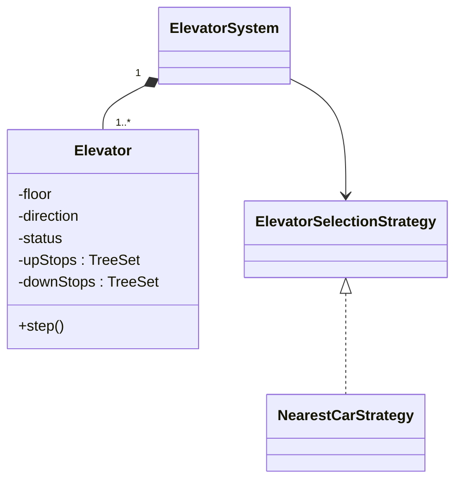

# Elevator System — L4 (Mid-level / SDE2) LLD Interview

> **Level expectation:** model the domain cleanly, implement a correct per-car scheduling algorithm (LOOK) with the right data structure, a simple dispatcher for hall calls, and a way to run/test the system step by step. Handle basic concurrency correctly when asked.

> 🆕 Never thought about elevator software? Read [00-understand-the-product.md](00-understand-the-product.md) first. It explains hall vs car calls and why lifts stop in floor order.

Legend: **🧑‍💼 Interviewer** · **🧑‍💻 Candidate** · **📝 Note** = commentary for you.

---

## 1. Clarifying requirements

**🧑‍💼 Interviewer:** Design an elevator system.

**🧑‍💻 Candidate:** Questions first:
- How many elevators and floors? Any basements (negative floors)?
- Buttons: ▲/▼ on each floor plus floor buttons inside each car (the usual setup)?
- Do I control the physical motors, or is this the scheduling/control logic only?
- Capacity/weight limits? Emergency modes?
- How do we represent time: a real-time system, or can I simulate in steps?

**🧑‍💼 Interviewer:** N elevators, floors 0..M. Usual buttons. Logic only, no hardware. Ignore weight and emergencies for now. Simulating in steps is fine.

**🧑‍💻 Candidate:**

**Functional**
1. Hall call: `callElevator(floor, UP|DOWN)`; the system assigns a car.
2. Car call: `pressFloor(carId, floor)`.
3. Each car serves its stops efficiently (not zig-zagging).
4. Cars can be put in maintenance.

**Non-functional**
1. Correct and testable (deterministic).
2. Button presses can come from many threads.
3. Easy to swap the dispatching rule.

> 📝 **Note:** "Can I simulate time in steps?" is a high-value question. It turns a real-time problem into something you can test deterministically, and interviewers almost always say yes.

---

## 2. Core entities

| Thing | Kind | Why |
|---|---|---|
| `Direction` | enum `UP, DOWN, IDLE` | Fixed set |
| `ElevatorStatus` | enum `IDLE, MOVING, DOORS_OPEN, MAINTENANCE` | A small state machine ([state machines](../../concepts/state-machines.md)) |
| `HallCall` | record `(floor, direction)` | Immutable request value |
| `CarCall` | record `(elevatorId, floor)` | Immutable request value |
| `Elevator` | class | Identity + changing state (floor, direction, stops) |
| `ElevatorSelectionStrategy` | interface | Dispatching rule, swappable |
| `ElevatorSystem` | class | The facade that buttons talk to |

**🧑‍💼 Interviewer:** Why aren't hall calls and car calls the same class?

**🧑‍💻 Candidate:** They mean different things. A hall call has a **direction** and can be served by **any** car, so it needs dispatching. A car call has **no** direction and belongs to **one** car. Merging them would force nullable fields and `if (isHallCall)` checks everywhere.

---

## 3. Interfaces

```java
public final class ElevatorSystem {
    public void callElevator(int floor, Direction direction);   // hall call
    public void pressFloor(int elevatorId, int floor);           // car call
    public void tick();                                          // advance time by one step
    public List<ElevatorSnapshot> snapshots();                   // read-only view for displays/tests
}

public interface ElevatorSelectionStrategy {
    Optional<Elevator> select(List<Elevator> elevators, Command.HallCall call);
}
```

---

## 4. Class diagram

See the [README](README.md#class-diagram-matches-the-code) for the full diagram. Core of it:



---

## 5. Deep dives

### 5.1 Stop order: LOOK with sorted sets

**🧑‍💻 Candidate:** If a car serves stops in the order pressed (first come, first served), it zig-zags: 8, then 2, then 5. Elevators instead use **LOOK**: keep going in the current direction while there are stops ahead, then reverse ([scheduling algorithms](../../concepts/scheduling-algorithms.md)).

Data structure: I need "the next stop at or above floor X" quickly. A **sorted set** answers that directly ([TreeSet](../../libraries/java/treeset-and-priorityqueue.md)):

```java
TreeSet<Integer> stops = new TreeSet<>(List.of(2, 5, 8));
stops.ceiling(3);  // 5     smallest stop >= 3  (next stop going up)
stops.floor(3);    // 2     largest stop <= 3   (next stop going down)
```

Simplest version, one set of stops per car:

```java
Integer nextTarget() {
    if (direction == UP) {
        Integer ahead = stops.ceiling(floor);
        if (ahead != null) return ahead;
        direction = DOWN;                         // nothing above: reverse
    }
    if (direction == DOWN) {
        Integer ahead = stops.floor(floor);
        if (ahead != null) return ahead;
        direction = UP;
        return stops.ceiling(floor);              // may be null → idle
    }
    return nearest(stops);                        // IDLE: closest stop either way
}
```

Each `ceiling`/`floor` is O(log n), where n = number of pending stops (tiny in practice).

**🧑‍💼 Interviewer:** Why not a `PriorityQueue`?

**🧑‍💻 Candidate:** A priority queue only gives you the min (or max). I need "the next one **above my current floor**", which changes as the car moves, plus removing an arbitrary floor when I arrive. `TreeSet` does both in O(log n); `PriorityQueue.remove(Object)` is O(n).

### 5.2 Time as ticks

**🧑‍💻 Candidate:** I model time explicitly: each `tick()` every car does exactly one thing: close its doors, or move one floor, or open its doors at a stop. Tests call `tick()` in a loop and check the order doors opened. No `Thread.sleep`, no flaky timing.

```java
void step() {
    if (status == DOORS_OPEN) { status = hasStops() ? MOVING : IDLE; return; }  // doors open for one tick
    Integer target = nextTarget();
    if (target == null) { status = IDLE; direction = IDLE; return; }
    if (target != floor) floor += (target > floor) ? 1 : -1;
    if (stops.remove(floor)) status = DOORS_OPEN;
}
```

### 5.3 Choosing a car for a hall call

**🧑‍💻 Candidate:** Simple, sensible first rule: the **nearest car that's in service**, preferring one that's idle or already heading toward the caller. Code: [NearestCarStrategy.java](java/src/elevator/NearestCarStrategy.java). It's behind an interface so we can try other rules (e.g. least busy, [LeastBusyStrategy.java](java/src/elevator/LeastBusyStrategy.java)) without touching `ElevatorSystem`.

---

## 6. Follow-ups

**🧑‍💼 Interviewer:** A person on floor 5 presses ▼ while a car going up to 9 passes floor 5. With one set of stops, what happens?

**🧑‍💻 Candidate:** It stops at 5 on the way up, opens the doors, and the person who wants to go down gets in a car going up. Real elevators don't do that. Fix: keep **two** sets per car, `upStops` (served while going up) and `downStops` (served while going down), and put a ▼ hall call into `downStops`. That's the [L5](L5-senior.md#31-direction-aware-stops) design, and what the code does.

**🧑‍💼 Interviewer:** Several threads press buttons at once. Is that safe?

**🧑‍💻 Candidate:** `TreeSet` and the elevator fields aren't thread-safe. Simplest fix: make `callElevator`, `pressFloor` and `tick` `synchronized` on the system. Buttons are pressed a few times per second, so one lock is plenty. (The L5 design avoids locks entirely with a command queue.)

**🧑‍💼 Interviewer:** A car goes into maintenance with pending hall calls.

**🧑‍💻 Candidate:** Mark it `MAINTENANCE` so the strategy skips it, and re-dispatch its unserved **hall** calls to other cars. Its car calls are dropped: passengers get out at the nearest floor in reality.

---

## 7. What the interviewer was evaluating (L4)

- [ ] Clarified hardware vs logic, time model, scope
- [ ] Separate hall calls and car calls, with reasons
- [ ] Enums for direction and status; records for requests
- [ ] LOOK, implemented with a sorted set (`ceiling`/`floor`); explained why not a priority queue
- [ ] Deterministic tick-based simulation and tests
- [ ] A dispatcher behind an interface
- [ ] Correct (even if coarse) thread safety

## 8. Common mistakes at this level

| Mistake | Why it's wrong |
|---|---|
| A FIFO queue of floors per car | Zig-zags; long waits |
| One `Request` class with nullable direction and car ID | Mixes two concepts; `if` checks everywhere |
| `Thread.sleep(1000)` per floor inside the logic | Untestable; slow tests |
| A thread per elevator mutating shared state without locks | Race conditions on stops and assignments |
| `PriorityQueue` for stops | No "next above X" query; O(n) arbitrary removal |
| Designing motors, door sensors, weight sensors before the scheduler works | Out of scope; burns time |

➡️ Next: [L5-senior.md](L5-senior.md)
