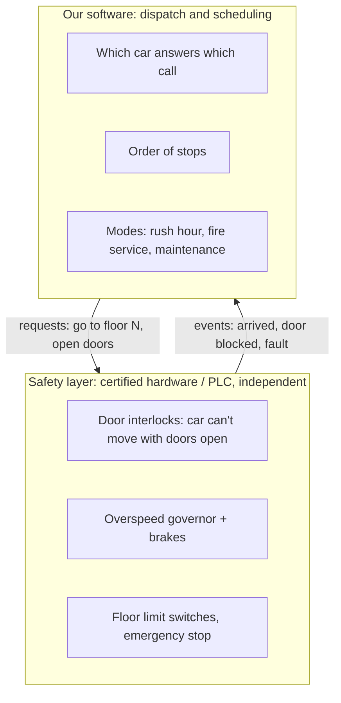
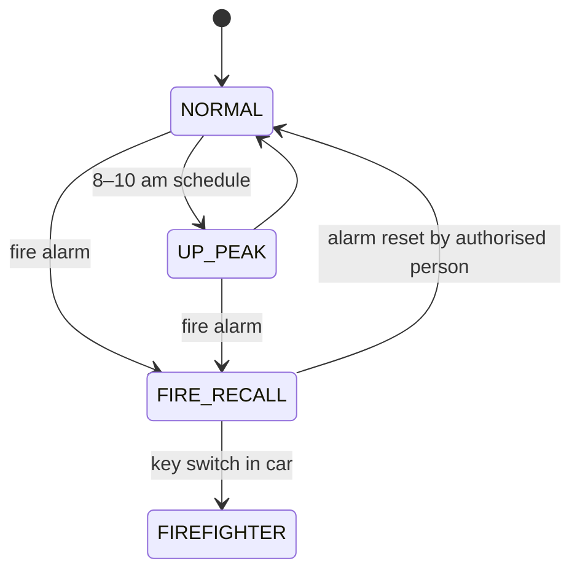

# Elevator System — L6 (Staff) LLD Interview

> **Level expectation:** the L5 design takes ~15 minutes. Then the interviewer makes it real: *"This controls physical machines that carry people. And we sell it to 500 buildings."* You keep the clean core, and reason about safety boundaries, hardware events and faults, testing something you can't easily test in production, tuning dispatch with simulation, and product variants (destination dispatch, modes), still able to point at the code that changes. Read [L5-senior.md](L5-senior.md) first.

Legend: **🧑‍💼 Interviewer** · **🧑‍💻 Candidate** · **📝 Note** = commentary for you.

---

## 1. First question: what is software allowed to decide?

**🧑‍💼 Interviewer:** This runs real elevators. What changes?

**🧑‍💻 Candidate:** The most important design decision: **safety must not depend on this software.**



- Our code **requests** actions ("go to 7", "open doors"); the safety controller **decides** whether they're safe and can refuse. Software bugs can cause bad service, never injury. That's also how elevator certification works (safety functions are separately certified hardware/firmware).
- So the L5 `step()` that moves a car one floor per tick becomes "send a target to the motion controller and wait for an `ARRIVED` event". The scheduling logic is unchanged; time comes from **real events** instead of ticks.

> 📝 **Note:** Drawing the boundary between "safety-critical" and "business logic" before designing anything is the staff move. The same principle applies anywhere software controls physical things.

---

## 2. From ticks to events

**🧑‍💻 Candidate:** The single-writer design pays off here. Hardware signals become just more commands in the same queue:

```java
sealed interface Command permits HallCall, CarCall, SetMaintenance,
                                 Arrived, DoorsClosed, DoorBlocked, Fault, LoadChanged { }
```

- One thread still owns all state; button presses **and** hardware events are applied in the order received. No locks, and the event log is a complete, replayable history.
- **Timers become events too:** "doors have been open 8 s" is a `DoorTimeout` command scheduled by a timer thread ([scheduled executor](../../libraries/java/scheduled-executor-service.md)), not a `sleep` in the logic.
- **Replay for debugging:** store the command stream; replaying it through the same code reproduces any incident exactly, which works because the logic is deterministic given its inputs. ([Single-writer principle](../../concepts/single-writer-principle.md).)

---

## 3. Faults and degraded modes

| Situation | Behaviour |
|---|---|
| Car stops responding (no `ARRIVED` within expected time) | Mark faulty → maintenance path: reassign hall calls; alert technicians |
| Door repeatedly blocked | After N attempts, close with reduced force / buzzer (safety layer), report; dispatch may skip the car briefly |
| **Controller software crash** | Cars finish their current trip safely (safety layer); a standby controller takes over by **replaying state from cars** (each car reports floor/direction/load) since hall-call state is cheap to rebuild: the buttons are still lit |
| Network between floor panels and controller down | Floor panels fall back to "any car stops at every floor with a lit button" (degraded but safe), the classic fallback mode |
| **Fire alarm** | Building-wide mode: cancel all calls, send every car to the designated floor, open doors, disable hall calls. A system-level **state** above per-car states |



**🧑‍💻 Candidate:** Building modes map cleanly onto the existing design: each mode selects a **dispatch Strategy** and a set of allowed commands. `FIRE_RECALL` ignores hall calls, which is one `if` in `apply()` guarded by the mode. ([State machines](../../concepts/state-machines.md).)

---

## 4. Destination dispatch

**🧑‍💼 Interviewer:** Our premium product has lobby keypads: passengers type their destination before boarding.

**🧑‍💻 Candidate:** That changes the **request model**, not just the strategy:
- Hall calls become `DestinationCall(fromFloor, toFloor)`: we know both ends at assignment time.
- The dispatcher **groups** passengers with nearby destinations into the same car ("A: 12, 14, 15"; "B: 3, 5"), so each car makes fewer stops. Studies and vendors report significantly shorter journey times in busy buildings.
- Inside the car there are no buttons, so car calls are created by the dispatcher at assignment.
- The keypad must **answer immediately** ("Go to car C"), and the assignment is a promise: no reallocation later, since a passenger can't be told to walk to another car once they're standing at C.

With `Command` as a sealed type and dispatch as a Strategy, this is a **new command + new strategy**; `Elevator` and the LOOK logic are reused as-is.

---

## 5. Tuning: simulate before you ship

**🧑‍💻 Candidate:** You can't A/B test a dispatch algorithm on a hospital's elevators. But because our core is deterministic and tick-driven, we can run it **offline** against real traffic:

1. Record real buildings' call logs (time, from floor, to floor).
2. Replay them through the simulator with strategy A vs strategy B.
3. Compare **average and p95 wait time**, **journey time**, **energy (number of starts/stops)**, and **worst-case waits** (fairness: nobody waits 5 minutes).

That's exactly what our `ElevatorSystem` + `tick()` enables: the L4 decision to make time explicit turns into a product capability. (The rush-hour discussion in [L5](L5-senior.md#4-follow-ups) gets answered with data, not opinions.)

> 📝 **Note:** Connecting an early design choice (explicit ticks, deterministic core) to a later business capability (offline evaluation) is a strong staff signal: decisions with long-term leverage.

---

## 6. Many buildings: product and operations

- **Configuration per building:** floors (including skipped ones like "no 13th floor" and basements), car groups (low-rise vs high-rise banks), which cars serve which floors, mode schedules. That's data, not code: validated config with versioning.
- **Remote monitoring:** each controller streams events (the same `ElevatorEvent`s) to a central service: predictive maintenance (door motor taking longer to close each week), SLA reports (average wait per building).
- **Updates:** controller software updates are risky physical-world deployments: staged rollout, one car group at a time, automatic rollback to the previous version on fault rate increase, and never during peak hours.
- **Security:** remote access to building controllers is a real attack surface: authenticated, audited, and unable to override the safety layer anyway.

---

## 7. Curveballs

**🧑‍💼 Interviewer:** Users complain a particular car "never comes" on floor 18.

**🧑‍💻 Candidate:** Check the replay logs for hall calls on 18 and their assignments. Typical causes: the cost function penalises that car (e.g. it's often busy) so others are always picked, which is fine unless *wait time* on 18 is bad; or a starvation bug, e.g. a car that keeps getting new calls ahead in its direction and never reverses. LOOK itself doesn't starve (each sweep ends), but **reallocation** can (calls keep moving to "better" cars). Mitigation: an age-based priority boost for hall calls waiting longer than X seconds.

**🧑‍💼 Interviewer:** Why not a thread per elevator? It feels more natural.

**🧑‍💻 Candidate:** It mirrors the physical world, but dispatch needs a **consistent view of all cars at once**, which with per-car threads means locking all of them (deadlock risk, contention) or reading inconsistent state. With a single writer, dispatch sees a consistent snapshot for free. A building has at most a few dozen cars and a few events per second, far below what one thread handles, so there's no throughput reason to split. ([Executors & threads](../../libraries/java/executors-and-threads.md).)

---

## 8. What the interviewer was evaluating (L6)

- [ ] Separated the safety layer from the control software before designing
- [ ] Moved from ticks to hardware events without changing the core logic
- [ ] Fault handling, controller failover by rebuilding from car state, degraded floor-panel mode
- [ ] Building-level modes (fire recall, peaks) as a state machine selecting strategies
- [ ] Destination dispatch as a new request model + strategy, reusing the core
- [ ] Offline simulation/replay for tuning, enabled by determinism
- [ ] Multi-building configuration, monitoring, safe rollouts, security
- [ ] Defended the single-writer choice against thread-per-car with concrete reasons

## 9. Common mistakes at this level

| Mistake | Why it hurts at L6 |
|---|---|
| Letting dispatch software enforce safety (door/motion interlocks) | Software bugs become injuries; won't pass certification |
| Real-time logic full of `sleep`s and callbacks | Non-deterministic, unreplayable, untestable |
| No answer for controller failure | Building stops |
| Treating destination dispatch as "just another strategy" | It changes the request model and the UX contract |
| Tuning dispatch in production by intuition | Unsafe and unmeasurable; simulate with recorded traffic |
| Hard-coding building layouts | 500 buildings, 500 forks |

⬅️ Previous: [L5-senior.md](L5-senior.md) · 🏠 [Problem overview](README.md)
