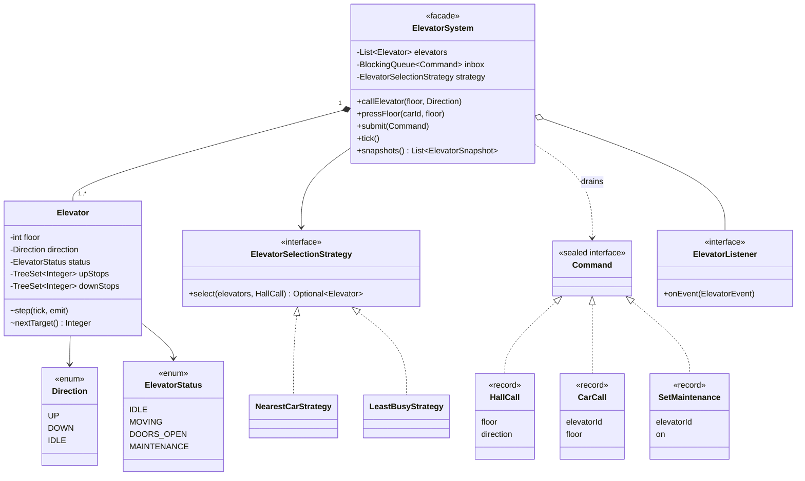

# LLD Interview: Design an Elevator System

> "Design the control software for a building with N elevators and M floors. People press buttons on floors and inside cars; the system decides which car goes where."

A classic LLD question that mixes **modelling** (cars, requests, states), **algorithms** (in what order to stop: LOOK; which car to send: a cost function) and **concurrency** (buttons pressed from everywhere at once). It's also a great place to show the **single-writer** design: one thread owns all elevator state, everyone else sends it commands.

## How to read this folder

> 👉 **Never thought about what the elevator software does? Start with [00-understand-the-product.md](00-understand-the-product.md).** It explains hall calls vs car calls, why a lift passes your floor, and the "elevator algorithm" (which is also how Linux used to schedule disk I/O).

| File | Level | What "good" looks like |
|---|---|---|
| [00-understand-the-product.md](00-understand-the-product.md) | Everyone, first | Know hall vs car calls, LOOK, dispatching, states |
| [L4-mid.md](L4-mid.md) | Mid / SDE2 | Clean model (enums, Elevator, requests), LOOK with sorted sets, a simple dispatcher, tick-based simulation |
| [L5-senior.md](L5-senior.md) | Senior | Direction-aware stops, cost-based dispatch Strategy, Command queue + single-writer concurrency, maintenance & reassignment, observers, deterministic tests |
| [L6-staff.md](L6-staff.md) | Staff | Real-world: safety vs software layers, hardware events, failure/fault handling, destination dispatch, simulation for tuning, building-wide modes, testing strategy |

## Code (runnable, no dependencies)

| | Run | Files |
|---|---|---|
| ☕ Java 21 | `./java/run.sh` | [java/src/elevator/](java/src/elevator/): `Elevator`, `ElevatorSystem`, `NearestCarStrategy`, `LeastBusyStrategy`, `Command`, tests in `ElevatorTests.java` |
| 🟨 Node 22 | `cd js && node --test` | [js/elevator.js](js/elevator.js), [js/elevator.test.js](js/elevator.test.js) |

## Class diagram (matches the code)

## Libraries & concepts used

**Java:** [TreeSet & PriorityQueue](../../libraries/java/treeset-and-priorityqueue.md) · [Blocking queues & producer-consumer](../../libraries/java/blocking-queues-and-producer-consumer.md) · [Executors & threads](../../libraries/java/executors-and-threads.md) · [Enums & EnumMap](../../libraries/java/enums-and-enummap.md) · [Records & immutability](../../libraries/java/records-and-immutability.md) · [Concurrent collections](../../libraries/java/concurrent-collections.md)

**JS:** [Sorted collections in JS](../../libraries/js/sorted-collections-in-js.md) · [Async/await & timers](../../libraries/js/async-await-and-timers.md) · [Event loop & concurrency](../../libraries/js/event-loop-and-concurrency.md) · [Classes & private fields](../../libraries/js/classes-and-private-fields.md)

**Concepts:** [Scheduling algorithms (FCFS, SSTF, SCAN, LOOK)](../../concepts/scheduling-algorithms.md) · [State machines](../../concepts/state-machines.md) · [Single-writer principle](../../concepts/single-writer-principle.md) · [Design patterns (Strategy, Command, Observer, State, Facade)](../../concepts/design-patterns.md) · [OOP modelling](../../concepts/oop-modeling.md) · [Thread-safety basics](../../concepts/thread-safety-basics.md)

## The core insight

1. **Two request types:** hall calls (floor + direction, any car) and car calls (floor, one specific car).
2. **Per car, stops live in two sorted sets: "serve going up" and "serve going down".** LOOK becomes "next stop at or above me" (`ceiling`) / "at or below me" (`floor`).
3. **Make time explicit (ticks) and give state a single owner.** Buttons enqueue commands; one thread applies them. No locks, deterministic tests.
