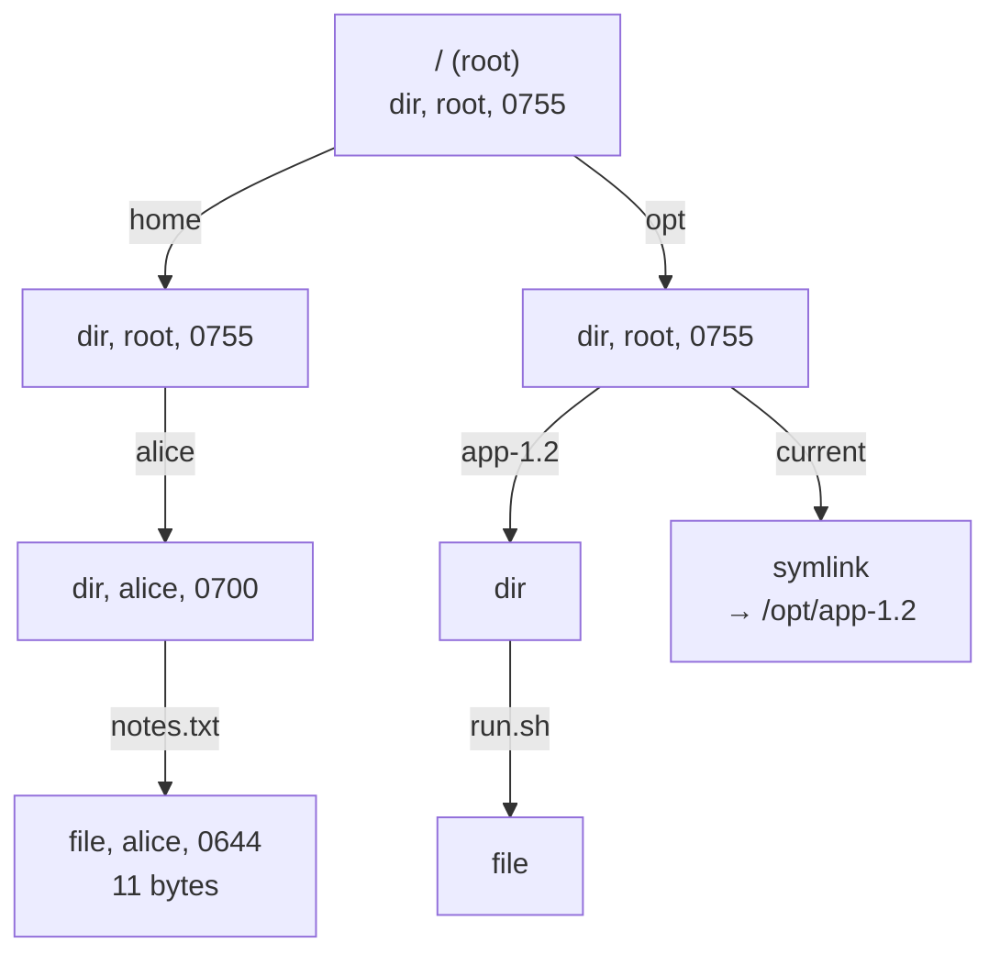

# Start Here: What Is a File System? (Before the Interview)

> You use one every few seconds: `mkdir -p /var/log/app`, `echo ok > health.txt`, `mv build build.old`, `rm -rf node_modules`, `chmod 600 key.pem`. Kubernetes mounts your ConfigMaps as files. This interview asks you to build the thing behind those commands, **in memory**: a tree of folders and files with names, paths, sizes, permissions and links, safe to use from many threads.
>
> Time: ~10 minutes. Then: [L4](L4-mid.md) → [L5](L5-senior.md) → [L6](L6-staff.md).

---

## 1. The problem as a story: the bucket with no folders

A team stores build artifacts in one big key-value store (a map from a string key to a blob of bytes). There are no folders, so they invent them in the key names:

```
builds/payments/1.4.2/app.jar
builds/payments/1.4.2/checksums.txt
builds/payments/1.4.3/app.jar
... 2 million more keys
```

It works until three things happen:

1. **"Rename the `payments` folder to `billing`."** There is no folder. There are 400,000 keys that start with `builds/payments/`. Renaming means **copy each one to a new key, then delete the old one**: 800,000 operations, hours of work, and if the job dies halfway, half the artifacts are under each name. This is exactly how Amazon S3 works: S3 "folders" are just **key prefixes** (the first part of the key, up to a `/`), and the console draws folders by grouping keys ([object storage](../../../HLD/technologies/object-storage.md)).
2. **"Who can read what?"** Each key needs its own access rule. There's no "everything inside this folder is private" because there is no "inside".
3. **"How big is `payments`?"** List 400,000 keys and add up their sizes, every time someone asks.

A **file system** fixes all three with one idea: **a tree**. A **directory** (folder) is a real object that holds **entries** (name → child). A file's full name, its **path** like `/builds/payments/1.4.2/app.jar`, is not stored anywhere: it is the route you walk from the **root** (`/`, the top of the tree) down through the directories.

- Renaming `payments` changes **one entry in one directory**. Its 400,000 descendants come along for free, because they hang off it: O(1) instead of O(n) ([Big-O](../../concepts/big-o-complexity.md): a way to say how cost grows with the input size `n`).
- Permissions live on directories too: lock the directory and nobody can walk through it.
- A directory can answer "how big am I?" by asking its children.

The catch, and the meat of the interview: walking paths correctly (`.`, `..`, `//`), moving a folder without creating a loop, symbolic links that point in circles, the rwx rules, and many threads changing the tree at once.

---

## 2. Where you've seen this

| Place | What you saw |
|---|---|
| **Linux (ext4, XFS: the usual on-disk file system formats)** | The tree itself. `ls -l` shows `drwxr-xr-x  2 alice dev 4096 app`: type, permissions, link count, owner, group, size, name |
| **S3 / GCS buckets** | Flat key space. `aws s3 ls s3://bucket/builds/` shows `PRE payments/` lines: those "folders" are prefixes grouped by the API (the `delimiter=/` option). No real rename |
| **Azure Data Lake Gen2, GCS hierarchical namespace** | Object stores that added **real directories** on top, mainly so big-data jobs can rename a whole output folder atomically (L6) |
| **Google Drive / Dropbox** | Folders you drag around: moving a folder with 10,000 files is instant. Sharing a folder shares everything inside. Dropbox keeps names in a **metadata** database (data about files: names, sizes, owners) and file contents as blocks elsewhere (L6, [File Storage & Sync HLD](../../../HLD/interviews/file-storage-sync/README.md)) |
| **Kubernetes ConfigMap volumes** | `kubectl exec ... ls -la /etc/config` shows each key as a **symlink** into a hidden `..data` directory. An update swaps one symlink so the app sees all-old or all-new files, never a mix (L5) |
| **`/proc` and `/sys`** | Look like directories and files, but nothing is on disk: the kernel generates the content when you read it. `stat /proc/cpuinfo` says size 0, yet `cat` prints kilobytes. A file system is an **interface** (a set of operations), not a disk format |
| **Zip / jar files** | Inside, a flat list of full paths (`com/acme/App.class`), like S3. Tools show it as a tree |
| **Git** | A commit points to a **tree object**: a directory listing of name → hash. Same tree idea, made immutable ([how git stores objects](../../../under-the-hood/git-object-store.md)) |
| **Docker images** | Layers stacked into one tree by an **overlay file system** (it shows several directory trees merged as one); a file deleted in a top layer is hidden by a "whiteout" marker file |

---

## 3. The features, one situation at a time

### 3.1 Make folders: `mkdir` and `mkdir -p`
A deploy script runs `mkdir /var/log/app/2026` and fails with "No such file or directory" because `/var/log/app` doesn't exist yet. `mkdir -p` creates every missing level and is happy if they already exist, so the script can run twice.

👉 Interview: *`mkdir` needs the parent; `mkdirs` walks and creates (L4).*

### 3.2 Create, write, append, read
`echo started > app.log` creates or **replaces** the file; `echo more >> app.log` **appends** (adds to the end); `cat app.log` reads it. `touch new.txt` creates an empty file.

👉 Interview: *`createFile`, `write`, `append`, `read`; what happens on a missing parent, on a directory (L4).*

### 3.3 List, sorted: `ls`
`ls` prints names in sorted order. On a file, it just prints the file.

👉 Interview: *children in a `HashMap` (fast, unordered) or a `TreeMap` (sorted for free) (L4).*

### 3.4 Paths: absolute, relative, `.` and `..`
You're in `/home/alice` (your **current working directory**, cwd, what `pwd` prints). `cat notes.txt` means `/home/alice/notes.txt` (a **relative** path, resolved from the cwd). `cat /etc/hosts` starts at the root (an **absolute** path). `.` is "this directory", `..` is "the parent", and `cd ..` at `/` keeps you at `/`. `//a///b/` is the same as `/a/b`.

👉 Interview: *path parsing and normalisation; the edge cases interviewers test (L4).*

### 3.5 Rename and move: `mv`
`mv build build.old` renames; `mv report.pdf archive/` moves the file **into** the directory. Moving a folder with a million files is instant on Linux. But `mv a a/b/c` is refused: "cannot move 'a' to a subdirectory of itself". If allowed, `a` would be cut off from the root, holding itself.

👉 Interview: *mv is O(1) in a tree; the subtree check; what may be overwritten (L4, L5).*

### 3.6 Delete: `rm`, `rm -r`
`rm file` deletes a file. `rm dir` on a non-empty folder fails; `rm -r dir` deletes everything below. On-call classic: you need `rm -r` to clean `/tmp/build`, and you double-check the path first.

👉 Interview: *`DirectoryNotEmpty` unless recursive; what permission a delete needs (L4, L5).*

### 3.7 How big is it: `du`
The disk alert fires at 90%. `du -sh /var/log/*` tells you which folder is eating space: a directory's size is the sum of everything below it.

👉 Interview: *recursive size (the Composite pattern); recompute vs cache and update ancestors (L4, L5).*

### 3.8 Find things: `find`
`find /var/log -name '*.gz' -size +100M` finds big compressed logs anywhere below.

👉 Interview: *a depth-first walk with filters; Visitor vs Iterator (L5).*

### 3.9 Symbolic links: `ln -s`
Releases live in `/opt/app-1.2`, `/opt/app-1.3`; `/opt/current` is a **symbolic link** (symlink: a small file whose content is another path; the system follows it when you use it). Deploy = repoint `current`; rollback = repoint it back. But `ln -s a b; ln -s b a; cat a` gives "Too many levels of symbolic links": a **loop**. Linux stops after 40 hops.

👉 Interview: *resolving links during the path walk, loop detection with a hop limit (L5).*

### 3.10 Permissions: `rwx` for owner, group, others
`-rw-r--r-- alice dev notes.txt`: alice can read and write; members of group `dev` can read; everyone else can read. For a **directory** the letters mean something else: `r` = list the names, `w` = create, delete or rename entries inside, `x` = pass through it to reach what's inside. That's why `chmod 700 /home/alice` hides everything below, whatever the files' own permissions say, and why you can delete a read-only file in a directory you can write to.

👉 Interview: *checks on every path component; the owner/group/others rule; root (L5).*

### 3.11 Many threads at once
A log shipper reads files while the app appends and a cleanup job runs `rm -r` on old folders. Nobody may see half a move or lose an append.

👉 Interview: *one read-write lock vs per-node locks and deadlocks (L4, L5).*

### 3.12 Hard links (bonus)
`ln a.log hard.log` gives the **same file** a second name. `ls -li` shows both with the same **inode number** (the file's internal ID) and a link count of 2. `rm a.log` only removes a name; the data stays until the count hits 0.

👉 Interview: *names vs inodes, link counts (L6).*

---

## 4. The key mechanism: a tree, and a walk down it



Names live **on the edges** (in the parent's entry list), not inside the node. That's why a rename touches only the parent.

Resolving `/home/alice/notes.txt` as user bob:

| Step | At | Look up | Check | Result |
|---|---|---|---|---|
| 1 | `/` | `home` | bob has `x` on `/` (others: r-x) ✅ | dir `home` |
| 2 | `home` | `alice` | `x` on `home` ✅ | dir `alice` |
| 3 | `alice` | `notes.txt` | `x` on `alice`: mode 0700, others: `---` ❌ | **Permission denied** |

`/opt/current/run.sh`: at `opt`, look up `current`, it's a symlink, so replace it with its target's parts: the remaining walk becomes `/opt/app-1.2/run.sh`, counting one **hop**. More than 40 hops in one lookup = loop error.

---

## 5. Try it yourself (real, 10 minutes, any Linux box)

```bash
mkdir -p /tmp/fsdemo/var/log/app && cd /tmp/fsdemo
echo hello > var/log/app/a.log
ln var/log/app/a.log hard.log          # hard link: a second name
ln -s var/log/app current              # symbolic link
ls -li . var/log/app                   # -i shows inode numbers
stat var/log/app/a.log
```

Output from the machine used to write this (Linux 6.18, ext4):

```
1680997 lrwxrwxrwx 1 root root   11 Oct  8 16:22 current -> var/log/app
1680983 -rw-r--r-- 2 root root    6 Oct  8 16:22 hard.log
1680939 drwxr-xr-x 3 root root 4096 Oct  8 16:22 var

var/log/app:
1680983 -rw-r--r-- 2 root root 6 Oct  8 16:22 a.log
...
Device: 254,0	Inode: 1680983     Links: 2
Access: (0644/-rw-r--r--)  Uid: (    0/    root)   Gid: (    0/    root)
```

Same inode `1680983`, link count 2: two names, one file. The symlink's size is 11: the length of the text `var/log/app`.

```bash
namei -l "$PWD/current/a.log"          # every component and its permissions, links followed
ln -s loopb loopa; ln -s loopa loopb; cat loopa
mv var/log var/log/app/x
stat -c '%s bytes: %n' /proc/cpuinfo; wc -c < /proc/cpuinfo
```

```
(earlier components trimmed)
drwxrwxrwt root root tmp                 ← t = "sticky bit": in /tmp you may delete only your own files
drwxr-xr-x root root fsdemo
lrwxrwxrwx root root current -> var/log/app
drwxr-xr-x root root   var
drwxr-xr-x root root   log
drwxr-xr-x root root   app
-rw-r--r-- root root a.log
cat: loopa: Too many levels of symbolic links
mv: cannot move 'var/log' to a subdirectory of itself, ...
0 bytes: /proc/cpuinfo
4868
```

`namei` shows the path walk from section 4 with the permissions checked at each step. A chain of 40 symlinks still resolved there; 41 failed.

**Object storage, for contrast** (needs an AWS account and a bucket): `aws s3 ls s3://my-bucket/builds/` prints `PRE payments/` lines (prefixes, not folders), and `aws s3 mv --recursive s3://my-bucket/builds/payments/ s3://my-bucket/builds/billing/` prints one `move:` line **per object**: a copy and a delete each.

**Run this folder's code:** `./java/run.sh` prints the tests and a short shell-like session with `ls -l` output; `cd js && node --test`.

---

## 6. From experience to requirements

| What you experienced | Requirement | Type |
|---|---|---|
| `mkdir`, `mkdir -p` | Create one directory; create a chain, idempotent (safe to run twice) | Functional |
| `echo >`, `echo >>`, `cat`, `touch` | Create, write (replace), append, read files | Functional |
| `ls` | Sorted listing; works on a file too | Functional |
| `cd`, `pwd`, `.`, `..`, `//` | Absolute and relative paths; normalisation; `..` at root stays at root | Functional |
| `mv` | Rename and move in O(1); move into a directory; refuse moving into own subtree | Functional |
| `rm`, `rm -r` | Refuse non-empty without recursive | Functional |
| `du` | Size of a subtree | Functional |
| `find` | Search by name pattern, type, size | Functional |
| `ln -s` | Symlinks to files and directories; detect loops | Functional |
| `chmod`, "Permission denied" | Owner/group/others rwx; directory x/r/w meanings; root | Functional |
| Errors like ENOENT, ENOTDIR | Specific, catchable errors | Functional |
| Log shipper + app + cleanup at once | Thread-safe; no lost writes; no half-done moves visible | Non-functional |
| Million-file folder renamed instantly | Rename cost independent of subtree size | Non-functional |
| Deep paths | Lookup cost proportional to path depth, not tree size | Non-functional |

---

## 7. Mini glossary

| Term | Meaning in plain words |
|---|---|
| **File system** | The tree of names (directories, files) plus the rules for using it |
| **Directory** | A node that holds entries: name → child node |
| **Path** | The route from the root (absolute) or the cwd (relative) to a node |
| **Root** | `/`, the top of the tree, its own parent |
| **cwd** | Current working directory: where relative paths start |
| **Normalisation** | Rewriting a path to its simplest form: drop `.`, `//`, resolve `..` |
| **Inode** | The file's internal record (type, size, owner, mode, where the data is), with a number; names point to it |
| **Hard link** | A second name for the same inode |
| **Symbolic link** | A small file holding another path, followed during lookup |
| **ELOOP** | Linux's error for "too many symlinks followed": almost always a loop |
| **Mode / rwx** | Permission bits: read, write, execute for owner, group, others; written in octal like 0755 |
| **Octal** | Base 8: each digit is 3 bits, so one digit = one rwx triple (7 = rwx, 5 = r-x, 4 = r--) |
| **Prefix (S3)** | The start of an object key up to a `/`; looks like a folder, isn't one |
| **Composite pattern** | Treating a group (directory) and a single item (file) through the same interface |

➡️ **Now build it:** [L4-mid.md](L4-mid.md)
