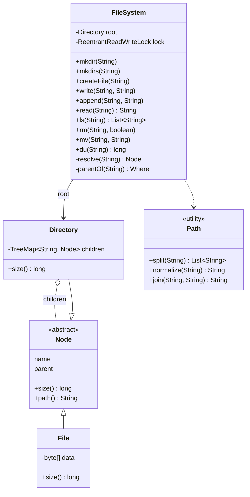
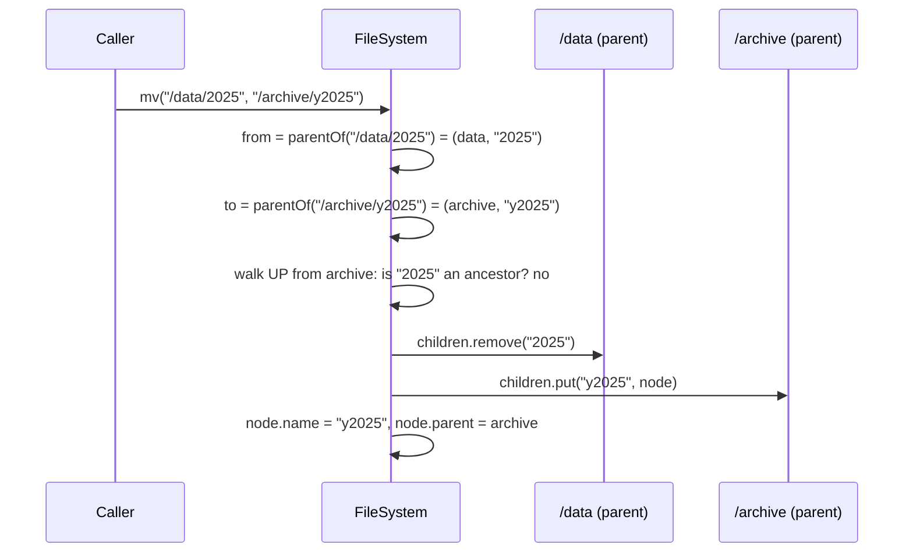

# In-memory File System — L4 (Mid-level / SDE2) LLD Interview

> **Level expectation:** model the tree with clean classes: an abstract **Node** with **Directory** and **File** (the **Composite** pattern), a **FileSystem** facade with `mkdir`, `mkdirs`, `createFile`, `write`, `append`, `read`, `ls`, `rm`, `mv`. Parse and **normalise paths** correctly (`.`, `..`, `//`, trailing `/`). Pick the children map on purpose (`HashMap` vs `TreeMap`). Report failures with **specific exceptions**. Explain why `mv` is O(1) in a tree and must refuse to move a folder into itself.

> 🆕 Never thought about what a folder really is? Read [00-understand-the-product.md](00-understand-the-product.md) first.

Legend: **🧑‍💼 Interviewer** · **🧑‍💻 Candidate** · **📝 Note** = commentary for you.

---

## 1. Clarifying requirements

**🧑‍💼 Interviewer:** Design an in-memory file system.

**🧑‍💻 Candidate:** A few questions first:
- **Which operations?** I'd guess `mkdir`, create/read/write files, `ls`, delete, move. `cd`/`pwd` too?
- **Paths:** absolute only, or relative to a current directory? Do I handle `.` and `..`?
- **File content:** text or bytes? Any size limit?
- **Sorted `ls`?** Like the shell, or any order?
- **Symlinks, permissions, multiple users?** In scope or later?
- **Concurrency:** one caller, or many threads?
- **Persistence:** in memory only, or must it survive a restart?

**🧑‍💼 Interviewer:** The operations you listed, plus `mkdir -p`. Absolute paths in the core API; handle `.` and `..`. Text content. Sorted `ls`. Symlinks and permissions later. Several threads may call it. Memory only.

**🧑‍💻 Candidate:**

**Functional:** `mkdir` (parent must exist), `mkdirs` (create the chain), `createFile`, `write` (replace), `append`, `read`, `ls` (sorted; on a file, its name), `rm` (non-empty directory needs a recursive flag), `mv` (rename or move, including into an existing directory), `du` (total size below a path).

**Non-functional:** lookup cost proportional to **path depth**, not tree size; `mv` cost independent of how much is below the moved folder; thread-safe; clear errors.

> 📝 **Note:** "Persistence?" is the question that tells the interviewer you know where the hard part of real file systems is (crash safety, L6). Scoping it out is fine; not knowing it exists is not.

---

## 2. Core entities

**🧑‍💻 Candidate:**

| Entity | Responsibility |
|---|---|
| `Node` (abstract, sealed) | Common part: `name`, `parent`, `size()`. Later also owner, group, mode |
| `Directory extends Node` | `children`: map name → `Node`. `size()` = sum of children's sizes |
| `File extends Node` | The bytes. `size()` = byte count |
| `FileSystem` | The **facade** (one simple front door to a bigger subsystem): every operation takes a path string, walks the tree, does the change, throws a specific error |
| `Path` (utility) | Pure string work: split on `/`, absolute or relative, normalise `.` and `..` |
| `FsException` + subclasses | `NoSuchFile`, `NotADirectory`, `IsADirectory`, `AlreadyExists`, `DirectoryNotEmpty` |

`Directory` holds `Node`s, and both answer `size()`: that's the **Composite pattern**, treating a group and a single item through one interface ([design patterns](../../concepts/design-patterns.md), more in [composite pattern & trees](../../concepts/composite-pattern-and-trees.md)). `du` on a directory just asks its children, which ask theirs.

`sealed` means only `Directory`, `File` (and later `SymLink`) may extend `Node`, so a `switch` over node types is checked by the compiler ([sealed interfaces & pattern matching](../../libraries/java/sealed-interfaces-and-pattern-matching.md)). Modelling advice in [OOP modeling](../../concepts/oop-modeling.md).

**🧑‍💼 Interviewer:** Where does a node's name live?

**🧑‍💻 Candidate:** As the **key in the parent's map**. I also keep it in the node (plus a `parent` pointer) so I can rebuild the full path for `pwd` and error messages by walking up. The node never stores its full path: if it did, renaming `/data` would mean rewriting the stored path of every node below it, which is the flat-key problem we're trying to avoid.

---

## 3. API

```java
public final class FileSystem {
    public void mkdir(String path);                   // parent must exist; name must not
    public void mkdirs(String path);                  // mkdir -p
    public void createFile(String path);              // empty file; fails if it exists
    public void write(String path, String text);      // > : create or replace
    public void append(String path, String text);     // >>: create or add to the end
    public String read(String path);                  // cat
    public List<String> ls(String path);              // sorted names
    public void rm(String path, boolean recursive);
    public void mv(String src, String dst);
    public long du(String path);
}
```

In the [code](java/src/fs/FileSystem.java) every method also takes a `User` first (permissions, L5), and a small `Shell` class keeps a cwd and turns relative paths into absolute ones, like each terminal tab has its own `pwd`.

---

## 4. Class diagram



Notation: [UML class diagrams](../../concepts/uml-class-diagrams.md). The full design (symlinks, users, `Stat`, `Shell`) is in the [README](README.md#class-diagram-matches-the-code).

---

## 5. Deep dives

### 5.1 Paths and normalisation

**🧑‍💼 Interviewer:** Normalise `/a/./b/../c`.

**🧑‍💻 Candidate:** Split on `/`, drop empty parts (that handles `//` and a trailing `/`), then use a **stack** (last-in-first-out list): skip `.`, pop on `..`, push anything else.

```java
public static String normalize(String raw) {
    Deque<String> out = new ArrayDeque<>();
    boolean absolute = raw.startsWith("/");
    for (String part : split(raw)) {                 // split drops "" from "//" and trailing "/"
        if (part.equals(".")) continue;
        if (part.equals("..")) {
            if (!out.isEmpty() && !out.peekLast().equals("..")) out.pollLast();
            else if (!absolute) out.addLast("..");   // "a/../../b" -> "../b": relative may climb
            // absolute and at "/": ".." at the root stays at the root
        } else out.addLast(part);
    }
    String joined = String.join("/", out);
    return absolute ? "/" + joined : (joined.isEmpty() ? "." : joined);
}
```

| Input | Output | Edge case |
|---|---|---|
| `/a/./b/../c` | `/a/c` | `.` and `..` |
| `/..`, `/../../..` | `/` | `..` at the root stays at the root |
| `/a/b/` | `/a/b` | trailing slash |
| `//a///b` | `/a/b` | repeated slashes |
| `a/../../b` | `../b` | a relative path may go above its start |

All five are in `pathNormalisationEdgeCases`. In the file system itself I don't normalise first: the **path walk** handles `.` and `..` as it goes (`..` = the current directory's `parent`, the root's parent is the root). Without symlinks both give the same answer, and a test checks that; L5 shows where they differ.

> 📝 **Note:** Interviewers almost always probe `..` at the root and `//`. Have the table ready.

### 5.2 The walk, and two kinds of lookup

```java
// L4 version: no symlinks or permissions yet (the full one is FileSystem.resolve)
private Node resolve(String path) {
    Node cur = root;
    for (String part : Path.split(path)) {
        if (!(cur instanceof Directory dir)) throw new NotADirectory(cur.path());   // "/f/x" where f is a file
        Node next = switch (part) {
            case "."  -> dir;
            case ".." -> dir.parent == null ? dir : dir.parent;
            default   -> dir.children.get(part);
        };
        if (next == null) throw new NoSuchFile(path);
        cur = next;
    }
    return cur;
}
```

Cost: one map lookup per component, so O(depth), whatever the size of the tree. Operations that **create or delete** a name need a different lookup, `parentOf(path)`: resolve everything except the last part, check it's a directory, and return `(parentDir, lastName)`. `mkdir`, `createFile`, `rm` and `mv` all start there.

### 5.3 The children map: `HashMap` or `TreeMap`?

**🧑‍💼 Interviewer:** Which map for children?

| | `HashMap` | `TreeMap` |
|---|---|---|
| Lookup during a walk | O(1) average | O(log k), k = entries in that directory |
| `ls` sorted | Copy + sort: O(k log k) every call | Already sorted: O(k) |
| Memory per entry | Smaller | Bigger (tree node with colour and 3 pointers) |

**🧑‍💻 Candidate:** `ls` must be sorted and directories are usually small (log₂ 1,000 ≈ 10 comparisons), so I pick `TreeMap` ([TreeSet & PriorityQueue](../../libraries/java/treeset-and-priorityqueue.md) covers the sorted collections). If profiling showed lookups dominate with huge directories, `HashMap` plus sort-on-`ls` is a one-line swap behind `Directory`. Real file systems face the same choice: ext4 indexes big directories with a hashed tree (HTree), not a sorted one, and `ls` sorts the output itself ([B-tree](../../../under-the-hood/b-tree.md) for the on-disk version of "sorted tree").

### 5.4 `mv` is O(1), with one rule



Two map operations and two field writes, however many files are under `2025`. With flat keys (the S3 way) it's one copy and one delete **per object**. The randomized test's reference model does exactly that re-keying, as a reminder of the difference.

**🧑‍💼 Interviewer:** `mv /a /a/b/c`?

**🧑‍💻 Candidate:** Must fail. If allowed, `a` is removed from `/` and put inside its own grandchild: a cycle that's no longer reachable from the root. The check: walk **up** from the destination's parent via `parent` pointers; if I meet the node being moved, refuse. O(depth). Linux returns `EINVAL` for this ("cannot move 'a' to a subdirectory of itself"). Plus: if `dst` is an existing directory, move **into** it with the same name (`mv report.pdf archive/`).

> 📝 **Note:** The subtree check is the classic L4 miss. Mention it before the interviewer asks.

### 5.5 Errors

**🧑‍💻 Candidate:** One exception class per failure, named after the Linux error code (**errno**: the number a system call returns to say what went wrong, `ENOENT` = no such entry):

| Exception | errno | Example |
|---|---|---|
| `NoSuchFile` | ENOENT | `read("/missing")`, `mkdir("/a/b")` without `/a` |
| `NotADirectory` | ENOTDIR | `read("/notes.txt/x")` |
| `IsADirectory` | EISDIR | `read("/var")` |
| `AlreadyExists` | EEXIST | `mkdir` on an existing name |
| `DirectoryNotEmpty` | ENOTEMPTY | `rm("/tmp/build", false)` |

They're unchecked (extend `RuntimeException`) and share a sealed base `FsException`, so callers catch exactly what they handle, the way you'd treat a 404 differently from a 409 in an HTTP API. Returning `null` or `false` instead loses the *why*.

### 5.6 `du`: recompute, on purpose

`Directory.size()` adds up its children every call: O(nodes below). Simple, always right, no state to keep in sync. The alternative (cache each directory's total and update the ancestors on every write) is an L5 trade-off. Symlinks (L5) count their own few bytes and are never followed, so a link loop can't make `du` recurse forever.

---

## 6. Follow-ups

**🧑‍💼 Interviewer:** Is it thread-safe?

**🧑‍💻 Candidate:** One `ReentrantReadWriteLock` (a lock that lets many readers in together, or one writer alone) for the whole tree ([locks & synchronized](../../libraries/java/locks-and-synchronized.md), [thread safety basics](../../concepts/thread-safety-basics.md)). `read`, `ls`, `du` take the read lock; anything that changes the tree takes the write lock. It's coarse, but `mv` touches two directories and must look **atomic** (all or nothing to any observer), and with one lock there's no **deadlock** (threads each waiting forever for a lock another holds) to reason about. The stress test (8 writers appending, 4 readers walking) passes; with writes switched to the read lock it fails on a **torn append** (two threads copying the same old array at once, so the data breaks). Finer locking is L5.

**🧑‍💼 Interviewer:** What does `ls` return for a file?

**🧑‍💻 Candidate:** Its own name, like the shell. And `write` on a path whose parent doesn't exist throws `NoSuchFile`; it doesn't create parents. That's `mkdirs`'s job.

**🧑‍💼 Interviewer:** `rm` an empty directory without the flag?

**🧑‍💻 Candidate:** I allow it, like `rmdir`. Real `rm` without `-r` refuses any directory; I state my choice and test it.

---

## 7. What the interviewer was evaluating (L4)

- [ ] Asked about relative paths, sorting, symlinks, permissions, concurrency, persistence
- [ ] Composite: `Directory` and `File` share `Node`; recursive `size()`
- [ ] Names stored as map keys in the parent, not as full paths in each node
- [ ] Path normalisation with a stack; `..` at root; `//`; trailing `/`
- [ ] `resolve` vs `parentOf`; O(depth) lookups
- [ ] A reasoned `HashMap` vs `TreeMap` choice
- [ ] `mv` in O(1), into-a-directory behaviour, and the subtree check
- [ ] Specific exceptions; one lock with a reason

## 8. Common mistakes at this level

| Mistake | Why it's wrong |
|---|---|
| A `Map<String, String>` of full paths → content | Rename and `rm -r` become O(n); `ls` scans everything |
| Storing the full path inside each node | A folder rename rewrites every descendant |
| `split("/")` without dropping empty parts | `//a` and `/a/` break |
| `..` at the root throws or returns null | Linux and every shell keep you at `/` |
| No subtree check in `mv` | `mv /a /a/b` detaches a cycle from the tree |
| `rm` of a non-empty directory without a flag | One typo deletes everything below |
| Returning `false` / `null` on errors | The caller can't tell "missing" from "not a directory" |
| `HashMap` children and an unsorted `ls` | Fails the stated requirement |

➡️ Next: [L5-senior.md](L5-senior.md)
