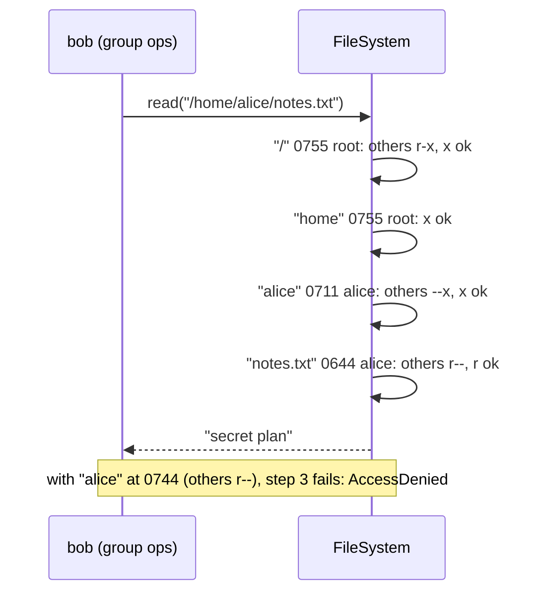

# In-memory File System — L5 (Senior) LLD Interview

> **Level expectation:** take the L4 tree and make it behave like a real one: precise **rename/move rules**, **symbolic links** with loop detection, **Unix permissions** checked on every path component, **find** with filters (Visitor or Iterator), the **cached vs recomputed size** trade-off, and a reasoned **locking** design: one read-write lock vs per-node locks, and how to avoid deadlocks when `mv` touches two directories. Read [L4-mid.md](L4-mid.md) first.

Legend: **🧑‍💼 Interviewer** · **🧑‍💻 Candidate** · **📝 Note** = commentary for you.

---

## 1. Requirements (what's new vs L4)

**🧑‍💻 Candidate:**
- **Move rules:** what may be overwritten, and when moving is refused.
- **Symlinks** to files and directories; relative and absolute targets; loops detected.
- **Users and permissions:** owner, group, mode bits like `0755`; checks on read, write, create, delete, traverse; `chmod`, `chown`; root.
- **find** by name pattern, type, size.
- **Fast `du`** on big trees (maybe).
- **Concurrency** that scales better than one big lock (maybe).

---

## 2. Move and rename semantics

**🧑‍💼 Interviewer:** Spell out exactly what `mv src dst` does.

**🧑‍💻 Candidate:** Following Linux's `rename()` system call (a **system call** is a request from a program to the kernel) and the `mv` command:

| Situation | My code | Linux `rename()` |
|---|---|---|
| `dst` is an existing directory | Move **into** it, keep the name (that's `mv`'s rule, not `rename()`'s) | `mv` does the same |
| Same node (`mv a a`, file) | No-op | No-op |
| Directory into its own subtree | `InvalidOperation` | `EINVAL` |
| File over existing file | Replace it | Replace, atomically |
| Directory over an **empty** directory | `AlreadyExists` (simplified) | Allowed |
| Directory over a file / file over a directory | `AlreadyExists` | `ENOTDIR` / `EISDIR` |
| Across file systems (different disks) | n/a (one tree) | `EXDEV`; `mv` falls back to copy + delete |

The replace is the reason **"write a temp file, then rename it over the real one"** is how config files and editors save safely ([file I/O & fsync](../../libraries/java/file-io-and-fsync.md)): readers see the old file or the new one, never half. The `mv` itself checks `w` and `x` on **both** parent directories, and the subtree check walks up with `parent` pointers (L4).

**🧑‍💼 Interviewer:** What about a symlink in `src`?

**🧑‍💻 Candidate:** The last component is **not** followed: `mv current old` renames the link, not the folder it points to. Same for `rm`. That's why `parentOf()` resolves everything except the last name.

---

## 3. Symbolic links

### 3.1 Resolving them during the walk

**🧑‍💻 Candidate:** A `SymLink` node stores a target path as text. During the walk, when the next component is a symlink, and it's either in the middle of the path or at the end and the operation **follows** links (`read`, `write`, `ls`: yes; `rm`, `mv`, `stat`: no), I push the target's components onto the front of the remaining work:

```java
if (next instanceof SymLink link && (followLast || !todo.isEmpty())) {
    if (++hops > MAX_SYMLINK_HOPS) throw new TooManyLinks(path);           // ELOOP
    List<String> target = Path.split(link.target);
    for (int i = target.size() - 1; i >= 0; i--) todo.addFirst(target.get(i));
    cur = Path.isAbsolute(link.target) ? root : dir;   // relative targets start at the link's directory
    continue;
}
```

`/opt/current/bin/run` with `current → /opt/app-1.2` becomes the work list `[opt, app-1.2, bin, run]` from the root. A relative target `bin/run` stored in `/opt/app-1.2/start` continues from `/opt/app-1.2`.

### 3.2 Loops: why a hop limit and not a visited set

`a → b`, `b → a`. A visited set ("have I seen this link?") sounds cleaner but is wrong: the **same** link can legitimately appear twice in one path, e.g. `d/up/d/up` where `up → ..` (test `symlinkLoopIsDetected` resolves `/d/up/d/up/d/up` to `/`). Linux counts hops instead and gives up after **40** (`MAXSYMLINKS`): a chain of 40 links resolves, 41 returns `ELOOP` ("Too many levels of symbolic links"). I checked that on a Linux 6.18 box, and the tests assert the same boundary. A limit is O(1) memory and always terminates.

### 3.3 `..` after a symlink: lexical vs physical

`/opt/current/bin/../..`, where `current → /opt/app-1.2`:

| Approach | Result | Who does it |
|---|---|---|
| **Lexical**: edit the string first (`Path.normalize`) | `/opt` (drops `bin`, then `current`) | Bash's `cd` by default (`cd -L`) |
| **Physical**: walk, `..` = parent of where you actually are | `/opt` here too, but via `app-1.2`'s parent | The kernel; `cd -P`; `realpath` |

They differ as soon as the link points somewhere else in the tree: with `/home/me/proj → /srv/code/proj`, `/home/me/proj/..` is `/home/me` lexically but `/srv/code` physically. My walk is physical (`..` = `dir.parent`), like the kernel; `Path.normalize` is lexical and only used for display. Mixing them is a classic source of "works in my shell, fails in my program" bugs.

### 3.4 Where symlinks earn their keep: Kubernetes ConfigMaps

A ConfigMap volume looks like this inside a pod:

```
/etc/config/app.yaml -> ..data/app.yaml
/etc/config/..data   -> ..2026_10_08_09_00_00.123456789
/etc/config/..2026_10_08_09_00_00.123456789/app.yaml
```

To update, the **kubelet** (the agent on each Kubernetes node that runs the pods) writes a new timestamped directory, then **renames** a new `..data` symlink over the old one. One rename = all files switch at once: an app reading two config files never sees one old and one new. (That's the kubelet's "atomic writer" approach; the exact directory naming may differ by version.) Same trick as `/opt/current` deploys.

---

## 4. Permissions

### 4.1 The model

**🧑‍💻 Candidate:** Each node has `owner`, `group` and a 9-bit `mode`: three **octal** digits (base 8, so each digit is exactly 3 bits), one `rwx` triple each for owner, group, others. `0754` = `rwxr-xr--`. A `User` record has a name and groups ([records & immutability](../../libraries/java/records-and-immutability.md)); the first group goes on files the user creates. New directories get `0755`, files `0644` (0777 / 0666 minus the usual **umask** 022, the bits a process removes from new files by default).

```java
static boolean allowed(User u, Node n, int wanted) {
    if (u.isRoot()) return true;                            // decision: root skips all checks
    int bits;
    if (u.name().equals(n.owner)) bits = (n.mode >> 6) & 7;
    else if (u.groups().contains(n.group)) bits = (n.mode >> 3) & 7;
    else bits = n.mode & 7;
    return (bits & wanted) == wanted;
}
```

Exactly **one** class applies, no fall-through: if alice owns a file with mode `0066`, alice can't read it even though "others" can (test `readOnlyFileAndOwnerClassRule`). Linux does the same.

### 4.2 What each operation checks

| Operation | Needs | Why |
|---|---|---|
| Any lookup | `x` on **every directory** walked through | `x` on a directory = "search": may look up a name inside |
| `ls dir` | `r` on `dir` | `r` on a directory = read its list of names |
| `read file` / `write file` | `r` / `w` on the file | The data itself |
| create, delete, rename an entry | `w` + `x` on the **parent directory** | The entry list is the directory's content |
| `rm -r` | `r` + `w` + `x` on every directory emptied | It lists, then unlinks |
| `chmod` | Be the owner (or root) | |
| `chown` | Root | Otherwise you could dodge disk quotas by giving files away |

Two surprises worth saying out loud, both tested:
- **`x` without `r`** on a directory: you can open `notes.txt` if you know its name, but `ls` fails. **`r` without `x`**: you can list names but not open anything.
- **Deleting a read-only file** needs nothing on the file: only `w` on the directory. Carol deletes alice's `0400` file in a group-writable directory. That's why `/tmp` has the **sticky bit** (`drwxrwxrwt`: in such a directory only the file's owner, the directory's owner or root may delete or rename a file); I didn't implement it.

Root: Linux root skips read/write checks and directory `x`, but still needs at least one `x` bit to execute a file. My code has no execute, so "root skips everything" is exact here. Richer models (ACLs, access control lists of per-user entries, and roles) are in [access control models](../../concepts/access-control-models.md).



> 📝 **Note:** "Permissions are checked on every component, and directory bits mean search / list / modify-entries" is the L5 answer. Most candidates only check the final file.

---

## 5. `find`: Visitor or Iterator

**🧑‍💼 Interviewer:** Implement `find /repo -name '*.java' -size +5c`.

**🧑‍💻 Candidate:** Two shapes:

| | Visitor (`walk(dir, visitor)`) | Iterator (`Iterator<Stat>`) |
|---|---|---|
| Who drives | The tree calls `visitor.visit(node)` for each node | The caller pulls `next()` |
| Stop early ("first 10 matches") | Needs a "stop" return value | Just stop calling `next()` |
| Holding a lock | Easy: whole walk inside one read lock | Hard: lock held between `next()` calls, or snapshot first |
| Java's own | `Files.walkFileTree(start, FileVisitor)` | `Files.walk(start)` returns a lazy `Stream` |

I take a filter (`Predicate<Stat>`) and return a `List<String>`, walking **depth-first with an explicit stack** (an `ArrayDeque`, not recursion, so a 10,000-deep tree can't overflow the call stack), pushing children in reverse so they come out in name order. The whole walk runs inside one read lock, and callers only get immutable `Stat` records, never live `Node`s they could modify without the lock. Symlinks aren't followed (like `find`'s default), so loops can't trap it. Directories the user can't read and search are skipped. Filters compose: `s -> s.isFile() && s.name().endsWith(".java") && s.size() > 5`.

---

## 6. `du`: recompute or cache?

| | Recompute (my code) | Cached size per directory |
|---|---|---|
| `du` cost | O(nodes below) | O(1) |
| `write` / `append` cost | O(1) | O(depth): add the delta to every ancestor |
| `mv` / `rm -r` | Nothing extra | Subtract from old ancestors, add to new ones |
| Risk | Slow on huge trees | A missed update = a wrong size forever |
| Concurrency | Read lock only | Every write touches the ancestors: they become a hotspot (the root is everyone's ancestor) |

Numbers: a tree of 1,000,000 nodes, `du /` = a million map-entry visits and additions; at roughly 10–50 ns each (pointer chasing through memory, not measured here) that's ~10–50 ms. Writes at depth 10 with caching = 10 extra additions each. If `du` runs on every dashboard refresh and writes are rare, cache. For a write-heavy tree, recompute or recompute **periodically** (that's roughly how quota usage is tracked in big systems: L6). Note the root hotspot: with per-node locks, cached sizes force every writer to lock the root.

---

## 7. Thread safety: one lock or many?

**🧑‍💻 Candidate:** My code uses **one `ReentrantReadWriteLock`** for the tree ([locks & synchronized](../../libraries/java/locks-and-synchronized.md)). Why it's a good first answer:
- `mv` and `rm -r` change several nodes and must look **atomic** (all or nothing to any observer). With one lock, they are.
- No deadlock is possible with one lock ([thread safety basics](../../concepts/thread-safety-basics.md)).
- In memory, an operation takes microseconds, so writers queue only briefly.

It's tested: 8 writers each append 500 bytes to one file while 4 readers run `du`, `ls`, `find`; the final size must be exactly 4,000. With writes moved to the read lock, the test fails with an `ArrayIndexOutOfBoundsException` inside `append`: two threads copied the same old array and one append was torn.

**🧑‍💼 Interviewer:** 64 cores, writes all over the tree. The single lock is the bottleneck.

**🧑‍💻 Candidate:** A read-write lock **per directory**:
- **Lookup:** take each directory's read lock while you look inside it, then move on. **Lock coupling** (hand-over-hand): lock the child before releasing the parent, so nobody can delete or move the child between the two steps.
- **Create/delete in a directory:** that directory's write lock.
- **`mv` between two directories:** both write locks. Thread 1 does `mv /x/f /y/`, thread 2 does `mv /y/g /x/` at the same time. Each grabs its source first, then waits for the other's: **deadlock** (two threads each holding a lock the other needs). Fix with a **global lock order** ([deadlocks & lock ordering](../../concepts/deadlocks-and-lock-ordering.md)): e.g. lock the ancestor before the descendant, and unrelated directories in a fixed order (by node ID).
- **The subtree check** (is `dst` inside `src`?) is a read of the whole ancestor chain, and a concurrent `mv` could change that chain between the check and the move. To keep it simple, Linux takes a **per-file-system rename mutex** for cross-directory renames, then locks the two parents in ancestor-first order (`lock_rename()` in the kernel's `fs/namei.c`; details vary by version). So even the kernel keeps one coarse lock for the hard case.

| | One RW lock | Per-directory locks |
|---|---|---|
| Code | ~10 lines | Lock coupling, ordering, rename mutex |
| Deadlock risk | None | Real, needs a strict order |
| Parallel writes | No | Yes, in different directories |
| Good when | Most in-memory uses; interview default | Many cores, writes spread out |

> 📝 **Note:** Start with one lock and say why; then upgrade with lock ordering *and* name the rename problem. Candidates who jump straight to per-node locks usually deadlock on `mv`.

### 7.1 Snapshots for readers

**🧑‍💻 Candidate:** A backup job wants a consistent view of the whole tree for minutes. Holding the read lock that long blocks every writer. Alternative: make nodes **immutable** and use **path copying**: a change creates new copies of the changed node and its ancestors up to a new root, sharing every untouched subtree. A snapshot is just "keep the old root pointer". Writers swap the root with a **compare-and-set** (an atomic "replace it only if it still equals what I read"); readers never lock. Git trees work exactly like this ([how git stores objects](../../../under-the-hood/git-object-store.md)); so do copy-on-write file systems like ZFS and Btrfs (they write changed blocks to new places instead of overwriting). Cost: every write copies O(depth) nodes.

---

## 8. Follow-ups

**🧑‍💼 Interviewer:** Where's SOLID here?

**🧑‍💻 Candidate:** Single responsibility (each class has one reason to change) ([SOLID](../../concepts/solid-principles.md)): `Path` does strings, `Permissions` does bits, `FileSystem` does the tree, `Shell` does the cwd. Open/closed: a new filter for `find` is a new lambda, not a new method. The sealed `Node` trades some openness for compiler-checked `switch`es.

**🧑‍💼 Interviewer:** Undo for `rm -r`?

**🧑‍💻 Candidate:** Make each operation a **Command** that records what it removed (the detached subtree) so `undo()` can re-attach it ([command & memento](../../concepts/command-and-memento.md)). With immutable snapshots, undo is "go back to the previous root". In practice: a trash folder (`mv` to `~/.Trash`, O(1)) is what desktops do.

---

## 9. What the interviewer was evaluating (L5)

- [ ] Precise `mv` rules, compared with `rename()`; the temp-file-then-rename pattern
- [ ] Symlinks resolved in the walk; follow vs no-follow per operation; relative targets
- [ ] Hop limit (40) instead of a visited set, with the reason
- [ ] Lexical vs physical `..`
- [ ] rwx on every component; directory r/w/x meanings; one class, no fall-through; root decision
- [ ] `find` as Visitor or Iterator; lock and immutable results
- [ ] Recompute vs cached sizes with costs and the root hotspot
- [ ] One lock first; per-directory locks with lock coupling, ordering, and the rename problem

## 10. Common mistakes at this level

| Mistake | Why it hurts at L5 |
|---|---|
| Following the last symlink in `rm` / `mv` | `rm current` deletes the release it points to |
| Visited-set loop detection | Rejects valid paths that use the same link twice |
| Checking permissions only on the final file | `chmod 700 ~` would protect nothing |
| Requiring `w` on a file to delete it | Wrong: deletion is a change to the directory |
| `find` handing out live nodes | Callers modify the tree without the lock |
| Recursive `find` on deep trees | `StackOverflowError` |
| Per-node locks without a global order | `mv` in opposite directions deadlocks |
| Cached sizes updated without the ancestors' locks | Lost updates; `du` drifts |

⬅️ Previous: [L4-mid.md](L4-mid.md) · ➡️ Next: [L6-staff.md](L6-staff.md)
