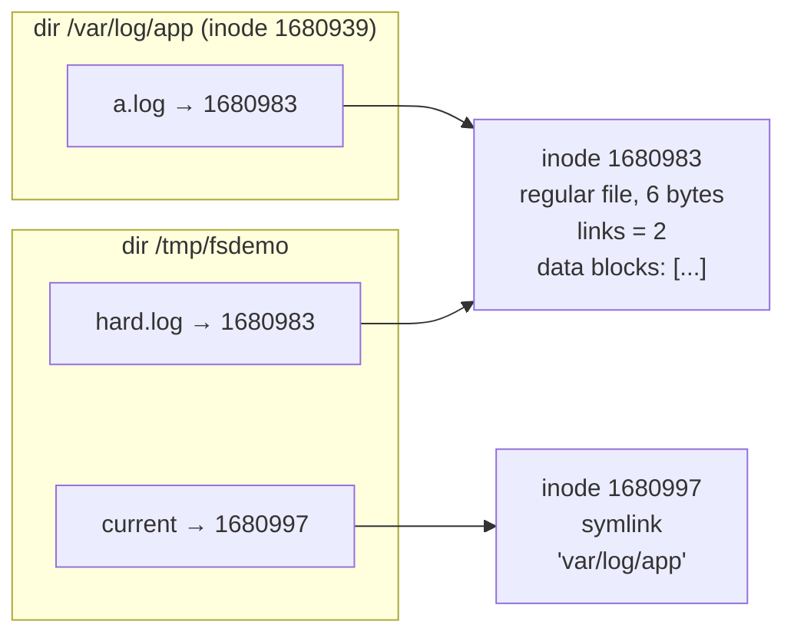
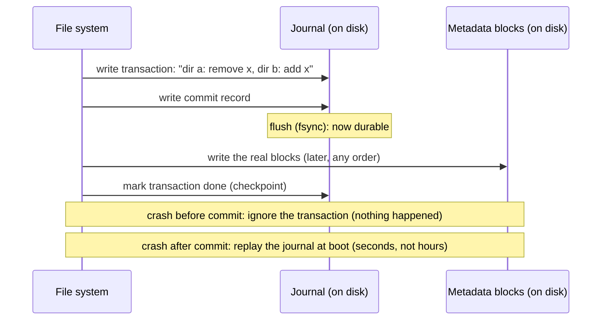
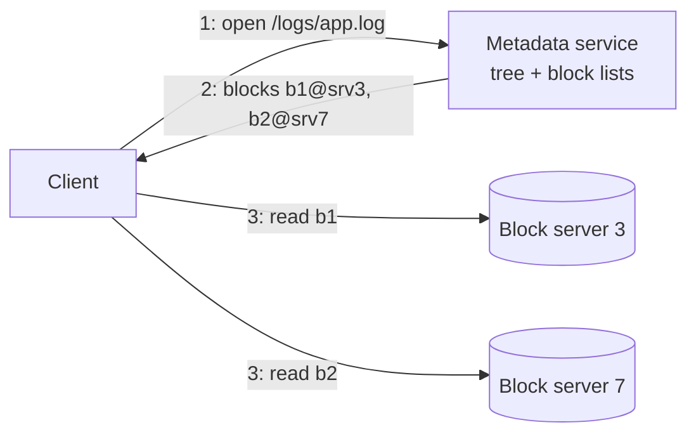

# In-memory File System — L6 (Staff) LLD Interview

> **Level expectation:** the L5 tree is a correct in-memory model. Now: *"Make it real. It must survive a power cut, hold files of 100 GB, serve a whole company as a shared service, and big-data jobs want to rename folders with a million files atomically."* You reason about **inodes vs names** (hard links), **durability** (journaling, write-ahead logs, `fsync`), **blocks and extents**, the **metadata service vs block storage** split (HDFS, Colossus, Dropbox), **object stores vs hierarchical namespaces**, **quotas**, why **distributed rename** is the hardest operation, **FUSE**, and how to **test** a file system. Read [L5-senior.md](L5-senior.md) first.

Legend: **🧑‍💼 Interviewer** · **🧑‍💻 Candidate** · **📝 Note** = commentary for you.

---

## 1. What breaks first

**🧑‍💼 Interviewer:** Your L5 design works. What changes when it's real?

**🧑‍💻 Candidate:** Four assumptions in L5 are false:
1. **"A name is the file."** My `Node` holds its name and data together, so a file can have only one name. Real systems separate the **name** (a directory entry) from the **file** (an inode).
2. **"Memory is forever."** A crash loses everything, and a crash *in the middle* of `mv` could leave a half-moved tree on disk.
3. **"A file is one `byte[]`."** A 100 GB file can't be one array, and appending 1 byte must not rewrite 100 GB.
4. **"One process, one lock."** A shared service has thousands of clients on hundreds of machines; one lock in one JVM (the Java process) is a single point of failure and a throughput ceiling.

---

## 2. Inodes vs names: hard links

**🧑‍💻 Candidate:** Unix splits a file in two:
- The **inode** (index node): a numbered record with type, size, owner, mode, timestamps, **link count**, and where the data lives. No name.
- The **directory entry** (dentry): name → inode number. A directory is just a list of those.

(Inode numbers from the real `ls -li` in [00-understand-the-product.md](00-understand-the-product.md#5-try-it-yourself-real-10-minutes-any-linux-box).)

- **Hard link** (`ln a b`) = a second entry pointing at the same inode; link count +1. `rm` = **unlink**: remove one entry, count −1. The data is freed when the count reaches 0 **and** no process still has the file open. That's why deleting a 50 GB log that a process is still writing doesn't free disk space until the process restarts: a classic on-call puzzle (`lsof +L1`, "list open files with fewer than 1 link", shows such deleted-but-open files).
- **No hard links to directories** (except the built-in `.` and `..`): they could create cycles, and `..` would be ambiguous.
- **Rename** only touches entries, never the inode: that's *why* it's O(1).

Change to my design: `Directory.children: Map<String, Long inodeNumber>` plus an inode table `Map<Long, Inode>`. `Node.name` and the single `parent` pointer go away (a file with two names has two parents); directories keep a `..` entry. My subtree check still works because directories have exactly one parent.

---

## 3. Durability: surviving a power cut

### 3.1 Why it's hard

`mv /a/x /b/x` on disk changes **two directory blocks** (remove from `a`, add to `b`) and maybe an inode. The disk writes them in any order and a power cut can land between them: the file is in both directories (link count wrong) or in neither (lost). Before journaling, the fix was `fsck`: scan the **whole disk** at boot to repair inconsistencies, which took hours on big disks.

### 3.2 Journaling = a write-ahead log for metadata

**🧑‍💻 Candidate:** A **journal** is a **write-ahead log** (WAL: an append-only log where you write what you're *about* to do before doing it) ([durability, WAL & snapshots](../../concepts/durability-wal-and-snapshots.md)):

ext4's default (`data=ordered`) journals **metadata** only but writes a file's data blocks before committing the metadata that points to them, so a crash never exposes garbage. Full data journaling writes everything twice. **Copy-on-write** file systems (ZFS, Btrfs) don't overwrite in place at all: they write new blocks and switch one root pointer, the immutable tree from L5 §7.1 on disk.

### 3.3 `fsync`: what the application must do

**`write()` returns when data is in the OS **page cache** (kernel memory), not on disk.** `fsync(fd)` forces it down ([file I/O & fsync](../../libraries/java/file-io-and-fsync.md); in Java, `FileChannel.force(true)`). The safe-save recipe: write `config.tmp`, `fsync` it, `rename` over `config`, then `fsync` the **directory** so the rename itself is durable. Skipping the last step is the most common durability bug.

**For my in-memory tree**, if asked to persist it: log every mutating operation (`MKDIR /a`, `MV /a /b`) to a WAL, `fsync` in batches (every ~10 ms or N operations: a **group commit**, one `fsync` paying for many operations, as databases do), and periodically write a full **snapshot** of the tree so recovery = load snapshot + replay the log tail. That's how the HDFS NameNode works: an `FsImage` snapshot plus an `EditLog`.

---

## 4. Big files: blocks and extents

**🧑‍💻 Candidate:** The disk is divided into fixed **blocks** (4 KB is typical). A file is a list of blocks. Listing every block number for a 100 GB file = 26 million entries (100 GB / 4 KB = 26,214,400). So ext4 uses **extents**: "blocks 5,000,000 to 5,032,767" as one record (up to 32,768 blocks × 4 KB = 128 MB per extent). A contiguous 100 GB file needs ~800 extents (100 GB / 128 MB = 800) instead of 26 million pointers. Appending 1 byte touches the last block and maybe one extent.

For my `File`: replace `byte[]` with a list of fixed-size chunks (say 64 KB): append = write into the last chunk; read at an offset = chunk `offset / 64K`. Same idea as a rope in a text editor (a tree of text chunks), applied to bytes.

---

## 5. File system as a service: split metadata from data

**🧑‍💼 Interviewer:** The whole company shares it: billions of files, petabytes.

**🧑‍💻 Candidate:** Separate the two very different workloads:

| | Metadata (names, tree, permissions, block lists) | Data (file contents) |
|---|---|---|
| Size | Small: ~100–300 bytes per file | Huge: KB to TB per file |
| Operations | Many tiny ones: lookup, `ls`, `mv`, `stat` | Few big sequential reads/writes |
| Needs | Strong consistency (every reader sees the latest change), atomic rename, transactions | Throughput, replication, cheap storage |
| Stored in | An in-memory tree (this interview!) or a database | Block / blob servers ([object storage](../../../HLD/technologies/object-storage.md)) |

Real systems with this split:
- **HDFS**: one **NameNode** holds the whole namespace in memory (FsImage + EditLog on disk); **DataNodes** store 128 MB blocks (the default since Hadoop 2), each replicated 3×. The NameNode protects the namespace with one global read-write lock: my L4 design, at scale. Its limit is memory: every file and block is a Java object in one heap, so HDFS added **federation** (several NameNodes, each owning a part of the tree). ZippyDB (below) is Meta's distributed key-value store.
- **Google Colossus** (successor to GFS, the Google File System): metadata in Bigtable (Google's distributed table database), which removed GFS's single-master limit (Google Cloud blog, 2021; details beyond that are not public).
- **Dropbox**: files split into 4 MB blocks, addressed by **content hash** (a fingerprint computed from the bytes, so identical blocks are stored once), stored in their own block store (Magic Pocket, 2016); the namespace and block lists live in a separate metadata store. See the [File Storage & Sync HLD](../../../HLD/interviews/file-storage-sync/README.md).
- **Meta's Tectonic** (paper at FAST 2021, the USENIX file and storage conference): splits metadata further into Name, File and Block layers, each a separate sharded table, so one hot directory doesn't overload one machine.

---

## 6. Object stores vs hierarchical namespaces

**🧑‍💻 Candidate:** S3 has **no directories**: keys like `logs/2026/10/app.log` and a `ListObjectsV2` call that can group keys by a `/` **delimiter**, returning the groups as "common prefixes". Consequences:

| | Flat key space (S3) | Hierarchical namespace |
|---|---|---|
| Rename a folder with n objects | n × (copy + delete), not atomic | One metadata change, atomic |
| Empty folder | Doesn't exist (consoles fake it with a zero-byte `folder/` key) | Real |
| List one level | Prefix scan with delimiter | Read one directory |
| Permissions per folder | Prefix-based policies | Directory ACLs (access control lists: per-user permission entries) |
| Scaling | Easy: keys hash-partitioned | Harder: the tree has hot spots and cross-shard renames |

Why it matters: Spark and Hadoop jobs (big-data frameworks that process files in parallel on many machines) write output to a temp directory and **rename** it to the final name to "commit". On S3 that rename is slow and non-atomic, which is why S3-specific committers exist. Hence object stores that added real directories: **Azure Data Lake Storage Gen2** (hierarchical namespace on Blob storage, generally available 2019, atomic directory rename) and **Google Cloud Storage hierarchical namespace buckets** (announced 2024 with atomic folder rename; I haven't verified the current feature set). **S3 Express One Zone** "directory buckets" (2023) also have real directories, as far as I know.

---

## 7. Quotas

**🧑‍💻 Candidate:** "Team X may use 10 TB and 5 million files." Two counters per quota root: bytes and **inodes** (number of files, which protects the metadata service: a million 1-byte files cost the NameNode as much as a million 1 GB files). HDFS has exactly these: a **name quota** and a **space quota** per directory.

Enforcement = the cached-size problem from L5: every write updates usage on the quota directory, so the quota root becomes a write hotspot. Options: exact counters updated in the same transaction (simple, contended); per-client **leases** of quota ("you may write 1 GB before checking back"), like a rate limiter handing out tokens in batches instead of one request at a time; or eventual enforcement with a periodic scan (cheap, can overshoot). XFS project quotas and Linux user/group quotas are the single-machine versions.

---

## 8. Distributed rename: the hardest operation

**🧑‍💼 Interviewer:** Metadata is sharded (split across machines by key) now. `mv /teams/a/proj /teams/b/proj`, where `/teams/a` and `/teams/b` live on different shards.

**🧑‍💻 Candidate:** It's a **transaction** across two shards ([transactions & isolation](../../concepts/transactions-and-isolation.md)): delete an entry on shard 1, insert on shard 2, and both or neither must happen. Plus the subtree check from L4 now needs the ancestors of the destination, which may live on a third shard, while someone else may be moving those ancestors at the same time. Options:
1. **Two-phase commit** (2PC: a coordinator asks every shard to *prepare*, then tells all to *commit*) with locks on both parents in a global order. Correct, slow, and blocks if the coordinator dies mid-way.
2. **Shard by subtree** so most renames stay on one shard; send the rare cross-shard rename through a slow path (or forbid it: with HDFS federation, a rename across two NameNodes' parts of the tree isn't supported, as far as I know).
3. **A single "rename coordinator"** for cross-directory renames: the distributed version of the kernel's per-file-system rename mutex (L5 §7).
4. **Store the tree in a database with transactions** (Colossus on Bigtable, Tectonic on ZippyDB, many systems on Spanner-like stores: Spanner is Google's globally distributed SQL database) and let it do the 2PC.

Same-directory rename (`mv a.tmp a`) is one shard and cheap. That's why "write to temp, rename in the same directory" is the pattern to recommend for clients.

---

## 9. FUSE: a file system as a normal program

**FUSE** (Filesystem in Userspace, in Linux since 2.6.14, 2005) lets an ordinary process implement `lookup`, `read`, `readdir`, `rename`, and the kernel forwards file calls on a **mount point** (the directory where a file system is attached to the tree) to it. My `FileSystem` class is roughly the shape of a FUSE handler. Examples: `sshfs` (a remote server's files as a folder), `s3fs` and Google's `gcsfuse` (a bucket as a folder, with the flat-namespace rename caveats above), AWS's Mountpoint for S3 (2023). Cost: every call crosses kernel → user process → kernel, so tiny operations are several times slower than a kernel file system.

---

## 10. Testing a file system

**🧑‍💻 Candidate:** Example tests ("mkdir then ls") miss the bugs that matter: a rename edge case in one rare combination. **Property-based testing** (checking a rule over many random inputs) against a **reference model**:

| Technique | In this folder |
|---|---|
| Random ops vs a trivially correct model | `randomOperationsMatchReferenceModel`: 3 seeds × 3,000 random `mkdir`/`write`/`append`/`rm -r`/`mv` on paths from `{a,b,c}` (so names collide and error paths are hit). The model is a `TreeMap<fullPath, content>`; success/failure must match every step, the full tree every 100 steps |
| Seeds | `new Random(seed)`: a failure prints `seed 1 step 220 ...` and replays exactly |
| Proof the tests can fail | Removing the `mv` subtree check fails `moveIntoOwnSubtreeFails` **and** the random test (`seed 1 step 220 op 4 /a /a/c`); making `..` stay put fails the path tests; an off-by-one in the hop limit fails at 40 links; writes under the read lock fail the stress test |
| Concurrency | 12 threads released together by a `CountDownLatch`; assertions on final counts only, so the test is deterministic |

Production libraries add **shrinking** (automatically cutting a failing 3,000-step run down to the 2 steps that matter): jqwik for Java, fast-check for JS. Real file systems go further: **crash-consistency testing** (record every block write, then replay every possible prefix as if power failed there, and check the file system mounts and is consistent) and **fuzzing** (feeding random or corrupted inputs, here corrupted disk images, to find crashes).

> 📝 **Note:** "My model is a flat map of full paths, which is obviously right and O(n); the tree must agree with it after any sequence" is a crisp staff-level testing answer. It also re-teaches the core insight: the flat model *is* S3.

---

## 11. What the interviewer was evaluating (L6)

- [ ] Inodes vs directory entries; hard links and link counts; why no directory hard links; deleted-but-open files
- [ ] Journaling as a WAL; ordered mode; copy-on-write as the alternative; the four-step safe save incl. directory `fsync`
- [ ] Persisting the in-memory tree: WAL + group commit + snapshot (like HDFS FsImage + EditLog)
- [ ] Blocks vs extents with arithmetic
- [ ] Metadata service vs block storage; HDFS / Colossus / Dropbox / Tectonic as examples; NameNode memory limit and federation
- [ ] Flat object keys vs hierarchical namespace; why big-data commits need atomic rename
- [ ] Quotas on bytes and inodes; the hotspot and leases
- [ ] Cross-shard rename as a distributed transaction, with options
- [ ] FUSE; property-based and crash-consistency testing

## 12. Common mistakes at this level

| Mistake | Why it hurts at L6 |
|---|---|
| Name stored inside the file object | No hard links; rename touches the file |
| "Write and rename" without `fsync` of file and directory | Power cut = empty or missing config |
| One `byte[]` per file | 100 GB files impossible; appends copy everything |
| Metadata and data in one service | Metadata latency suffers from bulk transfers; can't scale them separately |
| Assuming S3 rename is cheap and atomic | Jobs commit half their output |
| Quota counters updated without thinking about contention | The quota root serialises every write |
| Cross-shard rename as two independent writes | A crash leaves the directory in both places or none |
| Only example tests | The rare rename/symlink bug ships |

⬅️ Previous: [L5-senior.md](L5-senior.md) · 🏠 [Problem overview](README.md)
