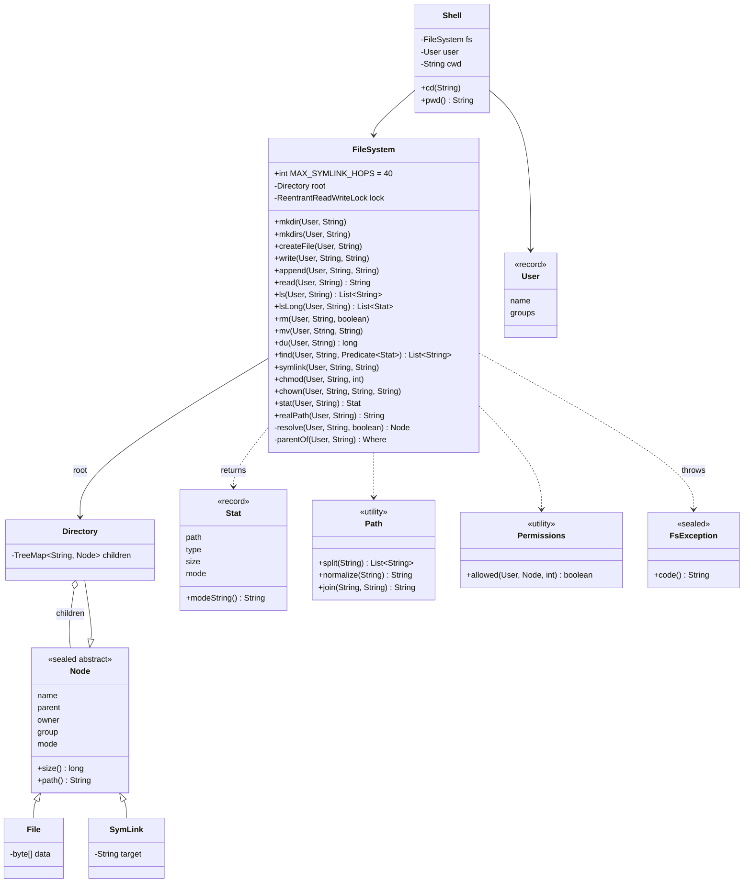

# LLD Interview: Design an In-memory File System (like Linux's, or LeetCode 588)

> "Design an in-memory file system: create directories and files, read and write them, list, move and delete. Then add symlinks, permissions and many threads."

A classic LLD question because it looks like a data-structures exercise and turns into a design one. It teaches the **Composite pattern** (a directory and a file used through one `Node` interface, with recursive `size()`), **path parsing and normalisation** (`.`, `..`, `//`, absolute vs relative), why a **tree makes rename O(1)** while a flat key space (S3) makes it O(n), the **subtree check** that stops `mv a a/b`, **symbolic links** and loop detection with a **hop limit**, **Unix permissions** checked on every path component, **find** as a Visitor or Iterator, **cached vs recomputed sizes**, and **locking** from one read-write lock to per-directory locks with lock ordering. At L6: **inodes and hard links**, **journaling and fsync**, **extents**, the **metadata service vs block storage** split (HDFS, Colossus, Dropbox), **hierarchical namespaces on object stores**, **quotas**, **distributed rename**, **FUSE**, and **model-based testing**.

> 💡 **Terms in one line each** (details in the files):
> **Path**: the route from the root `/` (absolute) or the current directory (relative) to a node. **Normalisation**: rewriting a path to its simplest form (`/a/./b/../c` → `/a/c`). **Composite pattern**: a group (directory) and a single item (file) share one interface. **Symlink**: a small file holding another path, followed during lookup. **ELOOP**: Linux's "too many symlinks" error, raised after 40 hops. **Mode / rwx**: read, write, execute bits for owner, group and others, written in octal like `0755`. **Inode**: a file's internal record (size, owner, data location) that names point to. **Hard link**: a second name for the same inode. **Journal / WAL**: an append-only log of changes written before the change itself, for crash recovery. **fsync**: the call that forces data from memory onto the disk. **Extent**: "blocks X to Y" as one record instead of one pointer per block. **Read-write lock**: many readers together, or one writer alone. **Lock ordering**: always taking locks in the same global order so threads can't deadlock.

## How to read this folder

> 👉 **Never thought about what a folder really is? Start with [00-understand-the-product.md](00-understand-the-product.md).** It walks through a bucket with no folders where renaming one "folder" means 800,000 operations, and traces a path lookup step by step.

| File | Level | What "good" looks like |
|---|---|---|
| [00-understand-the-product.md](00-understand-the-product.md) | Everyone, first | Know the features (`mkdir -p`, write/append, sorted `ls`, paths with `.` and `..`, `mv`, `rm -r`, `du`, `find`, symlinks, rwx, threads, hard links) and why each exists; real `ls -li`, `stat`, `namei` output |
| [L4-mid.md](L4-mid.md) | Mid / SDE2 | Sealed `Node` with `Directory` and `File` (Composite); `FileSystem` facade; path normalisation with a stack and its edge cases; `resolve` vs `parentOf`; `TreeMap` vs `HashMap` children; O(1) `mv` with the subtree check; specific exceptions; one read-write lock |
| [L5-senior.md](L5-senior.md) | Senior | Exact move/overwrite rules vs `rename()`; symlinks in the walk, follow vs no-follow, hop limit, lexical vs physical `..`, ConfigMap atomic swap; rwx on every component and what r/w/x mean on a directory; `find` as Visitor vs Iterator; cached vs recomputed sizes; per-directory locks, lock coupling, lock ordering and the rename problem; immutable snapshots |
| [L6-staff.md](L6-staff.md) | Staff | Inodes and hard links; journaling, fsync and the safe-save recipe; blocks and extents; metadata service vs block storage (HDFS, Colossus, Dropbox, Tectonic); S3 prefixes vs hierarchical namespaces; quotas; distributed rename; FUSE; model-based and crash-consistency testing |

## Code (runnable, no dependencies)

| | Run | Files |
|---|---|---|
| ☕ Java 21 | `./java/run.sh` | [java/src/fs/](java/src/fs/): sealed `Node` with `Directory`, `File`, `SymLink`; `FileSystem` (path walk with symlinks and permission checks, `mkdir`/`mkdirs`, `createFile`/`write`/`append`/`read`, `ls`/`lsLong`, `rm`, `mv` with the subtree check, `du`, `find`, `symlink`, `chmod`/`chown`, `realPath`, one `ReentrantReadWriteLock`); `Path` (split, join, lexical normalise); `User` and `Stat` records; `Permissions`; sealed `FsException` with one subclass per errno; `Shell` (user + cwd, relative paths); 21 tests in `FileSystemTests.java`; `Demo.java` |
| 🟨 Node 22 | `cd js && node --test` | [js/fs.js](js/fs.js), [js/fs.test.js](js/fs.test.js): `MemFS` with private `#fields`: tree, path walk, `mkdir` with `recursive`, write/append/read, sorted `ls`, `mv` with the subtree check, `rm` with `recursive`, `du`, `find`, symlinks with a 40-hop limit (8 tests, including a seeded random model test). No permissions or locks (Node runs one call at a time) |

**Design decisions in the code:** sizes are **recomputed** on each `du` (simple, always right; L5 compares caching). **Root skips every permission check.** An **empty** directory can be removed without the recursive flag (like `rmdir`). `rm -r` checks permissions on the whole subtree **first** and then deletes, so it's all-or-nothing (real `rm -r` deletes what it can). `..` in the walk is **physical** (the parent of where you really are, after following links), like the kernel. `find` skips directories it can't read and never follows symlinks.

**Tests:** a **reference model** test runs 3 seeds × 3,000 random `mkdir`/`write`/`append`/`rm -r`/`mv` operations against a `TreeMap` of full paths and compares success/failure every step and the whole tree every 100 steps. A stress test releases 12 threads at once with a `CountDownLatch`. Mutation checks (each change made on a copy, then reverted): making `..` stay in place, removing the `mv` subtree check, an off-by-one in the hop limit, or doing writes under the read lock each make at least one test fail; the subtree removal is caught by both its own test and the random model test (`seed 1 step 220 op 4 /a /a/c`).

Sample demo output:

```
alice$ ls -l
  lrwxrwxrwx  alice  dev        12  logs -> /var/log/app
  -rw-r--r--  alice  dev        11  notes.txt
  drwxr-xr-x  alice  dev         0  projects
alice$ mv projects projects/inner   # a folder into itself
  mv: EINVAL: cannot move '/home/alice/projects' into its own subtree '/home/alice/projects/inner'
alice$ chmod 700 /home/alice
bob$ cat /home/alice/notes.txt
  cat: EACCES: search '/home/alice' as bob
root$ ln -s /loop-b /loop-a ; ln -s /loop-a /loop-b ; cat /loop-a
  cat: ELOOP: too many levels of symbolic links (/loop-a)
root$ du -sb /home /var
  23	/home
  8	/var
```

## Class diagram (matches the code)



## Libraries & concepts used

**Java:** [Sealed interfaces & pattern matching](../../libraries/java/sealed-interfaces-and-pattern-matching.md) · [Records & immutability](../../libraries/java/records-and-immutability.md) · [Locks & synchronized](../../libraries/java/locks-and-synchronized.md) · [TreeSet & PriorityQueue (sorted collections)](../../libraries/java/treeset-and-priorityqueue.md) · [File I/O & fsync](../../libraries/java/file-io-and-fsync.md)

**JS:** [Classes & private fields](../../libraries/js/classes-and-private-fields.md) · [Map vs Object](../../libraries/js/map-vs-object.md) · [node:test runner](../../libraries/js/node-test-runner.md)

**Concepts:** [Composite pattern & trees](../../concepts/composite-pattern-and-trees.md) · [Design patterns](../../concepts/design-patterns.md) · [OOP modeling](../../concepts/oop-modeling.md) · [Access control models](../../concepts/access-control-models.md) · [Thread safety basics](../../concepts/thread-safety-basics.md) · [Deadlocks & lock ordering](../../concepts/deadlocks-and-lock-ordering.md) · [Durability, WAL & snapshots](../../concepts/durability-wal-and-snapshots.md) · [Big-O complexity](../../concepts/big-o-complexity.md) · [SOLID principles](../../concepts/solid-principles.md) · [Command & Memento](../../concepts/command-and-memento.md) · [UML class diagrams](../../concepts/uml-class-diagrams.md)

**Related:** [File Storage & Sync (HLD)](../../../HLD/interviews/file-storage-sync/README.md) (the same tree as a service, with blocks stored separately) · [Object storage](../../../HLD/technologies/object-storage.md) (the flat key space this design is contrasted with) · [How a B-tree works](../../../under-the-hood/b-tree.md) (how big sorted directories and metadata live on disk) · [How git stores objects](../../../under-the-hood/git-object-store.md) (immutable trees that share unchanged subtrees)

## The core insight

1. **A path is a walk, not a key.** Names live on the edges of a tree, so renaming a folder changes one entry no matter how much is below it, and permissions on a folder guard everything inside. The same data as a flat map of full paths (S3) makes rename, `rm -r` and "list one level" O(n).
2. **The rules are the design.** The data structure is easy; what makes it a file system is the precise behaviour around it: `..` at the root, follow-or-not for each operation, the subtree check, the 40-hop limit, x-to-traverse and w-on-the-directory-to-delete.
3. **Separate the namespace from the bytes.** In memory, one lock and one tree are enough. At scale, the tree (metadata) becomes its own strongly consistent service, the bytes go to block storage, and the hardest operation in the whole system is the one that was O(1) at L4: rename.
