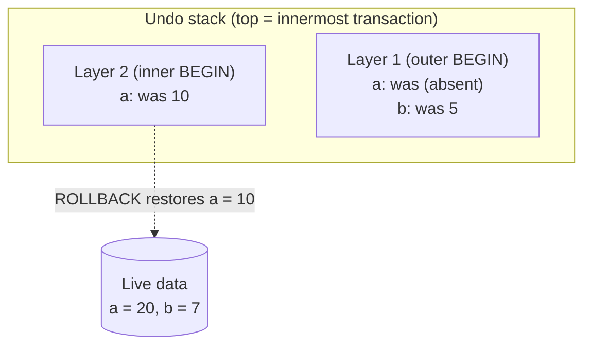

# Start Here: What Is a Key-Value Store with Transactions? (Before the Interview)

> You've already used one: **Redis**. Every design so far put a Redis box in a diagram, for caching, counters and rate limits. This interview asks you to build a small version of it yourself: store keys and values, expire them, group changes into **transactions** that can be undone, and survive a crash. Doing that shows you what's inside every database you'll ever use.
>
> Time: ~10 minutes. Then: [L4](L4-mid.md) → [L5](L5-senior.md) → [L6](L6-staff.md).

---

## 1. Why transactions exist: one transfer, two changes

Alice sends Bob ₹30. The system must make **two** changes:

```
balance:alice  100 → 70
balance:bob     50 → 80
```

What if the app crashes after the first line but before the second? ₹30 has vanished. What if the second step fails validation? The first must be undone.

A **transaction** groups changes so they happen **all together or not at all**:

```
BEGIN
SET balance:alice 70
SET balance:bob 80
COMMIT          ← both become permanent together
```

or, if anything goes wrong:

```
BEGIN
SET balance:alice 70
ROLLBACK        ← as if nothing happened; alice is back to 100
```

---

## 2. Where you've seen this

| Place | What you saw |
|---|---|
| **Redis** (`redis-cli`) | `SET`, `GET`, `DEL`, `EXPIRE`, `TTL`, and `MULTI`/`EXEC` (a *kind* of transaction, see the warning in §3.3) |
| **SQL databases** (`psql`, MySQL) | `BEGIN … COMMIT / ROLLBACK`, and `SAVEPOINT` for undoing part of a transaction (that's a **nested** transaction) |
| **Kubernetes' etcd** | A key-value store holding all cluster state (`etcdctl get /registry/pods/...`); its transactions are compare-and-swap style |
| **Java `HashMap`** | The in-memory core of a KV store, without TTL, transactions or durability |
| **Browser `localStorage`** | A tiny persistent key-value store in every browser |
| **Git** | `git stash` / `git reset` is "rollback"; commits are an append-only history |

---

## 3. The features, one situation at a time

### 3.1 SET / GET / DELETE
The basics: store a value under a key, read it, remove it.

### 3.2 COUNT: "how many keys have this value?"
E.g. "how many users are in status `ONLINE`?". Scanning every key is O(n); the interview wants **O(1)**, which means keeping a second map from value → count up to date on every change.

👉 Interview: *maintaining a derived index correctly through sets, deletes, expiries and rollbacks.*

### 3.3 Transactions: BEGIN / ROLLBACK / COMMIT, nested
Transactions can be **nested** (a transaction inside a transaction, like SQL savepoints):

```
BEGIN            ← outer
  SET a 10
  BEGIN          ← inner
    SET a 20
  ROLLBACK       ← undo only the inner part → a is 10 again
COMMIT           ← make a = 10 permanent
```

👉 Interview: *how to undo changes efficiently. Copying the whole database at every BEGIN works but is far too slow for big data. The trick is to remember only **what you changed** (an **undo log**).* See [undo & redo logs](../../concepts/undo-logs-and-redo-logs.md).

> ⚠️ **Redis nuance worth knowing:** Redis `MULTI`/`EXEC` queues commands and runs them together without interruption, but it **does not roll back** if one command fails, and `DISCARD` only works before `EXEC`. So it's "atomic execution", not "undoable transactions". The interview version (and SQL) has real rollback. See [transactions & isolation](../../concepts/transactions-and-isolation.md).

### 3.4 TTL: keys that expire
`EXPIRE session:42 1800` makes a login session vanish after 30 minutes. `TTL` shows the seconds left.

👉 Interview: *lazy expiry (check on access) vs active expiry (clean up in the background), and keeping COUNT correct when keys expire.*

### 3.5 Durability: survive a crash
Memory is lost on restart. Redis's **AOF** (append-only file) writes every change to a log on disk; on restart it replays the log. Each write can wait for the disk (**fsync**: forcing data from the OS's memory cache onto the physical disk), which is slow, or not wait, which is fast but can lose the last second of writes.

👉 Interview: *write-ahead logs, fsync policies, half-written records after a crash, and log compaction.* See [durability, WAL & snapshots](../../concepts/durability-wal-and-snapshots.md).

### 3.6 One thread or many?
Redis runs all commands on **one thread**: no locks, and every command is naturally atomic. It's still fast because everything is in memory.

👉 Interview: *why single-threaded can beat multi-threaded here* ([single-writer principle](../../concepts/single-writer-principle.md)).

---

## 4. The key mechanism: a stack of undo logs



- Every change records the key's **original** value in the current (top) layer, only the first time that key is touched in that layer.
- **ROLLBACK** = write the originals back, throw the layer away.
- **COMMIT** of an inner layer = merge its notes into the outer layer (the outer layer's older original wins), because the outer transaction could still be rolled back.
- **COMMIT** of the outermost layer = the changes are now permanent; write them to the log on disk.

Cost: proportional to the number of keys you *changed*, not the size of the database.

---

## 5. Try it yourself (real, 10 minutes)

1. **Redis** (local or a docker container `docker run -p 6379:6379 redis`):
   ```sh
   redis-cli SET balance:alice 100
   redis-cli EXPIRE balance:alice 30
   redis-cli TTL balance:alice              # counts down
   redis-cli CONFIG GET appendonly          # is the append-only file on?
   redis-cli CONFIG GET appendfsync         # always / everysec / no
   ```
   Then in one `redis-cli` session: `MULTI`, `SET a 1`, `INCR a` … `EXEC`. Notice commands are queued (`QUEUED`) and run together.
2. **Postgres** (`psql`): `BEGIN; UPDATE …; SAVEPOINT s1; UPDATE …; ROLLBACK TO s1; COMMIT;` That's nested rollback in a real database.
3. **Kubernetes:** `etcdctl get / --prefix --keys-only | head` (on a control-plane node, with the right certificates) shows that your whole cluster is a key-value store.

---

## 6. From experience to requirements

| What you experienced | Requirement | Type |
|---|---|---|
| `SET` / `GET` / `DEL` | Basic key-value operations | Functional |
| "How many keys have value X?" | `COUNT value` in O(1) | Functional |
| Transfer = two changes together | `BEGIN` / `COMMIT` / `ROLLBACK`, nested | Functional |
| Sessions expire | `EXPIRE` / `TTL` | Functional |
| Redis restarts without losing data | Append-only log + replay | Functional |
| Commands are instant | O(1) per command; rollback cost ∝ keys changed | Non-functional |
| A crash mid-write doesn't corrupt data | Crash-safe log format | Non-functional |
| No "half transactions" after a crash | Transactions logged atomically | Non-functional |

---

## 7. Mini glossary

| Term | Meaning in plain words |
|---|---|
| **Key-value store** | A database that maps keys to values, like a giant persistent `HashMap` |
| **Transaction** | A group of changes that succeed or fail together |
| **Nested transaction / savepoint** | A transaction inside another; can be undone without undoing the outer one |
| **Undo log** | Notes of original values, so changes can be reversed |
| **TTL** | Time to live: how long until a key expires |
| **AOF / write-ahead log (WAL)** | A file where changes are appended before/as they're applied, replayed after a restart |
| **fsync** | Forcing written data out of the OS's memory cache onto the physical disk |
| **Torn write** | A write cut off halfway by a crash, leaving a partial record |
| **Compaction / rewrite** | Replacing a long log with a short one that produces the same final state |

➡️ **Now build it:** [L4-mid.md](L4-mid.md)
