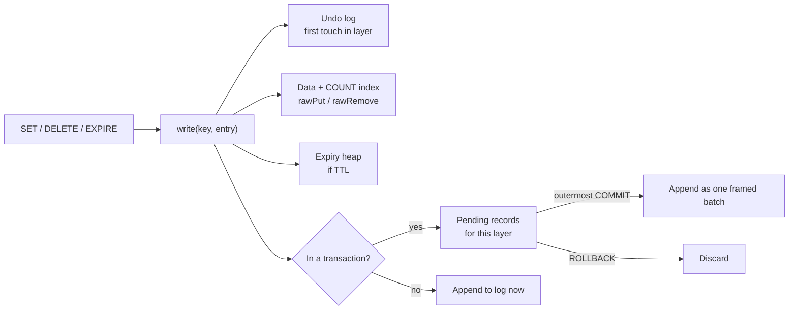

# KV Store — L5 (Senior) LLD Interview

> **Level expectation:** extend the L4 store with **TTL** and **durability** without breaking its invariants. Expiry must keep COUNT exact and behave sensibly inside transactions; the log must survive crashes mid-write and never resurrect rolled-back changes; you explain fsync trade-offs and compaction. Proven with crash and property tests. Read [L4-mid.md](L4-mid.md) first.

Legend: **🧑‍💼 Interviewer** · **🧑‍💻 Candidate** · **📝 Note** = commentary for you.

---

## 1. Requirements (what's new vs L4)

**🧑‍💻 Candidate:**
- `EXPIRE key seconds`, `TTL key` (-2 missing, -1 no expiry, else seconds left). `SET` clears a TTL, as in Redis.
- **Persistence:** after a restart, all **committed** data is back; nothing from rolled-back or unfinished transactions.
- Configurable durability vs speed (fsync policy).
- The log must not grow forever.

---

## 2. Design: one write path



**🧑‍💻 Candidate:** Every mutation goes through `write()`. The undo log, COUNT index, expiry heap and durable log can't get out of sync with the data because there's no other way to change it. Code: [KeyValueStore.java](java/src/kvstore/KeyValueStore.java).

---

## 3. Deep dives

### 3.1 TTL: lazy *and* active expiry

**🧑‍💼 Interviewer:** Why not just check expiry when a key is read?

**🧑‍💻 Candidate:** That's **lazy expiry**, and it's enough for `GET`. But `COUNT` reads the index, not the keys: an expired key that nobody reads would still be counted. So I also need **active expiry**: before each command, remove everything whose time has passed.

```java
private final PriorityQueue<Expiry> expiries = new PriorityQueue<>();   // min-heap by expiry time

private void purgeExpired() {
    long now = clock.millis();
    while (!expiries.isEmpty() && expiries.peek().at() <= now) {
        Expiry x = expiries.poll();
        Entry current = data.get(x.key());
        if (current != null && current.expiresAtMillis() == x.at()) rawRemove(x.key());   // skip stale heap entries
    }
}
```

- A **min-heap** ([PriorityQueue](../../libraries/java/treeset-and-priorityqueue.md)) gives the soonest expiry in O(1) and removal in O(log n). Each command pays only for keys that actually expired.
- **Stale heap entries:** if a key's TTL changed or it was overwritten by `SET`, its old heap entry is ignored by comparing timestamps, which is cheaper than deleting from the middle of a heap.
- **Redis does something similar:** lazy expiry on access plus a background job that samples keys with TTLs ~10 times a second.
- Time comes from an injected `Clock`, so tests jump forward instead of sleeping.

**Expiry inside transactions:** expired keys are removed **without** an undo record. If a rollback later "restored" one, it would restore something already expired, which the next purge removes anyway. And `EXPIRE` is just a `write()` of a new entry with an expiry, so a rollback restores the previous TTL. Test: `rollbackRestoresTtl`.

### 3.2 Durability: append-only log

**🧑‍💻 Candidate:** Same approach as Redis's AOF ([durability, WAL & snapshots](../../concepts/durability-wal-and-snapshots.md)): append every committed change to a file; on startup, replay the file.

```text
S  balance:alice  100  9223372036854775807     ← SET outside a transaction: logged immediately
B                                              ← transaction start
S  balance:alice  70   9223372036854775807
S  balance:bob    80   9223372036854775807
C                                              ← transaction end: only now does it count
```

Rules:
- **Inside a transaction, nothing is written to the file.** Records collect per layer (`pendingLog`). A nested commit hands them to the parent; a rollback throws them away; only the **outermost commit** appends them, as one write framed by `B`…`C`.
- **Expiry is stored as an absolute time** (`expiresAt`), so replaying a log hours later expires keys correctly rather than giving them a fresh TTL.
- **Escaping:** keys/values can contain tabs or newlines; they're escaped so a value can't break the line format. Test: `logReplaysCommittedState`.

### 3.3 Crashes in the middle of a write

**🧑‍💻 Candidate:** A crash can cut a write anywhere. Replay must handle:

| What's on disk | Replay behaviour |
|---|---|
| `B`, two records, no `C` | Transaction ignored: all or nothing |
| A half line like `S\tc\t3\t92233` | Stop at the first unparseable line |
| Clean end | Everything applied |

Test `tornTailIsIgnored` writes exactly those broken bytes and checks recovery. (Production formats add a **length prefix and checksum** per record, so corruption in the *middle* of a file is detected too, not just at the end.)

### 3.4 fsync: what "written" means

**🧑‍💻 Candidate:** `write()` to a file puts data in the operating system's **page cache** (memory). A power cut before the OS flushes it loses the data. `FileChannel.force()` (**fsync**) waits until the disk confirms ([file I/O & fsync](../../libraries/java/file-io-and-fsync.md)).

| Policy | Can lose on power loss | Cost per write |
|---|---|---|
| `ALWAYS` | Nothing acknowledged | Wait for the disk: ~0.1–10 ms depending on hardware |
| `EVERY_SECOND` | ≤ ~1 second | Almost none |
| `NEVER` | Whatever the OS hadn't flushed (often up to ~30 s) | None |

Redis defaults to `everysec`, a pragmatic middle ground. One honest limitation of my implementation: `EVERY_SECOND` only fsyncs when a write arrives; a real implementation uses a background thread so the last second gets flushed even if traffic stops.

> 📝 **Note:** Knowing that `write()` ≠ durable and naming the trade-off in numbers is a classic senior signal. Many engineers believe a successful `write()` means the data is on disk.

### 3.5 Compaction

**🧑‍💻 Candidate:** Setting `counter` 1,000 times leaves 1,000 lines but only one value matters. `compact()` rewrites the log as one `S` record per live key, safely:
1. write the new content to `appendonly.log.tmp`,
2. fsync it,
3. **atomically rename** it over the old file (`ATOMIC_MOVE`), so a crash leaves either the old or the new file, never half of each,
4. reopen for appending.

Redis's equivalent is `BGREWRITEAOF`, done in the background with a forked process (L6). Test: `compactionKeepsStateAndShrinksLog` (file shrinks by >10×, state identical after restart).

---

## 4. Testing strategy

| Test | Covers |
|---|---|
| `nestedTransactions`, `rollbackWithoutTransaction` | Transaction semantics incl. nested commit merge |
| `countIsAlwaysExact`, `ttlLazyAndActiveExpiry` | Index correctness with overwrite, delete, expiry, stale heap entries |
| `rollbackRestoresTtl` | TTL as part of transactional state |
| `logReplaysCommittedState`, `uncommittedTransactionIsLostAfterCrash`, `tornTailIsIgnored`, `compactionKeepsStateAndShrinksLog` | Durability and crash recovery |
| `matchesNaiveCopyModel` | 20,000 random ops vs a copy-on-BEGIN model |

---

## 5. Follow-ups

**🧑‍💼 Interviewer:** Recovery takes too long with a 10 GB log.

**🧑‍💻 Candidate:** Compact regularly (log size ≈ live data size), and/or take periodic **snapshots** (a full dump, like Redis RDB) so recovery = load snapshot + replay only the log written after it. Trade-off: snapshot frequency vs recovery time vs I/O cost.

**🧑‍💼 Interviewer:** Why not write the undo log to disk too?

**🧑‍💻 Candidate:** Because we never write uncommitted changes to the data file. After a crash there's nothing to undo; uncommitted work simply never existed on disk. Databases that *do* write uncommitted pages to disk (to support transactions bigger than memory) need both a redo log and an undo log ([undo & redo logs](../../concepts/undo-logs-and-redo-logs.md)).

---

## 6. What the interviewer was evaluating (L5)

- [ ] Single write path keeping data, index, undo, expiry and log consistent
- [ ] Lazy + active expiry; stale heap entries; exact COUNT with TTLs
- [ ] TTL as transactional state; absolute expiry times in the log
- [ ] Log written only at outermost commit, framed for atomic replay
- [ ] Torn-write handling; mention of checksums
- [ ] fsync policies with concrete loss/latency trade-offs
- [ ] Safe compaction (temp + fsync + atomic rename)
- [ ] Crash tests and property tests

## 7. Common mistakes at this level

| Mistake | Why it hurts at L5 |
|---|---|
| Lazy expiry only, with an O(1) COUNT index | Counts include expired keys |
| Logging each command inside a transaction immediately | Rolled-back changes come back after restart |
| Storing TTL as "seconds remaining" in the log | Keys live too long after a restart |
| Assuming `write()` means durable | Data loss on power failure |
| Compaction by truncating and rewriting the same file | A crash mid-rewrite loses everything |
| No crash-recovery tests | The code path that matters most is never exercised |

⬅️ Previous: [L4-mid.md](L4-mid.md) · ➡️ Next: [L6-staff.md](L6-staff.md)
