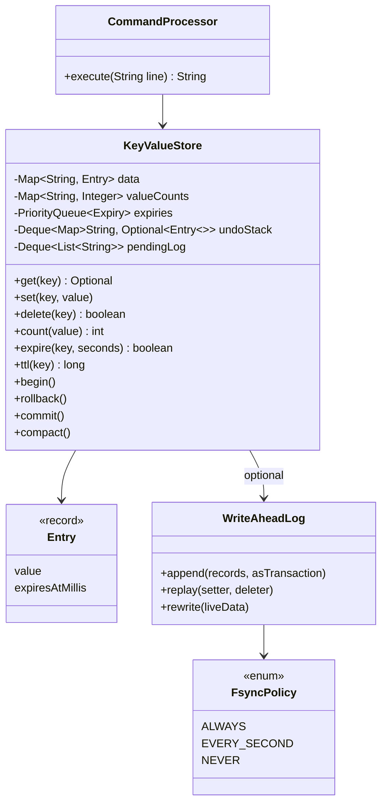

# LLD Interview: Design an In-Memory Key-Value Store with Transactions (mini Redis)

> "Implement a key-value store supporting SET, GET, DELETE, COUNT, and nested transactions with BEGIN, ROLLBACK and COMMIT. Then add expiry and persistence."

A classic coding-plus-design question (it's often asked as "simple database"). It teaches the ideas *inside* every database: **undo logs** for rollback, **derived indexes** kept consistent, **expiry**, **write-ahead logging and crash recovery**, and **why single-threaded execution is a feature**. It's the LLD companion to the [Distributed Key-Value Store](../../../HLD/interviews/distributed-kv-store/README.md) HLD interview.

## How to read this folder

> 👉 **New to transactions or Redis internals? Start with [00-understand-the-product.md](00-understand-the-product.md).** It explains transactions with a money transfer, Redis's MULTI/EXEC nuance, and the undo-log stack.

| File | Level | What "good" looks like |
|---|---|---|
| [00-understand-the-product.md](00-understand-the-product.md) | Everyone, first | Know why transactions, TTL and durability exist |
| [L4-mid.md](L4-mid.md) | Mid / SDE2 | Correct commands, O(1) COUNT, nested transactions with an undo-log stack (not full copies), clean command parsing |
| [L5-senior.md](L5-senior.md) | Senior | TTL with lazy + active expiry interacting correctly with COUNT and rollback; append-only log with fsync policies, crash-safe framing, compaction; property-based tests |
| [L6-staff.md](L6-staff.md) | Staff | Multiple clients: isolation levels, MVCC, optimistic `WATCH`-style transactions; single-threaded vs multi-threaded engines; snapshots without pausing; replication and what Redis/etcd actually do |

## Code (runnable, no dependencies)

| | Run | Files |
|---|---|---|
| ☕ Java 21 | `./java/run.sh` | [java/src/kvstore/](java/src/kvstore/): `KeyValueStore`, `WriteAheadLog`, `CommandProcessor`, `Entry`; tests in `KeyValueStoreTests.java` |
| 🟨 Node 22 | `cd js && node --test` | [js/kvstore.js](js/kvstore.js), [js/kvstore.test.js](js/kvstore.test.js) |

## Class diagram (matches the code)

## Libraries & concepts used

**Java:** [File I/O & fsync](../../libraries/java/file-io-and-fsync.md) · [Records & immutability](../../libraries/java/records-and-immutability.md) · [TreeSet & PriorityQueue](../../libraries/java/treeset-and-priorityqueue.md) · [Time & Clock](../../libraries/java/time-and-clock.md)

**JS:** [fs & durability in Node](../../libraries/js/fs-and-durability-in-node.md) · [Map vs Object](../../libraries/js/map-vs-object.md) · [node:test runner](../../libraries/js/node-test-runner.md)

**Concepts:** [Transactions & isolation](../../concepts/transactions-and-isolation.md) · [Undo & redo logs](../../concepts/undo-logs-and-redo-logs.md) · [Durability, WAL & snapshots](../../concepts/durability-wal-and-snapshots.md) · [Single-writer principle](../../concepts/single-writer-principle.md) · [Ledgers & event sourcing](../../concepts/ledgers-and-event-sourcing.md) · [Design patterns (Command)](../../concepts/design-patterns.md) · [Big-O complexity](../../concepts/big-o-complexity.md)

**Related:** [Redis](../../../HLD/technologies/redis.md) · [LSM trees & storage engines](../../../HLD/concepts/lsm-trees-and-storage-engines.md)

## The core insight

1. **Undo logs, not copies.** Record a key's original value the first time a transaction layer touches it; rollback cost is proportional to what changed, not to database size.
2. **Every derived structure must follow every change**: COUNT's index, expiry heap, undo log and write-ahead log all go through one `write()` path.
3. **Durability is a log + a policy.** Committed batches are appended atomically (framed), fsync'd per policy, and replay ignores anything half-written.
