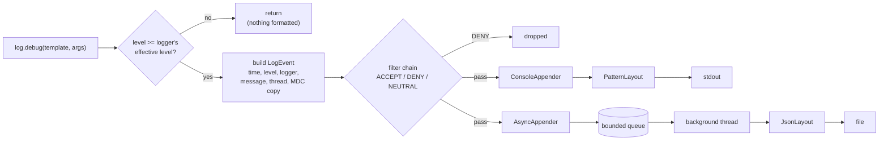

# Start Here: What Is a Logging Framework? (Before the Interview)

> You use one every day: `log.info("order {} placed", id)` in a Spring service, `kubectl logs` during an incident, a Kibana or Grafana search at 3 a.m. This interview asks you to build the library behind that one line: the part that decides **whether** a line is written, **what it looks like**, **where it goes**, and **what happens when the disk can't keep up**.
>
> Time: ~10 minutes. Then: [L4](L4-mid.md) → [L5](L5-senior.md) → [L6](L6-staff.md).

---

## 1. The problem as a story: 3 a.m., and logs are all you have

You're on call. Checkout errors spiked at 03:12. There is no debugger in production, and the pod that failed has already been restarted. The only witness is what the code **wrote down** while it ran.

The service was written quickly, so it logs with `System.out.println`:

```
order placed
payment failed
order placed
java.lang.IllegalStateException: connection refused
```

Every problem a logging framework solves is visible here:

1. **No timestamp.** Did "payment failed" happen at 03:12 or yesterday?
2. **No severity.** Which lines are errors and which are chatter? You can't search for "only errors".
3. **No context.** Which request, which user, which order? Two requests interleave and you can't tell their lines apart.
4. **No volume control.** Someone added `println` inside a loop "for debugging". It now writes 40,000 lines a second, and you can't turn it off without a redeploy.
5. **It's slow and it blocks.** `System.out` is one shared stream with a lock inside. Under load, request threads queue up waiting to print. When the disk is slow, the whole service is slow.
6. **Secrets leak.** Someone printed a request object; its `toString()` includes the customer's card token.

A **logging framework** is a library that fixes all six with one API: levels, timestamps, context, per-component switches you can flip at runtime, buffering off the request thread, and formatting rules applied in one place.

---

## 2. Where you've seen this

| Place | What you saw |
|---|---|
| **Spring Boot** | `private static final Logger log = LoggerFactory.getLogger(OrderService.class);` That's **SLF4J** (a *facade*: an API with no implementation of its own) backed by **Logback** (the implementation Spring Boot uses by default). See [SLF4J, Logback & Log4j2](../../libraries/java/slf4j-logback-and-log4j2.md) |
| **Log4j2** | Apache's logging library: same ideas, plus very fast **async loggers** built on a ring buffer (a fixed-size array reused in a circle, L6) |
| **`java.util.logging` (JUL)** | The logger built into the JDK; different level names (`SEVERE`, `WARNING`, `INFO`, `FINE`…) |
| **`kubectl logs`** | Kubernetes captures whatever a container writes to **stdout/stderr** (the process's standard output and error streams) into files on the node; `kubectl logs` reads them |
| **ELK / Loki** | **Elasticsearch** (a search engine) + Logstash + Kibana (a UI), or Grafana **Loki** (a cheaper log store): central places where logs from every pod are searchable |
| **JSON logs** | `{"ts":"…","level":"ERROR","msg":"…","requestId":"r-7f3a"}`: one JSON object per line, so machines can filter by field instead of guessing with regexes |
| **Node.js** | `console.log`, or libraries like pino and winston. See [logging in Node](../../libraries/js/logging-in-node.md) |
| **Log4Shell (Dec 2021)** | A bug in Log4j2 (CVE-2021-44228; a CVE is the public ID given to a known security vulnerability) where *logging a string an attacker controlled* could make the server download and run the attacker's code. Lesson: a logging library is **attack surface** (code an attacker can reach), not plumbing. L6 covers it |

---

## 3. The features, one situation at a time

### 3.1 Levels and thresholds: "only show me what matters"
Every line gets a **level**: `TRACE` < `DEBUG` < `INFO` < `WARN` < `ERROR`. A logger has a **threshold**; lines below it are thrown away. Production usually runs at `INFO`; you only see `DEBUG` when you ask for it.

👉 Interview: *the `Level` enum, comparing levels, and doing that check before any other work.*

### 3.2 Per-package loggers, hierarchy and inheritance
The database layer is noisy, the payment layer is critical. You want `com.shop.db` at `WARN` and `com.shop.payment` at `DEBUG`. Logger names are **dotted** like Java packages, and they form a tree: `com.shop.db.Pool` inherits from `com.shop.db`, which inherits from `com.shop`, up to `ROOT`. Set a level on a parent and every child without its own setting follows.

👉 Interview: *effective-level resolution by walking up the tree (L5).*

### 3.3 Appenders: where lines go
The same line may go to the console (for `kubectl logs`), a file, and a separate "audit" file. Each destination is an **appender**. A **rolling file** appender starts a new file every day or every 100 MB and deletes old ones, so the disk never fills up.

👉 Interview: *the `Appender` interface, fan-out to several appenders, and thread safety of each one.*

### 3.4 Layouts: what a line looks like
Humans like `03:12:07.415 ERROR [http-7] c.s.Orders - payment failed`. Log pipelines like JSON. A **layout** (Logback's word; also called a *formatter*) turns an event into text. Swap the layout, keep everything else.

👉 Interview: *Strategy pattern for layouts (one interface, interchangeable implementations); correct JSON escaping.*

### 3.5 Context (MDC): "which request was this?"
At the start of a request you put `requestId=r-7f3a` into the **MDC** (Mapped Diagnostic Context: a per-thread map of key/values), and every line logged while handling that request carries it automatically. Then one search shows one request's whole story.

👉 Interview: *ThreadLocal (a Java variable where each thread sees its own value), and why the context gets lost (or leaks) when work moves to a thread pool (L5). See [thread-local & context propagation](../../concepts/thread-local-and-context-propagation.md).*

### 3.6 Lazy messages: don't pay for lines nobody reads
```java
log.debug("cart: " + cart);          // builds the string (calls cart.toString()) even when DEBUG is off
log.debug("cart: {}", cart);         // checks the level first; toString() only if DEBUG is on
```
The `{}` placeholder style is how SLF4J makes disabled lines almost free.

👉 Interview: *level check before formatting; a test that proves `toString()` is never called.*

### 3.7 Async logging: when the disk is slow
A network disk stalls for 2 seconds. With synchronous logging, every request thread that logs waits 2 seconds too. An **async appender** puts events in an in-memory queue and returns; one background thread writes them.

👉 Interview: *bounded queue + one consumer thread, flushing on shutdown (L5).*

### 3.8 Back-pressure: what if the queue fills up?
The disk stays slow, the queue fills. Now you must choose: **block** the caller (lose nothing, but the app slows down), **drop** new lines (app stays fast, logs have holes), or **drop only low-level lines** (keep `WARN`/`ERROR`). Logback's default is the last one. That choice is **back-pressure**: what a fast producer does when a slow consumer can't keep up. See [back-pressure](../../concepts/back-pressure.md).

👉 Interview: *the overflow policy and counting what you dropped (L5).*

### 3.9 Changing levels without a restart
An incident is happening *now*. You need `DEBUG` on `com.shop.payment` for ten minutes, and a redeploy would wipe the evidence. Spring Boot exposes this as an HTTP call (see section 5).

👉 Interview: *runtime reconfiguration and making the change visible to all threads (`volatile`: a Java field modifier that makes a write immediately visible to every thread).*

### 3.10 Sampling and rate limiting
A dependency goes down and one line, `"timeout calling inventory"`, fires 50,000 times a second. You want the first few each second plus a count of the rest, not a bill for 4 billion identical lines.

👉 Interview: *a rate-limiting filter per call site (one `log.x(...)` line in the code); Chain of Responsibility for filters, where each filter may decide or pass to the next (L5, L6).*

### 3.11 Redaction of secrets and personal data
A developer logs a login request; the password is now in Elasticsearch, readable by 200 engineers and kept for 90 days. **Redaction** masks known-sensitive fields (`password=***`) before anything is written. **PII** (personally identifiable information: names, emails, phone numbers) needs the same care for legal reasons.

👉 Interview: *a redacting layout as a safety net (L4/L5), compliance (L6).*

---

## 4. The key mechanism: one log call, step by step



- The **level check** comes first and is a couple of comparisons. A disabled line costs almost nothing.
- Only then is a **`LogEvent`** built: an immutable snapshot (it never changes after creation) of everything about this call, including a *copy* of the MDC.
- **Filters** run in order; each may accept, deny, or pass to the next.
- Each **appender** formats the event with its own **layout** and writes to its **sink** (the final destination: a stream, a file, a socket).
- An **async appender** only enqueues; a background thread does the slow writing. Its queue is **bounded** (has a maximum size), so when the disk is slow, the overflow policy decides what happens.

---

## 5. Try it yourself (real, 10 minutes)

1. **The JDK's own logger in `jshell`** (Java's interactive shell, ships with the JDK):
   ```java
   var log = java.util.logging.Logger.getLogger("com.shop.db");
   log.info("hello");         // printed (to stderr) with a timestamp and the calling method
   log.fine("details");       // not printed: the default console handler's threshold is INFO
   ```
2. **Node, one line:**
   ```sh
   node -e 'console.error(JSON.stringify({ts:new Date().toISOString(), level:"WARN", msg:"say \"hi\"\nbye"}))'
   ```
   Notice the quote and the newline are escaped (`\"`, `\n`): the line stays one line.
3. **Kubernetes** (any test cluster, e.g. `kind` or `minikube`, tools that run a small cluster on your laptop):
   ```sh
   kubectl logs deploy/my-app --since=10m --tail=50     # last 10 minutes, at most 50 lines
   kubectl logs my-pod --previous                        # the container that crashed before this one
   ```
4. **Change a level at runtime in Spring Boot** (with `spring-boot-starter-actuator` and `management.endpoints.web.exposure.include=loggers`):
   ```sh
   curl localhost:8080/actuator/loggers/com.shop.payment
   curl -X POST localhost:8080/actuator/loggers/com.shop.payment \
        -H 'Content-Type: application/json' -d '{"configuredLevel":"DEBUG"}'
   ```
   Static configuration lives in `application.yml` as `logging.level.com.shop.payment: DEBUG`.

---

## 6. From experience to requirements

| What you experienced | Requirement | Type |
|---|---|---|
| "Which lines are errors?" | Levels with a threshold per logger | Functional |
| DB noisy, payment critical | Named loggers in a hierarchy; inherited, overridable levels | Functional |
| Console + file + audit file | Several appenders per logger; additivity on/off | Functional |
| Humans vs log pipelines | Pluggable layouts: pattern and JSON | Functional |
| "Which request was this?" | MDC context copied into every event | Functional |
| Incident in progress | Change levels at runtime, no restart | Functional |
| 50,000 identical lines/s | Rate limiting / sampling filters | Functional |
| Password in Elasticsearch | Redaction of known-sensitive fields | Functional |
| `DEBUG` off in production | Disabled calls cost ~nothing; no formatting | Non-functional |
| Slow disk | Logging must not block request threads (async) and must be bounded in memory | Non-functional |
| Pod killed during deploy | Flush queued events on shutdown | Non-functional |
| Many threads log at once | Lines never interleave mid-line; thread-safe | Non-functional |
| Broken appender | Logging never throws into business code | Non-functional |

---

## 7. Mini glossary

| Term | Meaning in plain words |
|---|---|
| **Level** | Severity of a line: TRACE, DEBUG, INFO, WARN, ERROR |
| **Threshold / effective level** | The minimum level a logger lets through; "effective" = inherited from the nearest ancestor that has one |
| **Logger** | A named object you call `info()` on; names are dotted (`com.shop.db`) and form a tree |
| **Additivity** | Whether a logger's events also go to its ancestors' appenders |
| **LogEvent** | One log call captured as an immutable record |
| **Appender** | A destination: console, file, rolling file, network |
| **Layout / formatter** | Turns an event into text (pattern or JSON) |
| **Sink** | The final place bytes are written (stream, file, socket) |
| **Filter** | A rule that accepts, denies or passes an event |
| **MDC** | Per-thread key/values (requestId, userId) added to every event |
| **Async appender** | Queues events; a background thread writes them |
| **Back-pressure** | What a fast producer does when the consumer can't keep up: wait, drop, or shed low-priority work |
| **Facade** | An API (SLF4J) that hides which implementation (Logback, Log4j2) is underneath |
| **Redaction** | Masking secrets or personal data before they are written |
| **Structured logging** | Logging fields (JSON) instead of free text |

➡️ **Now build it:** [L4-mid.md](L4-mid.md)
