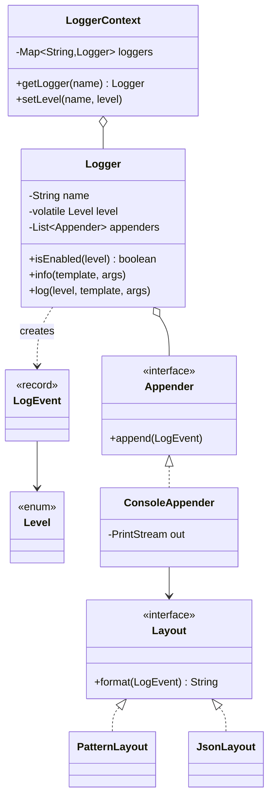

# Logging Framework — L4 (Mid-level / SDE2) LLD Interview

> **Level expectation:** model the framework cleanly (`Level`, `LogEvent`, `Logger`, `Appender`, `Layout`, a registry), make **disabled log calls nearly free** (level check first, `{}` parameters instead of string concatenation), use **Strategy** for layouts and **fan-out** to several appenders, make appenders **thread-safe** without serialising the whole app, and discuss the **singleton registry** honestly, including why it hurts tests.

> 🆕 Never thought about what's inside `log.info(...)`? Read [00-understand-the-product.md](00-understand-the-product.md) first.

Legend: **🧑‍💼 Interviewer** · **🧑‍💻 Candidate** · **📝 Note** = commentary for you.

---

## 1. Clarifying requirements

**🧑‍💼 Interviewer:** Design a logging library like Log4j. Application code calls `log.info("...")`.

**🧑‍💻 Candidate:** A few questions first:
- **Library or service?** I assume an **in-process library**: code inside our JVM (Java Virtual Machine, the process running our Java code), not a log-collection service. Shipping logs across the fleet is a separate (HLD) problem.
- **Levels:** the usual TRACE, DEBUG, INFO, WARN, ERROR, with a threshold per logger?
- **Destinations:** console and file to start? More than one per logger?
- **Formats:** human-readable lines, and JSON for machines?
- **Concurrency:** many request threads log at the same time, I assume?
- **Performance:** what about `debug` calls in hot code when DEBUG is off?

**🧑‍💼 Interviewer:** Library, yes. Those five levels. Console and file, several per logger. Plain text first, JSON is a plus. Hundreds of threads. And yes: disabled calls must cost almost nothing.

**🧑‍💻 Candidate:**

**Functional:** `getLogger(name)`; `trace/debug/info/warn/error(template, args...)`; a threshold level per logger; one or more appenders per logger; pluggable layouts; exceptions logged with their stack trace (the list of method calls that led to the error).

**Non-functional:** a disabled call does no formatting and no I/O (input/output: writing to a disk, stream or network); lines from different threads never mix characters; logging **never throws** into business code; easy to test.

> 📝 **Note:** "Disabled calls must be free" is the requirement that shapes the whole API. Ask about it, or raise it yourself: it's what separates a logging framework from `System.out.println` with a prefix.

---

## 2. Core entities

| Piece | Responsibility |
|---|---|
| `Level` | An **enum** (a fixed set of named constants) `TRACE, DEBUG, INFO, WARN, ERROR, OFF`. Declaration order *is* severity order, so comparing is `ordinal() >=` (ordinal = the constant's position, 0, 1, 2…). See [enums](../../libraries/java/enums-and-enummap.md) |
| `LogEvent` | One log call captured as an immutable **record** (a Java class whose fields are fixed at construction, with equals/hashCode generated): time, level, logger name, template, formatted message, thread name, context map, throwable. See [records & immutability](../../libraries/java/records-and-immutability.md) |
| `Logger` | A named entry point: `info(...)`, holds its level and appenders |
| `Appender` | *Where* a line goes: console, file, memory (tests). An interface |
| `Layout` | *How* a line looks: pattern or JSON. An interface |
| `LoggerContext` | The **registry**: one `Logger` per name, plus the clock and global filters |
| `LoggerFactory` | Static entry point `getLogger(MyClass.class)` over a default context |

Separating **where** (`Appender`) from **how** (`Layout`) means a JSON file and a JSON socket share one layout, and a console can switch from text to JSON without a new appender class. That's the **Single Responsibility** and **Open/Closed** principles from [SOLID](../../concepts/solid-principles.md): each class has one reason to change, and new formats are added, not edited in.

---

## 3. Interfaces

```java
public enum Level { TRACE, DEBUG, INFO, WARN, ERROR, OFF;
    public boolean isAtLeast(Level threshold) { return ordinal() >= threshold.ordinal(); } }

public record LogEvent(Instant instant, Level level, String loggerName, String template, String message,
                       String threadName, Map<String, String> mdc, Throwable throwable) {}

public interface Appender extends AutoCloseable { void append(LogEvent e); default void close() {} }
public interface Layout { String format(LogEvent e); }

public final class Logger {
    public boolean isEnabled(Level level);
    public void info(String template, Object... args);   // also trace/debug/warn/error
    public void log(Level level, String template, Object... args);
}

public final class LoggerContext {
    public Logger getLogger(String name);
    public void setLevel(String loggerName, Level level);
}
```

`Object... args` is **varargs**: the compiler packs the arguments into an `Object[]` for you.

---

## 4. Class diagram



The full diagram (async appender, filters, MDC, hierarchy) is in the [README](README.md#class-diagram-matches-the-code). Notation: [UML class diagrams](../../concepts/uml-class-diagrams.md).

---

## 5. Deep dives

### 5.1 Make disabled calls free: level check first, `{}` parameters

**🧑‍💼 Interviewer:** `log.debug("cart: " + cart)` with DEBUG off. What does it cost?

**🧑‍💻 Candidate:** Java evaluates arguments *before* calling the method. So even if `debug` returns immediately, we already called `cart.toString()` (maybe walking 200 items), built a new `String`, and created **garbage** (objects the GC, the JVM's garbage collector, must later clean up). In a loop running 100,000 times a second, that's real CPU for lines nobody sees.

Two fixes, both in the API:

```java
log.debug("cart: {}", cart);           // 1. parameters: formatting happens INSIDE, after the check
if (log.isEnabled(Level.DEBUG))         // 2. explicit guard for truly expensive arguments
    log.debug("cart diff: {}", computeDiff(old, cart));
```

And inside the logger the order is strict ([Logger.java](java/src/logging/Logger.java)):

```java
public void log(Level lv, String template, Object... args) {
    if (!isEnabled(lv)) return;   // FIRST and cheapest: no formatting, no event, no toString()
    // ... only now: extract a trailing Throwable, format "{}", snapshot context, build LogEvent
}
```

Test `disabledLevelNeverFormatsArguments` passes an object whose `toString()` counts its calls: 0 after a disabled `debug`, 1 after an enabled `info`. I checked the test catches the bug: formatting before the check makes it fail with `expected 0 but was 1`.

What a disabled call still costs: the method call, the level comparison, and the `Object[]` for varargs (often optimised away by the **JIT**, the JVM's just-in-time compiler that turns hot bytecode into machine code, but not guaranteed). That's why SLF4J (the standard Java logging API, see [SLF4J, Logback & Log4j2](../../libraries/java/slf4j-logback-and-log4j2.md)) has fixed one- and two-argument overloads (`debug(String, Object)`, `debug(String, Object, Object)`) next to the varargs one.

> 📝 **Note:** This is the single most important point at L4. Say "arguments are evaluated before the call, so the check must happen before formatting, and `{}` moves formatting after the check".

### 5.2 `{}` substitution rules

**🧑‍💻 Candidate:** Each `{}` takes the next argument's `String.valueOf`. Edge cases, all in test `placeholderEdgeCases`:

| Call | Result | Rule |
|---|---|---|
| `info("a={} b={}", 1)` | `a=1 b={}` | Too few args: leftover `{}` stays |
| `info("a={}", 1, 2)` | `a=1` | Extra args ignored |
| `info("failed for {}", "alice", ex)` | `failed for alice` + stack trace | Last arg is a `Throwable` with no `{}` left → it's the exception (SLF4J's rule since 1.6) |
| `info("cause: {}", ex)` | `cause: java.lang.IllegalStateException: boom` | `{}` consumed it → just text |
| `info("{}", obj)` where `toString()` throws | `[toString() failed: …]` | Logging must never throw |

### 5.3 Layouts are a Strategy; appenders are a fan-out

**🧑‍💼 Interviewer:** How do you support text and JSON?

**🧑‍💻 Candidate:** The **Strategy pattern** ([design patterns](../../concepts/design-patterns.md)): an interface for one interchangeable algorithm, chosen at configuration time. `Layout.format(LogEvent)` has two implementations:

```
PatternLayout: 2026-10-08T03:30:00.000Z WARN  [main] com.shop.Orders - stock low: 2 {requestId=r-9}
JsonLayout:    {"ts":"2026-10-08T03:30:00.000Z","level":"WARN","logger":"com.shop.Orders","thread":"main","msg":"stock low: 2","requestId":"r-9"}
```

A logger holds a **list** of appenders and sends each event to all of them. That's an **Observer**-like fan-out (Observer: subscribers register with a subject and all get notified): the logger doesn't know or care whether it's feeding a console, a file, or a test list. Two rules:
- **Format once per appender, not per logger**: different appenders may use different layouts.
- **One broken appender must not affect the others or the caller.** Each `append` is wrapped in `try/catch`; failures go to `System.err` (test `brokenAppenderNeverThrowsToCaller`). An exception from logging that crashes a payment is a much worse bug than a missing log line.

The appender list is a `CopyOnWriteArrayList` ([concurrent collections](../../libraries/java/concurrent-collections.md)): a list that copies itself on every write, so reads (every log call) need no lock and writes (configuration, rare) pay the cost.

### 5.4 Thread safety of appenders

**🧑‍💼 Interviewer:** 200 threads log to the console at once. What can go wrong?

**🧑‍💻 Candidate:** Two lines can **interleave** (characters of one line mixed into another) if the write isn't atomic, and a file appender's internal buffer can be corrupted by two concurrent writers. The fix is a lock **per appender**, held only for the write ([locks & synchronized](../../libraries/java/locks-and-synchronized.md), [thread-safety basics](../../concepts/thread-safety-basics.md)):

```java
public void append(LogEvent event) {
    String line = layout.format(event);     // CPU work, no shared state: outside the lock
    synchronized (this) {                   // only one thread writes at a time
        out.println(line);
        out.flush();
    }
}
```

`synchronized` makes a block **mutually exclusive**: only one thread at a time may be inside it for the same object. Formatting outside the lock keeps the critical section (the code that runs under the lock) short. A lock per appender, not one global lock, means a slow file appender doesn't block the console appender. Even so, every thread still waits for the disk: that's the problem the **async appender** solves at L5.

`Logger` itself is **immutable in its identity** (name, parent) and its mutable bits are a `volatile` level (a field whose writes are immediately visible to all threads) and the copy-on-write appender list, so `Logger` needs no lock at all.

### 5.5 The registry: singleton or not?

**🧑‍💼 Interviewer:** `LoggerFactory.getLogger(...)` is static. Is a singleton OK here?

**🧑‍💻 Candidate:** A **singleton** is a class with exactly one instance reachable globally. For logging it's the industry norm: every class does `private static final Logger log = LoggerFactory.getLogger(X.class);`, and nobody wants to pass a logger through every constructor. But it has costs:

| Pro | Con |
|---|---|
| One line per class, no wiring | **Global mutable state**: a test that sets `com.shop` to DEBUG or adds an appender changes every other test in the same JVM |
| One place to configure | Hard to assert "this code logged X" without a test-only hook |
| Same logger instance per name everywhere | Initialisation order: logging before configuration is loaded uses defaults |

My compromise in the code: `LoggerContext` is a **normal class** with a public constructor. `LoggerFactory` just holds one default instance. Tests build their own `LoggerContext` with a `ManualClock` and a `ListAppender`, so they are isolated and deterministic. Inside, `getLogger` is a `ConcurrentHashMap` (a thread-safe hash map whose reads take no lock) lookup ([concurrent collections](../../libraries/java/concurrent-collections.md)): lock-free for the common case, and only creation is `synchronized`.

> 📝 **Note:** Interviewers like hearing *both*: "static loggers are fine and idiomatic" and "here is how I keep tests from sharing state". Logback does exactly this: `LoggerContext` is a normal class; SLF4J's `LoggerFactory` is the static door.

### 5.6 Complexity

[Big-O](../../concepts/big-o-complexity.md) per log call, with *d* = depth of the logger name (3–6 in practice), *a* = number of appenders, *m* = message length:

| Step | Cost |
|---|---|
| Level check (disabled call) | O(d) pointer reads, often O(1) with caching (L5) |
| Format message | O(m) |
| Fan-out | O(a) appends, each O(m) to format + the write |
| `getLogger(name)` | O(1) average hash lookup; usually called once per class |

---

## 6. Follow-ups

**🧑‍💼 Interviewer:** Why not let callers pass a `Supplier<String>`: `log.debug(() -> "cart " + cart)`?

**🧑‍💻 Candidate:** Also lazy and fine (Log4j2 and SLF4J 2's fluent API support it). The lambda itself may allocate a small object if it captures variables. `{}` covers 95% of cases; suppliers are for expensive computations that aren't just `toString()`. The Node version supports both.

**🧑‍💼 Interviewer:** Where do timestamps come from?

**🧑‍💻 Candidate:** An injected `java.time.Clock` ([Time & Clock](../../libraries/java/time-and-clock.md)), so tests assert exact output lines. Timestamps are printed in UTC with fixed milliseconds (`.000`), so lines from different machines sort and compare as plain strings.

**🧑‍💼 Interviewer:** And in JavaScript?

**🧑‍💻 Candidate:** Same entities. Node runs our code on one thread (the **event loop**, see [event loop & concurrency](../../libraries/js/event-loop-and-concurrency.md)), so no locks are needed, but blocking that one thread on a slow write would freeze every request, so the JS appender buffers and writes in batches ([js/logger.js](js/logger.js)).

---

## 7. What the interviewer was evaluating (L4)

- [ ] Clarified library vs service, levels, destinations, concurrency, cost of disabled calls
- [ ] Clean entities: `Level` enum with ordered comparison, immutable `LogEvent`, `Logger`, `Appender`, `Layout`, registry
- [ ] Level check **before** formatting; `{}` parameters; explained why concatenation is eager
- [ ] Strategy for layouts; fan-out to appenders; failures isolated per appender
- [ ] Thread-safe appenders with a short, per-appender lock; format outside it
- [ ] Singleton trade-offs and a way to test without global state

## 8. Common mistakes at this level

| Mistake | Why it's wrong |
|---|---|
| `log.debug("x=" + x)` everywhere | Builds strings and calls `toString()` even when DEBUG is off |
| Formatting before the level check inside the logger | Same cost, hidden inside the library |
| One global lock around all logging | Every thread waits for the slowest appender |
| Formatting inside the `synchronized` block | Holds the lock longer than needed |
| Letting an appender exception propagate | A full disk crashes business requests |
| Levels as strings compared with `equals` | No ordering: "is WARN ≥ INFO?" needs a table you'll get wrong |
| A static singleton with no way to reset it in tests | Tests leak configuration into each other |
| Layout logic inside each appender | Duplicate formatting code; can't reuse JSON for file and socket |

➡️ Next: [L5-senior.md](L5-senior.md)
