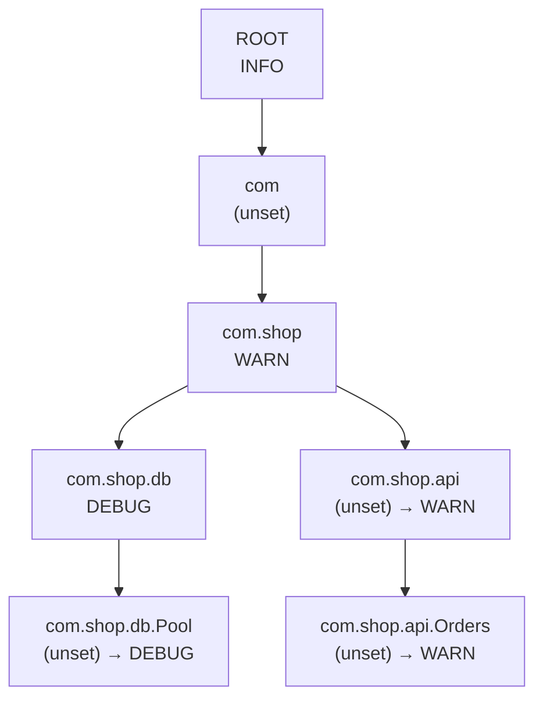
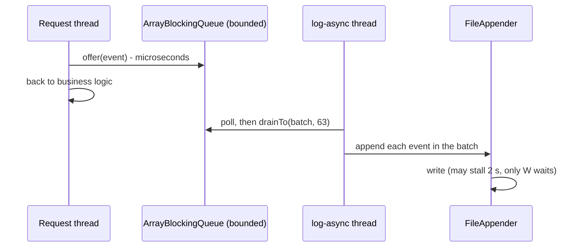

# Logging Framework — L5 (Senior) LLD Interview

> **Level expectation:** take the L4 design and make it production-grade: a **dotted logger hierarchy** with effective-level inheritance and additivity; **filters as a Chain of Responsibility**; an **async appender** with a bounded queue, one consumer thread, batching, flush on shutdown and an explicit **back-pressure policy** with a dropped counter; **MDC** and how it breaks on thread pools; **rolling files**; **correct JSON escaping**; and **runtime reconfiguration** that every thread sees. All with deterministic tests. Read [L4-mid.md](L4-mid.md) first.

Legend: **🧑‍💼 Interviewer** · **🧑‍💻 Candidate** · **📝 Note** = commentary for you.

---

## 1. Requirements (what's new vs L4)

**🧑‍💻 Candidate:**
- Levels configured per **package prefix** (`com.shop.db=WARN`), inherited by every logger below it, changeable **at runtime**.
- Events can go to the ancestors' appenders too (**additivity**), and that can be switched off.
- **Filters**: rate-limit noisy call sites; let ERRORs through regardless.
- **Async logging** so a slow disk never slows request threads, with bounded memory and a defined behaviour when full.
- **Context** (requestId, userId) on every line without passing it around.
- **JSON** output that never breaks a line or a parser; **rolling files**.

---

## 2. Deep dives

### 2.1 The logger hierarchy and effective levels

**🧑‍💼 Interviewer:** Config says `ROOT=INFO`, `com.shop=WARN`, `com.shop.db=DEBUG`. What does `com.shop.db.Pool` log? And `com.shop.api.Orders`?

**🧑‍💻 Candidate:** Logger names form a tree by dots. A logger's **effective level** is its own level if set, else its parent's effective level, up to `ROOT`, which always has one.



So `Pool` logs DEBUG and above; `Orders` logs WARN and above. `getLogger("com.shop.db.Pool")` **creates missing parents** (`com.shop.db`, `com.shop`, `com`) so the chain always exists, even if config for `com.shop` arrives later.

```java
public Level effectiveLevel() {
    for (Logger l = this; l != null; l = l.parent) {
        Level lv = l.level;              // volatile read
        if (lv != null) return lv;
    }
    throw new IllegalStateException("ROOT always has a level");
}
```

Walking is O(depth), a handful of pointer reads. **Logback caches** the effective level in each logger and, when you change a level, pushes the new value down to the children that inherit it. That makes the check O(1) at the price of a more complex `setLevel`. Both are fine answers if you name the trade-off.

**Runtime change** is `context.setLevel("com.shop.db", DEBUG)` (Spring's `POST /actuator/loggers/com.shop.db` does exactly this). The field is `volatile`, so the next log call on *any* thread sees it. Without `volatile`, the **Java Memory Model** (the rules for when one thread's writes become visible to another) allows a thread to keep using a stale cached value. `setLevel(null)` means "inherit again". Test: `hierarchyInheritanceOverrideAndRuntimeChange`.

**Additivity:** after a logger's own appenders, the event also goes to its parent's appenders, then the grandparent's… until `ROOT` or a logger with `additive = false`.

| Setup | `com.shop.payment.Stripe.info("refund")` goes to |
|---|---|
| ROOT has console; `com.shop.payment` has audit file; additive = true | audit file **and** console |
| Same, but `com.shop.payment` additive = false | audit file only |
| Console attached to *both* ROOT and `com.shop` | console **twice** (the classic duplicate-lines bug) |

Test: `additivity`.

### 2.2 Filters: a Chain of Responsibility

**🧑‍💼 Interviewer:** Inventory is down, and `"timeout for user {}"` fires 50,000 times a second. How do you stop it from drowning everything?

**🧑‍💻 Candidate:** A **filter chain**. **Chain of Responsibility** ([design patterns](../../concepts/design-patterns.md)) = a request passes along a list of handlers, and each may handle it or pass it on. Each filter returns `ACCEPT` (log it, skip the rest), `DENY` (drop it), or `NEUTRAL` (ask the next one); all-NEUTRAL means log. That's Logback's `FilterReply` contract.

```java
for (Filter f : filters) {
    switch (f.decide(e)) {
        case ACCEPT: return true;
        case DENY:   return false;
        case NEUTRAL: break;
    }
}
return true;
```

Order matters: `[acceptAtOrAbove(ERROR), RateLimitFilter(2 per second)]` means ERRORs are never rate-limited, everything else is. The rate limiter keys on **logger + template** (`"timeout for user {}"`), not the formatted message, so 50,000 different user IDs still count as **one call site**. It's a fixed-window counter (see the [Rate Limiter interview](../rate-limiter/README.md) for sliding windows and token buckets), and it counts what it suppressed so you can export "lines hidden" as a metric. With an injected clock, test `rateLimitFilterChain` is exact: 5 WARNs → 2 logged, 3 suppressed; 3 ERRORs all logged; next window logs again.

> 📝 **Note:** The filter map has one entry per call site, so it's bounded by the number of log statements in the code. Keying by formatted message would be **unbounded** memory (one entry per user ID), a subtle leak worth calling out.

### 2.3 The async appender

**🧑‍💼 Interviewer:** The file appender sits on a network disk that sometimes stalls for 2 seconds. Every request thread that logs stalls too. Fix it.

**🧑‍💻 Candidate:** Put a queue between the callers and the slow appender, and one background thread that drains it: the producer-consumer pattern ([blocking queues & producer-consumer](../../libraries/java/blocking-queues-and-producer-consumer.md)).



Design decisions, each with a reason:

| Decision | Why |
|---|---|
| **Bounded** `ArrayBlockingQueue(capacity)` | An unbounded queue turns a slow disk into an `OutOfMemoryError`. Memory = capacity × event size, known in advance |
| **One** consumer thread | Events reach the file in exactly the order they were queued, and the delegate appender has a single writer: no lock contention on the file. That's the [single-writer principle](../../concepts/single-writer-principle.md) |
| **Batching** with `drainTo` | One lock round-trip for up to 64 events instead of 64; the file can be flushed once per batch |
| Format the message on the **caller's** thread | Arguments may be mutable objects; by the time the worker runs, the caller may have changed them. `LogEvent` holds the already-formatted string and an MDC *copy* |
| **Daemon** worker thread | A **daemon** thread doesn't keep the JVM alive. A forgotten `close()` doesn't hang shutdown |
| `close()` drains, then joins | Set `closed`, let the worker empty the queue, `join()` (wait for it to finish) with a timeout, then close the delegate. Test `asyncCloseDrainsQueue` |
| A **shutdown hook** calls `close()` | `Runtime.addShutdownHook` runs on normal exit and on SIGTERM (the "please stop" signal Kubernetes sends before killing a pod). Without it, the last second of logs, usually the most interesting ones, die in the queue |

Test `asyncBlockDeliversAllInOrder` pushes 2,000 events through a 16-slot queue and checks they all arrive in order. See [executors & threads](../../libraries/java/executors-and-threads.md) for thread basics.

### 2.4 Back-pressure: the queue is full, now what?

**🧑‍💻 Candidate:** This is a policy decision, so it's a constructor parameter, and every drop is **counted** ([back-pressure](../../concepts/back-pressure.md), [atomics](../../libraries/java/atomics-and-cas.md) for the `AtomicLong` counter):

| Policy | Caller when full | Lose | Use when |
|---|---|---|---|
| `BLOCK` | `queue.put()` waits for space | Nothing | Audit logs where every line is legally required; accepts that a slow disk slows the app |
| `DROP` | `queue.offer()` fails → drop the new event, `dropped++` | Newest events | Debug-heavy, high-volume logs; the app's latency matters more |
| `DISCARD_BELOW_WARN_WHEN_80_PERCENT_FULL` | When ≥ 80% full, drop TRACE/DEBUG/INFO; WARN/ERROR still `put()` | Low-value lines first | The sensible default: keep the lines on-call needs |

The third is **Logback's `AsyncAppender` default**: `queueSize` 256, and when less than 20% capacity remains (`discardingThreshold`, default queueSize/5) it drops TRACE, DEBUG and INFO; `neverBlock=false` means WARN/ERROR block when completely full. Log4j2's equivalent is `AsyncQueueFullPolicy` (default: block; `Discard` drops INFO and below).

**How to test "full" without sleeping:** a **gated appender** whose `append` waits on a `CountDownLatch` (a one-shot gate). Log one event; wait until the worker is *inside* the gate; the queue is now empty and the consumer is stuck. Capacity 2 → the next 2 events fill it, the following 3 are dropped: `dropped() == 3`, every time (test `asyncDropCountsDrops`). The 80% test fills 8 of 10 slots the same way, then checks DEBUG/INFO are dropped and WARN/ERROR kept (`asyncDiscardsLowLevelsWhenNearlyFull`). I checked the drain logic is really tested: a worker that exits as soon as `closed` is set makes `asyncDropCountsDrops` fail with `expected [e0, e1, e2] but was [e0]`.

> 📝 **Note:** "Count the drops and expose the counter" is the senior signal. A log pipeline that silently loses lines under load is worse than one that loses them loudly. Log4j2 and Logback both report drops through their status/metrics; you'd export `dropped` as a metric and alert when it's non-zero.

### 2.5 MDC: per-thread context, and the thread-pool trap

**🧑‍💼 Interviewer:** How does `requestId` end up on every line?

**🧑‍💻 Candidate:** A servlet filter (code that runs before every HTTP request) does `MDC.put("requestId", id)` and, in `finally`, `MDC.clear()`. MDC is a `ThreadLocal<Map<String,String>>`: a **ThreadLocal** is a variable where each thread sees its own value ([thread-local & context propagation](../../concepts/thread-local-and-context-propagation.md)). Each event takes an **immutable copy** (`Map.copyOf`), so later `put`s don't rewrite history, and the async thread reads the copy, not the caller's live map.

Two classic bugs, both because pool threads are **reused**:

| Bug | What happens | Fix |
|---|---|---|
| **Lost context** | Request thread submits work to an `ExecutorService`; the pool thread has its own (empty) MDC, so those lines have no requestId | Capture on submit, install around the task: `MDC.wrap(task)` |
| **Leaked context** | A pool thread handled request A, nobody cleared the MDC; request B's lines now say `requestId=A` | Always `clear()` (or restore) in `finally`; `wrap` restores the previous map |

```java
public static Runnable wrap(Runnable task) {
    Map<String, String> captured = snapshot();          // on the submitting thread
    return () -> {
        Map<String, String> previous = CONTEXT.get();
        CONTEXT.set(new HashMap<>(captured));           // on the pool thread
        try { task.run(); } finally { CONTEXT.set(previous); }
    };
}
```

Test `mdcSnapshotIsIsolatedPerThread` covers all of it: snapshot not changed by a later `put`, another thread's value, a pool thread **without** wrap (`null`), and **with** wrap (propagated). `InheritableThreadLocal` (copies values to *child* threads at creation) doesn't help with pools, which create threads once; Logback stopped using it for MDC in version 1.1.5 for that reason.

**Virtual threads** (Java 21: cheap JVM-managed threads, often one per task) support ThreadLocals, but each virtual thread has its own copy, so the same wrap rule applies, and millions of threads × a copied map is real memory. **`ScopedValue`** (preview in Java 21, final in Java 25) is the newer answer: an immutable value bound for the duration of a call, automatically visible to child tasks in structured concurrency (a Java API where a task's sub-tasks must finish inside its scope). In Node, the equivalent is `AsyncLocalStorage`, which follows a request across `await`s (see [js/logger.js](js/logger.js)).

### 2.6 Rolling files

**🧑‍💻 Candidate:** A plain file appender fills the disk eventually. A **rolling** appender switches files on a trigger and deletes old ones:

| Trigger | Example | Watch out |
|---|---|---|
| Time | `app.2026-10-08.log` daily | One huge day still fills the disk |
| Size | new file at 100 MB | Many files on a busy day |
| Size **and** time | `app.2026-10-08.3.log` | Logback's `SizeAndTimeBasedRollingPolicy` |
| Retention | `maxHistory=14`, `totalSizeCap=5GB` | Cap total size, not just count |

The roll itself: close the current file, rename it (or start writing to a new name), open a fresh one, all under the appender's lock so no event lands in a half-closed file; compress old files in the background. Durability: `flush()` hands bytes to the OS; only `fsync` forces them to disk ([file I/O & fsync](../../libraries/java/file-io-and-fsync.md)). Loggers don't `fsync` every line (far too slow); they accept losing the last moments on a machine crash. **In Kubernetes, prefer stdout:** the kubelet (the node's Kubernetes agent) already rotates container logs (`containerLogMaxSize`, default 10 Mi), and a file inside the container is invisible to `kubectl logs`.

### 2.7 Structured JSON, escaping and log injection

**🧑‍💻 Candidate:** JSON lines are only useful if *every* line parses. The message may contain anything a user typed. JSON string escaping ([RFC 8259](https://www.rfc-editor.org/rfc/rfc8259)): `"` → `\"`, `\` → `\\`, newline → `\n`, tab → `\t`, and **every control character below 0x20** → `\u00XX`. Forget the backslash and `C:\tmp` becomes an invalid escape; forget newlines and one event becomes two broken lines. Test `jsonEscaping` asserts the exact output and that the result has no raw newline; removing the backslash case makes it fail.

The same issue in text layouts is **log injection** (CWE-117; CWE is the standard catalogue of software weakness types): a username of `bob\n2026-10-08T03:31:00.000Z INFO … - admin login ok` forges a fake line. JSON layouts are immune when escaping is correct; pattern layouts should replace CR/LF in messages (Logback's `%replace`, Log4j2's `%enc{…}{CRLF}`). In Node, use `JSON.stringify`; never build JSON by string concatenation.

**Redaction** is a `RedactingLayout` **decorator** (wraps any layout and post-processes its output): `password=hunter2` → `password=***`, `"token":"…"` → `"token":"***"`. Test `redaction`. It's a safety net; L6 discusses why it isn't enough.

### 2.8 Runtime reconfiguration, safely

**🧑‍💼 Interviewer:** Ops edits the config file: three level changes, a new appender. Threads are logging the whole time. How do you apply it?

**🧑‍💻 Candidate:** Single level changes are one `volatile` write each: safe. A *multi-part* change shouldn't be visible half-applied (new appender attached, old filter not removed yet). Options:
- **Copy-on-write** for lists: appenders and filters are `CopyOnWriteArrayList`s, so a reader iterates over a consistent snapshot.
- **Swap a whole immutable config object**: build the new configuration off to the side, then publish it with one `volatile` (or `AtomicReference`) write; readers see either all-old or all-new. Log4j2 does this: it builds a new `Configuration` and swaps it in, then stops the old one's appenders.
- Close replaced appenders only **after** the swap, so no thread writes into a closed file.

---

## 3. Testing strategy

| Test | Covers |
|---|---|
| `levelThreshold`, `hierarchyInheritanceOverrideAndRuntimeChange`, `additivity` | Thresholds, inheritance, override, `null` = inherit, runtime change, additivity on/off |
| `disabledLevelNeverFormatsArguments`, `placeholderEdgeCases` | Laziness, `{}` rules, trailing Throwable |
| `mdcSnapshotIsIsolatedPerThread` | Snapshot copy, per-thread, pool with and without `wrap` |
| `patternLayoutLine`, `jsonEscaping`, `redaction` | Exact output, escaping, masking |
| `rateLimitFilterChain` | Chain order, per-template windows, injected clock |
| `asyncBlockDeliversAllInOrder`, `asyncDropCountsDrops`, `asyncDiscardsLowLevelsWhenNearlyFull`, `asyncCloseDrainsQueue` | Ordering, all three policies, drop count, drain on close; deterministic via a latch |
| `brokenAppenderNeverThrowsToCaller` | Isolation of failures |

Mutation checks done: formatting before the level check fails the laziness test; removing backslash escaping fails `jsonEscaping`; a worker that exits without draining fails `asyncDropCountsDrops`. JS: formatting before the check and reversing a batch each make `node --test` fail.

---

## 4. Follow-ups

**🧑‍💼 Interviewer:** Users want the file name and line number of the log call in every line.

**🧑‍💻 Candidate:** That's **caller data**: the framework creates a `Throwable` (or uses `StackWalker`) and walks the stack to find the caller. It's expensive, so Logback's `AsyncAppender` has `includeCallerData=false` by default, and Log4j2 docs warn that location info makes async logging much slower. It must also be captured on the **caller's** thread; the worker's stack is useless. My answer: off by default, use the logger name (= class name) instead.

**🧑‍💼 Interviewer:** An ERROR happens; the 500 DEBUG lines before it would explain it, but DEBUG is off.

**🧑‍💻 Candidate:** A **ring-buffer appender**: keep the last N events of *all* levels in memory per request (cheap, no I/O), and dump them only if an ERROR occurs. PHP's Monolog calls this a "fingers crossed" handler. It costs memory and formatting for lines usually thrown away, so it's opt-in per logger.

---

## 5. What the interviewer was evaluating (L5)

- [ ] Hierarchy with created parents, effective level by walking up (or cached), `volatile` for runtime changes, additivity and the duplicate-line bug
- [ ] Filters as Chain of Responsibility with ACCEPT/DENY/NEUTRAL; rate limit keyed by template, bounded memory
- [ ] Async appender: bounded queue, single consumer (ordering, single writer), batching, format on caller thread, daemon + shutdown hook + drain on close
- [ ] Explicit back-pressure policies, Logback's discard-below-WARN default, counted drops
- [ ] MDC copy per event; lost and leaked context on pools; wrap/clear; virtual threads and `ScopedValue`
- [ ] Rolling by size and time with total cap; stdout in Kubernetes
- [ ] Correct JSON escaping, log injection, redaction as a decorator; atomic config swap

## 6. Common mistakes at this level

| Mistake | Why it hurts at L5 |
|---|---|
| Unbounded async queue | A slow disk becomes an out-of-memory crash |
| Several consumer threads on one file | Out-of-order lines and lock contention on the file |
| Dropping events without counting | Silent holes in the logs exactly during incidents |
| Passing mutable args to the async thread unformatted | Lines show values from *after* the log call |
| No shutdown hook / no drain | The last second before a crash is lost |
| `MDC.put` without `clear()` on pooled threads | Wrong requestId on other users' lines |
| Rate limiting keyed by formatted message | Unbounded map, no actual limiting |
| Building JSON with `"\"msg\":\"" + msg + "\""` | One quote or newline breaks every downstream parser |
| Appender attached to both ROOT and a child, additivity on | Every line twice |

⬅️ Previous: [L4-mid.md](L4-mid.md) · ➡️ Next: [L6-staff.md](L6-staff.md)
