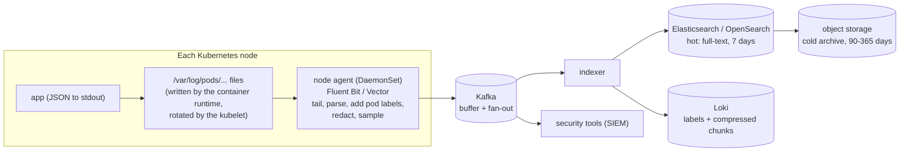
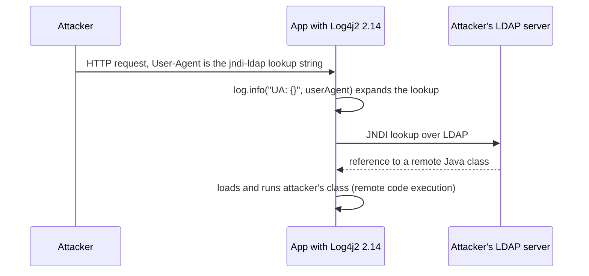

# Logging Framework — L6 (Staff) LLD Interview

> **Level expectation:** the L5 library is correct inside one process. Now: *"We run 2,000 pods. Logs cost us more than some databases, they contain things they shouldn't, and in December 2021 our logging library was the way attackers got in."* You reason about the fleet pipeline, volume and cost with arithmetic, sampling, redaction and compliance, levels as an on-call contract, trace correlation, security, the performance of the hot path, facade vs implementation, and what not to build. Read [L5-senior.md](L5-senior.md) first.

Legend: **🧑‍💼 Interviewer** · **🧑‍💻 Candidate** · **📝 Note** = commentary for you.

---

## 1. The new problems

**🧑‍💼 Interviewer:** Your L5 library is in every service. What changes at fleet scale?

**🧑‍💻 Candidate:** Three things the library alone can't see:
1. **Where lines go after the process.** Pods are replaced all the time; a log file inside a dead pod is gone. Logs must leave the node quickly and be searchable in one place.
2. **Volume is money.** Every line is shipped, parsed, indexed, replicated and stored. A chatty INFO line in a hot path can cost more per month than the service's compute.
3. **Logs are data with risk.** They hold user IDs, emails, sometimes tokens; they're readable by many engineers and retained for weeks. And the library parses attacker-controlled strings on every request.

---

## 2. The fleet pipeline

- **Apps write to stdout, not to the network.** The app stays simple and never blocks on a log server; the container runtime writes stdout to files on the node. This is the "treat logs as event streams" rule from the Twelve-Factor App guidelines (a widely used set of rules for cloud-friendly services).
- A **node agent** runs once per node as a **DaemonSet** (a Kubernetes object that runs one pod on every node). It tails those files, parses JSON, adds metadata (namespace, pod, container, node), and ships. It tracks its read position, so a restart resumes where it stopped.
- **[Kafka](../../../HLD/technologies/kafka.md)** (a durable, replayable log of messages) in the middle absorbs spikes (an incident doubles volume exactly when the indexer is busiest), lets several consumers read the same stream (search, a **SIEM**: a security tool that scans logs for attacks, metrics extraction), and allows replay after an indexer outage.
- **Storage tiers:** hot (fast search, expensive, days), warm/cold (cheaper, slower), archive in object storage (S3-like, cents per GB-month), then delete. **[Elasticsearch](../../../HLD/technologies/elasticsearch.md)** builds a full-text index of every word: fast arbitrary search, big storage overhead. **Loki** indexes only labels (service, pod, level) and stores compressed text chunks: much cheaper, slower for "grep everything".

**Where back-pressure lives now:** if the agent falls behind, files on the node keep growing until the kubelet rotates them (`containerLogMaxSize` 10 Mi × `containerLogMaxFiles` 5 by default). Lines rotated away before the agent read them are **lost silently**. So the agent's lag (bytes behind) is a metric to alert on, just like `dropped` in our async appender ([back-pressure](../../concepts/back-pressure.md)). Dropping DEBUG/INFO before WARN/ERROR when the pipeline is overloaded is **load shedding**: deliberately discarding low-value work to protect the rest ([resilience patterns](../../../HLD/concepts/resilience-patterns.md)).

---

## 3. Volume and cost, with arithmetic

**🧑‍💼 Interviewer:** 2,000 pods, average 50 lines per second each, 300 bytes per JSON line. Size it.

**🧑‍💻 Candidate:**

| Quantity | Arithmetic | Result |
|---|---|---|
| Lines per second | 2,000 × 50 | 100,000 lines/s |
| Bytes per second | 100,000 × 300 B | 30,000,000 B/s = **30 MB/s** |
| Per day | 30 MB/s × 86,400 s | 2,592,000 MB ≈ **2.6 TB/day** |
| Lines per day | 100,000 × 86,400 | 8.64 billion |
| Per node (100 nodes, 20 pods each) | 20 × 50 × 300 B | 300 KB/s per agent: easy |
| 7 days hot, 1 replica | 2.6 TB × 7 × 2 copies | ≈ 36 TB before compression and index overhead |
| 365 days archive (assume ~5× compression) | 2.6 TB × 365 ÷ 5 | ≈ 190 TB |

**Money**, with an **assumed** blended price of $0.50 per GB ingested and indexed (illustrative; real prices vary a lot by vendor and contract): 2,592 GB/day × $0.50 ≈ **$1,300/day ≈ $39,000/month ≈ $470,000/year**.

Where the volume really comes from: usually a few call sites. If one INFO line ("request handled") fires 20 times per second per pod, that's 20 ÷ 50 = **40% of the bill**. Because our events carry the **template** (`"request handled in {} ms"`), the pipeline can group by `logger + template` and produce a "top 10 most expensive log lines" report. That one report usually pays for the effort. "Request handled in X ms" also belongs in a **metric** (a number aggregated over time, like a histogram of latencies, see [observability](../../../HLD/concepts/observability.md)), which costs bytes per minute, not per request.

> 📝 **Note:** Staff candidates turn "logging is expensive" into a number and then into a lever: drop or sample the top call sites, move counts to metrics, shorten hot retention, archive the rest.

---

## 4. Sampling and rate limiting

**🧑‍💻 Candidate:** Not all lines are equal. Policies, from the library outwards:

| Technique | How | Keeps |
|---|---|---|
| Per-call-site rate limit (our `RateLimitFilter`) | N per window per logger+template, count the rest, emit "suppressed 4,812" once per window | First lines of a storm + its size |
| ERROR bypass | `acceptAtOrAbove(ERROR)` first in the chain | Every error |
| Probabilistic sampling of success logs | Keep 1% of INFO "request ok" lines | Shape of normal traffic |
| **Request-consistent** sampling | Decide once per request by `hash(requestId) % 100 < 1` and put the decision in MDC | **All** lines of the sampled requests, so a story is complete |
| Tail-based: decide at the end | Buffer a request's lines; keep them all if it errored or was slow | The interesting requests in full (costs memory, see L5 ring buffer) |

Random per-line sampling is the trap: you keep line 3 and line 7 of a request but not line 5, and no request can be followed. Same idea as head vs tail sampling in distributed tracing.

---

## 5. Redaction, PII and compliance

**🧑‍💼 Interviewer:** Security found customer emails and some session tokens in Elasticsearch. Fix it for good.

**🧑‍💻 Candidate:** Regex redaction (our `RedactingLayout`) is the last line of defence, not the strategy. It misses formats it doesn't know (`"pwd"`, a token in a URL path) and costs CPU on every line. Defence in depth:

1. **Types that can't leak.** Wrap secrets in a `Secret` class whose `toString()` returns `***`; mark sensitive record fields and generate a masked `toString()`. Logging `request` then can't print the password, whatever the developer does.
2. **Log identifiers, not people.** `userId=u-42`, never the email or name. **PII** (personally identifiable information) in logs is hard to delete: under **GDPR** (the EU data-protection law) a user can ask to be erased, and finding their email in 190 TB of compressed archives is not realistic. Not logging it is the only cheap compliance.
3. **Hard rules for regulated data.** **PCI DSS** (the card-industry security standard) forbids storing card security codes after authorisation and requires card numbers to be masked or unreadable wherever stored, logs included.
4. **Library redaction** for known keys (`password`, `token`, `apiKey`), plus **pipeline redaction** in the node agent for patterns (card-number shapes, JWTs: JSON Web Tokens, the signed login tokens in `Authorization` headers), so a service with an old library is still covered.
5. **Access control and retention** on the log store: logs are a database of user activity, so they get the same access reviews.
6. **Detection:** scan samples of indexed logs for secret patterns and alert the owning team.

---

## 6. Levels as an on-call contract

**🧑‍💻 Candidate:** Levels only help if everyone uses them the same way. I'd write it down:

| Level | Meaning | Who acts |
|---|---|---|
| **ERROR** | A request or job failed and the system could not recover; someone should look | Alert on **rate** (errors/min), not on single lines |
| **WARN** | Unexpected but handled (retry succeeded, fallback used, close to a limit) | Reviewed in dashboards; a rising WARN rate is an early signal |
| **INFO** | Lifecycle and business events (started, config loaded, order placed) | Read during incidents; keep low-volume |
| **DEBUG / TRACE** | Developer detail | Off in production; switched on per logger at runtime, then off again |

Rules that keep it honest: **log an exception once**, where it's handled (log-and-rethrow at every layer gives five stack traces for one failure); an expected client error (404, validation) is not ERROR; every ERROR line has enough context (IDs) to act on. Runtime level changes should **expire** (e.g. revert DEBUG after 30 minutes), or someone's emergency DEBUG doubles the bill for a month.

---

## 7. Correlation with traces

**🧑‍💻 Candidate:** A **trace** follows one request across services; each service's part is a **span**. The trace ID travels in the W3C `traceparent` HTTP header. If the tracing library puts `traceId` and `spanId` into the MDC (OpenTelemetry's Java instrumentation can do this for Logback and Log4j2), every log line carries them, and the UI can jump from a slow span to exactly that request's log lines in every service ([observability](../../../HLD/concepts/observability.md)). This only works if context propagation is right: the L5 thread-pool trap now loses the trace link, not just a requestId ([thread-local & context propagation](../../concepts/thread-local-and-context-propagation.md)).

---

## 8. Security: Log4Shell and the lesson

**🧑‍💼 Interviewer:** What happened with Log4Shell, and what would you do differently in your design?

**🧑‍💻 Candidate:** **CVE-2021-44228**, publicly disclosed on 9–10 December 2021, rated 10.0 (the maximum) on **CVSS** (the standard 0–10 severity score for vulnerabilities). Log4j2 versions 2.0-beta9 to 2.14.1 supported **lookups**: `${...}` expressions expanded at logging time, and they were expanded **inside the formatted message**, which includes user input. One lookup type was **JNDI** (Java Naming and Directory Interface, a JDK API to fetch objects from directory services such as **LDAP**, a directory protocol).

Any field that got logged (User-Agent header, username, a chat message) became remote code execution (**RCE**: the attacker runs their own code on your server). Fixes came in steps: 2.15.0 disabled message lookups by default, 2.16.0 removed them and disabled JNDI by default, 2.17.0 and 2.17.1 fixed follow-up CVEs (a recursion **denial of service**, i.e. a way to crash or freeze the app, and a config issue in the JDBC appender, the one that writes logs to a database).

**Lessons for the design:**
- **Never interpret message content.** Our `MessageFormatter` substitutes `{}` with `String.valueOf(arg)` exactly once and never re-parses the result. Data stays data.
- **Features are attack surface.** Lookups were a convenience almost nobody used in messages. Default to the smallest feature set.
- **Cap sizes.** Truncate huge messages and stack traces (a 10 MB user field is a cheap denial of service against your log pipeline).
- **Know where you depend on it.** Many teams couldn't answer "do we run log4j-core 2.14?" because it came in **transitively** (a dependency of a dependency). An **SBOM** (software bill of materials: the list of every library in a build) answers that in minutes.

---

## 9. Performance of the hot path

**🧑‍💻 Candidate:** At 100,000 lines/s fleet-wide nobody notices one service's logging, but in a latency-critical service (an ad server, a trading gateway) logging can be the biggest source of **garbage** (short-lived objects the GC, the JVM's garbage collector, must clean up, sometimes pausing threads). Costs per enabled call in our design:

| Allocation | Avoidable? |
|---|---|
| `Object[]` for varargs; `Integer` boxing for `log("{}", 5)` | Fixed-arity overloads; primitive-specific methods |
| Formatted `String`, `StringBuilder` | Reuse a per-thread `StringBuilder`, or format straight into a byte buffer |
| `LogEvent` record, MDC `Map.copyOf` | Pre-allocated, reused event objects |
| Timestamp formatting | Cache the formatted "yyyy-MM-dd HH:mm:ss" part per second (Logback does) |

**Log4j2's answer:** "garbage-free" mode (since 2.6) reuses these objects, and its **async loggers** use the **LMAX Disruptor**: a pre-allocated **ring buffer** (a fixed-size array used in a circle; default 262,144 slots) where a producer claims the next slot number with **CAS** (compare-and-swap, a single CPU instruction that updates a value only if it hasn't changed, see [atomics & CAS](../../libraries/java/atomics-and-cas.md)), fills the event already sitting in that slot, and publishes it. No lock in the common case and no new event object per call. Our `ArrayBlockingQueue` takes one lock shared by producers and the consumer; fine for most services, a contention point at millions of events per second. The [single-writer principle](../../concepts/single-writer-principle.md) explains why the Disruptor's single consumer is so fast.

---

## 10. Facade vs implementation

**🧑‍💻 Candidate:** **SLF4J** is a **facade**: an API (`Logger`, `LoggerFactory`) with no real implementation. At startup it finds one **provider** (Logback, Log4j2 via `log4j-slf4j2-impl`, or a no-op) on the **classpath** (the list of JARs the JVM loads classes from). SLF4J 2.x finds it with Java's `ServiceLoader` (the JDK's built-in plug-in discovery); 1.x used a "static binder" class. This is the **Dependency Inversion** principle from [SOLID](../../concepts/solid-principles.md): code depends on an abstraction, the app chooses the implementation ([SLF4J, Logback & Log4j2](../../libraries/java/slf4j-logback-and-log4j2.md)).

- **Libraries must depend only on the facade.** If a library ships Logback itself, every app that uses it gets a second implementation and SLF4J warns about multiple providers (and picks one).
- **Bridges** route other APIs into one implementation: `jul-to-slf4j`, `jcl-over-slf4j` and `log4j-over-slf4j`, so the whole JVM ends up in one pipeline with one config.
- During Log4Shell, the split mattered: `log4j-api` (the API) was not vulnerable, `log4j-core` (the implementation) was. Teams on SLF4J + Logback were unaffected by that CVE.

---

## 11. Build vs buy

| Option | Good for | Watch out |
|---|---|---|
| **SLF4J + Logback** | Default in Spring Boot; simple, well known | Async appender is a plain blocking queue |
| **Log4j2** | Highest throughput (async loggers, garbage-free), rich config | Large feature surface; keep it patched |
| `java.util.logging` | Zero dependencies | Awkward API and config; route it via `jul-to-slf4j` |
| **pino** (Node) | Fast JSON logging; heavy work can move to a worker thread | Pretty-printing belongs in dev only. See [logging in Node](../../libraries/js/logging-in-node.md) |
| Fluent Bit / Vector agents | Shipping, parsing, redaction, sampling on the node | Their buffers and lag need monitoring too |
| Elasticsearch/OpenSearch, Loki, ClickHouse | Self-hosted search/storage at different cost points | Operating them is a team's job |
| SaaS (Datadog, Splunk, cloud providers) | No operations, good UIs | The per-GB price from section 3 |

**🧑‍💻 Candidate:** Never build a logging library for production; build the *policies*: a shared config with JSON layout, MDC keys (`traceId`, `requestId`, `userId`), redaction rules, an async appender with discard-below-WARN, and a dashboard of the top call sites by volume.

---

## 12. Curveballs

**🧑‍💼 Interviewer:** "The logs from the 30 seconds before the crash are missing." Where do you look?

**🧑‍💻 Candidate:** (1) Async queue not flushed: no shutdown hook, or the pod got SIGKILL (immediate kill) after `terminationGracePeriodSeconds` (default 30 s) before the drain. (2) Dropped by back-pressure: check the dropped counter. (3) The node agent lagged and the kubelet rotated the files away. (4) Rate limiting or sampling hid them. (5) An OOM kill (out of memory): the JVM dies without running shutdown hooks. Fixes: drain within the grace period, alert on drops and agent lag, keep ERRORs out of sampling, and flush synchronously on fatal paths.

**🧑‍💼 Interviewer:** "The log bill doubled this month."

**🧑‍💻 Candidate:** Group by `service + logger + template`, sort by bytes: one or two new call sites (or a DEBUG level someone forgot to turn off) almost always explain it. Then make it structural: per-service log budgets, expiring runtime level changes, and a review of the top 10 every month.

---

## 13. What the interviewer was evaluating (L6)

- [ ] Fleet pipeline: stdout → node agent → Kafka → stores with retention tiers; where lines get lost
- [ ] Volume and cost with arithmetic; template-based "top call sites"; logs vs metrics
- [ ] Sampling that keeps whole requests; ERRORs never sampled
- [ ] Redaction in depth: safe types, IDs not PII, pipeline rules, access and retention; GDPR/PCI awareness
- [ ] Levels defined as an on-call contract; log once; expiring DEBUG
- [ ] traceId/spanId in MDC and the propagation dependency
- [ ] Log4Shell mechanism and the design lesson (never interpret data, small surface, SBOM)
- [ ] Hot-path allocations, garbage-free logging, Disruptor vs a locked queue
- [ ] Facade vs implementation; libraries depend on the facade; bridges

## 14. Common mistakes at this level

| Mistake | Why it hurts at L6 |
|---|---|
| Apps sending logs straight to Elasticsearch over HTTP | A slow log cluster now slows or breaks every service |
| No owner for log volume | The bill grows silently; nobody knows which line costs what |
| Random per-line sampling | No request can be followed end to end |
| Relying only on regex redaction | New formats leak; PII is effectively undeletable once archived |
| ERROR for expected client errors | Alert fatigue; real errors get ignored |
| A library that evaluates expressions in messages | Log4Shell: user input becomes code |
| Shipping a logging implementation inside a library | Conflicting providers in every app that uses it |
| Not monitoring the agent's lag or the appender's drops | Logs disappear exactly during incidents, when they matter |

⬅️ Previous: [L5-senior.md](L5-senior.md) · 🏠 [Problem overview](README.md)
