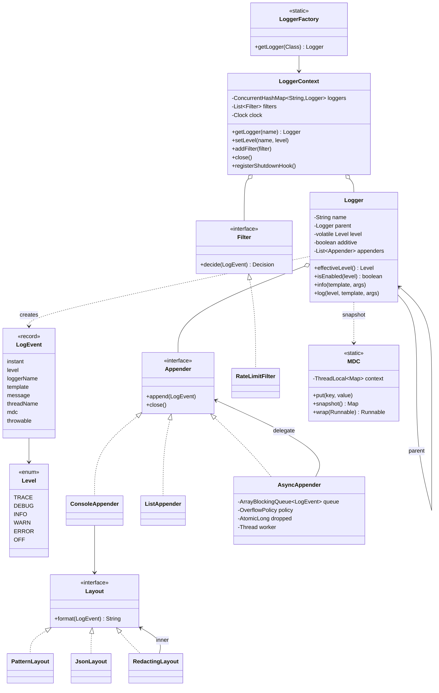

# LLD Interview: Design a Logging Framework (like Log4j / Logback / SLF4J)

> "Design a logging library. Callers write `log.info("order {} placed", id)`. Support levels, multiple destinations and formats. Then make it fast, safe under many threads, and well-behaved when the disk is slow."

A classic LLD question that looks like "wrap `System.out`" and turns out to be about **cost, concurrency and failure**. It teaches the ideas inside SLF4J, Logback and Log4j2: a **level check that makes disabled lines free**, a **logger hierarchy with inherited levels**, **Strategy** (layouts), fan-out to **appenders**, **Chain of Responsibility** (filters), **async appenders with a bounded queue and an explicit back-pressure policy**, **MDC context** and how it leaks across thread pools, **structured JSON logs**, and at L6 the fleet-scale view: shipping, cost, sampling, redaction, and **Log4Shell**.

> 💡 **Terms in one line each** (details in the files):
> **Level**: severity of a line (TRACE < DEBUG < INFO < WARN < ERROR). **Effective level**: the threshold a logger inherits from its nearest configured ancestor. **Appender**: a destination (console, file). **Layout**: turns an event into text (pattern or JSON). **Filter**: accepts, denies or passes an event. **MDC**: per-thread key/values (requestId) added to every line. **Async appender**: a queue plus a background writer thread. **Back-pressure**: what to do when the queue is full (block, drop, drop low levels). **Additivity**: whether events also flow to ancestors' appenders. **Facade**: SLF4J, an API that hides the implementation underneath. **Log4Shell**: the 2021 Log4j2 bug where logging attacker text ran attacker code. **Strategy**: one interface, interchangeable implementations (here: layouts). **Chain of Responsibility**: a list of handlers where each may decide or pass to the next (here: filters).

## How to read this folder

> 👉 **Never thought about what's inside `log.info`? Start with [00-understand-the-product.md](00-understand-the-product.md).** It walks through a 3 a.m. incident with only `println`s to go on, and shows the level check → filters → appenders → layout → sink pipeline.

| File | Level | What "good" looks like |
|---|---|---|
| [00-understand-the-product.md](00-understand-the-product.md) | Everyone, first | Know the features (levels, hierarchy, appenders, layouts, MDC, async, redaction) and why each exists |
| [L4-mid.md](L4-mid.md) | Mid / SDE2 | Clean entities (`Level`, `LogEvent`, `Logger`, `Appender`, `Layout`, registry), level check before formatting, `{}` parameters, Strategy for layouts, fan-out to appenders, thread-safe appenders, singleton trade-offs |
| [L5-senior.md](L5-senior.md) | Senior | Dotted hierarchy with effective-level inheritance and additivity, filter chain, async appender (bounded queue, single consumer, batching, flush on shutdown, BLOCK / DROP / discard-below-WARN, dropped counter), MDC + thread pools, rolling files, JSON escaping, runtime reconfiguration |
| [L6-staff.md](L6-staff.md) | Staff | Fleet pipeline (stdout → node agent → Kafka → Elasticsearch/Loki → retention tiers), volume and cost arithmetic, sampling, redaction and compliance, levels as an on-call contract, trace correlation, Log4Shell, allocation-free hot paths and the Disruptor, facade vs implementation, build vs buy |

## Code (runnable, no dependencies)

| | Run | Files |
|---|---|---|
| ☕ Java 21 | `./java/run.sh` | [java/src/logging/](java/src/logging/): `Level`, `LogEvent`, `MessageFormatter`, `Logger`, `LoggerContext`, `LoggerFactory`, `MDC`, `Appender` + `ConsoleAppender` / `ListAppender` / `AsyncAppender`, `Layout` + `PatternLayout` / `JsonLayout` / `RedactingLayout`, `Filter` + `RateLimitFilter`, `ManualClock`; 15 tests in `LoggingTests.java`; `Demo.java` prints pattern and JSON lines and an async drop count |
| 🟨 Node 22 | `cd js && node --test` | [js/logger.js](js/logger.js), [js/logger.test.js](js/logger.test.js): same design, context via `AsyncLocalStorage`, a buffered appender instead of a thread (8 tests) |

**Design for testability:** time comes from an injected `java.time.Clock` (`ManualClock` in tests), so timestamps and rate-limit windows are exact. Output goes to a `PrintStream` or a `ListAppender` you can inspect. Async tests never sleep: a **gated appender** blocks the background thread on a latch (a one-shot "wait until released" signal), so "the queue is full" is a deterministic state, not a race.

Sample demo output:

```
2026-10-08T03:30:00.000Z INFO  [main] com.shop.orders.OrderService - order A-1001 placed with 3 items {requestId=req-7f3a}
2026-10-08T03:30:00.015Z DEBUG [main] com.shop.db.Pool - borrowed connection conn-4 after 12 ms {requestId=req-7f3a}
{"ts":"2026-10-08T03:30:00.050Z","level":"WARN","logger":"com.shop.payment.Gateway","thread":"main","msg":"retrying charge, provider said \"rate limited\nretry later\" token=***","requestId":"req-7f3a","userId":"u-42"}
logged 1000, dropped 978 (exact number varies run to run)
```

## Class diagram (matches the code)



## Libraries & concepts used

**Java:** [SLF4J, Logback & Log4j2](../../libraries/java/slf4j-logback-and-log4j2.md) · [Blocking queues & producer-consumer](../../libraries/java/blocking-queues-and-producer-consumer.md) · [Executors & threads](../../libraries/java/executors-and-threads.md) · [Concurrent collections](../../libraries/java/concurrent-collections.md) · [Locks & synchronized](../../libraries/java/locks-and-synchronized.md) · [Atomics & CAS](../../libraries/java/atomics-and-cas.md) · [Records & immutability](../../libraries/java/records-and-immutability.md) · [Enums & EnumMap](../../libraries/java/enums-and-enummap.md) · [Time & Clock](../../libraries/java/time-and-clock.md) · [File I/O & fsync](../../libraries/java/file-io-and-fsync.md)

**JS:** [Logging in Node](../../libraries/js/logging-in-node.md) · [Event loop & concurrency](../../libraries/js/event-loop-and-concurrency.md) · [fs & durability in Node](../../libraries/js/fs-and-durability-in-node.md) · [Classes & private fields](../../libraries/js/classes-and-private-fields.md) · [node:test runner](../../libraries/js/node-test-runner.md)

**Concepts:** [Back-pressure](../../concepts/back-pressure.md) · [Thread-local & context propagation](../../concepts/thread-local-and-context-propagation.md) · [Design patterns](../../concepts/design-patterns.md) · [SOLID principles](../../concepts/solid-principles.md) · [Thread-safety basics](../../concepts/thread-safety-basics.md) · [Single-writer principle](../../concepts/single-writer-principle.md) · [Big-O complexity](../../concepts/big-o-complexity.md) · [UML class diagrams](../../concepts/uml-class-diagrams.md)

**Related:** [Rate Limiter (LLD)](../rate-limiter/README.md) · [Observability](../../../HLD/concepts/observability.md) · [Resilience patterns](../../../HLD/concepts/resilience-patterns.md) · [Kafka](../../../HLD/technologies/kafka.md)

## The core insight

1. **The cheapest log line is the one you decide not to write, early.** Check the level first, format only after, and pass arguments as `{}` parameters so a disabled `debug` never calls `toString()`. Everything else (events, filters, layouts) happens only for lines that will actually be written.
2. **Logging is a producer-consumer system, and the consumer (the disk, the network) is sometimes slow.** Put a bounded queue and one writer thread between them, and make "queue full" an explicit, counted policy: block, drop, or drop low levels first. Flush the queue on shutdown.
3. **A log line is data that leaves your process.** Copy context (MDC) into the event, escape it correctly (JSON), strip secrets before it's written, never *interpret* it (Log4Shell), and remember that at fleet scale every line has a price.
