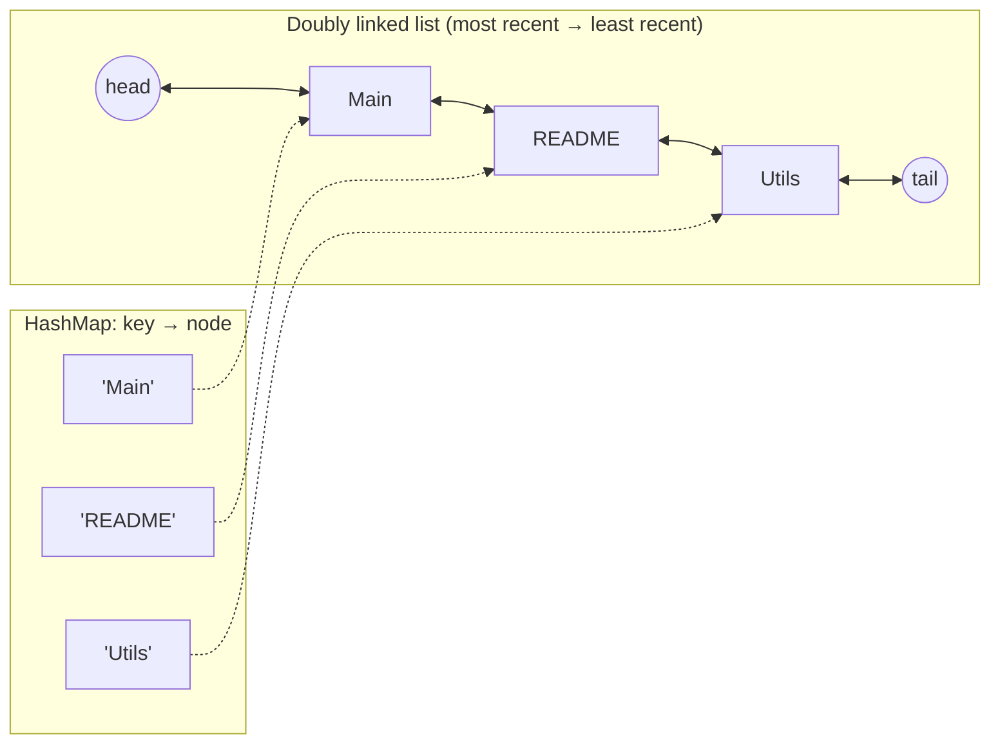

# Start Here: What Is an LRU Cache? (Before the Interview)

> "LRU cache" sounds like an algorithm puzzle. It's actually the rule behind things you use every day: your phone closing old apps, your IDE's "Recent files" list, Redis running out of memory. This page shows you the idea in those places first, so the code in the interview is just writing down something you already understand.
>
> Time: ~10 minutes. Then: [L4](L4-mid.md) → [L5](L5-senior.md) → [L6](L6-staff.md).

---

## 1. The problem: a small fast space, a big slow one

A **cache** is a small, fast storage area that keeps copies of things you'll probably need again, so you don't have to fetch them from the big, slow place every time.

| Small & fast (the cache) | Big & slow (the source) |
|---|---|
| Your desk | The library |
| RAM | Disk |
| CPU's L1/L2 cache (tiny memories inside the CPU chip) | RAM |
| Redis | The database |
| A `HashMap` inside your Java service | A remote API call |

The desk only holds 5 books. When you bring a 6th, **one has to go back to the library. Which one?**

That question, "what do I throw out when the cache is full?", is called the **eviction policy**. **LRU = Least Recently Used**: throw out the thing you haven't touched for the longest time. The bet: *what you used recently, you'll probably use again soon; what you haven't touched in ages, probably not.*

---

## 2. You've seen LRU working already

| Where | What you see | What's being evicted |
|---|---|---|
| **IntelliJ "Recent Files"** (Ctrl+E / Cmd+E) | The file you opened last is at the top. Open a 21st file and the oldest one drops off the list | The least recently opened file |
| **Your phone's recent apps** | Open many apps → the ones you haven't used in a while restart from scratch when you go back | Android/iOS kill the least recently used apps when memory runs low |
| **Browser tabs** (Chrome "Memory Saver") | Old background tabs reload when you click them | Tabs you haven't looked at recently get unloaded |
| **Redis** with `maxmemory-policy allkeys-lru` | Old keys vanish when Redis hits its memory limit | Approximately least recently used keys |
| **Kubernetes nodes** (infra!) | When a node's disk fills up, unused container images get deleted | kubelet's image garbage collection removes images by **last used time**, oldest first |
| **Linux page cache** | `free -h` shows a big "buff/cache" number | The kernel keeps recently read file data in RAM and drops the least recently used pages under pressure |

**So an LRU cache in an interview = "build the data structure behind Recent Files".**

---

## 3. Watch it happen (capacity = 3)

Like a Recent Files list that holds 3 files. Newest on the left:

| Action | Cache after (most → least recent) | What happened |
|---|---|---|
| open `Main.java` | `Main` | added |
| open `Utils.java` | `Utils, Main` | added |
| open `README.md` | `README, Utils, Main` | full now |
| open `Main.java` **again** | `Main, README, Utils` | **hit**: Main jumps to the front |
| open `pom.xml` | `pom, Main, README` | full → **evict `Utils`** (least recent) |
| open `Utils.java` | `Utils, pom, Main` | **miss** (it was evicted) → load it → evict `README` |

Two rules make it LRU:
1. **Reading something makes it "recent"** (Main jumped to the front when reopened).
2. **When full, evict from the "least recent" end.**

`java/run.sh` runs this same sequence in its demo section (up to the miss on `Utils.java`) and prints the order after each step.

---

## 4. Why the interview cares about *how* you build it

The rules are easy. The challenge is making **every operation O(1)**: constant time, no matter if the cache holds 3 items or 3 million. (O(1) and "Big-O" in plain words: [big-O complexity](../../concepts/big-o-complexity.md).)

| Naive approach | Problem |
|---|---|
| Keep items in a list; move to front on access | Finding an item in a list = scanning it = **O(n)** |
| Keep items in a `HashMap` with a "last used" timestamp | Lookup is O(1), but finding the oldest to evict = scanning all = **O(n)** |
| **HashMap + doubly linked list** | HashMap finds the item in O(1); the linked list keeps the order and lets you move/remove an item in O(1). ✅ |



- `get(key)`: map gives you the node directly → unlink it → put it right after `head`. All O(1).
- Evict: the node right before `tail` is the least recent → unlink → remove from map. O(1).

How hash maps and linked lists work underneath: [hash map & linked list](../../concepts/hashmap-and-linked-list.md).

---

## 5. The features you'll be asked about

| Feature | Real-life situation | Interview question it leads to |
|---|---|---|
| **Capacity** | Recent Files shows max 20 | Bounded size, evict when full |
| **Get refreshes recency** | Reopening a file moves it to the top | `get` is secretly a write (moves the node) → matters for thread safety! |
| **Update existing key** | Saving a file again | Replace value, move to front, don't grow |
| **TTL (time to live)** | A login session cached for 30 minutes | Entries also expire by time ([L5](L5-senior.md)) |
| **Other eviction policies** | "Most played" playlist keeps songs you play *often*, not *recently* | LFU (least frequently used) ([L5](L5-senior.md), [eviction policies](../../concepts/cache-eviction-policies.md)) |
| **Many threads** | A web server's cache used by 200 request threads | Locking, lock striping ([L5](L5-senior.md)) |
| **Cache stampede** | A popular key expires and 1,000 requests all hit the DB at once | Single-flight loading ([L6](L6-staff.md)) |
| **Hit rate** | "Is the cache even helping?" | Stats; the metric every cache is judged by |

---

## 6. Try it yourself (5 minutes, all real)

1. **IntelliJ:** press Ctrl+E (Cmd+E on Mac). Open a file that's 5th in the list and press Ctrl+E again. It's now at the top. That's `get` refreshing recency.
2. **Redis** (if you have one locally or at work, read-only command):
   ```sh
   redis-cli CONFIG GET maxmemory-policy
   redis-cli INFO stats | grep -E 'keyspace_hits|keyspace_misses|evicted_keys'
   ```
   The policy (`allkeys-lru`, `volatile-lru`, `allkeys-lfu`, `noeviction`…) is the eviction rule. Hits/misses give you the hit rate, and `evicted_keys` counts how many times it had to throw something out.
3. **Linux:** run `free -h` and look at `buff/cache`: memory the kernel is using as a cache of disk data, given back when apps need it.
4. **Kubernetes** (if you run clusters): the kubelet flags `--image-gc-high-threshold` / `--image-gc-low-threshold` control when least-recently-used images get deleted.

---

## 7. From experience to requirements

| What you experienced | Requirement | Type |
|---|---|---|
| Recent Files holds 20 | `new LruCache(capacity)` | Functional |
| Open a file → it's there or not | `get(key)` → value or empty | Functional |
| Open a new file | `put(key, value)` | Functional |
| Least recently used falls off | Evict LRU entry when full | Functional |
| Reopening moves it to the top | `get` updates recency | Functional |
| Instant, even with millions of entries | **O(1)** `get` and `put` | Non-functional |
| Used by many request threads | **Thread-safe** | Non-functional |
| Session expires after 30 min | TTL | Functional (extension) |
| "Is the cache working?" | Hit/miss stats | Non-functional (observability) |

---

## 8. Mini glossary

| Term | Meaning in plain words |
|---|---|
| **Cache** | Small fast storage holding copies of data from a bigger, slower source |
| **Hit / miss** | Hit = found in the cache; miss = not there, must fetch from the source |
| **Hit rate** | Hits ÷ (hits + misses). 95% means only 1 in 20 requests reaches the slow source |
| **Eviction** | Removing an entry to make room |
| **LRU** | Least Recently Used: evict what hasn't been touched for the longest time |
| **LFU** | Least Frequently Used: evict what has been touched the fewest times |
| **TTL** | Time To Live: an entry expires after a fixed time regardless of use |
| **O(1)** | Takes the same time no matter how much data there is |
| **Doubly linked list** | A chain of nodes where each knows its previous and next neighbour, so you can remove one without scanning |
| **Sentinel node** | A dummy node at each end of the list that holds no data, so code never has to special-case "empty list" or "first item" |
| **Cache stampede** | Many requests miss the same key at once and all hit the slow source together |

➡️ **Now build it:** [L4-mid.md](L4-mid.md)
